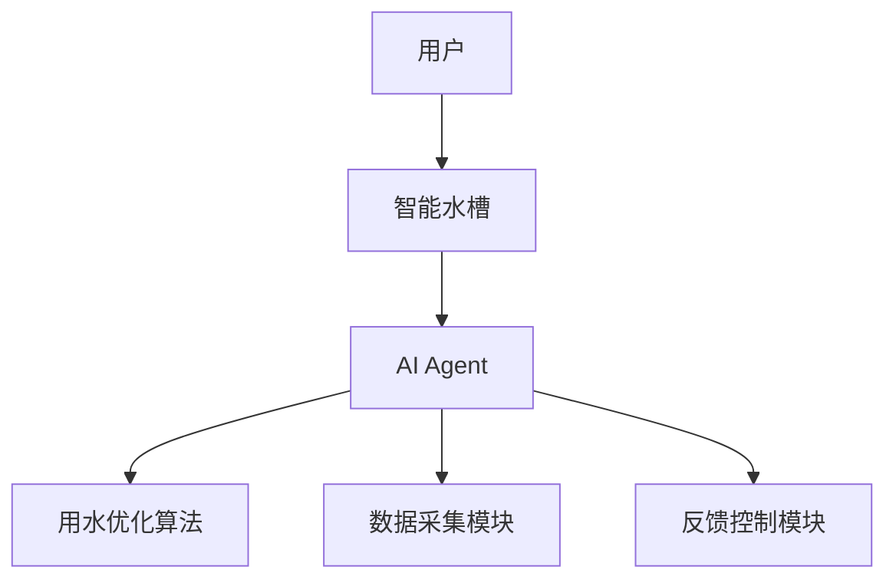
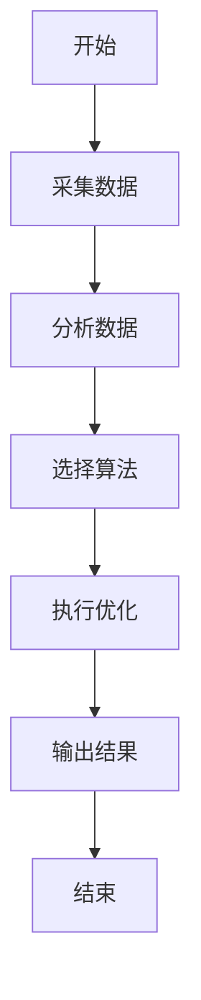
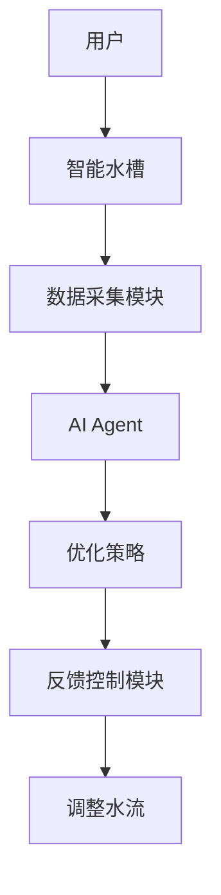
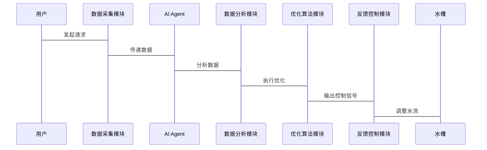

                 


# 智能厨房水槽：AI Agent的用水优化控制

## 关键词
智能厨房水槽, AI Agent, 用水优化, 物联网, 人工智能

## 摘要
智能厨房水槽通过AI Agent实现用水优化控制，结合物联网技术，实时监测和调整用水量，提升水资源利用效率。本文详细探讨其背景、核心概念、算法原理、系统架构及项目实战，为读者提供全面的技术解析。

---

## 第一部分：智能厨房水槽的背景与意义

### 第1章：智能厨房水槽的背景介绍

#### 1.1 传统厨房水槽的功能与局限性
传统水槽仅用于洗漱和清洁，功能单一，无法实时监测和优化用水量。用户无法有效控制水量，导致水资源浪费。

#### 1.2 智能化时代的厨房革命
随着物联网和AI技术的发展，智能家居设备逐渐普及。厨房作为家庭生活的重要场所，智能化需求日益增长。

#### 1.3 AI Agent在智能厨房中的角色
AI Agent作为智能厨房的核心，负责协调各设备，优化资源使用。在水槽中，AI Agent通过实时数据处理，实现用水量的精准控制。

### 第2章：智能厨房水槽的定义与特点

#### 2.1 智能厨房水槽的核心定义
智能厨房水槽结合AI和物联网技术，具备实时监测、数据分析和自动控制功能，实现用水优化。

#### 2.2 AI Agent的功能特点
AI Agent能够实时感知环境数据，分析用户行为，优化用水策略，提供个性化服务。

#### 2.3 用水优化控制的实现方式
通过传感器采集数据，AI Agent分析并调整出水流量，减少水资源浪费。

### 第3章：用水优化控制的背景与需求

#### 3.1 当前水资源利用的现状
全球水资源短缺问题日益严重，优化用水效率成为重要任务。

#### 3.2 厨房用水的浪费问题
传统水槽使用不智能，导致水资源浪费。AI Agent通过优化控制，减少浪费。

#### 3.3 AI Agent在用水优化中的应用价值
通过AI技术，实现用水量的精准控制，提升水资源利用效率，降低成本。

---

## 第二部分：AI Agent与智能厨房水槽的核心概念

### 第4章：AI Agent的基本原理

#### 4.1 AI Agent的定义与分类
AI Agent是具有感知、决策和执行能力的智能体，分为简单反射型、基于模型的反应型等类型。

#### 4.2 AI Agent的核心功能模块
- 感知模块：采集环境数据
- 决策模块：分析数据并制定策略
- 执行模块：执行优化控制

#### 4.3 AI Agent与智能水槽的结合
AI Agent通过传感器数据，分析用户行为和环境条件，优化水槽的用水策略。

### 第5章：智能厨房水槽的系统架构

#### 5.1 系统输入与输出
- 输入：用户行为、环境数据
- 输出：优化后的水流控制信号

#### 5.2 系统功能模块划分
- 数据采集模块：收集水压、流量等数据
- AI Agent模块：分析数据并制定优化策略
- 执行模块：调整水流

#### 5.3 系统核心算法与实现
- 数据分析算法：实时监测并分析数据
- 优化算法：制定最优用水策略

### 第6章：AI Agent与智能水槽的实体关系图



---

## 第三部分：智能厨房水槽的用水优化控制算法

### 第7章：优化算法的基本原理

#### 7.1 基于AI的优化算法概述
AI Agent通过学习用户行为和环境数据，优化用水策略。

#### 7.2 常见优化算法对比
- 遗传算法：模拟生物进化，优化解空间。
- 模拟退火：通过随机化寻找全局最优解。

#### 7.3 适用于智能水槽的优化算法选择
选择适合的算法，确保优化效果和效率。

### 第8章：基于AI的优化算法实现

#### 8.1 算法流程图


#### 8.2 Python代码实现
```python
def optimize_water_usage(data):
    # 数据预处理
    processed_data = preprocess(data)
    # 选择优化算法
    algorithm = choose_algorithm(processed_data)
    # 执行优化
    result = algorithm.optimize(processed_data)
    return result
```

#### 8.3 数学模型与公式
优化目标：最小化用水量，最大化效率。

$$ \text{目标函数} = \sum_{i=1}^{n} w_i $$
$$ \text{约束条件} = \{w_i \leq W_{\text{max}}, i=1,2,...,n\} $$

### 第9章：算法实现的数学模型

#### 9.1 基于遗传算法的优化
$$ \text{适应度函数} = \sum_{i=1}^{n} (w_i - \text{目标值})^2 $$

#### 9.2 基于模拟退火的优化
$$ \text{降温策略} = T_{k+1} = \alpha T_k $$

---

## 第四部分：智能厨房水槽的系统架构设计

### 第10章：系统分析与架构设计方案

#### 10.1 项目场景介绍
智能厨房水槽应用于家庭厨房，通过AI Agent优化用水。

#### 10.2 系统功能设计
- 数据采集：传感器采集水流、温度等数据
- AI Agent分析数据，优化用水策略
- 反馈控制：调整水流，减少浪费

#### 10.3 系统架构设计


#### 10.4 系统接口设计
- 数据接口：传感器数据输入
- 控制接口：水流调节输出

#### 10.5 系统交互流程图


### 第11章：系统实现与优化

#### 11.1 系统实现
- 硬件：安装传感器和执行器
- 软件：开发AI Agent和优化算法

#### 11.2 系统优化
- 数据处理效率优化
- 算法优化，提升计算速度

### 第12章：系统测试与验证

#### 12.1 测试环境搭建
- 硬件设备：智能水槽、传感器
- 软件工具：测试平台、数据分析工具

#### 12.2 功能测试
- 数据采集功能测试
- 优化算法测试
- 反馈控制测试

#### 12.3 性能测试
- 响应时间测试
- 处理能力测试
- 稳定性测试

---

## 第五部分：项目实战与应用

### 第13章：项目实战

#### 13.1 环境安装
- 安装Python和相关库
- 安装传感器和硬件设备

#### 13.2 核心代码实现
```python
import numpy as np

def genetic_algorithm(population, fitness_func, mutation_rate=0.1):
    # 初始化种群
    current = population
    while True:
        # 计算适应度
        fitness = [fitness_func(individual) for individual in current]
        # 选择
        selected = selection(current, fitness)
        # 交叉
        crossed = crossover(selected, mutation_rate)
        # 变异
        mutated = mutation(crossed)
        # 更新种群
        current = crossed + mutated
        # 终止条件
        if stopping_condition(current, fitness):
            break
    return current[0]
```

#### 13.3 代码解读与分析
- `genetic_algorithm`函数实现遗传算法
- `fitness_func`适应度函数
- `selection`选择函数
- `crossover`交叉函数
- `mutation`变异函数

#### 13.4 实际案例分析
通过具体案例，展示AI Agent如何优化用水。

### 第14章：项目小结

#### 14.1 项目总结
智能厨房水槽通过AI Agent实现用水优化，减少浪费。

#### 14.2 经验与教训
在开发过程中，需要注意传感器精度和算法效率。

---

## 第六部分：最佳实践与扩展

### 第15章：最佳实践

#### 15.1 小结
智能厨房水槽结合AI技术，优化用水效率。

#### 15.2 注意事项
- 确保传感器准确性
- 优化算法效率
- 提供用户友好的界面

#### 15.3 拓展阅读
推荐相关书籍和论文，进一步深入学习。

### 第16章：未来展望

#### 16.1 技术发展
AI Agent技术的进一步提升，优化算法的优化。

#### 16.2 应用场景扩展
智能厨房水槽的应用扩展到其他家庭设备。

---

## 结语

智能厨房水槽通过AI Agent实现用水优化，是智能家居的重要组成部分。本文详细介绍了其背景、核心概念、算法原理、系统架构及项目实战，为读者提供全面的技术解析。

## 作者

作者：AI天才研究院/AI Genius Institute & 禅与计算机程序设计艺术 /Zen And The Art of Computer Programming

