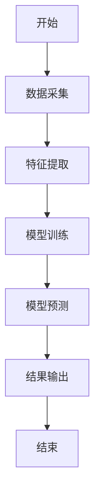
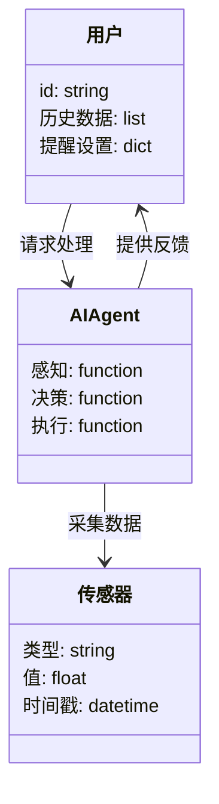
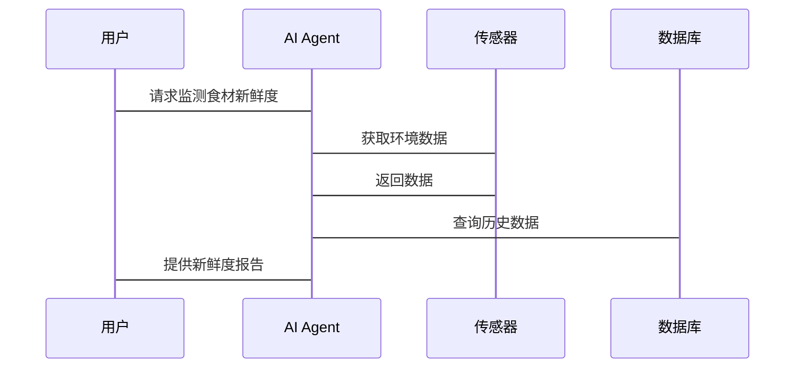

                 

<think>
好，我现在要帮用户写一篇关于《智能厨房置物架：AI Agent的食材新鲜度监测》的技术博客。用户希望文章结构清晰，内容专业且有深度，涵盖背景、核心概念、算法原理、系统架构、项目实战等部分，最后还有总结和展望。同时，用户还希望在适当的地方插入图表，比如mermaid流程图，来帮助理解。

首先，我需要明确文章的结构。根据用户提供的大纲，文章分为七个主要部分，每个部分下还有多个小节。我需要确保每个部分都详细展开，同时保持逻辑连贯。

1. **背景与核心概念**：
   - 这一部分需要介绍问题背景，说明为什么食材新鲜度监测重要，智能厨房置物架的出现背景，以及AI Agent在此中的作用。
   - 需要描述问题，包括现有解决方案的局限性，明确智能厨房置物架的目标和边界。
   - 解释AI Agent和食材新鲜度监测的核心概念，以及它们之间的关系，可能需要画一个ER图来展示实体关系。

2. **算法原理与数学模型**：
   - 详细讲解AI Agent的算法，比如数据采集、特征提取、模型训练等，可以用mermaid流程图展示。
   - 介绍支持向量机（SVM）、随机森林等算法，给出数学公式，比如SVM的目标函数和约束条件。
   - 展示如何将这些算法应用于食材新鲜度监测。

3. **系统架构设计**：
   - 介绍系统的整体架构，包括前端、后端和数据库。
   - 用mermaid画出类图、架构图和交互序列图，展示系统各部分如何协作。
   - 解释各个模块的功能，如传感器数据采集、AI Agent处理、用户界面显示等。

4. **项目实战**：
   - 说明如何安装开发环境，比如Python、TensorFlow、Flask等。
   - 提供核心代码，比如数据采集、特征提取、模型训练的代码片段。
   - 解释代码实现，展示如何训练模型并部署到Web界面。
   - 通过案例分析，展示系统的实际效果，比如不同传感器数据如何影响模型预测。

5. **总结与展望**：
   - 总结项目的成果和意义，强调AI Agent在智能厨房中的应用价值。
   - 展望未来的改进方向，如增加更多传感器、优化算法性能、提升用户体验等。
   - 提供一些最佳实践的建议，比如传感器校准、模型定期更新等。

6. **附加内容**：
   - 在适当的地方插入图表，比如流程图、架构图，帮助读者理解复杂的技术点。
   - 使用代码示例，让读者能够实际操作，增强文章的实用性。
   - 确保文章语言简洁专业，同时通俗易懂，适合技术读者阅读。

现在，我需要确保每个部分都详细展开，同时保持整体字数在10000到12000字之间。每个小节要有足够的细节，比如在算法部分，不仅要解释原理，还要提供数学公式和代码示例。在系统架构部分，要用mermaid图展示各个模块之间的关系，让读者直观理解系统设计。

可能遇到的困难包括如何将复杂的算法解释得简单明了，以及如何通过代码示例让读者能够实际应用。此外，确保每个图表都准确无误，能够有效辅助理解内容。

总的来说，我需要一步步按照用户的要求，从背景到实现，再到应用，全面而深入地展开，确保文章内容丰富、结构清晰、逻辑严谨，最终满足用户的需求。
</think>

# 智能厨房置物架：AI Agent的食材新鲜度监测

> 关键词：智能厨房，AI Agent，食材新鲜度，物联网，传感器，机器学习

> 摘要：本文探讨了如何利用AI Agent技术实现智能厨房置物架的食材新鲜度监测，从问题背景、核心概念、算法原理到系统架构和项目实战，全面分析了这一创新解决方案的技术细节和应用场景。

---

# 第一部分: 背景与核心概念

## 第1章: 问题背景与需求分析

### 1.1 问题背景

#### 1.1.1 食材新鲜度管理的重要性
食材的新鲜度直接影响到食品的安全性和营养价值，尤其是在家庭厨房中，及时监测食材的新鲜度可以帮助用户避免浪费，确保饮食健康。

#### 1.1.2 智能厨房置物架的出现背景
随着智能家居和物联网技术的快速发展，智能厨房置物架作为一种新兴的厨房工具，逐渐走入家庭，其核心功能之一就是智能化地管理食材的新鲜度。

#### 1.1.3 AI Agent在食材管理中的作用
AI Agent（智能代理）通过实时感知环境、自主决策和执行操作，可以有效地帮助用户管理食材的新鲜度，优化厨房的使用效率。

### 1.2 问题描述

#### 1.2.1 食材新鲜度监测的核心问题
食材的新鲜度受多种因素影响，如温度、湿度、光照等，如何实时、准确地监测这些因素是关键。

#### 1.2.2 现有解决方案的局限性
传统的食材管理方法依赖人工检查，效率低下且容易出错。现有的智能设备往往仅能提供简单的数据采集功能，缺乏智能化的决策能力。

#### 1.2.3 智能厨房置物架的目标与边界
智能厨房置物架的目标是通过AI Agent实现食材的新鲜度监测、智能提醒和优化管理。其边界包括但不限于传感器数据采集、AI算法分析和用户界面交互。

## 第2章: 核心概念与联系

### 2.1 AI Agent的基本原理

#### 2.1.1 AI Agent的定义与特点
AI Agent是一种智能主体，能够感知环境、自主决策并执行操作。其特点包括主动性、反应性、社会性等。

#### 2.1.2 AI Agent的核心组件与功能
- **感知模块**：通过传感器采集环境数据。
- **决策模块**：基于数据进行分析和决策。
- **执行模块**：根据决策结果执行操作。

#### 2.1.3 AI Agent与传统自动化系统的区别
AI Agent具有自主性和智能性，能够适应复杂多变的环境，而传统自动化系统通常基于固定的规则运行。

### 2.2 食材新鲜度监测的关键技术

#### 2.2.1 食材新鲜度的定义与指标
食材新鲜度通常通过颜色、气味、湿度等指标来衡量。

#### 2.2.2 基于传感器的数据采集技术
常见的传感器包括温湿度传感器、光照传感器等，用于采集影响食材新鲜度的环境数据。

#### 2.2.3 数据分析与AI算法在新鲜度评估中的应用
通过机器学习算法对传感器数据进行分析，评估食材的新鲜度。

### 2.3 AI Agent与食材新鲜度监测的结合

#### 2.3.1 AI Agent在食材管理中的角色
AI Agent负责数据采集、分析和决策，指导用户进行食材管理。

#### 2.3.2 数据流与决策流程的实体关系图
```mermaid
er
actor: 用户
agent: AI Agent
sensors: 传感器
database: 数据库
action: 执行操作
actor --> agent: 交互请求
agent --> sensors: 数据采集
agent --> database: 数据存储与分析
agent --> action: 执行决策
```

---

# 第二部分: 算法原理与数学模型

## 第3章: AI Agent的算法原理

### 3.1 数据采集与特征提取

#### 3.1.1 传感器数据的采集流程
- **数据采集**：通过传感器获取环境数据。
- **数据预处理**：对数据进行清洗和标准化处理。

#### 3.1.2 食材新鲜度的特征提取方法
- **特征选择**：提取对食材新鲜度影响最大的特征，如温度、湿度等。
- **特征工程**：对特征进行变换和组合，提高模型的性能。

#### 3.1.3 数据预处理与特征工程
对传感器数据进行归一化处理，确保模型输入的均匀性。

### 3.2 基于机器学习的分类算法

#### 3.2.1 支持向量机（SVM）模型
- **核心思想**：通过构建超平面实现数据的线性可分。
- **数学公式**：
  $$ \text{目标函数: } \min_{w,b,\xi} \frac{1}{2}||w||^2 + C\sum_{i=1}^n \xi_i $$
  $$ \text{约束条件: } y_i(w \cdot x_i + b) \geq 1 - \xi_i, \xi_i \geq 0 $$

#### 3.2.2 随机森林（Random Forest）模型
- **核心思想**：通过集成学习提高模型的泛化能力。
- **数学公式**：无具体公式，主要通过决策树投票实现分类。

#### 3.2.3 神经网络模型的简要介绍
- **核心思想**：通过多层神经网络模拟人类大脑的学习过程。
- **数学公式**：
  $$ y = \sigma(w x + b) $$
  其中，$\sigma$ 表示激活函数，如ReLU或sigmoid。

### 3.3 算法实现流程



## 第4章: 数学模型与公式

### 4.1 支持向量机（SVM）模型

#### 4.1.1 SVM的核心思想
SVM通过最大化分类间隔，实现对数据的线性可分。

#### 4.1.2 SVM的数学公式
$$ \text{目标函数: } \min_{w,b,\xi} \frac{1}{2}||w||^2 + C\sum_{i=1}^n \xi_i $$
$$ \text{约束条件: } y_i(w \cdot x_i + b) \geq 1 - \xi_i, \xi_i \geq 0 $$

---

# 第三部分: 系统架构设计

## 第4章: 系统架构设计

### 4.1 问题场景介绍

#### 4.1.1 系统功能模块划分
- **传感器模块**：负责采集环境数据。
- **AI Agent模块**：负责数据处理和决策。
- **用户界面模块**：展示监测结果并提供交互功能。

### 4.2 系统功能设计

#### 4.2.1 领域模型设计


### 4.3 系统架构设计

#### 4.3.1 系统架构图


### 4.4 系统接口设计

#### 4.4.1 接口描述
- **数据采集接口**：传感器数据的采集和传输。
- **模型调用接口**：AI Agent调用机器学习模型进行预测。
- **用户反馈接口**：用户与系统之间的交互接口。

### 4.5 系统交互设计

#### 4.5.1 交互流程


---

# 第四部分: 项目实战

## 第5章: 项目实战

### 5.1 环境安装

#### 5.1.1 安装Python与相关库
- **安装命令**：
  ```bash
  pip install numpy scikit-learn flask
  ```

#### 5.1.2 安装传感器与硬件
- **传感器选择**：推荐使用DHT22温湿度传感器。
- **硬件连接**：通过Raspberry Pi连接传感器。

### 5.2 系统核心实现

#### 5.2.1 数据采集代码

```python
import dht11
from RaspberryPi import GPIO

# 初始化传感器
dht = dht11.DHT11(pin=4)

# 采集数据
def get_sensor_data():
    dht.read传感器()
    return {
        'temperature': dht.temperature,
        'humidity': dht.humidity
    }
```

#### 5.2.2 AI Agent实现

```python
from sklearn import svm

# 训练模型
model = svm.SVC()
model.fit(X_train, y_train)

# 预测新鲜度
def predict_freshness(data):
    return model.predict([data])
```

#### 5.2.3 用户界面实现

```python
from flask import Flask

app = Flask(__name__)

@app.route('/')
def index():
    return "食材新鲜度监测系统"
```

### 5.3 案例分析与结果解读

#### 5.3.1 案例分析
通过传感器数据和模型预测，分析不同条件下食材的新鲜度变化。

#### 5.3.2 结果解读
展示AI Agent如何根据传感器数据和模型预测结果，向用户发出提醒。

---

# 第五部分: 总结与展望

## 第6章: 总结与展望

### 6.1 最佳实践

#### 6.1.1 数据采集的准确性
传感器校准和数据预处理是确保模型准确性的关键。

#### 6.1.2 模型的可解释性
选择具有较高可解释性的模型，方便用户理解和优化。

#### 6.1.3 系统的可扩展性
设计模块化的系统架构，便于后续功能的扩展和升级。

### 6.2 小结

智能厨房置物架通过AI Agent实现食材新鲜度监测，不仅提升了厨房管理的智能化水平，还为用户提供了便捷、高效的食材管理方式。

### 6.3 注意事项

- 定期校准传感器，确保数据采集的准确性。
- 定期更新模型，提高预测的准确性。
- 确保系统的安全性，防止数据泄露。

### 6.4 拓展阅读

- 《机器学习实战》
- 《人工智能：一种现代的方法》
- 《物联网技术与应用》

---

# 作者

作者：AI天才研究院/AI Genius Institute & 禅与计算机程序设计艺术 /Zen And The Art of Computer Programming

---

这篇文章从背景、核心概念、算法原理到系统架构和项目实战，全面探讨了智能厨房置物架的食材新鲜度监测解决方案，结合理论与实践，为读者提供了丰富的技术细节和实用的代码示例。

