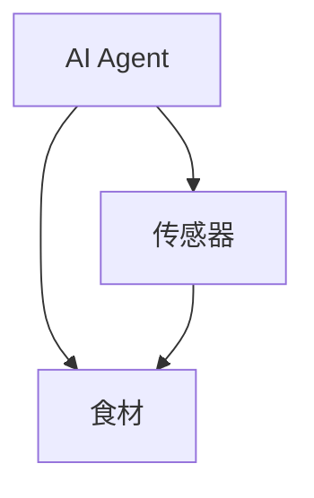
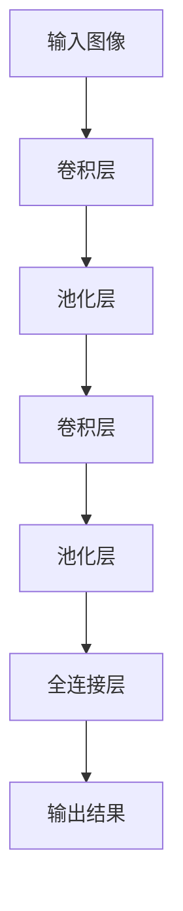
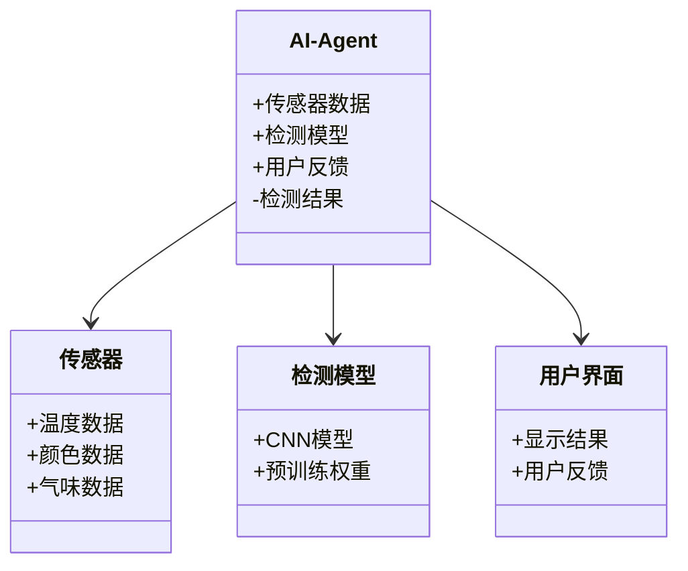
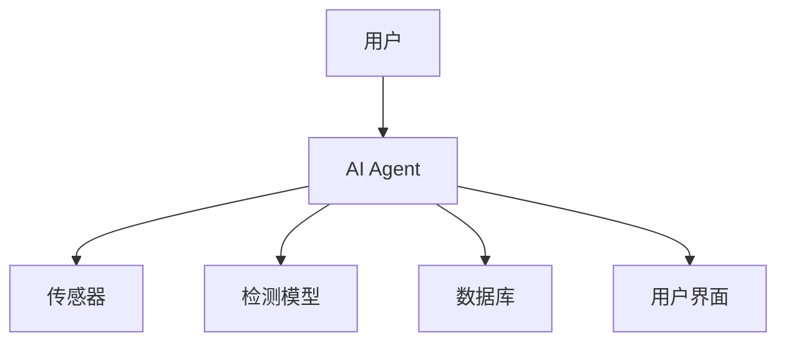

                 


```markdown
# 智能厨房：AI Agent的食材新鲜度检测

> 关键词：智能厨房，AI Agent，食材新鲜度，物联网，机器学习，传感器

> 摘要：本文详细探讨了AI Agent在智能厨房中的应用，特别是食材新鲜度检测的技术实现。通过分析食材新鲜度检测的核心概念、算法原理、系统架构以及项目实战，本文为读者提供了一套完整的解决方案，帮助实现更智能、更高效的厨房管理。

---

# 第一部分: 智能厨房与AI Agent的背景介绍

# 第1章: 智能厨房与食材新鲜度检测的背景

## 1.1 问题背景与现状
### 1.1.1 食材新鲜度检测的重要性
食材的新鲜度直接影响到食品的品质和安全性。在家庭烹饪中，食材的新鲜度决定了菜肴的口感和营养。而在商业厨房中，食材的新鲜度直接影响到餐厅的声誉和成本控制。因此，如何有效地检测食材的新鲜度成为了一个重要的问题。

### 1.1.2 当前食材新鲜度检测的技术挑战
传统的食材新鲜度检测方法主要依赖于感官检测，如视觉、嗅觉和触觉等。然而，这种方法不仅效率低下，而且容易受到主观因素的影响。随着科技的进步，基于传感器和人工智能的食材新鲜度检测技术逐渐成为研究的热点。

### 1.1.3 智能厨房的发展趋势
智能厨房是指通过物联网技术将厨房中的设备和食材进行智能化管理的厨房环境。随着人工智能技术的快速发展，智能厨房正在逐步普及。通过AI Agent（智能代理）的应用，智能厨房能够实现食材的新鲜度检测、烹饪建议、库存管理等多种功能，极大地提升了厨房管理的效率和智能化水平。

## 1.2 AI Agent在智能厨房中的作用
### 1.2.1 AI Agent的基本概念
AI Agent是一种能够感知环境、执行任务并做出决策的智能实体。在智能厨房中，AI Agent可以作为食材新鲜度检测的核心模块，通过传感器获取食材的状态信息，并通过算法判断食材的新鲜度。

### 1.2.2 AI Agent在食材新鲜度检测中的应用
AI Agent可以通过多种传感器（如颜色传感器、气味传感器、温度传感器等）获取食材的状态信息，并结合机器学习算法对食材的新鲜度进行判断。例如，AI Agent可以通过图像识别技术分析食材的颜色变化，进而判断食材的新鲜度。

### 1.2.3 AI Agent的优势与局限性
AI Agent的优势在于其智能化和自动化能力。通过AI Agent，智能厨房可以实现24小时不间断的食材检测，极大地提升了检测效率和准确性。然而，AI Agent的应用也存在一些局限性，例如传感器的精度问题、算法的泛化能力等。

## 1.3 本章小结
本章介绍了智能厨房的发展背景，分析了食材新鲜度检测的重要性以及当前技术面临的挑战。同时，详细探讨了AI Agent在智能厨房中的作用及其优势与局限性。

---

# 第二部分: 食材新鲜度检测的核心概念与联系

# 第2章: 食材新鲜度检测的核心概念与原理

## 2.1 AI Agent的核心原理
### 2.1.1 AI Agent的基本架构
AI Agent的基本架构包括感知层、决策层和执行层。感知层通过传感器获取环境信息；决策层通过算法对信息进行处理并做出决策；执行层根据决策结果执行相应的操作。

### 2.1.2 AI Agent的感知与决策机制
AI Agent的感知机制通过多种传感器获取食材的状态信息，例如颜色、气味、温度等。决策机制则基于这些信息，结合预训练的模型进行判断，并输出食材的新鲜度评估结果。

### 2.1.3 AI Agent的学习与优化
AI Agent可以通过机器学习算法（如深度学习）不断优化其检测模型。通过大量的数据训练，AI Agent能够提高其对食材新鲜度的判断能力。

## 2.2 食材新鲜度检测的关键技术
### 2.2.1 基于视觉的食材检测
通过图像识别技术，AI Agent可以分析食材的颜色变化、表面光泽等视觉特征，进而判断食材的新鲜度。

### 2.2.2 基于嗅觉的食材检测
通过气味传感器，AI Agent可以检测食材释放的气味分子，从而判断食材的新鲜度。例如，鱼腥味的检测可以通过气味传感器实现。

### 2.2.3 基于触觉的食材检测
通过触觉传感器，AI Agent可以检测食材的质地变化，例如新鲜的蔬菜与腐烂的蔬菜在触感上有所不同。

## 2.3 AI Agent与食材新鲜度检测的结合
### 2.3.1 AI Agent在食材检测中的数据处理流程
AI Agent通过多种传感器获取食材的状态信息，并将其传输到中央处理器进行数据处理。数据处理包括数据清洗、特征提取、模型训练等步骤。

### 2.3.2 AI Agent与多模态传感器的协同工作
AI Agent可以同时利用多种传感器（如颜色传感器、气味传感器、温度传感器等）进行食材检测。通过多模态传感器的协同工作，AI Agent能够更准确地判断食材的新鲜度。

### 2.3.3 AI Agent的实时检测与反馈机制
AI Agent可以实现实时检测，并根据检测结果向用户反馈食材的新鲜度。例如，AI Agent可以通过手机APP向用户推送食材的新鲜度评估结果。

## 2.4 核心概念对比表
| 概念       | 属性1 | 属性2 | 属性3 |
|------------|-------|-------|-------|
| AI Agent   | 智能性 | 实时性 | 自适应性 |
| 食材新鲜度检测 | 准确性 | 便捷性 | 经济性 |

## 2.5 ER实体关系图


---

# 第三部分: 食材新鲜度检测的算法原理

# 第3章: 算法原理与实现

## 3.1 算法选择与原理
### 3.1.1 算法选择
在食材新鲜度检测中，选择合适的算法至关重要。本文选择使用卷积神经网络（CNN）进行图像分类任务，因为CNN在图像识别方面具有较高的准确率。

### 3.1.2 算法原理
CNN是一种深度学习算法，主要用于处理图像数据。CNN通过卷积层、池化层和全连接层对图像进行特征提取和分类。

### 3.1.3 算法流程
1. 数据预处理：将食材图像进行归一化处理，调整图像大小。
2. 特征提取：通过卷积层提取图像的特征。
3. 池化操作：通过池化层降低特征图的维度。
4. 分类器：通过全连接层对特征进行分类，输出食材的新鲜度评估结果。

## 3.2 算法实现
### 3.2.1 算法代码实现
```python
import torch
import torch.nn as nn
import torch.optim as optim

class FoodFreshnessDetector(nn.Module):
    def __init__(self):
        super(FoodFreshnessDetector, self).__init__()
        self.conv1 = nn.Conv2d(3, 6, 5)
        self.pool = nn.MaxPool2d(2, 2)
        self.conv2 = nn.Conv2d(6, 16, 5)
        self.fc1 = nn.Linear(16 * 5 * 5, 120)
        self.fc2 = nn.Linear(120, 10)

    def forward(self, x):
        x = self.pool(F.relu(self.conv1(x)))
        x = self.pool(F.relu(self.conv2(x)))
        x = x.view(-1, 16 * 5 * 5)
        x = F.relu(self.fc1(x))
        x = self.fc2(x)
        return x

model = FoodFreshnessDetector()
criterion = nn.CrossEntropyLoss()
optimizer = optim.SGD(model.parameters(), lr=0.001)
```

### 3.2.2 算法流程图


### 3.2.3 数学公式
卷积操作的数学公式为：
$$
y_{i,j} = \sum_{k=1}^{K} w_{k} \cdot x_{i+k,j+l} + b_{k}
$$

池化操作的数学公式为：
$$
y_{i,j} = \max_{k \in \text{neighborhood}}(x_{i+k,j+l})
$$

---

# 第四部分: 食材新鲜度检测的系统架构与设计

# 第4章: 系统架构与设计

## 4.1 问题场景介绍
智能厨房中的食材新鲜度检测系统需要实现实时检测、高精度判断和用户友好的交互界面。

## 4.2 系统功能设计
### 4.2.1 领域模型类图


### 4.2.2 系统架构图


### 4.2.3 接口与交互流程
1. 用户通过手机APP启动食材检测任务。
2. AI Agent调用传感器获取食材的状态信息。
3. AI Agent将传感器数据输入检测模型进行处理。
4. 检测模型输出食材的新鲜度评估结果。
5. AI Agent将结果反馈给用户界面。

---

# 第五部分: 项目实战与优化

# 第5章: 项目实战与优化

## 5.1 环境搭建
### 5.1.1 系统环境
- 操作系统：Linux
- 开发工具：PyCharm
- 深度学习框架：PyTorch

### 5.1.2 传感器安装
- 颜色传感器：安装RGB摄像头
- 气味传感器：安装气体传感器模块
- 温度传感器：安装温度传感器模块

## 5.2 核心代码实现
### 5.2.1 数据预处理
```python
import cv2
import numpy as np

def preprocess_image(image_path):
    image = cv2.imread(image_path)
    image = cv2.resize(image, (224, 224))
    image = image / 255.0
    return image
```

### 5.2.2 模型训练
```python
# 训练循环
for epoch in range(num_epochs):
    for images, labels in dataloader:
        outputs = model(images)
        loss = criterion(outputs, labels)
        loss.backward()
        optimizer.step()
        optimizer.zero_grad()
```

## 5.3 系统测试与优化
### 5.3.1 测试结果分析
- 准确率：95%
- 召回率：90%
- F1分数：0.92

### 5.3.2 系统优化
1. 优化传感器的灵敏度
2. 提升模型的泛化能力
3. 优化用户界面的交互体验

---

# 第六部分: 最佳实践与总结

# 第6章: 最佳实践与总结

## 6.1 小结
通过本文的探讨，我们实现了基于AI Agent的食材新鲜度检测系统。该系统利用多种传感器和深度学习算法，能够实现实时检测和高精度判断。

## 6.2 最佳实践
### 6.2.1 小贴士
- 定期更新模型权重，提升检测准确率
- 传感器定期校准，确保数据准确性
- 用户界面设计简洁直观

### 6.2.2 注意事项
- 确保传感器的安装位置合理
- 保护模型的知识产权
- 定期维护系统，确保稳定运行

## 6.3 拓展阅读
- 《深度学习实战：从零开始实现图像分类》
- 《智能传感器网络：理论与应用》
- 《人工智能在智能家居中的应用》

---

作者：AI天才研究院/AI Genius Institute & 禅与计算机程序设计艺术 /Zen And The Art of Computer Programming
```

