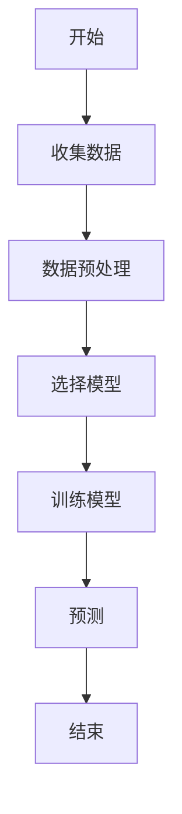
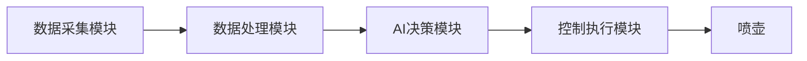
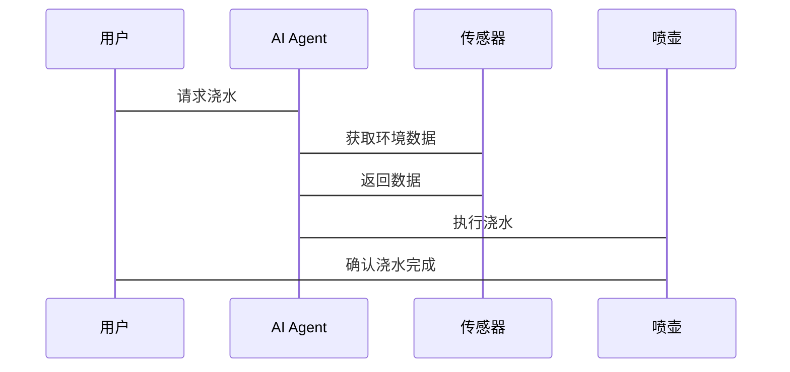

                 


# 智能园艺喷壶：AI Agent的植物浇水优化

> 关键词：智能园艺喷壶，AI Agent，植物浇水优化，智能浇水系统，物联网传感器，时间序列预测

> 摘要：本文探讨了如何利用AI Agent优化植物浇水管理，结合物联网传感器和时间序列预测模型，设计并实现了一个智能园艺喷壶系统，解决了传统浇水方法的不足，实现了高效、精准的植物浇水管理。

---

## 第一部分：背景介绍

### 第1章：问题背景与描述

#### 1.1 问题背景
- 1.1.1 传统园艺浇水的挑战
  - 手动浇水效率低，依赖人工判断，容易过浇或漏浇。
  - 植物生长周期不同，浇水需求变化大，难以精确管理。
  - 现代生活节奏快，难以持续关注植物浇水情况。

- 1.1.2 智能浇水的必要性
  - 自动化管理可节省时间和精力。
  - 精准浇水可提高植物生长质量，减少水资源浪费。
  - 连网传感器可实时监测环境数据，优化浇水策略。

#### 1.2 问题描述
- 1.2.1 浇水不规律的影响
  - 不同植物对水分需求不同，传统方法难以满足。
  - 浇水不及时可能导致植物生长不良或病害。
  - 过度浇水可能引发根部病害，浪费水资源。

- 1.2.2 资源浪费的问题
  - 非智能系统无法根据实际需水量调整浇水频率。
  - 手工记录浇水数据效率低下，难以分析优化。

#### 1.3 解决方案
- 1.3.1 AI Agent的应用
  - 利用AI Agent实现自动化浇水决策。
  - 通过传感器数据和历史记录，预测未来浇水需求。
  - 结合环境数据，实时调整浇水策略。

- 1.3.2 智能喷壶的优势
  - 自动化控制，减少人工干预。
  - 数据驱动决策，提高浇水效率。
  - 精准控制，优化水资源利用。

#### 1.4 边界与外延
- 1.4.1 系统的适用范围
  - 适用于家庭花园、农业大棚等场景。
  - 支持多种植物类型，但需根据具体需求调整模型。

- 1.4.2 系统的局限性
  - 依赖传感器数据，传感器故障可能导致决策错误。
  - 环境变化剧烈时，模型预测可能不够准确。
  - 需要定期维护和校准传感器。

#### 1.5 概念结构与核心要素
- 1.5.1 核心要素
  - **AI Agent**：负责数据处理和决策。
  - **传感器**：采集环境数据。
  - **喷壶**：执行浇水动作。
  - **用户界面**：提供交互界面。

---

## 第二部分：核心概念与联系

### 第2章：AI Agent的核心概念

#### 2.1 AI Agent的基本原理
- AI Agent是一个智能体，能够感知环境、做出决策并执行动作。
- 在智能喷壶中，AI Agent负责：
  - **感知**：接收传感器数据。
  - **决策**：分析数据，确定是否需要浇水。
  - **执行**：控制喷壶进行浇水。

#### 2.2 AI Agent的类型对比

| 类型          | 特点                        | 优缺点                          | 应用场景                |
|---------------|-----------------------------|----------------------------------|------------------------|
| 基于规则的AI Agent | 使用预定义规则做出决策       | 简单易懂，但灵活性差           | 适合规则明确的场景      |
| 基于知识的AI Agent | 使用知识库进行推理           | 精确性高，但知识获取困难        | 适合需要专业知识的场景   |
| 基于学习的AI Agent | 通过数据学习做出决策         | 灵活性高，但需要大量数据        | 适合复杂、动态的环境     |

#### 2.3 实体关系与ER图

```mermaid
erDiagram
    participant 传感器 : Sensor
    participant 喷壶 : Sprinkler
    participant 用户 : User
    participant 环境 : Environment

    传感器 --> 环境 : 监测
    传感器 --> AI Agent : 传递数据
    AI Agent --> 喷壶 : 控制
    用户 --> AI Agent : 下达指令
```

---

## 第三部分：算法原理讲解

### 第3章：基于时间序列的预测模型

#### 3.1 算法原理
- 使用时间序列预测模型（如ARIMA）预测未来需水量。
- 通过历史浇水数据和环境数据，训练模型预测最佳浇水时间。

#### 3.2 算法流程



#### 3.3 核心代码实现

```python
import pandas as pd
from statsmodels.tsa.arima.model import ARIMA

# 数据预处理
data = pd.read_csv('watering_data.csv')
data = data['water_amount']

# 训练模型
model = ARIMA(data, order=(5,1,0))
model_fit = model.fit()

# 预测
forecast = model_fit.forecast(steps=7)
print(forecast)
```

#### 3.4 数学模型与公式

时间序列预测模型的数学公式如下：

$$
\hat{y}_t = \alpha \hat{y}_{t-1} + \beta t + \gamma
$$

其中：
- $$\hat{y}_t$$ 是预测的需水量
- $$\alpha$$ 是自回归系数
- $$\beta$$ 是趋势系数
- $$\gamma$$ 是常数项

---

## 第四部分：系统分析与架构设计

### 第4章：系统功能设计

#### 4.1 功能需求
- 数据采集：采集土壤湿度、光照强度等数据。
- 数据处理：清洗和预处理数据。
- 智能决策：基于模型预测决定是否浇水。
- 控制执行：控制喷壶执行浇水动作。

#### 4.2 系统架构设计



#### 4.3 接口设计
- 传感器接口：连接温湿度传感器。
- 用户界面：提供设置和查看数据的接口。
- 网络接口：支持远程控制和数据上传。

#### 4.4 交互设计



---

## 第五部分：项目实战

### 第5章：环境搭建与核心代码实现

#### 5.1 环境搭建
- 安装必要的库：`pandas`, `statsmodels`, `sensorlib`

#### 5.2 核心代码实现

```python
import sensorlib

class SmartSprinkler:
    def __init__(self):
        self.sensor = sensorlib.Sensor()
        self.ai_agent = AI-Agent()

    def water_plant(self):
        data = self.sensor.get_data()
        prediction = self.ai_agent.predict(data)
        if prediction['water']:
            self.control_sprinkler()

    def control_sprinkler(self):
        # 控制喷壶执行浇水
        pass
```

#### 5.3 案例分析
- 数据分析：不同植物的需水量差异。
- 系统优化：根据预测结果调整浇水频率。

---

## 第六部分：最佳实践与总结

### 第6章：最佳实践

#### 6.1 小贴士
- 定期校准传感器，确保数据准确性。
- 根据植物生长阶段调整模型参数。
- 设置备用浇水模式，应对传感器故障。

#### 6.2 小结
本文详细介绍了AI Agent在智能园艺喷壶中的应用，通过时间序列预测模型优化了浇水管理，实现了高效、精准的植物浇水。

#### 6.3 注意事项
- 数据隐私：避免敏感数据泄露。
- 设备维护：定期检查传感器和喷壶。
- 环境适应：根据不同植物调整模型。

#### 6.4 拓展阅读
- 推荐书籍：《时间序列分析》、《机器学习实战》。
- 推荐资源：Kaggle上的相关数据集，TensorFlow的园艺应用案例。

---

## 作者：AI天才研究院 & 禅与计算机程序设计艺术

---

通过以上详细分析，本文系统地探讨了AI Agent在智能园艺喷壶中的应用，结合理论与实践，展示了如何利用技术优化植物浇水管理。希望本文能为读者提供有价值的见解和实践指导。

