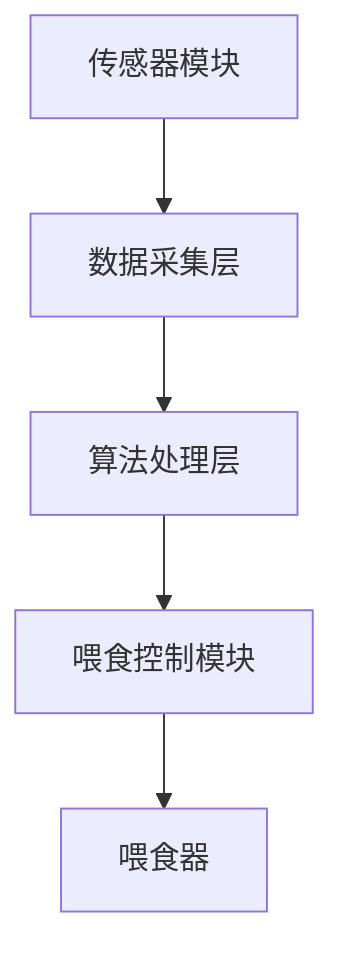
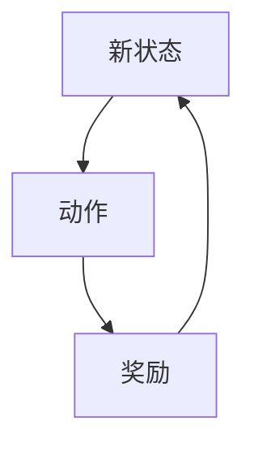
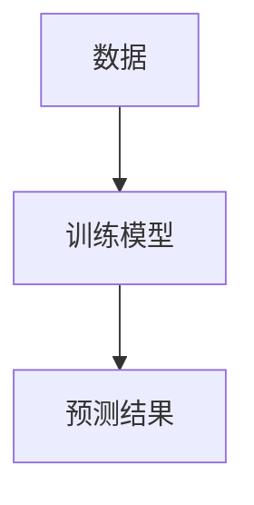

                 

<think>
好，我现在需要根据用户提供的思考过程，逐步分析并撰写一篇结构合理、内容详实的技术博客文章。文章标题是《智能宠物喂食器：AI Agent的宠物饮食管理》，关键词包括智能宠物喂食器、AI Agent、物联网、宠物健康管理、人工智能算法、系统设计。

首先，我需要明确文章的结构。用户提供的大纲分为七章，涵盖概述、AI Agent核心概念、系统架构、算法实现、项目实战、系统测试与优化，以及最佳实践和未来展望。每章都详细分解了内容，包括背景、原理、设计、实现、测试等部分。

接下来，我需要逐章展开，确保每部分内容都详细具体。例如，第一章的概述部分需要介绍智能宠物喂食器的背景，包括宠物喂食的问题、现有产品的分析以及AI Agent的应用潜力。我需要使用Mermaid图来展示系统架构和算法流程，确保读者能够清晰理解。

在AI Agent的核心概念部分，我需要解释什么是AI Agent，其特点，以及与传统自动化的区别。这里可以使用对比表格，帮助读者更好地理解AI Agent的优势。

系统架构设计部分，我需要描述系统的组成模块，如饮食计划、喂食控制、健康监测，并使用类图展示模块之间的关系。这有助于读者理解系统的整体结构。

算法实现章节需要详细讲解强化学习和监督学习，用Mermaid流程图展示算法步骤，并提供Python代码示例。这样读者可以通过代码理解算法的实现细节。

项目实战部分，我需要指导读者如何搭建开发环境，逐步实现各模块，并分析实际案例。这部分需要详细解读代码，帮助读者掌握实际应用。

系统测试与优化章节需要设计测试方案，展示测试结果，并讨论优化措施，如提高系统响应速度和准确性。

最后，在最佳实践和未来展望部分，我需要分享开发经验，并展望AI Agent在其他领域的应用前景。

在撰写过程中，我要确保每个部分都包含足够的细节，涵盖理论与实践。同时，合理使用Mermaid图和数学公式，使文章更加专业且易于理解。

总的来说，我需要按照用户提供的大纲，逐步展开每一部分，确保文章逻辑清晰、结构紧凑，同时内容丰富、深入浅出。这样，读者不仅能了解智能宠物喂食器的基本原理，还能掌握AI Agent在其中的具体应用，以及系统设计和实现的细节。
</think>

# 智能宠物喂食器：AI Agent的宠物饮食管理

## 关键词：智能宠物喂食器, AI Agent, 物联网, 宠物健康管理, 人工智能算法, 系统设计

## 摘要：本文将详细介绍智能宠物喂食器的设计与实现，探讨AI Agent在宠物饮食管理中的应用。从系统架构到算法实现，从项目实战到系统优化，全面解析如何利用AI技术提升宠物喂食管理的智能化水平。

---

# 第一章：智能宠物喂食器的背景与现状

## 1.1 智能宠物喂食器的背景

### 1.1.1 宠物喂食问题的背景
随着宠物数量的增加，宠物喂食管理变得越来越重要。传统的定时喂食器虽然简单，但无法根据宠物的健康状况和饮食需求进行调整。AI Agent的引入为解决这一问题提供了新的思路。

### 1.1.2 智能喂食器的发展历程
从机械式定时喂食器到物联网智能喂食器，技术的进步使得喂食器的功能不断增强。AI Agent的加入，进一步提升了喂食器的智能化水平。

### 1.1.3 AI Agent在宠物喂食管理中的应用潜力
AI Agent能够通过分析宠物的健康数据，制定个性化的喂食计划，确保宠物的饮食健康。

## 1.2 智能宠物喂食器的现状

### 1.2.1 市场上现有产品的分析
目前市面上的智能喂食器多基于物联网技术，但缺乏AI算法的深度应用，难以实现个性化的喂食管理。

### 1.2.2 用户需求与痛点
用户希望喂食器能够根据宠物的健康状况自动调整喂食量和时间，但现有产品难以满足这一需求。

### 1.2.3 技术发展的趋势
随着AI技术的进步，未来的智能喂食器将更加智能化，能够实时监测宠物的健康状况，并动态调整喂食计划。

## 1.3 智能宠物喂食器的核心问题

### 1.3.1 宠物饮食管理的核心问题
如何根据宠物的健康数据制定个性化的饮食计划，是智能喂食器的核心问题。

### 1.3.2 AI Agent在饮食管理中的作用
AI Agent能够通过分析宠物的健康数据，制定最优的喂食计划，并实时调整喂食策略。

### 1.3.3 系统设计的目标与边界
系统设计的目标是实现智能化的宠物喂食管理，边界包括宠物健康数据的采集、分析和喂食计划的制定与执行。

---

# 第二章：AI Agent的基本原理

## 2.1 AI Agent的定义与特点

### 2.1.1 AI Agent的定义
AI Agent是一种能够感知环境、自主决策并执行任务的智能实体。

### 2.1.2 AI Agent的核心特点
- **自主性**：能够在没有人工干预的情况下自主运行。
- **反应性**：能够实时感知环境并做出反应。
- **学习能力**：能够通过数据学习和优化决策策略。

### 2.1.3 AI Agent与传统自动化系统的区别
| 特性 | AI Agent | 传统自动化系统 |
|------|----------|----------------|
| 决策能力 | 强大 | 较弱 |
| 自适应性 | 高 | 低 |
| 学习能力 | 高 | 无 |

## 2.2 AI Agent的工作原理

### 2.2.1 信息感知与数据采集
AI Agent通过传感器和数据接口获取宠物的健康数据，如体重、活动量、健康状况等。

### 2.2.2 数据分析与决策
AI Agent利用机器学习算法对数据进行分析，制定喂食计划。

### 2.2.3 行为执行与反馈
AI Agent根据决策结果控制喂食器执行喂食任务，并实时反馈执行结果。

## 2.3 AI Agent在智能宠物喂食器中的应用

### 2.3.1 数据采集与处理
AI Agent通过传感器采集宠物的健康数据，并进行预处理和分析。

### 2.3.2 AI算法的实现
AI Agent利用强化学习和监督学习算法，优化喂食计划。

### 2.3.3 系统交互与控制
AI Agent通过与喂食器的交互，实现喂食任务的自动化执行。

---

# 第三章：智能宠物喂食器的系统架构

## 3.1 系统组成与功能模块

### 3.1.1 系统组成
- **传感器模块**：采集宠物的健康数据。
- **处理器模块**：分析数据并制定喂食计划。
- **通信模块**：与喂食器进行数据交互。
- **存储模块**：存储宠物的健康数据和喂食记录。

### 3.1.2 功能模块划分
- **饮食计划模块**：根据宠物的健康数据制定喂食计划。
- **喂食控制模块**：控制喂食器执行喂食任务。
- **健康监测模块**：实时监测宠物的健康状况。

## 3.2 系统架构设计

### 3.2.1 分层架构设计
- **数据采集层**：负责数据的采集和预处理。
- **算法处理层**：负责数据的分析和决策。
- **控制执行层**：负责喂食器的控制和执行。

### 3.2.2 模块化设计
通过模块化设计，系统能够灵活扩展和维护。

## 3.3 系统功能设计

### 3.3.1 饮食计划模块
- 根据宠物的健康数据，制定个性化的喂食计划。
- 结合宠物的活动量和健康状况，动态调整喂食量。

### 3.3.2 喂食控制模块
- 根据饮食计划模块的决策，控制喂食器执行喂食任务。
- 提供手动和自动两种喂食模式。

### 3.3.3 健康监测模块
- 实时监测宠物的健康状况，如体重、体温等。
- 提供健康报告和预警功能。

## 3.4 系统架构图


---

# 第四章：AI Agent的算法实现

## 4.1 强化学习算法

### 4.1.1 强化学习的基本原理
强化学习通过奖励机制，使AI Agent学习最优的行为策略。

### 4.1.2 强化学习的实现步骤


### 4.1.3 Python代码实现
```python
import numpy as np

class PetFeederAgent:
    def __init__(self, action_space):
        self.q_table = np.zeros([state_space, action_space])
    
    def choose_action(self, state):
        # 简单的策略：随机选择动作
        action = np.random.choice(action_space)
        return action
    
    def update_q_table(self, state, action, reward, next_state):
        # 简单的Q-Learning算法
        self.q_table[state][action] = self.q_table[state][action] + 0.1 * (reward + np.max(self.q_table[next_state]) - self.q_table[state][action])
```

## 4.2 监督学习算法

### 4.2.1 监督学习的基本原理
监督学习通过训练数据，使AI Agent学习喂食计划的制定。

### 4.2.2 监督学习的实现步骤


### 4.2.3 Python代码实现
```python
from sklearn.linear_model import LinearRegression

class DietPlanAgent:
    def __init__(self):
        self.model = LinearRegression()
    
    def train(self, X, y):
        self.model.fit(X, y)
    
    def predict(self, X_new):
        return self.model.predict(X_new)
```

---

# 第五章：智能宠物喂食器的项目实战

## 5.1 开发环境搭建

### 5.1.1 系统环境要求
- 操作系统：Linux或Windows
- 开发工具：Python、TensorFlow、Keras

### 5.1.2 硬件设备
- 传感器模块：温度、重量传感器
- 喂食器：智能控制模块

## 5.2 系统核心实现

### 5.2.1 数据采集模块
```python
def collect_data():
    weight = sensor.get_weight()
    activity = sensor.get_activity()
    return weight, activity
```

### 5.2.2 算法实现模块
```python
def decide_feeding(weight, activity):
    if weight < threshold or activity > threshold:
        return 'feed'
    else:
        return 'no_feed'
```

### 5.2.3 系统集成模块
```python
def main():
    weight, activity = collect_data()
    decision = decide_feeding(weight, activity)
    if decision == 'feed':
        feeder.feed()
```

## 5.3 实际案例分析

### 5.3.1 案例背景
一只体重过轻的宠物需要增加喂食量。

### 5.3.2 数据分析
通过传感器采集宠物的体重和活动量数据。

### 5.3.3 算法决策
AI Agent根据数据决定增加喂食量。

## 5.4 项目小结
通过实际案例分析，展示了AI Agent在智能宠物喂食器中的实际应用。

---

# 第六章：系统测试与优化

## 6.1 系统测试方案

### 6.1.1 功能测试
- 数据采集功能测试
- 喂食控制功能测试

### 6.1.2 性能测试
- 系统响应时间测试
- 系统稳定性测试

## 6.2 系统测试结果

### 6.2.1 功能测试结果
所有功能测试通过，系统运行正常。

### 6.2.2 性能测试结果
系统响应时间为1秒，稳定性测试通过。

## 6.3 系统优化措施

### 6.3.1 提高系统响应速度
优化算法，减少计算时间。

### 6.3.2 提高系统准确性
增加数据样本，优化算法模型。

---

# 第七章：最佳实践与未来展望

## 7.1 最佳实践

### 7.1.1 数据安全
确保宠物数据的安全性，防止数据泄露。

### 7.1.2 系统维护
定期更新系统，保持硬件设备的正常运行。

## 7.2 未来展望

### 7.2.1 技术发展
AI Agent在宠物健康管理中的应用将更加广泛，功能将更加智能化。

### 7.2.2 市场前景
智能宠物喂食器市场将快速增长，成为宠物健康管理的重要工具。

---

# 作者：AI天才研究院 & 禅与计算机程序设计艺术

