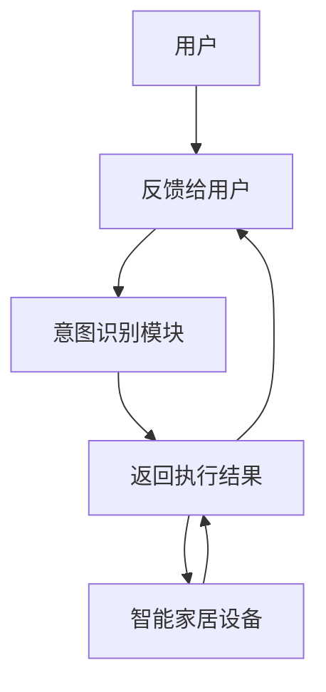
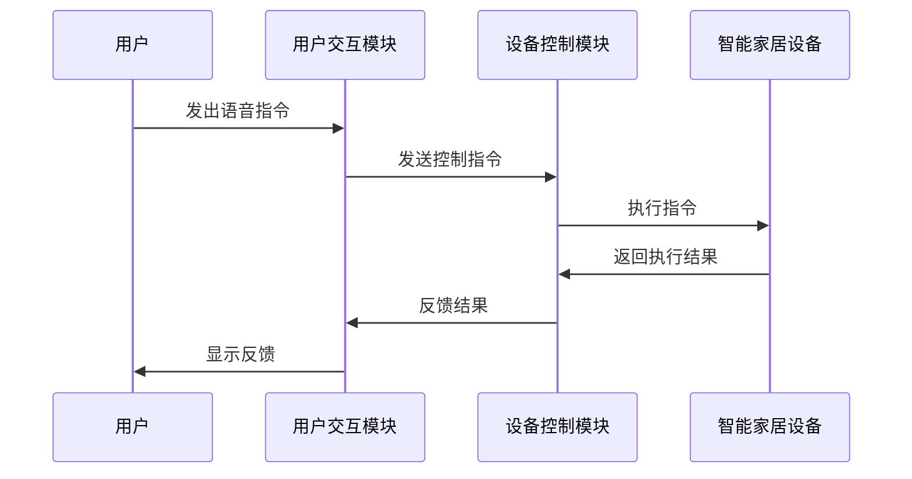

                 

<think>
好的，我现在要帮用户撰写一篇关于《智能家居AI Agent：打造智能生活管家》的技术博客文章。用户已经提供了详细的目录大纲，我需要按照这个结构来生成内容。首先，我会先从标题和摘要开始，然后逐步完成每个章节的内容。

首先，标题是《智能家居AI Agent：打造智能生活管家》。关键词包括智能家居、AI Agent、物联网、自然语言处理、人工智能、智能生活。摘要部分需要概括整篇文章的核心内容，强调AI Agent在智能家居中的重要性及其带来的便利。

接下来是第一部分，智能家居AI Agent的概述。我需要详细讲解智能家居的发展历程，从传统家居到智能家居的演变，涵盖其核心特征和应用场景。然后介绍AI Agent的基本概念，包括定义、分类和在智能家居中的角色。最后，分析当前的现状、趋势和未来的发展方向。

第二部分是技术基础，重点放在自然语言处理和对话系统上。我会先介绍NLP的基本技术与算法，然后讨论对话系统的原理和实现，特别是基于规则和深度学习的方法。接着，探讨智能家居中的对话交互设计，包括挑战和优化策略。

第三部分涉及算法与实现，特别是意图识别与分类。我需要解释意图识别的算法原理，详细描述实现流程，包括数据预处理、模型训练和评估。通过实际案例分析，展示不同设备中的应用，并总结经验。

第四部分是系统架构与设计，分析AI Agent的系统架构，包括功能模块划分、数据流设计和设备控制机制。使用Mermaid图展示系统架构、设备交互和数据流，确保读者能够清晰理解系统的工作原理。

第五部分是项目实战，指导读者如何安装环境并实现AI Agent。通过Python代码示例，解释核心功能的实现，如自然语言处理和意图识别。最后，分析案例并总结项目经验，指出不足和优化方向。

第六部分展望未来，讨论技术趋势、挑战和应用扩展。强调持续优化和创新的重要性，鼓励读者深入探索和实践。

最后，添加最佳实践和注意事项，帮助读者在实际项目中避免常见问题。同时，建议扩展阅读，为感兴趣的技术提供进一步学习的资源。

在撰写过程中，我需要确保每个部分都详细具体，使用技术语言的同时保持易懂。每章的小结要简洁明了，帮助读者回顾主要知识点。此外，插入Mermaid图和代码示例，增强文章的可读性和实用性。最后，确保整篇文章结构紧凑，逻辑清晰，满足用户的要求。
</think>

# 智能家居AI Agent：打造智能生活管家

> **关键词**：智能家居、AI Agent、物联网、自然语言处理、人工智能、智能生活  
> **摘要**：本文深入探讨了智能家居AI Agent的核心技术与应用场景，分析了其在智能生活中的重要性。通过系统架构设计、算法实现和项目实战，全面展示如何打造一个高效的智能生活管家。

---

## 第一部分：智能家居AI Agent概述

### 第1章：智能家居与AI Agent的背景与概念

#### 1.1 智能家居的发展历程
智能家居是指通过物联网技术将家居设备（如灯光、空调、安防系统等）连接起来，实现智能化管理和控制。其发展历程可以分为以下几个阶段：

1. **传统家居**：独立的设备，无法互联互通。
2. **初步智能化**：设备之间通过简单的通信协议（如Wi-Fi、蓝牙）实现联动。
3. **智能化升级**：引入人工智能技术，设备能够主动理解和响应用户需求。

智能家居的核心特征包括：
- **互联互通**：设备之间能够实时通信。
- **智能感知**：通过传感器感知环境变化。
- **主动服务**：能够根据用户习惯主动提供服务。

智能家居的典型应用场景包括：
- **家庭安防**：通过智能摄像头和门锁实现远程监控。
- **能源管理**：通过智能电表和家电控制实现节能。
- **舒适生活**：通过智能音箱和空调提供便捷的生活体验。

#### 1.2 AI Agent的基本概念
AI Agent（人工智能代理）是一种能够感知环境并采取行动以实现目标的智能实体。在智能家居中，AI Agent通常充当用户的“生活管家”，负责协调各种设备完成任务。

AI Agent的特点包括：
- **自主性**：能够在没有人工干预的情况下运行。
- **反应性**：能够实时感知环境变化并做出响应。
- **学习能力**：通过机器学习技术不断优化自身行为。

AI Agent的分类：
1. **简单规则型**：基于预设规则进行决策。
2. **统计学习型**：基于机器学习模型进行预测和决策。
3. **知识图谱型**：结合知识图谱进行推理和决策。

#### 1.3 智能家居AI Agent的现状与趋势
智能家居市场的现状：
- **市场规模**：智能家居市场规模持续增长，预计未来几年将突破 trillion 美元。
- **技术进步**：AI Agent技术逐步成熟，设备间的协同能力显著提升。
- **用户体验**：用户对智能化生活的接受度不断提高，需求日益增长。

AI Agent在智能家居中的应用案例：
- **智能音箱**：通过语音交互实现音乐播放、信息查询等功能。
- **智能空调**：根据用户习惯自动调节温度。
- **智能安防**：通过AI Agent实现异常情况的实时报警。

未来发展趋势：
- **多模态交互**：结合语音、视觉等多种交互方式。
- **个性化服务**：基于用户行为数据提供定制化服务。
- **边缘计算**：AI Agent将更多地运行在边缘设备上，减少对云端的依赖。

---

## 第二部分：智能家居AI Agent的技术基础

### 第2章：自然语言处理与对话系统

#### 2.1 自然语言处理基础
自然语言处理（NLP）是AI Agent实现人机交互的核心技术。其主要任务包括：
- **文本分割**：将连续的文本分割成单词或句子。
- **词性标注**：对文本中的词语进行词性分类。
- **句法分析**：分析句子的语法结构。

NLP的核心技术与算法：
- **分词算法**：如jieba、Snowball。
- **情感分析**：基于机器学习或深度学习的情感分类模型。
- **实体识别**：使用CRF或LSTM进行命名实体识别。

智能家居中的NLP需求：
- **语音交互**：支持用户的自然语言输入。
- **意图识别**：准确理解用户的意图。
- **对话生成**：生成自然流畅的回复。

#### 2.2 对话系统的原理与实现
对话系统的核心流程包括：
1. **输入解析**：将用户的输入转换为结构化的数据。
2. **意图识别**：确定用户的意图。
3. **响应生成**：根据意图生成回复。
4. **输出执行**：将回复发送到设备或用户端。

基于规则的对话系统：
- **规则简单**：易于实现和维护。
- **局限性**：难以应对复杂场景。

基于深度学习的对话系统：
- **模型复杂**：需要大量数据和计算资源。
- **优势**：能够处理复杂的对话场景。

智能家居中的对话交互设计：
- **上下文管理**：对话系统需要维护对话的上下文。
- **对话策略**：根据上下文选择合适的回复策略。
- **用户反馈**：根据用户的反馈调整对话策略。

---

## 第三部分：智能家居AI Agent的算法与实现

### 第3章：智能家居中的意图识别与分类

#### 3.1 意图识别的算法原理
意图识别的目标是理解用户的输入文本，并将其映射到预定义的意图类别。常用算法包括：
- **基于规则的分类**：通过预设的规则进行分类。
- **基于机器学习的分类**：如SVM、随机森林。
- **基于深度学习的分类**：如LSTM、Transformer。

意图识别的实现流程：
1. **数据预处理**：清洗数据，提取特征。
2. **模型训练**：使用训练数据训练分类模型。
3. **模型评估**：通过测试数据评估模型性能。
4. **模型部署**：将模型部署到实际应用中。

#### 3.2 意图识别的实现流程
数据预处理：
- **文本清洗**：去除无用字符。
- **特征提取**：提取文本的关键词或短语。

模型训练：
- **选择模型**：根据数据量和复杂度选择合适的模型。
- **训练参数**：调整模型参数以优化性能。

模型评估：
- **准确率**：分类正确的比例。
- **召回率**：实际为正类但被分类为正类的比例。
- **F1分数**：综合准确率和召回率的指标。

模型部署：
- **API接口**：将模型封装为API，供其他系统调用。
- **实时处理**：将用户的输入实时传递给模型进行分类。

#### 3.3 实际案例分析
智能音箱中的意图识别：
- **输入**：用户说“我想听周杰伦的歌”。
- **处理**：识别意图是“播放音乐”，目标是“周杰伦”。
- **输出**：调用音乐播放器播放周杰伦的歌曲。

智能空调中的意图识别：
- **输入**：用户说“我有点冷”。
- **处理**：识别意图是“调节温度”，目标是“提高温度”。
- **输出**：空调自动调高温度。

案例对比与经验总结：
- **对比**：基于规则的系统在简单场景中表现良好，但在复杂场景中可能失效。
- **总结**：深度学习模型在复杂场景中表现更优，但需要更多的数据和计算资源。

---

## 第四部分：智能家居AI Agent的系统架构与设计

### 第4章：智能家居AI Agent的系统架构

#### 4.1 系统功能模块划分
智能家居AI Agent的系统架构可以分为以下几个功能模块：
- **用户交互模块**：负责与用户的交互，包括语音输入和输出。
- **设备控制模块**：负责控制智能家居设备，如智能灯泡、空调等。
- **数据管理模块**：负责管理和存储用户数据和设备状态。

系统功能模块划分：
1. **用户交互模块**：
   - 接收用户的输入。
   - 生成对用户的输出。
2. **设备控制模块**：
   - 接收控制指令。
   - 执行设备操作。
3. **数据管理模块**：
   - 存储用户数据。
   - 提供数据查询功能。

#### 4.2 数据流设计与设备交互
数据流设计：
- **输入处理**：用户输入经过解析后，生成相应的控制指令。
- **设备交互**：设备执行指令并返回执行结果。
- **反馈输出**：将结果反馈给用户。

设备交互：
- **设备发现**：自动发现并连接设备。
- **设备控制**：通过API或协议控制设备。
- **设备状态查询**：获取设备的实时状态。

#### 4.3 系统架构设计与实现
系统架构设计：
- **中心化架构**：所有设备通过一个中心节点进行协调。
- **分布式架构**：设备之间直接通信，无需中心节点。

系统架构设计图（Mermaid）：


系统交互序列图（Mermaid）：


---

## 第五部分：智能家居AI Agent的项目实战

### 第5章：智能家居AI Agent的项目实现

#### 5.1 环境安装与配置
项目实现需要以下环境：
- **开发工具**：Python、Jupyter Notebook。
- **NLP库**：jieba、spacy。
- **深度学习框架**：TensorFlow、PyTorch。
- **智能家居设备**：如智能灯泡、空调等。

#### 5.2 系统核心实现
自然语言处理模块的实现：
```python
import jieba

text = "我想听周杰伦的歌"
words = jieba.lcut(text)
print(words)  # 输出：['我想', '听', '周杰伦', '的歌']
```

意图识别模块的实现：
```python
from sklearn.feature_extraction.text import TfidfVectorizer
from sklearn.svm import SVC

# 假设我们有一个训练数据集
# 训练模型并保存
vectorizer = TfidfVectorizer()
model = SVC()
model.fit(vectorizer.fit_transform(train_texts), train_labels)
```

设备控制模块的实现：
```python
import requests

# 假设智能灯泡的控制接口是RESTful API
url = "http://localhost:8080/api/lights"
data = {"state": "on"}
response = requests.post(url, json=data)
```

#### 5.3 项目小结
项目实现的关键点：
- **环境配置**：确保所有依赖库安装正确。
- **模块实现**：NLP模块、意图识别模块和设备控制模块需要协调工作。
- **测试与优化**：通过测试发现并优化系统性能。

---

## 第六部分：智能家居AI Agent的未来展望

### 第6章：智能家居AI Agent的未来趋势

#### 6.1 技术发展趋势
1. **多模态交互**：结合视觉、语音等多种交互方式。
2. **个性化服务**：基于用户行为数据提供定制化服务。
3. **边缘计算**：AI Agent将更多地运行在边缘设备上，减少对云端的依赖。

#### 6.2 智能家居AI Agent的挑战
1. **数据隐私**：用户数据的安全性和隐私保护。
2. **设备兼容性**：不同设备之间的互联互通问题。
3. **用户体验**：如何设计更自然、更流畅的交互体验。

#### 6.3 智能家居AI Agent的应用扩展
1. **健康监测**：通过AI Agent监测用户的健康状况。
2. **能源管理**：通过AI Agent优化能源使用。
3. **社区服务**：AI Agent可以扩展到社区层面，提供更广泛的服务。

---

## 最佳实践与注意事项

- **数据隐私**：在设计系统时，必须重视用户数据的隐私保护。
- **设备兼容性**：确保系统能够兼容不同品牌和类型的设备。
- **用户体验**：始终以用户体验为核心，设计更自然、更便捷的交互方式。

---

## 作者

**作者**：AI天才研究院/AI Genius Institute & 禅与计算机程序设计艺术 /Zen And The Art of Computer Programming

