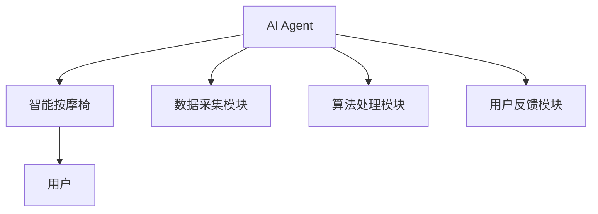
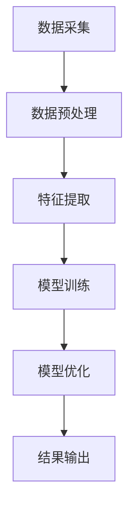
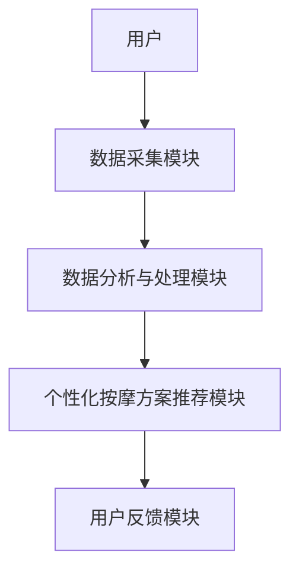
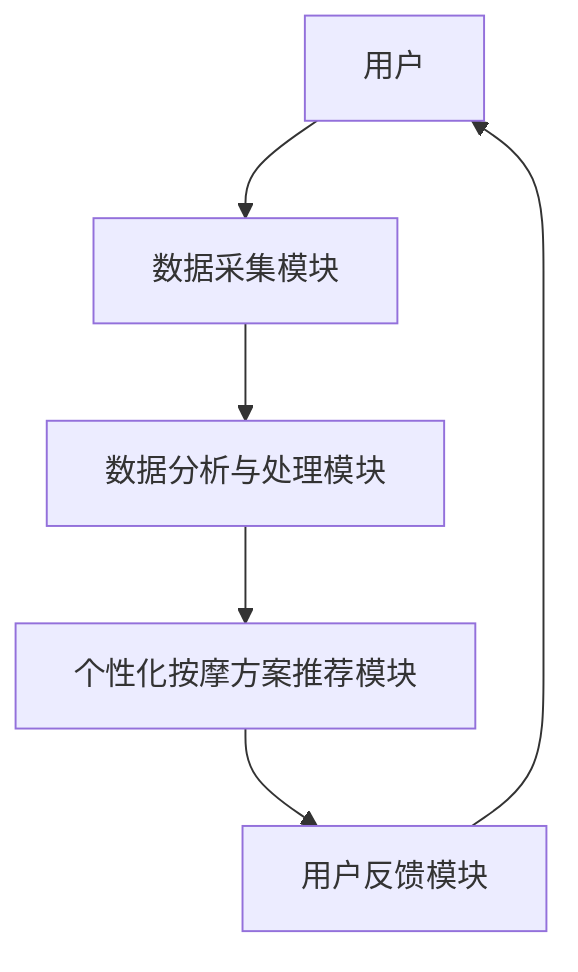

                 


# 智能按摩椅：AI Agent的个性化按摩方案

## 关键词：智能按摩椅, AI Agent, 个性化按摩, 数据分析, 机器学习, 推荐算法, 系统架构

## 摘要：本文探讨了智能按摩椅结合AI Agent实现个性化按摩方案的技术细节。通过分析用户数据，AI Agent利用推荐算法和机器学习模型，制定个性化的按摩计划。文章从系统架构、算法原理到项目实战，详细阐述了实现过程，为读者提供全面的技术解析。

---

# 第1章: 智能按摩椅与AI Agent的背景与概念

## 1.1 智能按摩椅的定义与特点

### 1.1.1 智能按摩椅的基本概念

智能按摩椅是一种结合了人工智能技术的按摩椅，能够通过传感器和AI算法，实时分析用户的生理数据，如心率、压力水平、肌肉紧张程度等，从而提供个性化的按摩服务。

### 1.1.2 AI Agent在智能按摩椅中的作用

AI Agent（人工智能代理）在智能按摩椅中扮演着核心角色，负责数据采集、分析、决策和执行。它能够根据用户的实时数据，动态调整按摩方案，提供更精准的服务。

### 1.1.3 智能按摩椅与传统按摩椅的区别

与传统按摩椅相比，智能按摩椅通过AI技术实现了个性化服务，能够根据用户的具体需求和健康状况，自动调整按摩强度、频率和模式，提供更高效的按摩体验。

## 1.2 AI Agent的核心概念

### 1.2.1 AI Agent的基本定义

AI Agent是一种智能实体，能够感知环境、自主决策并执行任务。在智能按摩椅中，AI Agent负责采集用户数据、分析需求、制定按摩方案，并通过按摩椅执行相应的操作。

### 1.2.2 AI Agent的主要功能与特点

- **数据采集**：通过传感器获取用户的生理数据。
- **数据分析**：利用机器学习算法分析数据，识别用户的健康状况和按摩需求。
- **个性化推荐**：根据分析结果，推荐适合的按摩方案。
- **动态调整**：根据用户的反馈，实时调整按摩方案。

### 1.2.3 AI Agent在智能按摩椅中的应用场景

- **健康监测**：实时监测用户的健康数据，如心率、血压等。
- **压力缓解**：根据用户的压力水平，推荐相应的按摩模式。
- **个性化按摩方案**：基于用户的数据，制定个性化的按摩计划。

## 1.3 智能按摩椅的个性化按摩方案

### 1.3.1 个性化按摩的需求背景

现代人生活节奏快，压力大，传统按摩椅无法满足每个人的个性化需求。通过AI Agent实现个性化按摩，能够更精准地缓解用户的不适。

### 1.3.2 个性化按摩方案的核心要素

- **用户数据**：心率、压力水平、肌肉紧张程度等。
- **按摩强度**：根据用户的健康状况调整按摩力度。
- **按摩模式**：选择不同的按摩模式，如深层组织按摩、放松按摩等。
- **反馈机制**：根据用户的反馈，动态调整按摩方案。

### 1.3.3 AI Agent如何实现个性化按摩

AI Agent通过采集用户的生理数据，利用机器学习算法分析数据，识别用户的健康状况和按摩需求，制定个性化的按摩方案，并通过按摩椅执行相应的操作。

---

# 第2章: AI Agent与智能按摩椅的核心概念与联系

## 2.1 AI Agent的核心原理

### 2.1.1 AI Agent的基本工作原理

AI Agent通过感知环境、分析数据、制定决策并执行任务。在智能按摩椅中，AI Agent负责采集用户数据、分析需求、制定按摩方案，并通过按摩椅执行相应的操作。

### 2.1.2 AI Agent的感知与决策机制

AI Agent通过传感器采集用户的生理数据，利用机器学习算法分析数据，识别用户的健康状况和按摩需求，制定个性化的按摩方案。

### 2.1.3 AI Agent的学习与优化能力

AI Agent能够通过不断学习用户的数据和反馈，优化按摩方案，提高服务的准确性和效果。

## 2.2 智能按摩椅的数据采集与分析

### 2.2.1 用户健康数据的采集

智能按摩椅通过传感器采集用户的生理数据，如心率、压力水平、肌肉紧张程度等。

### 2.2.2 数据分析与处理

AI Agent对采集的数据进行预处理、特征提取和数据分析，识别用户的健康状况和按摩需求。

### 2.2.3 数据驱动的个性化按摩方案

基于分析结果，AI Agent推荐适合的按摩方案，如不同的按摩强度、频率和模式。

## 2.3 AI Agent与智能按摩椅的实体关系图



---

# 第3章: AI Agent的算法原理与实现

## 3.1 推荐算法的基本原理

### 3.1.1 基于协同过滤的推荐算法

协同过滤是一种常用的推荐算法，通过分析用户的行为和偏好，推荐相似的物品。在智能按摩椅中，协同过滤可以用于推荐适合用户的按摩方案。

### 3.1.2 基于内容的推荐算法

内容推荐算法通过分析物品的特征，推荐与用户兴趣相符的物品。在智能按摩椅中，内容推荐算法可以用于推荐适合用户健康状况的按摩方案。

### 3.1.3 混合推荐算法

混合推荐算法结合了协同过滤和内容推荐的优势，能够提供更精准的推荐结果。在智能按摩椅中，混合推荐算法可以用于推荐个性化且高效的按摩方案。

## 3.2 基于机器学习的个性化按摩方案

### 3.2.1 数据预处理与特征提取

在机器学习中，数据预处理和特征提取是非常重要的步骤。通过对用户数据进行预处理和特征提取，可以提高模型的准确性和效果。

### 3.2.2 模型训练与优化

通过训练机器学习模型，可以预测用户的健康状况和按摩需求，制定个性化的按摩方案。

### 3.2.3 模型评估与验证

通过评估和验证模型的性能，可以优化模型的参数和结构，提高推荐的准确性和效果。

## 3.3 算法实现的流程图



---

# 第4章: 系统分析与架构设计

## 4.1 系统功能设计

### 4.1.1 用户信息采集模块

用户信息采集模块负责采集用户的生理数据，如心率、压力水平等。

### 4.1.2 数据分析与处理模块

数据分析与处理模块负责对采集的数据进行预处理、特征提取和数据分析，识别用户的健康状况和按摩需求。

### 4.1.3 个性化按摩方案推荐模块

个性化按摩方案推荐模块负责基于分析结果，推荐适合的按摩方案。

### 4.1.4 用户反馈模块

用户反馈模块负责收集用户的反馈，优化按摩方案。

## 4.2 系统架构设计

### 4.2.1 系统架构图



### 4.2.2 系统接口设计

系统接口设计包括数据采集接口、算法处理接口和用户反馈接口。

### 4.2.3 系统交互序列图



---

# 第5章: 项目实战

## 5.1 环境安装

在开始实现之前，需要安装必要的开发环境和库。例如，安装Python、NumPy、Pandas、Scikit-learn等。

## 5.2 系统核心实现源代码

### 5.2.1 数据预处理代码

```python
import numpy as np
import pandas as pd

# 读取数据
data = pd.read_csv('user_data.csv')

# 数据清洗
data.dropna(inplace=True)
data = data.drop_duplicates()

# 特征提取
features = data[['heart_rate', 'stress_level', 'muscle_tension']]
```

### 5.2.2 模型训练代码

```python
from sklearn.model

