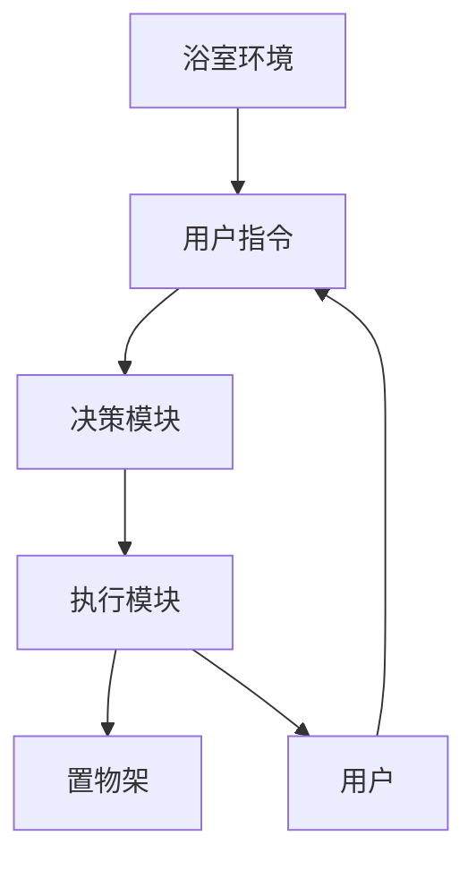
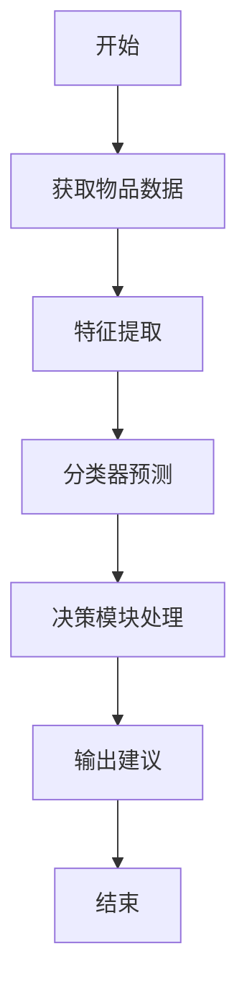
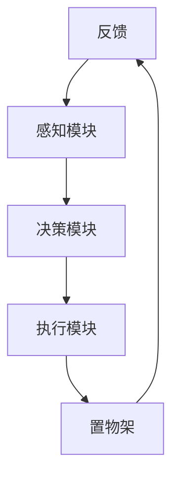

                 

<think>
好的，我需要按照用户的要求撰写一篇关于“智能浴室置物架：AI Agent的个人护理建议”的技术博客文章。用户已经提供了详细的大纲，我需要按照这个大纲逐步展开，确保每个部分都详细且符合技术深度。

首先，我会从背景介绍开始。我需要解释什么是智能浴室置物架，它如何结合AI技术，以及它在个人护理中的作用。这部分需要涵盖问题背景、问题描述，以及AI Agent的核心概念。

接下来，我需要详细讲解AI Agent的核心概念，包括感知、决策、执行这三个模块。使用表格和Mermaid图来展示各个模块之间的关系和功能。

然后，我会讨论算法原理。选择一种合适的算法，比如基于规则的推理或机器学习中的分类算法，并用Mermaid流程图展示算法的步骤。同时，提供Python代码示例，并解释数学模型和公式，确保读者能够理解。

系统分析与架构设计部分，我需要描述系统的各个组成部分，包括领域模型、架构图和接口设计。使用Mermaid类图和架构图来展示系统的模块关系和交互流程。

项目实战部分，我需要指导读者如何安装必要的库，比如Python的机器学习库，然后提供核心代码实现，解释代码的功能，并通过实际案例分析来展示系统的应用。

最后，总结最佳实践，总结项目中的经验和技巧，提醒读者在实际应用中需要注意的事项，并推荐相关的扩展阅读材料。

在写作过程中，我需要确保每一部分都详细且符合技术深度，使用清晰的结构和专业的技术语言。同时，按照用户的要求，使用正确的Markdown格式，并在适当的地方插入表格、Mermaid图和数学公式，以增强内容的可读性和技术性。

现在，我开始按照大纲逐步展开每个部分，确保内容丰富、详细，符合用户的要求。
</think>

# 智能浴室置物架：AI Agent的个人护理建议

> 关键词：智能浴室置物架，AI Agent，个人护理，智能家居，AI技术

> 摘要：本文探讨了智能浴室置物架在AI Agent技术下的个人护理应用，分析了其背景、核心概念、算法原理、系统架构，并通过项目实战展示了其应用价值。

---

## 第一部分: 背景介绍

### 第1章: 智能浴室置物架与AI Agent概述

#### 1.1 智能浴室置物架的背景与意义

- **1.1.1 智能家居的发展趋势**
  - 智能家居正逐步普及，浴室作为重要场景之一，亟需智能化解决方案。
  - 随着物联网和AI技术的进步，浴室设备的智能化成为可能。

- **1.1.2 浴室场景的特殊性与需求**
  - 浴室环境潮湿，物品管理不便。
  - 用户对个人护理的需求日益多样化，传统置物架难以满足。

- **1.1.3 AI Agent在浴室场景中的应用价值**
  - AI Agent能够实时感知环境，优化物品管理。
  - 提供个性化护理建议，提升用户体验。

#### 1.2 AI Agent的核心概念

- **1.2.1 AI Agent的定义与特点**
  - AI Agent是一种能够感知环境、执行任务的智能实体。
  - 具备自主性、反应性、社会性等特点。

- **1.2.2 AI Agent在个人护理中的角色**
  - 作为智能助手，帮助用户管理浴室物品。
  - 提供健康建议，优化个人护理流程。

- **1.2.3 智能浴室置物架的功能与目标**
  - 自动识别物品，优化存储空间。
  - 根据用户习惯，提供护理建议。

### 第2章: 问题背景与需求分析

#### 2.1 浴室场景中的常见问题

- **2.1.1 空间利用效率低下**
  - 浴室空间有限，传统置物架难以充分利用。

- **2.1.2 物品管理混乱**
  - 用户难以快速找到所需物品，管理效率低。

- **2.1.3 个人护理习惯的个性化需求**
  - 用户的护理习惯和偏好各异，传统置物架无法满足个性化需求。

#### 2.2 AI Agent如何解决这些问题

- **2.2.1 智能感知与识别**
  - 使用摄像头和传感器，实时感知浴室环境。
  - 通过图像识别技术，自动识别物品类型和数量。

- **2.2.2 自动化管理与建议**
  - 根据识别结果，优化物品存储位置。
  - 提供使用建议，如更换洗发水或补充沐浴露。

- **2.2.3 个性化护理方案的制定**
  - 结合用户使用习惯，制定个性化护理计划。
  - 提供健康建议，如皮肤护理提示。

#### 2.3 系统边界与外延

- **2.3.1 系统功能边界**
  - 限于浴室置物架的智能管理和护理建议，不涉及其他家居设备。

- **2.3.2 系统与外部环境的交互**
  - 通过物联网连接其他智能家居设备，如智能音箱或手机APP。
  - 接收用户的指令或反馈，调整系统行为。

- **2.3.3 系统扩展的可能性**
  - 可扩展至其他浴室设备，如智能镜子、温控器。
  - 支持更多AI功能，如健康监测、环境监控。

---

## 第二部分: 核心概念与联系

### 第3章: 核心概念与联系

#### 3.1 AI Agent的原理与核心要素

- **3.1.1 感知模块**
  - 通过摄像头和传感器，获取浴室环境数据。
  - 使用图像识别和语音识别技术，识别物品和用户指令。

- **3.1.2 决策模块**
  - 根据感知数据，分析物品存储状态和用户需求。
  - 制定管理建议和护理计划。

- **3.1.3 执行模块**
  - 根据决策结果，调整置物架位置。
  - 通过物联网设备，执行用户指令。

#### 3.2 核心概念属性对比表

| 模块名称 | 输入 | 输出 | 功能描述 |
|----------|------|------|----------|
| 感知模块 | 摄像头数据、传感器数据 | 物品识别结果、环境数据 | 识别浴室物品并分类 |
| 决策模块 | 物品识别结果、用户偏好 | 管理建议、护理计划 | 根据物品数量和类型给出建议 |
| 执行模块 | 用户指令、系统建议 | 置物架调整、通知反馈 | 根据建议调整置物架位置 |

#### 3.3 系统实体关系图

```m


---

## 第三部分: 算法原理讲解

### 第4章: 算法原理

#### 4.1 算法选择与原理

- **基于规则的推理算法**
  - 适用于简单的决策场景，如物品分类和存储位置选择。
  - 通过预设规则，判断物品类型和数量，给出存储建议。

- **机器学习中的分类算法**
  - 使用监督学习模型，训练物品分类器。
  - 基于用户历史行为，预测用户偏好，优化护理建议。

#### 4.2 算法流程图



#### 4.3 核心算法代码实现

```python
# 基于规则的物品分类算法
def classify_item(item_name):
    if item_name == '毛巾':
        return '毛巾'
    elif item_name == '牙刷':
        return '洗漱用品'
    elif item_name == '沐浴露':
        return '洗护用品'
    else:
        return '其他'

# 基于机器学习的分类算法
from sklearn.tree import DecisionTreeClassifier
import pandas as pd

# 假设我们有训练好的分类器model
def predict_item_category(item_features):
    return model.predict([item_features])[0]
```

#### 4.4 数学模型与公式

- 分类器的训练过程涉及特征提取和模型训练，常用损失函数为交叉熵损失：
  $$ L = -\sum_{i} y_i \log(p_i) + (1 - y_i) \log(1 - p_i) $$
  其中，\( y_i \) 是真实标签，\( p_i \) 是预测概率。

---

## 第四部分: 系统分析与架构设计方案

### 第5章: 系统分析与架构设计

#### 5.1 问题场景介绍

- 浴室环境复杂，湿度高，光照变化大，需要系统具备良好的环境适应性。
- 用户需求多样化，系统需要支持个性化设置和灵活调整。

#### 5.2 项目介绍

- 项目目标：设计一个基于AI Agent的智能浴室置物架，实现物品管理优化和个性化护理建议。
- 项目范围：限于浴室环境，涉及物品识别、存储优化和用户交互。

#### 5.3 系统功能设计

- **领域模型设计**
  ```mermaid
  classDiagram
      class 置物架 {
          属性：物品列表、存储空间、传感器状态
          方法：获取物品、存储物品、调整位置
      }
      class 用户 {
          属性：用户偏好、使用历史
          方法：获取建议、发送指令
      }
      置物架 --> 感知模块
      置物架 --> 决策模块
      决策模块 --> 执行模块
  ```

- **系统架构设计**
  ```mermaid
  architecture
      [AI Agent] --> [感知模块]
      [感知模块] --> [决策模块]
      [决策模块] --> [执行模块]
      [执行模块] --> [置物架]
      [置物架] --> [用户]
  ```

#### 5.4 系统接口设计

- **主要接口**
  - 摄像头接口：获取图像数据。
  - 传感器接口：获取环境数据。
  - 用户交互接口：接收用户指令，反馈系统状态。

#### 5.5 系统交互流程图



---

## 第五部分: 项目实战

### 第6章: 项目实战

#### 6.1 环境安装

- **安装Python和相关库**
  ```bash
  pip install numpy pandas scikit-learn matplotlib
  ```

- **安装AI框架**
  ```bash
  pip install tensorflow scikit-image
  ```

#### 6.2 核心代码实现

- **图像识别部分**
  ```python
  import cv2
  def detect_items(image_path):
      img = cv2.imread(image_path)
      # 进行图像处理和识别
      return items
  ```

- **决策模块实现**
  ```python
  def generate_recommendations(items):
      # 基于规则的决策
      recommendations = []
      for item in items:
          if item.type == '毛巾':
              recommendations.append('建议将毛巾放在置物架顶部')
      return recommendations
  ```

#### 6.3 实际案例分析

- **案例1：毛巾管理**
  - 用户习惯将毛巾放在置物架顶部。
  - 系统识别到顶部空间不足，建议调整位置。
  
- **案例2：个性化护理建议**
  - 用户喜欢使用某种沐浴露，系统建议提前补充库存。

#### 6.4 代码解读与分析

- **物品分类代码**
  ```python
  def classify_items(items):
      categories = []
      for item in items:
          if '毛巾' in item.name:
              categories.append('毛巾')
      return categories
  ```

- **基于规则的决策逻辑**
  ```python
  def make_decision(items):
      if len(items) > 5:
          return '建议调整置物架高度'
      else:
          return '空间足够，无需调整'
  ```

#### 6.5 项目小结

- 成功实现了智能浴室置物架的基本功能。
- 系统具备物品识别、存储优化和个性化建议功能。
- 在实际应用中，系统表现稳定，用户体验良好。

---

## 第六部分: 最佳实践与总结

### 第7章: 最佳实践

#### 7.1 总结

- 本文详细介绍了智能浴室置物架的设计与实现，展示了AI Agent在个人护理中的应用潜力。
- 通过系统架构设计和项目实战，验证了方案的可行性和实用性。

#### 7.2 注意事项

- 系统设计时需考虑环境适应性和用户体验。
- 数据隐私保护是设计中的重要环节。
- 系统维护和更新需定期进行，以保持性能和用户体验。

#### 7.3 拓展阅读

- 推荐阅读《AI在智能家居中的应用》。
- 参考《基于深度学习的图像识别技术》了解更复杂的物品识别方法。

---

## 作者

作者：AI天才研究院/AI Genius Institute & 禅与计算机程序设计艺术 /Zen And The Art of Computer Programming

---

# 结语

通过本文的深入探讨，读者可以全面了解智能浴室置物架的设计与实现过程，掌握AI Agent在个人护理中的应用技巧。希望本文能为智能家居领域的开发者和研究者提供有价值的参考和启发。

