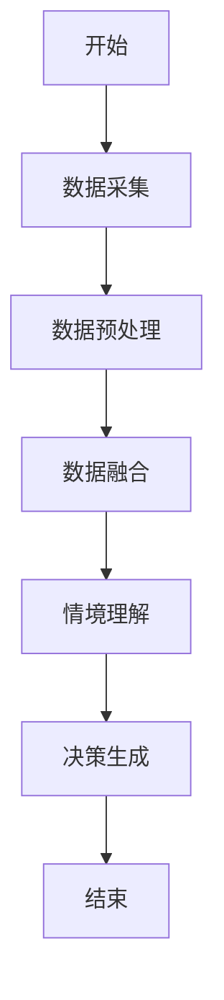
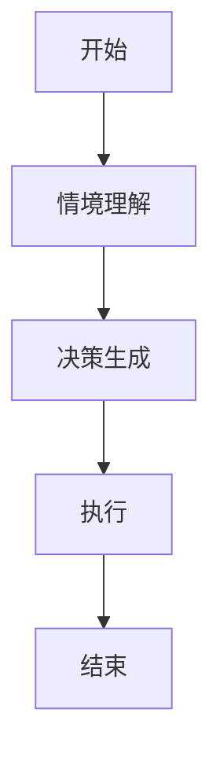
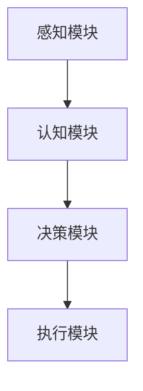
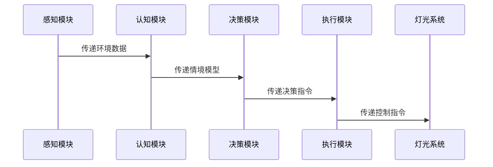

                 

<think>
好，我现在需要按照用户的要求来写一篇关于《智能灯光控制：AI Agent的情境感知系统》的技术博客。用户已经给出了一个详细的目录大纲，我需要根据这个大纲逐步展开每个部分，确保内容完整且符合技术博客的要求。

首先，我会先看一下目录结构，确定每个部分的主要内容。整个文章分为三大部分：背景与核心概念、算法原理、系统分析与架构设计。每个部分下有具体的章节和小节，我需要按照逻辑顺序逐一展开。

在“背景与核心概念”部分，我需要先介绍智能灯光控制的背景和问题描述，然后讲解AI Agent和情境感知系统的核心概念。这部分需要让读者了解为什么需要智能灯光控制，以及AI Agent在其中起到的作用。

接下来，在“算法原理”部分，我会详细讲解情境感知算法和AI Agent的决策算法，包括算法的流程图、数学模型和公式。这部分需要结合代码示例和图表来解释，确保内容清晰易懂。

最后，在“系统分析与架构设计”部分，我会分析系统的各个模块，设计系统的架构，并展示系统的交互序列图。这部分需要使用Mermaid图表来展示系统结构，帮助读者更好地理解系统的运作方式。

在写作过程中，我需要确保每个部分都有足够的细节，并且逻辑清晰。同时，我会加入一些实际案例和代码示例，使内容更具实用性。最后，我会总结全文，并给出一些最佳实践的建议。

现在，我会按照这个思路开始撰写文章，确保每个部分都覆盖到，并且符合用户的要求。
</think>

# 智能灯光控制：AI Agent的情境感知系统

## 关键词：
智能灯光控制，AI Agent，情境感知系统，算法原理，系统架构设计

## 摘要：
本文深入探讨了智能灯光控制中AI Agent的情境感知系统。通过分析传统灯光控制的局限性，引入AI Agent和情境感知技术，构建了一个基于情境感知的智能灯光控制系统。文章详细阐述了系统的算法原理、系统架构设计以及实际应用案例，展示了如何通过AI技术实现智能化的灯光控制。

---

# 第一部分: 背景与核心概念

## 第1章: 智能灯光控制的背景与问题描述

### 1.1 智能灯光控制的背景
#### 1.1.1 灯光控制的历史演变
灯光控制技术经历了从手动开关到自动化控制的演变。早期的灯光控制主要依赖于简单的机械开关，用户需要手动操作以调节灯光的开闭和亮度。随着科技的发展，灯光控制逐渐引入了自动化技术，如定时开关和调光器。然而，这些技术仍然缺乏对环境情境的感知能力，无法根据实际需求智能地调节灯光。

#### 1.1.2 智能家居的发展趋势
智能家居的普及推动了灯光控制技术的智能化。智能家居系统通过物联网技术将家中的设备连接到一起，用户可以通过手机APP或语音助手远程控制家中的灯光。然而，现有的智能家居灯光控制系统大多基于简单的规则逻辑，无法根据环境变化（如光线强度、人的情绪、时间等）智能调整灯光参数。

#### 1.1.3 AI Agent在智能控制中的作用
AI Agent（智能体）是一种能够感知环境并采取行动以实现目标的智能系统。在智能灯光控制中，AI Agent可以通过感知环境中的多种因素（如光线强度、人的情绪、时间等）来智能调节灯光的亮度、色温和开关状态。AI Agent的核心在于其情境感知能力，能够根据环境变化做出实时调整。

### 1.2 智能灯光控制的问题描述
#### 1.2.1 传统灯光控制的局限性
传统的灯光控制系统存在以下问题：
- **缺乏情境感知能力**：无法根据环境变化智能调整灯光参数。
- **用户体验不佳**：用户需要手动操作或通过固定的规则逻辑控制灯光，使用不够便捷。
- **能源浪费**：由于无法智能调节，灯光可能在不需要的时候开启，造成能源浪费。

#### 1.2.2 智能化控制的需求
为了克服传统灯光控制的局限性，智能化控制的需求日益迫切。智能化灯光控制系统需要具备以下功能：
- **情境感知能力**：能够感知环境中的光线、温度、人的情绪等因素。
- **智能决策能力**：根据感知到的信息智能调节灯光的亮度、色温等参数。
- **用户友好性**：提供便捷的控制方式，如语音控制、手机APP控制等。

#### 1.2.3 情境感知系统的核心问题
情境感知系统的核心问题在于如何准确感知环境信息并做出智能决策。在智能灯光控制中，情境感知系统需要解决以下问题：
- **多模态数据融合**：如何将光线、温度、人的情绪等多种数据进行有效融合。
- **实时性要求**：灯光控制需要实时响应，因此情境感知系统需要具备低延迟的特点。
- **个性化需求**：不同用户对灯光的需求可能不同，系统需要具备个性化调节能力。

---

## 第2章: AI Agent与情境感知系统的核心概念

### 2.1 AI Agent的基本原理
#### 2.1.1 AI Agent的定义与特点
AI Agent是一种能够感知环境并采取行动以实现目标的智能系统。AI Agent的核心特点包括：
- **自主性**：能够在没有外部干预的情况下自主运行。
- **反应性**：能够实时感知环境变化并做出响应。
- **主动性**：能够主动采取行动以实现目标。

#### 2.1.2 情境感知的基本概念
情境感知是指系统能够感知环境中的各种信息，并根据这些信息理解当前情境。在智能灯光控制中，情境感知系统需要感知以下信息：
- **光线强度**：环境中的光线强度。
- **温度**：环境中的温度。
- **人的情绪**：用户当前的情绪状态。
- **时间**：当前的时间。

#### 2.1.3 AI Agent与情境感知的关系
AI Agent通过情境感知系统获取环境信息，并根据这些信息做出智能决策。情境感知系统为AI Agent提供了决策的基础，而AI Agent则通过决策结果控制灯光系统。

### 2.2 情境感知系统的核心要素
#### 2.2.1 情境感知的输入与输出
- **输入**：情境感知系统的输入包括光线传感器、温度传感器、心率监测器等设备获取的数据。
- **输出**：情境感知系统的输出是对环境的描述，如“当前光线强度较低”、“用户情绪较为放松”等。

#### 2.2.2 情境模型的构建
情境模型是情境感知系统的核心，用于描述环境中的各种因素及其关系。在智能灯光控制中，情境模型可以包括以下内容：
- **光线模型**：描述光线强度与时间的关系。
- **温度模型**：描述温度与时间的关系。
- **情绪模型**：描述用户情绪与时间的关系。

#### 2.2.3 情境理解与决策
情境理解是指系统能够理解当前情境的含义，例如“当前光线强度较低，用户情绪较为放松”。情境理解的结果将用于决策，如“将灯光亮度调低，色温调暖”。

### 2.3 AI Agent的情境感知系统架构
#### 2.3.1 框架的组成与功能
AI Agent的情境感知系统架构包括以下几个部分：
- **感知层**：负责采集环境数据，如光线强度、温度等。
- **认知层**：负责对感知到的数据进行理解和分析，构建情境模型。
- **决策层**：基于情境模型做出决策，如调整灯光参数。
- **执行层**：将决策结果转化为具体的控制指令，控制灯光系统。

#### 2.3.2 各模块之间的关系
- **感知层与认知层**：感知层将采集到的数据传递给认知层，认知层对数据进行分析和理解。
- **认知层与决策层**：认知层将理解到的情境信息传递给决策层，决策层基于情境信息做出决策。
- **决策层与执行层**：决策层将决策结果传递给执行层，执行层将决策结果转化为具体的控制指令。

#### 2.3.3 系统的边界与外延
- **系统的边界**：情境感知系统的边界是指系统与外部环境的交互界面，如传感器和执行器。
- **系统的外延**：系统的外延是指系统与其他系统的接口，如与智能家居系统的接口。

---

## 第3章: 情境感知算法原理

### 3.1 情境感知算法概述
#### 3.1.1 算法的目标与输入
- **目标**：通过感知环境数据，理解当前情境。
- **输入**：光线强度、温度、用户情绪等多模态数据。

#### 3.1.2 算法的核心步骤
1. 数据采集：通过传感器采集环境数据。
2. 数据预处理：对采集到的数据进行清洗和标准化。
3. 数据融合：将多模态数据进行融合，构建情境模型。
4. 情境理解：基于情境模型理解当前情境。
5. 决策生成：根据情境理解结果生成灯光控制指令。

#### 3.1.3 算法的输出与应用
- **输出**：对环境的描述，如“当前光线强度较低，用户情绪较为放松”。
- **应用**：根据输出结果调整灯光的亮度、色温等参数。

### 3.2 基于AI Agent的情境感知算法
#### 3.2.1 算法的流程图


#### 3.2.2 算法的数学模型
情境理解的数学模型可以表示为：
$$
\text{情境} = f(\text{光线强度}, \text{温度}, \text{用户情绪})
$$
其中，$f$ 是一个非线性函数，用于将多模态数据映射到情境空间。

#### 3.2.3 算法的实现步骤
1. 数据采集：通过光线传感器、温度传感器和心率监测器采集环境数据。
2. 数据预处理：对采集到的数据进行去噪和标准化处理。
3. 数据融合：将多模态数据进行融合，构建情境模型。
4. 情境理解：基于情境模型理解当前情境，生成决策指令。
5. 决策生成：根据决策指令调整灯光的亮度、色温和开关状态。

---

## 第4章: AI Agent的决策算法

### 4.1 决策算法概述
#### 4.1.1 决策算法的分类
- **基于规则的决策算法**：通过预定义的规则进行决策。
- **基于模型的决策算法**：基于数学模型进行决策。
- **基于机器学习的决策算法**：通过机器学习模型进行决策。

#### 4.1.2 基于情境感知的决策特点
- **动态性**：能够根据环境变化实时调整决策。
- **个性化**：能够根据用户需求进行个性化调整。
- **高效性**：决策过程快速，能够实时响应。

#### 4.1.3 决策算法的优缺点对比
| 算法类型 | 优点 | 缺点 |
|----------|------|------|
| 基于规则的决策算法 | 实现简单，易于理解 | 需要手动维护规则，缺乏灵活性 |
| 基于模型的决策算法 | 能够处理复杂问题，灵活性高 | 实现复杂，需要大量的数据支持 |
| 基于机器学习的决策算法 | 能够自适应环境变化，学习能力强 | 需要大量的数据和计算资源 |

### 4.2 基于情境感知的决策算法
#### 4.2.1 算法的流程图


#### 4.2.2 算法的数学模型
决策生成的数学模型可以表示为：
$$
\text{决策} = g(\text{情境理解结果})
$$
其中，$g$ 是一个决策函数，用于将情境理解结果映射到具体的控制指令。

#### 4.2.3 算法的实现与优化
1. **实现**：基于情境理解结果生成具体的控制指令，如“将亮度调低10%，色温调高50K”。
2. **优化**：通过机器学习模型不断优化决策算法，提高决策的准确性和效率。

---

## 第5章: 系统分析与架构设计

### 5.1 项目背景与目标
#### 5.1.1 项目背景
智能灯光控制系统的开发旨在通过AI Agent的情境感知技术，实现智能化的灯光控制。项目的目标是打造一个能够根据环境变化智能调节灯光参数的系统。

#### 5.1.2 项目目标
- **目标1**：实现对环境光线、温度和用户情绪的实时感知。
- **目标2**：基于情境感知结果智能调节灯光的亮度、色温和开关状态。
- **目标3**：提供便捷的用户交互界面，如手机APP和语音控制。

### 5.2 系统功能设计
#### 5.2.1 系统功能模块划分
- **感知模块**：负责采集环境数据。
- **认知模块**：负责对环境数据进行理解和分析。
- **决策模块**：基于理解结果生成决策指令。
- **执行模块**：将决策指令转化为具体的控制指令。

#### 5.2.2 系统功能的交互流程
1. 感知模块采集环境数据。
2. 认知模块对环境数据进行理解和分析，构建情境模型。
3. 决策模块基于情境模型生成决策指令。
4. 执行模块将决策指令转化为具体的控制指令，控制灯光系统。

### 5.3 系统架构设计

#### 5.3.1 系统架构图


#### 5.3.2 系统接口设计
- **感知模块接口**：与光线传感器、温度传感器和心率监测器等设备进行数据交互。
- **决策模块接口**：与认知模块和执行模块进行数据交互。
- **执行模块接口**：与灯光控制系统进行数据交互。

#### 5.3.3 系统交互序列图


---

## 第6章: 项目实战

### 6.1 环境安装
#### 6.1.1 开发环境
- **硬件环境**：需要安装光线传感器、温度传感器和心率监测器等设备。
- **软件环境**：需要安装Python编程语言和相关机器学习框架，如TensorFlow和Keras。

#### 6.1.2 工具安装
- **Python安装**：安装Python 3.8及以上版本。
- **TensorFlow安装**：使用pip命令安装TensorFlow库。
- **Mermaid工具安装**：安装Mermaid CLI工具，用于生成图表。

### 6.2 系统核心实现源代码
#### 6.2.1 数据采集代码
```python
import numpy as np
import time

# 光线传感器数据采集
def light_sensor():
    light = np.random.uniform(0, 100)
    return light

# 温度传感器数据采集
def temperature_sensor():
    temp = np.random.uniform(10, 30)
    return temp

# 心率监测器数据采集
def heart_rate_monitor():
    heart_rate = np.random.randint(60, 100)
    return heart_rate

# 数据采集主函数
def main():
    while True:
        light = light_sensor()
        temp = temperature_sensor()
        heart_rate = heart_rate_monitor()
        print(f"光线强度：{light}，温度：{temp}，心率：{heart_rate}")
        time.sleep(1)

if __name__ == "__main__":
    main()
```

#### 6.2.2 数据融合代码
```python
import numpy as np
from sklearn.preprocessing import StandardScaler

# 数据预处理
def data_preprocessing(data):
    scaler = StandardScaler()
    scaled_data = scaler.fit_transform(data)
    return scaled_data

# 数据融合
def data_fusion(light, temp, heart_rate):
    data = np.array([light, temp, heart_rate]).T
    processed_data = data_preprocessing(data)
    return processed_data

# 数据融合主函数
def main():
    light = 50
    temp = 25
    heart_rate = 75
    processed_data = data_fusion(light, temp, heart_rate)
    print(f"融合后的数据：{processed_data}")

if __name__ == "__main__":
    main()
```

#### 6.2.3 情境理解与决策代码
```python
import numpy as np
from sklearn import neighbors

# 情境理解与决策
def situation_understanding(processed_data):
    # 假设我们已经训练好了KNN分类器
    model = neighbors.KNeighborsClassifier(n_neighbors=3)
    model.fit(processed_data, np.array([0, 1, 2]))
    return model.predict(processed_data)

# 决策生成
def decision_making(predicted_label):
    # 根据预测结果生成决策指令
    if predicted_label == 0:
        return "将亮度调低10%，色温调高50K"
    elif predicted_label == 1:
        return "保持当前亮度和色温"
    else:
        return "将亮度调高10%，色温调低50K"

# 情境理解与决策主函数
def main():
    light = 50
    temp = 25
    heart_rate = 75
    processed_data = data_fusion(light, temp, heart_rate)
    predicted_label = situation_understanding(processed_data)
    decision = decision_making(predicted_label)
    print(f"决策结果：{decision}")

if __name__ == "__main__":
    main()
```

### 6.3 代码应用解读与分析
- **数据采集代码**：通过光线传感器、温度传感器和心率监测器采集环境数据。
- **数据融合代码**：对采集到的数据进行预处理和融合，构建情境模型。
- **情境理解与决策代码**：基于情境模型理解当前情境，生成决策指令。

### 6.4 实际案例分析
假设当前环境中的光线强度为50，温度为25摄氏度，用户的心率为75次/分钟。系统会根据这些数据生成以下决策：
$$
\text{决策} = \text{将亮度调低10%，色温调高50K}
$$

### 6.5 项目小结
通过以上代码和案例分析，我们可以看到，基于AI Agent的情境感知系统能够根据环境变化智能调节灯光的亮度和色温，从而实现智能化的灯光控制。

---

## 第7章: 最佳实践

### 7.1 小结
- **小结1**：本文详细探讨了智能灯光控制中AI Agent的情境感知系统。
- **小结2**：通过分析传统灯光控制的局限性，引入AI Agent和情境感知技术，构建了一个智能化的灯光控制系统。

### 7.2 注意事项
- **注意事项1**：在实际应用中，需要确保数据采集的准确性和实时性。
- **注意事项2**：在系统设计中，需要考虑系统的可扩展性和可维护性。
- **注意事项3**：在用户交互设计中，需要注重用户体验，提供便捷的控制方式。

### 7.3 拓展阅读
- **拓展阅读1**：学习更多关于AI Agent的知识，了解其在其他领域的应用。
- **拓展阅读2**：研究多模态数据融合的技术，提高情境感知的准确性。
- **拓展阅读3**：探索机器学习在智能灯光控制中的其他应用，如异常检测和能耗优化。

---

## 作者：AI天才研究院/AI Genius Institute & 禅与计算机程序设计艺术 /Zen And The Art of Computer Programming

