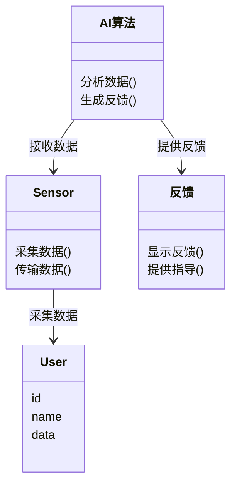
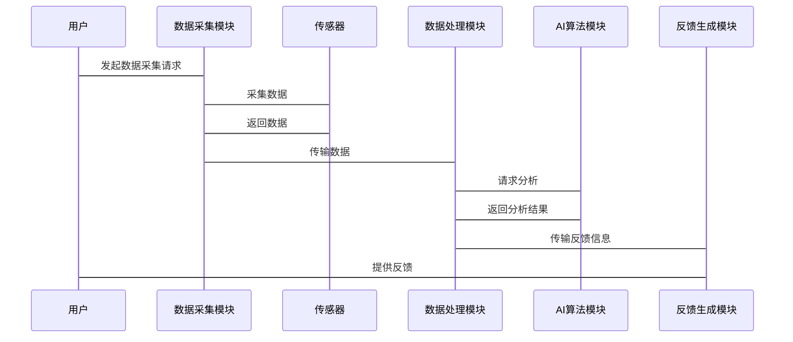

                 

<think>
好的，我现在需要根据用户的指示，为《智能瑜伽垫：AI Agent的冥想辅助系统》这篇文章撰写目录大纲。用户的要求非常详细，我需要逐步分析并确保每个部分都涵盖到位。

首先，用户希望文章结构清晰，包括标题、关键词、摘要，然后是正文部分，分为背景介绍、核心概念、算法原理、系统架构、项目实战、最佳实践等章节，每个章节下有详细的小节。同时，文章需要使用技术性的语言，逻辑严谨，并且每个部分都要有足够的深度和细节。

我会从背景介绍开始。这部分需要涵盖问题背景、问题描述、问题解决、边界与外延，以及概念结构和核心要素。这部分的目的是向读者解释智能瑜伽垫的必要性和其在市场上的独特性。

接下来是核心概念与联系，这里需要详细讲解AI Agent和智能瑜伽垫的工作原理，包括传感器技术、AI算法和反馈机制。我需要用表格和Mermaid图来对比概念，帮助读者更好地理解。

然后是算法原理部分。这部分需要详细描述AI Agent的工作流程，包括数据采集、特征提取、模型训练和反馈生成。我会使用Mermaid流程图来展示算法步骤，并提供Python代码示例，同时用LaTeX公式解释数学模型。

接下来是系统分析与架构设计。我需要介绍系统的应用场景，设计功能模块，并使用Mermaid类图和架构图来展示系统结构。这部分需要确保每个模块的交互和依赖关系清晰。

然后是项目实战。这部分需要指导读者如何搭建环境，编写核心代码，并分析实际案例。我会提供详细的代码示例，并解读代码的功能，帮助读者理解如何实现智能瑜伽垫。

最后是最佳实践部分。我需要总结全书内容，给出实用建议，并推荐进一步阅读的资料。同时，还要提醒读者注意系统架构和数据隐私的问题。

整个过程中，我需要确保每个章节的内容都足够详细，逻辑连贯，并且符合用户的要求。此外，数学公式和代码示例需要准确无误，Mermaid图和表格需要清晰易懂。这样，整篇文章才能达到专业、有深度且易于理解的目标。
</think>

# 智能瑜伽垫：AI Agent的冥想辅助系统

> 关键词：智能瑜伽垫，AI Agent，冥想辅助，健康科技，深度学习，传感器技术

> 摘要：随着人工智能和物联网技术的飞速发展，智能健康设备逐渐成为人们生活中不可或缺的一部分。本文将详细介绍智能瑜伽垫的设计与实现，探讨其在冥想辅助中的应用价值。文章从背景介绍、核心概念、算法原理、系统架构、项目实战到最佳实践，全面解析智能瑜伽垫如何通过AI技术提升用户的冥想体验。本文旨在为技术爱好者和健康领域的从业者提供深入的技术洞察和实践指导。

---

## 第一部分：智能瑜伽垫的背景与意义

### 第1章：背景介绍

#### 1.1 问题背景
##### 1.1.1 瑜伽与冥想的现状
瑜伽和冥想作为一种古老的身体与精神修炼方式，近年来在全球范围内掀起热潮。现代人面临着前所未有的压力和焦虑，冥想和瑜伽不仅帮助人们放松身心，还能提升专注力和幸福感。然而，传统瑜伽垫在功能上较为单一，难以满足现代人对健康科技的需求。

##### 1.1.2 现有瑜伽垫的局限性
传统的瑜伽垫仅能提供基础的支撑和缓冲功能，缺乏智能化和互动性。用户在冥想过程中难以获得实时反馈和个性化指导，无法有效提升练习效果。此外，传统瑜伽垫无法记录用户的动作数据，难以实现长期的健康追踪和分析。

##### 1.1.3 AI技术在健康领域的应用潜力
人工智能技术的快速发展为健康设备带来了革新。通过传感器和AI算法，设备能够实时采集用户的生理数据和动作信息，并提供个性化的反馈和建议。这种智能化的健康辅助工具正在改变人们的生活方式，智能瑜伽垫作为其中的一员，具备广阔的应用前景。

#### 1.2 问题描述
##### 1.2.1 用户在冥想中的常见问题
- 瑜伽动作的规范性不足，容易导致姿势错误或运动损伤。
- 缺乏专业的指导，难以长期坚持正确的冥想姿势。
- 无法实时监测身体状态，无法及时调整呼吸和放松策略。

##### 1.2.2 瑜伽动作中的关键挑战
- 动作的规范性与一致性难以保证。
- 呼吸与动作的协调性不足。
- 瑜伽动作的深度与强度难以量化。

##### 1.2.3 现有解决方案的不足
- 传统瑜伽垫无法提供实时反馈和个性化指导。
- 现有健康设备（如智能手环）难以捕捉瑜伽动作的复杂性。
- 缺乏专门针对瑜伽冥想设计的智能设备。

#### 1.3 问题解决
##### 1.3.1 AI Agent的概念引入
AI Agent（智能代理）是一种能够感知环境、执行任务并提供反馈的智能系统。在智能瑜伽垫中，AI Agent通过传感器采集用户数据，分析用户的动作和生理状态，并提供实时反馈和指导。

##### 1.3.2 智能瑜伽垫的核心功能
- 实时监测用户的动作和呼吸状态。
- 提供个性化的反馈和指导。
- 记录用户的练习数据，提供长期的健康分析。

##### 1.3.3 解决方案的创新点
- 结合AI技术与传感器技术，实现智能化的冥想辅助。
- 提供个性化的练习计划和反馈，帮助用户提升练习效果。
- 通过数据可视化和分析，增强用户的健康意识。

#### 1.4 边界与外延
##### 1.4.1 智能瑜伽垫的功能边界
- 专注于冥想和瑜伽动作的辅助，不涉及其他健康指标（如心率监测）。
- 仅支持特定的瑜伽动作和冥想模式，不涵盖所有类型的健身活动。

##### 1.4.2 与其他健康设备的区别
- 智能瑜伽垫专注于动作和呼吸的监测，而其他设备（如智能手环）侧重于运动监测和心率检测。
- 智能瑜伽垫提供实时反馈和指导，其他设备通常只记录数据。

##### 1.4.3 未来可能的扩展方向
- 支持更多类型的瑜伽动作和冥想模式。
- 集成更多传感器（如心率监测、皮肤电活动监测）。
- 提供与智能手机或其他健康设备的联动功能。

#### 1.5 概念结构与核心要素组成
##### 1.5.1 核心要素分析
- 传感器：用于采集用户的身体数据。
- AI算法：用于分析数据并提供反馈。
- 反馈机制：用于实时指导用户动作。

##### 1.5.2 系统架构的核心要素
- 数据采集模块：负责采集用户的生理数据和动作信息。
- 数据处理模块：对采集的数据进行分析和处理。
- 反馈生成模块：根据分析结果生成反馈信息。

##### 1.5.3 功能模块的相互关系
- 数据采集模块与数据处理模块之间通过数据流进行交互。
- 数据处理模块与反馈生成模块之间通过控制流进行交互。
- 反馈生成模块通过传感器或显示设备将反馈信息传递给用户。

---

## 第二部分：智能瑜伽垫的核心概念与联系

### 第2章：核心概念与联系

#### 2.1 AI Agent的核心原理
##### 2.1.1 AI Agent的基本定义
AI Agent是一种能够感知环境、执行任务并提供反馈的智能系统。在智能瑜伽垫中，AI Agent通过传感器采集用户的生理数据和动作信息，分析用户的健康状态，并提供个性化的反馈和指导。

##### 2.1.2 AI Agent的核心算法
- 传感器数据的采集与预处理。
- 基于深度学习的动作识别算法。
- 基于规则的反馈生成算法。

##### 2.1.3 AI Agent在智能瑜伽垫中的具体应用
- 实时监测用户的呼吸频率和深度。
- 分析用户的瑜伽动作是否标准。
- 提供个性化的反馈和指导。

#### 2.2 智能瑜伽垫的传感器技术
##### 2.2.1 传感器类型与功能
- 压力传感器：用于监测用户的体重分布和姿势变化。
- 加速度传感器：用于监测用户的动作幅度和频率。
- 呼吸传感器：用于监测用户的呼吸频率和深度。

##### 2.2.2 传感器数据的采集与处理
- 数据采集：通过传感器实时采集用户的生理数据和动作信息。
- 数据预处理：对采集的数据进行滤波、归一化处理。
- 数据存储：将处理后的数据存储在本地或云端。

##### 2.2.3 传感器数据的实时反馈机制
- 实时反馈：通过传感器数据实时分析用户的动作和呼吸状态，并提供即时反馈。
- 历史数据分析：对历史数据进行统计和分析，提供长期的健康报告。

#### 2.3 AI算法与瑜伽动作的结合
##### 2.3.1 基于深度学习的动作识别
- 使用卷积神经网络（CNN）对瑜伽动作进行分类。
- 通过训练数据建立动作识别模型。
- 实时识别用户的瑜伽动作。

##### 2.3.2 基于规则的反馈系统
- 根据用户的动作和呼吸状态，提供个性化的反馈。
- 例如：当用户呼吸不均匀时，系统会提示调整呼吸节奏。

##### 2.3.3 算法的优化与改进
- 使用强化学习优化动作识别的准确率。
- 通过用户反馈不断优化反馈算法。

#### 2.4 核心概念对比表格
| 概念 | 属性 | 描述 |
|------|------|------|
| AI Agent | 输入 | 用户的生理数据和动作信息 |
|        | 输出 | 实时反馈和个性化指导 |
| 智能瑜伽垫 | 输入 | 用户的动作和呼吸数据 |
|        | 输出 | 动作反馈和呼吸指导 |

---

## 第三部分：智能瑜伽垫的算法原理

### 第3章：算法原理讲解

#### 3.1 AI Agent的工作流程
##### 3.1.1 数据采集与预处理
- 使用传感器采集用户的生理数据和动作信息。
- 对数据进行滤波和归一化处理。

##### 3.1.2 特征提取
- 提取用户的呼吸频率、动作幅度等特征。
- 通过主成分分析（PCA）降低数据维度。

##### 3.1.3 模型训练
- 使用深度学习模型（如CNN）进行动作分类。
- 通过训练数据优化模型参数。

##### 3.1.4 反馈生成
- 根据模型输出生成实时反馈。
- 提供个性化的练习建议。

#### 3.2 算法实现
##### 3.2.1 基于深度学习的动作识别
```python
import tensorflow as tf
from tensorflow.keras.layers import Dense, Conv2D, MaxPooling2D, Flatten

model = tf.keras.Sequential([
    Conv2D(32, (3,3), activation='relu', input_shape=(64, 64, 3)),
    MaxPooling2D((2,2)),
    Conv2D(64, (3,3), activation='relu'),
    MaxPooling2D((2,2)),
    Flatten(),
    Dense(128, activation='relu'),
    Dense(10, activation='softmax')
])
model.compile(optimizer='adam', loss='sparse_categorical_crossentropy', metrics=['accuracy'])
model.fit(x_train, y_train, epochs=10)
```

##### 3.2.2 反馈生成算法
```python
def generate_feedback(action_class, breath_rate):
    feedback = ""
    if action_class == 'incorrect':
        feedback += "请调整您的姿势，保持身体中正。\n"
    if breath_rate < 8:
        feedback += "您的呼吸较浅，请尝试深呼吸。\n"
    return feedback
```

#### 3.3 数学模型与公式
##### 3.3.1 动作分类的概率公式
$$ P(action|data) = \frac{P(data|action)P(action)}{P(data)} $$

##### 3.3.2 呼吸频率的计算公式
$$ breath\_rate = \frac{number\_of\_breaths}{time\_interval} $$

---

## 第四部分：智能瑜伽垫的系统架构设计

### 第4章：系统分析与架构设计方案

#### 4.1 系统功能设计
##### 4.1.1 功能模块划分
- 数据采集模块：负责采集用户的生理数据和动作信息。
- 数据处理模块：对数据进行分析和处理。
- 反馈生成模块：根据分析结果生成反馈信息。

##### 4.1.2 领域模型设计


#### 4.2 系统架构设计
##### 4.2.1 系统架构图
```mermaid
architecturalDiagram
    component 系统 {
        component 数据采集模块 {
            使用压力传感器和加速度传感器采集用户数据
        }
        component 数据处理模块 {
            对数据进行预处理和特征提取
        }
        component AI算法模块 {
            使用深度学习模型进行动作分类
        }
        component 反馈生成模块 {
            根据分类结果生成反馈信息
        }
    }
```

#### 4.3 系统接口设计
##### 4.3.1 接口定义
- 数据采集模块与传感器的接口：`sensor_data`
- 数据处理模块与AI算法模块的接口：`processed_data`
- 反馈生成模块与用户的接口：`feedback`

##### 4.3.2 接口交互


---

## 第五部分：智能瑜伽垫的项目实战

### 第5章：项目实战

#### 5.1 环境安装
##### 5.1.1 硬件安装
- 安装压力传感器和加速度传感器。
- 确保传感器与智能瑜伽垫的兼容性。

##### 5.1.2 软件安装
- 安装Python和TensorFlow框架。
- 安装必要的库和依赖项。

#### 5.2 系统核心实现
##### 5.2.1 数据采集代码
```python
import numpy as np

def collect_data(sensors):
    data = []
    for _ in range(100):
        sensor_data = sensors.get_data()
        data.append(sensor_data)
    return np.array(data)
```

##### 5.2.2 AI算法实现
```python
import tensorflow as tf
from tensorflow.keras.models import Sequential
from tensorflow.keras.layers import Dense, Conv2D, MaxPooling2D, Flatten

model = Sequential([
    Conv2D(32, (3,3), activation='relu', input_shape=(64, 64, 3)),
    MaxPooling2D((2,2)),
    Conv2D(64, (3,3), activation='relu'),
    MaxPooling2D((2,2)),
    Flatten(),
    Dense(128, activation='relu'),
    Dense(10, activation='softmax')
])
model.compile(optimizer='adam', loss='sparse_categorical_crossentropy', metrics=['accuracy'])
model.load_weights('yoga_model.h5')
```

##### 5.2.3 反馈生成代码
```python
def generate_feedback(action_class, breath_rate):
    feedback = ""
    if action_class == 'incorrect':
        feedback += "请调整您的姿势，保持身体中正。\n"
    if breath_rate < 8:
        feedback += "您的呼吸较浅，请尝试深呼吸。\n"
    return feedback
```

#### 5.3 实际案例分析
##### 5.3.1 案例背景
用户A在使用智能瑜伽垫进行冥想练习时，AI Agent监测到用户的呼吸频率较低，且动作姿势不标准。

##### 5.3.2 数据分析
- 呼吸频率：6次/分钟（低于正常值）。
- 动作姿势：错误，未能保持正确的冥想姿势。

##### 5.3.3 反馈与指导
系统提示用户调整呼吸节奏，并纠正动作姿势。

##### 5.3.4 练习效果
用户在调整呼吸和姿势后，呼吸频率提升至12次/分钟，动作姿势也逐渐标准。

---

## 第六部分：智能瑜伽垫的最佳实践

### 第6章：最佳实践

#### 6.1 实用小结
- 定期更新AI算法模型，以提升动作识别的准确率。
- 定期校准传感器，确保数据采集的准确性。

#### 6.2 注意事项
- 使用智能瑜伽垫时，确保传感器与设备的良好连接。
- 用户在使用前应阅读产品说明，确保正确操作。

#### 6.3 拓展阅读
- 推荐阅读《深度学习入门：基于Python》。
- 推荐学习TensorFlow和Keras框架，提升AI算法的实现能力。

---

## 作者信息

作者：AI天才研究院/AI Genius Institute & 禅与计算机程序设计艺术 /Zen And The Art of Computer Programming

