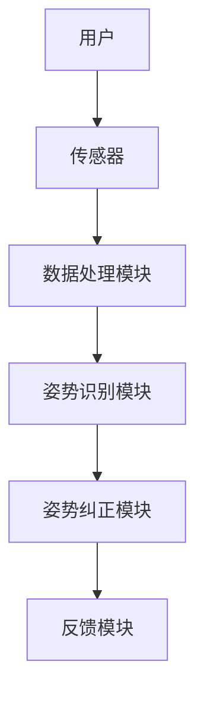
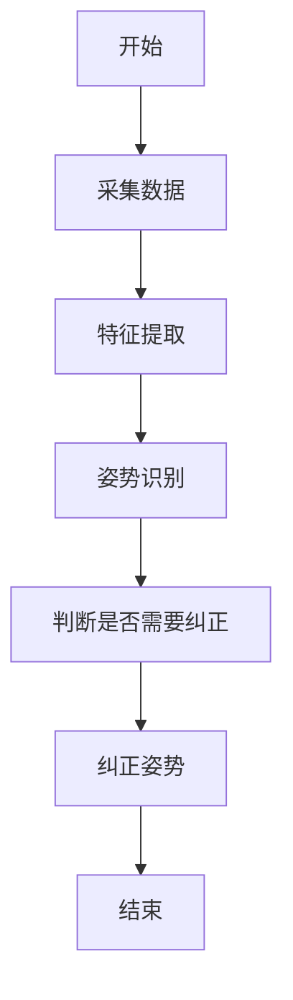

                 


```markdown
# 智能瑜伽垫：AI Agent的姿势纠正系统

> 关键词：智能瑜伽垫，AI Agent，姿势纠正，深度学习，传感器，物联网

> 摘要：本文详细介绍了智能瑜伽垫的设计与实现，结合AI Agent技术，通过传感器和深度学习算法，实时监测并纠正用户的瑜伽姿势，提供高效、个性化的健身指导。

---

# 第一部分：智能瑜伽垫的背景与核心概念

## 第1章：智能瑜伽垫的背景介绍

### 1.1 瑜伽运动的普及与需求
- 瑜伽作为一种全身性的运动，近年来在全球范围内迅速普及。
- 随着人们对健康和 wellness 的追求，瑜伽成为最受欢迎的健身方式之一。
- 然而，瑜伽练习者在没有专业指导的情况下，容易因为姿势不正确导致受伤。

### 1.2 传统瑜伽教学的局限性
- 传统瑜伽教学依赖于专业教练的现场指导。
- 教练资源有限，难以满足大量用户的需求。
- 学习者需要定期预约，时间和成本较高。

### 1.3 AI技术在健身领域的应用趋势
- AI技术的快速发展为健身领域带来了新的可能性。
- 基于深度学习的姿势识别技术逐渐成熟。
- 物联网设备的普及为智能健身设备提供了基础。

## 第2章：AI Agent在智能瑜伽垫中的作用

### 2.1 AI Agent的基本概念
- AI Agent（智能代理）是一种能够感知环境并自主决策的智能系统。
- 在智能瑜伽垫中，AI Agent负责实时监测用户的姿势，并提供纠正建议。

### 2.2 AI Agent在姿势纠正中的应用
- 通过传感器数据和摄像头捕捉用户的动作。
- 利用深度学习算法识别用户姿势，并与标准姿势进行对比。
- 发现错误姿势后，AI Agent会立即给出纠正指令。

### 2.3 AI Agent与传统健身设备的对比
- 传统健身设备无法提供实时反馈，只能记录数据。
- AI Agent能够实时分析数据，提供个性化指导。
- AI Agent的学习能力使其能够不断优化纠正策略。

---

# 第二部分：智能瑜伽垫的核心概念与技术原理

## 第3章：AI Agent的原理与实现

### 3.1 AI Agent的核心原理
- **感知层**：通过传感器收集用户姿势数据。
- **决策层**：利用深度学习模型分析数据，判断是否需要纠正姿势。
- **执行层**：通过震动或语音提示用户调整姿势。

### 3.2 AI Agent在姿势纠正中的具体实现
- **数据采集**：使用压力传感器和加速度计捕捉用户动作。
- **姿势识别**：基于卷积神经网络（CNN）的姿势识别模型。
- **姿势纠正**：根据识别结果，生成纠正指令。

### 3.3 实体关系图


---

# 第三部分：智能瑜伽垫的算法与数学模型

## 第4章：姿势识别算法的实现

### 4.1 基于深度学习的姿势识别
- 使用预训练的CNN模型（如ResNet）进行特征提取。
- 通过数据增强技术扩大训练数据集。

### 4.2 姿势纠正的策略制定
- 根据姿势识别结果，计算与标准姿势的偏差。
- 生成纠正指令，例如“抬起你的脚趾”或“调整你的肩膀”。

### 4.3 算法流程图


---

## 第5章：数学模型与公式

### 5.1 姿势纠正的数学模型
- 使用欧几里得距离计算用户姿势与标准姿势的偏差。
- 公式：$$ distance = \sqrt{(x_2 - x_1)^2 + (y_2 - y_1)^2} $$

### 5.2 基于加速度计的姿势分析
- 利用加速度和角速度数据计算身体姿态。
- 公式：$$ angle = \arctan\left(\frac{acceleration\_x}{acceleration\_y}\right) $$

---

# 第四部分：系统分析与架构设计

## 第6章：系统架构设计

### 6.1 分层架构
- **数据采集层**：负责采集用户姿势数据。
- **算法处理层**：处理数据并生成纠正指令。
- **用户交互层**：显示反馈并接收用户输入。

### 6.2 系统架构图


---

# 第五部分：项目实战

## 第7章：智能瑜伽垫的实现

### 7.1 环境搭建
- 安装必要的Python库（如TensorFlow、OpenCV）。
- 配置传感器和物联网设备。

### 7.2 核心代码实现
```python
import numpy as np
from tensorflow.keras.models import load_model

# 加载预训练模型
model = load_model('pose_correction_model.h5')

# 数据预处理
def preprocess_data(data):
    # 标准化处理
    return (data - np.mean(data)) / np.std(data)

# 姿势识别
def recognize_pose(data):
    processed_data = preprocess_data(data)
    prediction = model.predict(processed_data)
    return np.argmax(prediction, axis=1)

# 姿势纠正
def correct_pose(prediction):
    if prediction == 0:
        return "抬起你的脚趾"
    elif prediction == 1:
        return "调整你的肩膀"
    else:
        return "保持当前姿势"
```

### 7.3 实际案例分析
- 用户A在练习山式（Tadasana）时，系统识别到肩膀位置不正确。
- 系统发出纠正指令：“调整你的肩膀”。

---

## 第8章：最佳实践与总结

### 8.1 小结
- 智能瑜伽垫结合AI Agent技术，能够实时监测并纠正用户姿势。
- 通过深度学习算法和传感器数据，提供高效的健身指导。

### 8.2 注意事项
- 确保传感器的准确性和稳定性。
- 定期更新AI模型以提高识别准确率。

### 8.3 拓展阅读
- 《深度学习在健身领域的应用》
- 《AI驱动的智能健身设备开发》

---

作者：AI天才研究院 & 禅与计算机程序设计艺术
```

