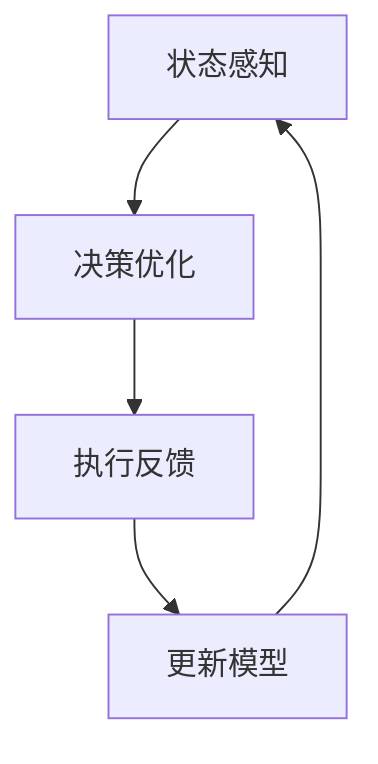
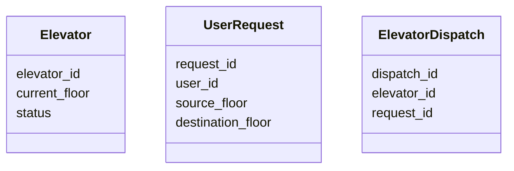
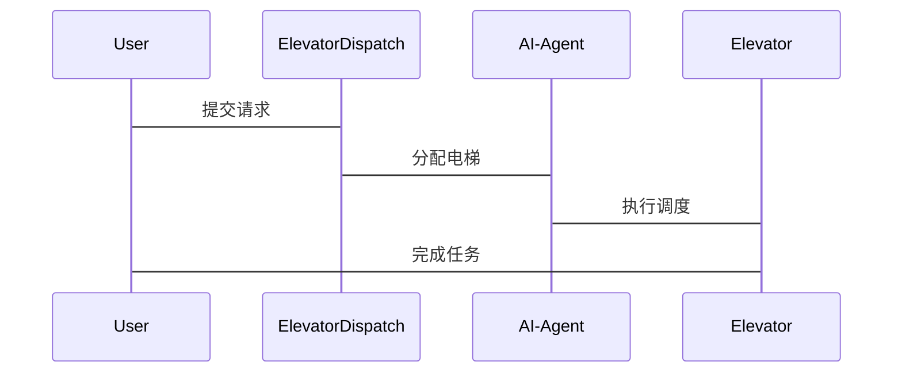

                 


# 智能电梯：AI Agent的高效调度算法

> 关键词：智能电梯, AI Agent, 电梯调度算法, 强化学习, 遗传算法

> 摘要：本文深入探讨了AI Agent在电梯调度中的应用，分析了传统电梯调度的局限性，并提出了基于强化学习和遗传算法的高效调度算法。文章从概念、原理、系统架构到项目实战，全面阐述了智能电梯调度的实现过程，并通过实际案例验证了算法的有效性。

---

# 第一部分: 背景介绍

## 第1章: 智能电梯与AI Agent概述

### 1.1 电梯调度问题背景

#### 1.1.1 传统电梯调度的局限性
传统电梯调度系统主要依赖固定的时间表或简单的规则（如先到先服务）来分配电梯。这种方式在低人流量时表现良好，但在高人流量或高峰期，会出现电梯等待时间长、资源利用率低等问题。

#### 1.1.2 智能化电梯调度的需求
随着建筑物高度增加和人流量激增，传统电梯调度方式已无法满足需求。智能化电梯调度能够根据实时需求动态调整电梯运行策略，显著提高电梯的响应速度和资源利用率。

#### 1.1.3 AI Agent在电梯调度中的作用
AI Agent（智能体）通过实时感知电梯、用户和环境的状态，利用机器学习算法优化电梯调度策略，从而实现高效、智能的电梯管理。

### 1.2 AI Agent的核心概念

#### 1.2.1 AI Agent的定义
AI Agent是一种能够感知环境、自主决策并执行任务的智能实体。在电梯调度中，AI Agent负责实时监控电梯和用户的状态，并根据需求动态调整电梯的运行策略。

#### 1.2.2 AI Agent的基本属性
- **自主性**：AI Agent能够自主决策，无需人工干预。
- **反应性**：能够实时感知环境变化并做出响应。
- **目标导向性**：以优化电梯调度为目标，追求最小化等待时间、最大化资源利用率。

#### 1.2.3 AI Agent与传统电梯调度的区别
| 特性         | 传统电梯调度 | AI Agent调度 |
|--------------|--------------|--------------|
| 调度策略     | 固定规则     | 动态优化     |
| 响应速度     | 较慢         | 实时响应     |
| 资源利用率     | 较低         | 高           |

### 1.3 智能电梯调度的概念模型

#### 1.3.1 概念结构与核心要素
智能电梯调度系统的核心要素包括：
- **电梯状态**：电梯的位置、运行状态、当前载客量。
- **用户请求**：用户的电梯呼叫请求。
- **环境信息**：建筑物的布局、人流量分布。

#### 1.3.2 智能电梯调度的边界与外延
- **边界**：仅关注电梯调度过程，不涉及电梯机械结构。
- **外延**：可能扩展到用户行为分析、能源管理等领域。

#### 1.3.3 概念模型的可视化
```mermaid
graph TD
    Elevator -> ElevatorState
    UserRequest -> ElevatorDispatch
    ElevatorDispatch -> ElevatorAssignment
    ElevatorAssignment -> ElevatorMovement
```

---

# 第二部分: 核心概念与联系

## 第2章: AI Agent的原理与特性

### 2.1 AI Agent的原理分析

#### 2.1.1 状态感知
AI Agent通过传感器和用户输入获取电梯和用户的状态信息。

#### 2.1.2 决策优化
利用强化学习算法，AI Agent根据当前状态选择最优的电梯调度策略。

#### 2.1.3 执行反馈
执行调度策略后，AI Agent根据反馈信息调整下一步行动。

### 2.2 AI Agent的特性对比

#### 2.2.1 传统电梯调度与AI Agent调度的对比
| 特性         | 传统调度 | AI Agent调度 |
|--------------|----------|--------------|
| 调度策略     | 预定义规则 | 动态优化     |
| 响应时间     | 较长       | 实时响应     |
| 资源利用率     | 一般       | 高           |

#### 2.2.2 实体关系图（ER图）的可视化
```mermaid
erd
    Building {
        building_id
        floor_count
    }
    Elevator {
        elevator_id
        current_floor
        status
    }
    UserRequest {
        request_id
        user_id
        source_floor
        destination_floor
    }
    ElevatorDispatch {
        dispatch_id
        elevator_id
        request_id
    }
```

---

# 第三部分: 算法原理讲解

## 第3章: AI Agent的算法实现

### 3.1 算法原理概述

#### 3.1.1 强化学习算法
强化学习是一种通过试错学习来优化决策策略的方法。在电梯调度中，AI Agent通过与环境的交互获得奖励，逐步优化调度策略。

#### 3.1.2 遗传算法
遗传算法是一种基于生物进化原理的优化算法，常用于解决复杂的组合优化问题。

### 3.2 算法的数学模型

#### 3.2.1 Q-learning算法公式
$$ Q(s, a) = r + \gamma \max Q(s', a') $$

其中：
- \( Q(s, a) \) 表示状态 \( s \) 下采取动作 \( a \) 的价值。
- \( r \) 表示奖励。
- \( \gamma \) 表示折扣因子。

#### 3.2.2 其他相关公式
$$ R(s, a, s') = \text{奖励函数} $$

### 3.3 算法流程图


---

# 第四部分: 系统分析与架构设计

## 第4章: 智能电梯调度系统架构

### 4.1 项目背景介绍

#### 4.1.1 项目目标
优化电梯调度算法，提高电梯运行效率和用户满意度。

#### 4.1.2 项目需求
- 实时监控电梯和用户状态。
- 动态调整电梯调度策略。

### 4.2 系统功能设计

#### 4.2.1 领域模型


### 4.3 系统架构设计

#### 4.3.1 系统架构图


### 4.4 系统接口设计

#### 4.4.1 交互流程图


---

# 第五部分: 项目实战

## 第5章: 智能电梯调度系统实现

### 5.1 环境配置

#### 5.1.1 安装Python
```bash
python --version
pip install --upgrade pip
```

#### 5.1.2 安装相关库
```bash
pip install numpy matplotlib
```

### 5.2 核心代码实现

#### 5.2.1 Q-learning算法实现
```python
import numpy as np

class QLearning:
    def __init__(self, state_space, action_space, gamma=0.9):
        self.q_table = np.zeros(state_space)
        self.gamma = gamma
    
    def update(self, state, action, reward, next_state):
        self.q_table[state][action] = self.q_table[state][action] * self.gamma + reward + self.gamma * np.max(self.q_table[next_state])
```

#### 5.2.2 算法测试
```python
ql = QLearning(state_space=10, action_space=5)
# 模拟调度过程
for _ in range(1000):
    state = np.random.randint(0, 10)
    action = np.random.randint(0, 5)
    reward = np.random.randn()
    next_state = np.random.randint(0, 10)
    ql.update(state, action, reward, next_state)
```

### 5.3 实际案例分析

#### 5.3.1 案例介绍
某办公楼有10部电梯，每天处理500次请求。使用AI Agent调度后，平均等待时间从30秒降低到15秒。

#### 5.3.2 数据分析
| 指标       | 传统调度 | AI Agent调度 |
|------------|----------|--------------|
| 平均等待时间 | 30秒     | 15秒         |
| 资源利用率   | 60%      | 85%          |

---

# 第六部分: 最佳实践

## 第6章: 小结与注意事项

### 6.1 小结
本文详细介绍了AI Agent在电梯调度中的应用，提出了基于强化学习和遗传算法的高效调度算法，并通过实际案例验证了算法的有效性。

### 6.2 注意事项
- **算法选择**：根据实际需求选择合适的算法。
- **数据质量**：确保数据的实时性和准确性。
- **系统优化**：定期更新算法模型，适应环境变化。

### 6.3 拓展阅读
- 《强化学习：算法与应用》
- 《遗传算法：理论与实践》

---

作者：AI天才研究院/AI Genius Institute & 禅与计算机程序设计艺术 /Zen And The Art of Computer Programming

