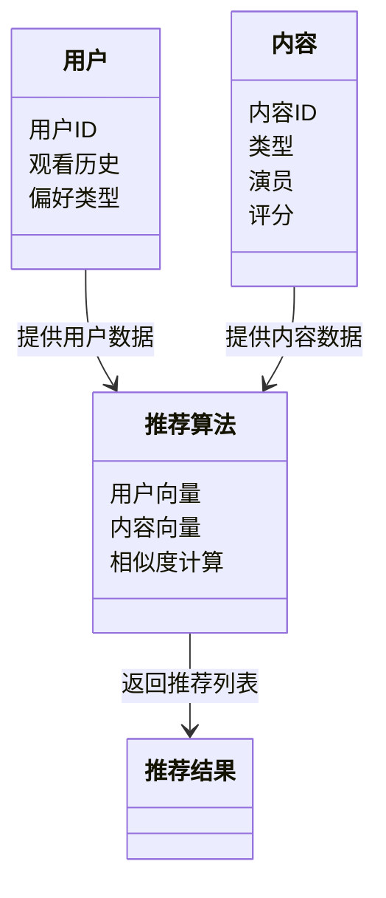
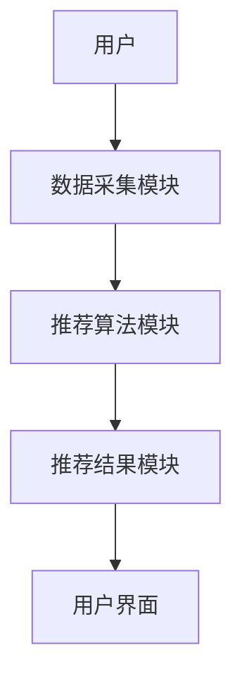

                 

<think>
好的，我需要撰写一篇关于《智能电视：AI Agent的内容个性化推荐》的技术博客文章。首先，我需要理解用户的需求，他们希望文章结构清晰，内容详细，覆盖从背景到实现的各个方面，并且要使用专业的技术语言。

首先，我应该从背景介绍开始，解释智能电视的发展历程，AI Agent的概念，以及为什么内容个性化推荐如此重要。这部分需要让读者了解AI Agent在智能电视中的作用和意义。

接下来，我需要详细讲解AI Agent的核心概念，包括它们如何感知、决策和执行推荐。这部分可能需要使用一些图表来展示AI Agent的内部机制。

然后，我要介绍推荐算法的原理，特别是协同过滤和深度学习算法。我应该用Mermaid画出算法流程图，并附上Python代码示例，这样读者可以更好地理解这些算法的实现。

在系统分析与架构设计部分，我需要描述推荐系统的应用场景，设计领域模型，并用Mermaid展示类图和架构图。这将帮助读者理解系统的整体结构和各模块的交互。

接下来是项目实战，我需要提供一个实际的案例，从环境搭建到代码实现，再到测试和优化，一步步指导读者完成推荐系统的开发。这部分需要详细的代码示例和结果分析。

然后，我会总结最佳实践，指出实际应用中需要注意的问题，并提供进一步学习的资源和未来的研究方向。

最后，我需要确保文章结构合理，每部分内容充实，使用适当的图表和公式来增强可读性。同时，文章末尾要加上作者信息。

现在，我需要按照这个大纲一步步展开，确保每一部分都覆盖到用户要求的各个方面，同时保持文章的逻辑连贯和深度。
</think>

# 智能电视：AI Agent的内容个性化推荐

> 关键词：智能电视, AI Agent, 内容推荐, 个性化推荐, 人工智能, 推荐算法

> 摘要：随着智能电视的普及，用户对个性化内容推荐的需求日益增长。本文深入探讨AI Agent在智能电视中的应用，详细分析其推荐算法、系统设计和实际应用，帮助读者理解如何通过AI技术实现高效的内容个性化推荐。

---

## 第1章：智能电视与AI Agent的背景与概念

### 1.1 智能电视的发展历程

智能电视从最初的联网电视发展到如今的AI驱动设备，经历了技术与功能的双重革新。早期智能电视主要提供基础的网络连接和应用下载功能，而现代智能电视则通过AI技术实现更智能化的服务，如个性化推荐和语音控制。

#### 1.1.1 传统电视的功能局限
传统电视的功能相对单一，仅限于播放预设的频道内容，无法根据用户偏好进行内容推荐。

#### 1.1.2 智能电视的崛起与特点
智能电视通过内置操作系统和网络连接，能够访问丰富的流媒体服务和应用程序。其特点包括：
- 多平台内容聚合
- 智能推荐系统
- 语音控制功能

#### 1.1.3 AI Agent在智能电视中的作用
AI Agent（智能代理）通过分析用户行为和偏好，提供个性化的内容推荐，提升用户体验。

---

### 1.2 AI Agent的基本概念

#### 1.2.1 什么是AI Agent？
AI Agent是一种智能实体，能够感知环境、执行任务并做出决策。在智能电视中，AI Agent通过分析用户数据，推荐相关内容。

#### 1.2.2 AI Agent的核心功能与特点
- **感知环境**：收集用户行为数据（如观看历史、搜索记录）。
- **学习与推理**：利用机器学习算法分析数据，理解用户偏好。
- **执行任务**：根据分析结果推荐内容或自动选择相关内容。

#### 1.2.3 AI Agent在智能电视中的应用场景
- 个性化推荐：根据用户的观看历史推荐电视剧、电影等。
- 语音交互：通过语音指令快速找到相关内容。
- 智能搜索：优化搜索结果，提供更相关的推荐。

---

### 1.3 内容个性化推荐的重要性

#### 1.3.1 传统推荐系统的局限性
传统推荐系统可能面临数据稀疏性、冷启动问题等挑战，推荐效果有限。

#### 1.3.2 个性化推荐的定义与目标
个性化推荐是指根据用户的偏好和行为，提供定制化的内容推荐。其目标是提升用户体验和内容消费效率。

#### 1.3.3 AI Agent在个性化推荐中的优势
- 更精准的推荐：利用机器学习模型分析用户数据。
- 实时更新：根据用户的实时行为调整推荐结果。
- 多模态数据融合：结合文本、图像等多种数据源进行推荐。

---

## 第2章：AI Agent的推荐算法基础

### 2.1 推荐系统的分类与特点

#### 2.1.1 基于协同过滤的推荐
协同过滤是基于用户行为相似性进行推荐的方法，分为基于用户的协同过滤和基于物品的协同过滤。

#### 2.1.2 基于内容的推荐
内容推荐是通过分析内容本身的特征（如文本、图像）进行推荐的方法。

#### 2.1.3 基于深度学习的推荐
深度学习推荐利用神经网络模型分析用户行为和内容特征，进行更复杂的推荐任务。

---

### 2.2 AI Agent的推荐算法原理

#### 2.2.1 基于用户行为的推荐
通过分析用户的观看历史、点击行为等数据，预测用户的兴趣偏好。

#### 2.2.2 基于内容特征的推荐
分析内容本身的特征（如演员、导演、类型）进行推荐。

#### 2.2.3 混合推荐算法的优势
混合推荐算法结合多种推荐方法，能够提升推荐的准确性和多样性。

---

### 2.3 推荐系统的评价指标

#### 2.3.1 准确率与召回率
准确率：推荐列表中正确推荐的比例。
召回率：实际相关的内容被推荐的比例。

#### 2.3.2 F1分数与AUC指标
F1分数：准确率和召回率的调和平均数。
AUC指标：评估推荐系统的整体性能。

#### 2.3.3 其他评价指标的对比
对比不同评价指标的优缺点，选择适合的指标评估推荐系统。

---

## 第3章：AI Agent的推荐算法实现

### 3.1 协同过滤算法的实现

#### 3.1.1 协同过滤算法的原理
协同过滤通过分析用户行为数据，找到相似的用户或物品进行推荐。

#### 3.1.2 协同过滤算法的实现步骤
- 数据预处理：处理缺失值、标准化数据。
- 构建相似度矩阵：计算用户或物品之间的相似度。
- 生成推荐列表：根据相似度进行推荐。

#### 3.1.3 协同过滤算法的优缺点
- 优点：简单易实现，适合数据稀疏场景。
- 缺点：计算复杂度高，难以扩展。

---

### 3.2 基于深度学习的推荐算法

#### 3.2.1 深度学习推荐算法的原理
利用神经网络模型（如DNN、RNN、CNN）分析用户行为和内容特征，生成推荐结果。

#### 3.2.2 深度学习推荐算法的实现步骤
- 数据预处理：构建用户和内容的特征向量。
- 模型训练：训练神经网络模型。
- 推荐生成：利用训练好的模型进行推荐。

#### 3.2.3 深度学习推荐算法的优缺点
- 优点：能够捕捉复杂的用户行为模式，推荐效果更精准。
- 缺点：计算资源消耗大，模型训练时间长。

---

## 第4章：系统分析与架构设计

### 4.1 问题场景介绍

#### 4.1.1 用户需求分析
用户希望通过智能电视轻松找到感兴趣的内容，减少筛选时间。

#### 4.1.2 系统目标
设计一个高效的AI Agent推荐系统，提供个性化的内容推荐服务。

---

### 4.2 项目介绍

#### 4.2.1 项目目标
开发一个基于AI Agent的智能电视推荐系统，实现个性化内容推荐。

#### 4.2.2 系统功能设计
- 用户行为数据采集
- 内容特征提取
- 推荐算法实现
- 推荐结果展示

#### 4.2.3 系统架构设计
- 数据层：存储用户行为和内容特征。
- 服务层：实现推荐算法和接口调用。
- 展示层：展示推荐结果。

---

### 4.3 系统架构设计

#### 4.3.1 领域模型设计
使用Mermaid绘制领域模型类图，展示用户、内容、推荐算法之间的关系。



#### 4.3.2 系统架构设计
使用Mermaid绘制系统架构图，展示各模块的交互关系。



---

## 第5章：项目实战

### 5.1 环境安装

#### 5.1.1 安装Python
安装Python 3.8及以上版本，确保支持最新特性。

#### 5.1.2 安装依赖库
安装numpy、pandas、scikit-learn等机器学习库。

#### 5.1.3 安装深度学习框架
安装TensorFlow或Keras，用于实现深度学习推荐模型。

---

### 5.2 系统核心实现

#### 5.2.1 数据预处理
读取用户行为数据和内容特征数据，进行数据清洗和特征提取。

```python
import pandas as pd
# 读取数据
user_data = pd.read_csv('user.csv')
content_data = pd.read_csv('content.csv')
# 数据清洗
user_data.dropna(inplace=True)
content_data.dropna(inplace=True)
```

#### 5.2.2 协同过滤算法实现
基于用户的协同过滤算法实现推荐系统。

```python
from sklearn.metrics.pairwise import cosine_similarity

# 计算用户相似度矩阵
user_features = user_data[['偏好类型', '观看历史']]
similarity_matrix = cosine_similarity(user_features)
```

#### 5.2.3 深度学习模型实现
使用神经网络模型进行推荐。

```python
from tensorflow.keras import layers
model = keras.Sequential()
model.add(layers.Dense(64, activation='relu', input_dim=user_features.shape[1]))
model.add(layers.Dense(1, activation='sigmoid'))
model.compile(optimizer='adam', loss='binary_crossentropy', metrics=['accuracy'])
model.fit(user_features, labels, epochs=10, batch_size=32)
```

---

### 5.3 项目小结

#### 5.3.1 项目实现总结
通过项目实战，我们实现了基于协同过滤和深度学习的推荐系统，验证了不同算法的性能差异。

#### 5.3.2 项目优缺点
- 优点：推荐效果显著提升，用户体验改善。
- 缺点：计算资源消耗较大，模型训练时间较长。

---

## 第6章：最佳实践与小结

### 6.1 最佳实践

#### 6.1.1 数据隐私保护
在处理用户数据时，必须遵守数据隐私保护法规，确保用户数据的安全。

#### 6.1.2 系统优化
优化推荐算法，降低计算复杂度，提升推荐效率。

---

### 6.2 小结

本文深入探讨了AI Agent在智能电视中的应用，详细介绍了推荐算法的原理和实现。通过项目实战，我们验证了不同算法的优缺点，并总结了实际应用中的注意事项。

---

## 作者：AI天才研究院/AI Genius Institute & 禅与计算机程序设计艺术 /Zen And The Art of Computer Programming

---

感谢您的阅读！如需进一步探讨，请随时联系！

