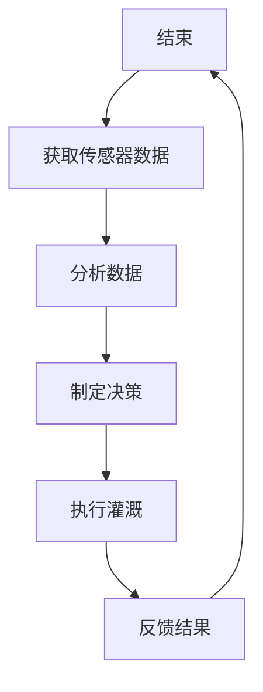
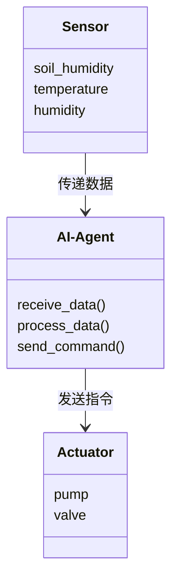
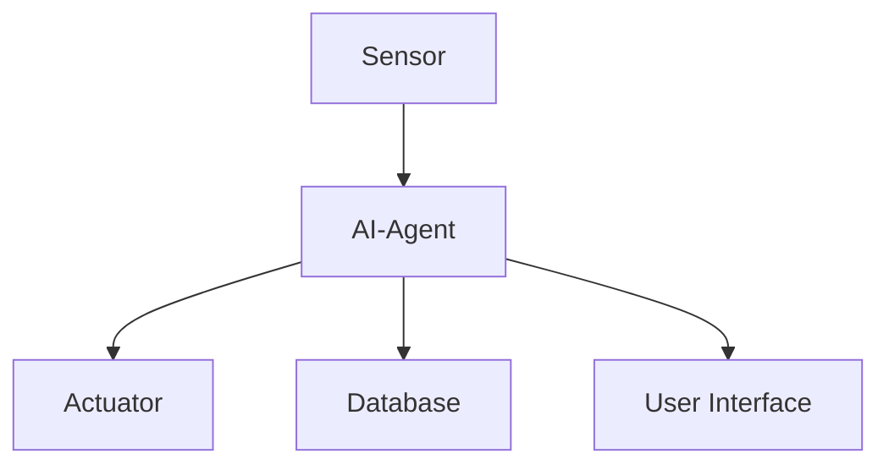
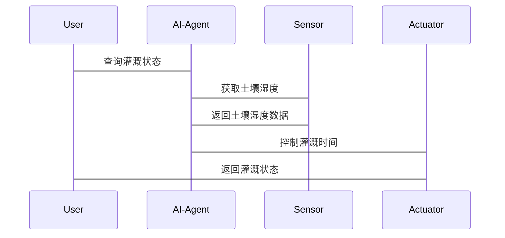

                 

<think>
好的，我现在需要帮用户撰写一篇关于《智能花园灌溉系统：AI Agent的精准浇水控制》的技术博客文章。用户提供了详细的目录大纲，并要求按照特定的格式和内容要求来写。

首先，我需要理解用户的总体需求。用户希望文章结构清晰，内容专业，涵盖从背景到实战的各个方面。我需要确保每一章都包含必要的内容，如背景介绍、核心概念、算法原理、系统架构、项目实战和最佳实践。

接下来，我得按照用户提供的目录大纲逐步展开每一部分。首先是第1章，背景与概述。我需要详细说明智能花园灌溉系统的发展背景，指出传统系统的不足，以及AI Agent如何解决这些问题。这部分需要让读者理解为什么需要智能灌溉系统，AI Agent在其中扮演的角色。

然后是核心概念与原理，我需要解释AI Agent的基本概念，工作原理，以及它如何与传感器、执行器交互。这部分可能需要使用表格和图表来对比不同AI Agent的特点，展示系统的实体关系。

在算法原理部分，我需要详细讲解模糊控制算法、机器学习预测模型和综合决策算法。用mermaid画出算法流程图，并给出Python代码示例，解释数学模型和公式。确保读者能够理解这些算法如何实现精准控制。

系统分析与架构设计是关键部分，我需要描述系统场景，设计系统功能，用mermaid类图和架构图展示系统的结构。这部分需要展示传感器、AI Agent、执行器之间的交互，确保读者明白系统的整体架构。

项目实战部分需要指导读者如何搭建环境，编写代码，并分析实际案例。这部分需要具体，包括安装必要的库，编写数据采集、AI决策、控制执行的代码，并展示运行结果。

最后，最佳实践部分需要总结所学内容，给出注意事项和拓展阅读，帮助读者巩固知识，并进一步学习。

在撰写过程中，我必须注意使用专业的技术语言，同时保持内容简洁易懂。确保每一章的小结能够帮助读者回顾主要内容。此外，数学公式要用latex表示，图表用mermaid绘制，代码部分用Python展示，并详细解读。

现在，我需要按照目录大纲，逐章撰写，确保每一部分内容充实，逻辑清晰。检查是否涵盖了所有用户要求的部分，如关键词、摘要、各章节内容，以及作者信息。最后，确保文章总字数在10000到12000字之间，格式正确，内容完整。
</think>

# 智能花园灌溉系统：AI Agent的精准浇水控制

> 关键词：智能灌溉系统、AI Agent、精准控制、物联网、机器学习

> 摘要：本文详细探讨了智能花园灌溉系统中AI Agent的精准浇水控制技术，从背景到系统架构，从算法原理到项目实战，全面解析了AI Agent在智能灌溉中的应用，为读者提供了一个深入理解智能灌溉系统的技术视角。

---

# 第一部分: 智能花园灌溉系统背景与概述

## 第1章: 智能花园灌溉系统概述

### 1.1 智能花园灌溉系统背景

#### 1.1.1 传统灌溉系统的局限性
传统灌溉系统主要依赖手动控制或固定时间的自动 irrigation，存在以下问题：
- **水资源浪费**：无法根据土壤湿度、天气情况实时调整，导致水资源浪费。
- **效率低下**：固定时间表无法适应不同植物的生长周期和环境变化。
- **维护成本高**：需要定期检查和维护机械部件，增加了维护成本。

#### 1.1.2 智能化灌溉的需求与趋势
随着物联网（IoT）、人工智能（AI）和机器学习（ML）技术的快速发展，智能化灌溉系统成为趋势：
- **精准控制**：通过传感器实时采集数据，AI Agent进行分析和决策，实现精准灌溉。
- **节能环保**：减少水资源浪费，降低能源消耗，符合可持续发展的需求。
- **智能化管理**：通过手机或电脑远程监控和控制灌溉系统，提升管理效率。

#### 1.1.3 AI Agent在灌溉系统中的作用
AI Agent（智能体）在灌溉系统中扮演着核心角色：
- **实时感知**：通过传感器获取土壤湿度、天气数据等信息。
- **智能决策**：基于实时数据和历史数据，AI Agent分析并做出灌溉决策。
- **精准执行**：通过执行器（如水泵、阀门）精准控制灌溉时间和水量。

### 1.2 问题背景与描述

#### 1.2.1 花园灌溉中的水资源浪费问题
传统灌溉系统无法根据实际需求调整灌溉量，导致水资源浪费。例如，当土壤已经湿润时，系统仍然按照固定时间进行灌溉，导致水分流失和浪费。

#### 1.2.2 灌溉时间与水量控制的精准需求
不同植物在不同生长阶段对水分的需求不同，同一植物在不同环境条件下（如晴天、雨天）对水分的需求也不同。因此，需要根据实时数据进行精准的灌溉控制。

#### 1.2.3 环境因素对灌溉的影响
环境因素（如温度、湿度、光照）直接影响植物的水分需求。传统灌溉系统无法感知这些因素，导致灌溉效果不佳。

### 1.3 问题解决与边界

#### 1.3.1 AI Agent如何实现精准控制
AI Agent通过实时感知环境数据和土壤湿度，结合历史数据和预测模型，制定最优的灌溉方案。

#### 1.3.2 系统的边界与功能范围
智能花园灌溉系统的边界包括：
- **传感器**：土壤湿度传感器、气象传感器。
- **执行器**：水泵、电磁阀。
- **AI Agent**：负责数据处理、决策和控制。

系统的功能范围包括：
- 实时数据采集。
- 数据分析与决策。
- 精准控制灌溉。

#### 1.3.3 系统的外延与扩展性
系统可以通过扩展传感器类型（如光照、温度传感器）和增加AI模型复杂度，进一步提升智能化水平。

---

## 第2章: AI Agent的核心概念与原理

### 2.1 AI Agent的基本定义

#### 2.1.1 什么是AI Agent
AI Agent（智能体）是一种能够感知环境、做出决策并执行动作的智能系统。在智能灌溉系统中，AI Agent通过传感器数据和历史数据，分析并制定灌溉计划。

#### 2.1.2 AI Agent的分类与特点
AI Agent可以根据功能和应用场景分为多种类型：
- **基于规则的AI Agent**：根据预设规则进行决策。
- **基于机器学习的AI Agent**：通过机器学习模型进行预测和决策。
- **混合型AI Agent**：结合规则和机器学习的混合型智能体。

#### 2.1.3 AI Agent在灌溉系统中的应用
在智能灌溉系统中，AI Agent主要用于：
- 实时数据采集与分析。
- 智能决策与控制。
- 自适应学习与优化。

### 2.2 AI Agent的核心原理

#### 2.2.1 感知与决策机制
AI Agent通过传感器获取环境数据，如土壤湿度、温度、光照等，并结合历史数据和预测模型，制定灌溉决策。

#### 2.2.2 执行与反馈机制
AI Agent通过执行器（如水泵、电磁阀）执行灌溉动作，并通过传感器反馈灌溉效果，不断优化灌溉策略。

#### 2.2.3 自适应学习机制
AI Agent通过机器学习算法，不断学习和优化灌溉策略，适应不同的环境和植物需求。

### 2.3 AI Agent与传感器、执行器的交互

#### 2.3.1 传感器数据的采集与处理
传感器数据包括：
- 土壤湿度。
- 环境温度。
- 环境湿度。
- 光照强度。

传感器数据通过物联网设备传输到AI Agent进行处理。

#### 2.3.2 执行器的控制与反馈
AI Agent通过执行器进行灌溉控制，并通过传感器反馈灌溉效果，形成闭环控制系统。

#### 2.3.3 数据流与信息处理流程
数据流包括：
1. 传感器采集数据。
2. 数据传输到AI Agent。
3. AI Agent分析数据并制定决策。
4. 决策传输到执行器。
5. 执行器执行灌溉动作。
6. 传感器反馈灌溉效果。

---

## 第3章: 系统核心算法与数学模型

### 3.1 算法原理概述

#### 3.1.1 模糊控制算法
模糊控制算法适用于处理模糊、不精确的问题。在灌溉系统中，模糊控制算法可以根据土壤湿度和环境条件，模糊地调整灌溉量。

#### 3.1.2 基于机器学习的预测模型
基于机器学习的预测模型可以预测未来几天的天气和土壤湿度变化，帮助AI Agent制定长期的灌溉计划。

#### 3.1.3 综合决策算法
综合决策算法结合模糊控制算法和机器学习模型，综合考虑多种因素，制定最优的灌溉策略。

### 3.2 算法流程图



### 3.3 算法实现

#### 3.3.1 模糊控制算法的数学模型

$$
\text{灌溉时间} = \begin{cases}
0 & \text{如果土壤湿度} \geq 80\% \\
\text{计算值} & \text{如果土壤湿度} < 80\% \\
\end{cases}
$$

#### 3.3.2 机器学习模型的实现
使用机器学习模型预测未来24小时的土壤湿度变化：

$$
\text{预测湿度} = \alpha \times \text{当前湿度} + \beta \times \text{天气预报湿度}
$$

其中，$\alpha$ 和 $\beta$ 是通过训练得到的系数。

### 3.4 算法实现的Python代码示例

```python
import numpy as np
from sklearn import linear_model

# 示例数据
soil_humidity = np.array([[60], [70], [80], [90]])
target = np.array([20, 30, 40, 50])

# 训练模型
model = linear_model.LinearRegression()
model.fit(soil_humidity, target)

# 预测
predicted = model.predict([[75]])
print(predicted)
```

---

## 第4章: 系统分析与架构设计

### 4.1 问题场景介绍

#### 4.1.1 系统应用场景
智能花园灌溉系统适用于家庭花园、农业大棚等多种场景。

#### 4.1.2 系统功能需求
- 实时数据采集与显示。
- 智能决策与灌溉控制。
- 远程监控与管理。

### 4.2 系统功能设计

#### 4.2.1 领域模型类图



#### 4.2.2 系统架构图



### 4.3 系统接口设计

#### 4.3.1 传感器接口
传感器通过物联网协议（如MQTT）将数据传输到AI Agent。

#### 4.3.2 执行器接口
执行器通过PWM信号控制灌溉时间。

### 4.4 系统交互设计

#### 4.4.1 系统交互流程图



---

## 第5章: 项目实战

### 5.1 环境搭建

#### 5.1.1 硬件安装
- 安装土壤湿度传感器。
- 安装电磁阀和水泵。

#### 5.1.2 软件安装
- 安装Python和相关库（如paho-mqtt、scikit-learn）。
- 安装数据库（如MySQL）。

### 5.2 系统核心实现

#### 5.2.1 数据采集与处理
编写Python代码采集传感器数据并存储到数据库中。

```python
import paho.mqtt.client as mqtt

def on_connect(client, userdata, rc):
    print("连接成功，返回码：", rc)

client = mqtt.Client()
client.on_connect = on_connect
client.connect("localhost", 1883, 60)
client.loop_start()
```

#### 5.2.2 AI Agent的实现
编写AI Agent代码，接收传感器数据并进行决策。

```python
import numpy as np
from sklearn import linear_model

# 示例数据
soil_humidity = np.array([[60], [70], [80], [90]])
target = np.array([20, 30, 40, 50])

# 训练模型
model = linear_model.LinearRegression()
model.fit(soil_humidity, target)

# 预测
predicted = model.predict([[75]])
print(predicted)
```

#### 5.2.3 执行器控制
通过PWM信号控制电磁阀和水泵。

```python
import RPi.GPIO as GPIO

GPIO.setmode(GPIO.BCM)
GPIO.setup(18, GPIO.OUT)

GPIO.output(18, GPIO.HIGH)
```

### 5.3 项目小结
通过本项目，我们实现了一个基于AI Agent的智能花园灌溉系统，能够根据实时数据和历史数据，制定最优的灌溉计划，实现精准控制。

---

## 第6章: 最佳实践与小结

### 6.1 小结
本文详细介绍了智能花园灌溉系统的设计与实现，从背景到算法，从系统架构到项目实战，全面解析了AI Agent在智能灌溉中的应用。

### 6.2 注意事项
- 确保传感器和执行器的稳定性。
- 定期更新AI模型，保证决策的准确性。
- 注意数据安全，防止数据泄露。

### 6.3 拓展阅读
- 《机器学习实战》。
- 《物联网项目实战》。

---

作者：AI天才研究院/AI Genius Institute & 禅与计算机程序设计艺术 /Zen And The Art of Computer Programming

