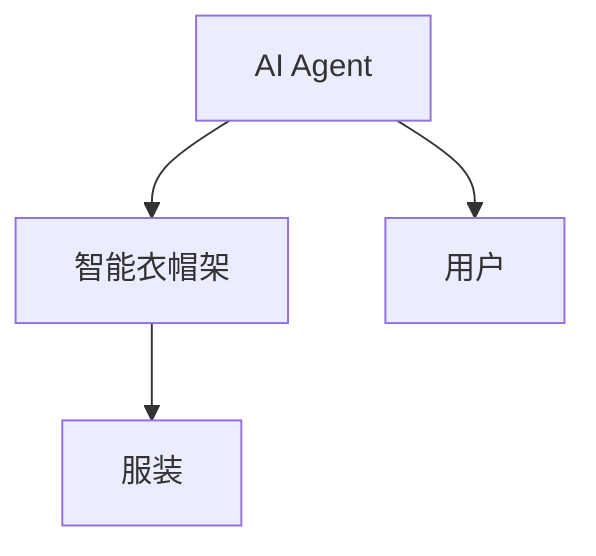
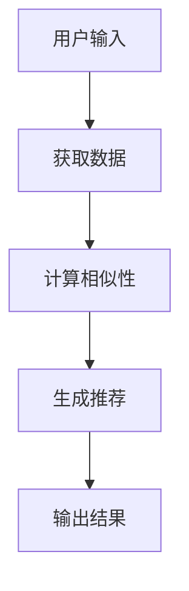
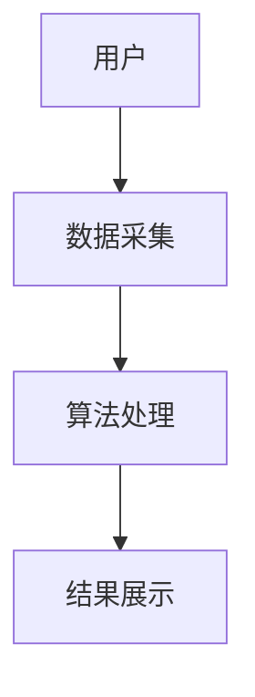

                 


# 智能衣帽架：AI Agent的穿搭建议系统

> 关键词：智能衣帽架，AI Agent，穿搭建议，推荐算法，系统架构，项目实战

> 摘要：本文介绍了一种结合AI Agent技术的智能衣帽架系统，该系统能够为用户提供个性化的穿搭建议。文章详细阐述了系统的背景、核心概念、算法原理、系统架构、项目实现和最佳实践，旨在为读者提供全面的技术洞察。

---

## 第1章: 引言

智能衣帽架是一种结合人工智能技术的创新家居产品，它通过AI Agent（智能体）帮助用户进行服装搭配和管理。本文将深入探讨这一系统的设计与实现，展示AI技术如何为日常生活带来便利。

---

## 第2章: 背景介绍

### 2.1 传统衣帽架的不足

传统衣帽架仅具备存储功能，无法提供穿搭建议。用户在选择服装时，常常面临搭配困难，尤其是在需要快速决策时，传统衣帽架显得力不从心。

### 2.2 智能衣帽架的应用价值

智能衣帽架通过AI技术，能够根据用户的衣橱内容、天气情况和场合需求，实时推荐合适的穿搭方案，显著提升用户体验。

---

## 第3章: AI Agent与智能衣帽架的核心概念

### 3.1 AI Agent的定义与特征

AI Agent是一种智能实体，能够感知环境、自主决策并执行任务。在智能衣帽架中，AI Agent负责接收用户指令、分析数据并生成穿搭建议。

### 3.2 智能衣帽架的系统构成

智能衣帽架由硬件和软件两部分组成。硬件包括衣帽架主体和传感器，软件则包含AI算法、推荐系统和用户界面。

### 3.3 实体关系分析

- 用户与AI Agent：用户输入需求，AI Agent分析并提供建议。
- AI Agent与智能衣帽架：AI Agent控制衣帽架的机械动作，如旋转和升降。
- 衣帽架与服装：衣帽架存储服装信息，AI Agent根据服装数据生成搭配建议。

### 3.4 实体关系图



---

## 第4章: 算法原理

### 4.1 推荐算法的选择

本系统采用协同过滤和聚类分析相结合的推荐算法。协同过滤基于用户行为数据，聚类分析则根据服装属性进行分组。

### 4.2 协同过滤算法

协同过滤通过分析用户的历史行为，找到相似用户的偏好，从而推荐相似的服装搭配。

公式：
$$ sim(u, v) = \frac{\sum_{i} (r_{u,i} - \bar{r}_u)(r_{v,i} - \bar{r}_v)}{\sqrt{\sum_{i} (r_{u,i} - \bar{r}_u)^2} \sqrt{\sum_{i} (r_{v,i} - \bar{r}_v)^2}} $$

### 4.3 聚类分析算法

聚类分析根据服装的颜色、类型和品牌等属性，将服装分为不同的类别，便于推荐。

### 4.4 算法流程图



---

## 第5章: 系统架构设计

### 5.1 系统功能模块

- 数据采集模块：采集用户衣橱数据。
- 算法处理模块：执行推荐算法。
- 用户交互模块：显示推荐结果。

### 5.2 系统架构图



---

## 第6章: 项目实战

### 6.1 环境配置

- Python 3.8+
- AI框架：TensorFlow或PyTorch
- 其他依赖：Pandas、Scikit-learn

### 6.2 核心代码实现

```python
def recommend_clothes(user_id):
    # 获取用户数据
    user_data = get_user_data(user_id)
    # 计算相似用户
    similar_users = find_similar_users(user_data)
    # 生成推荐列表
    recommendations = generate_recommendations(similar_users)
    return recommendations
```

### 6.3 案例分析

假设用户A喜欢穿深色西装，系统会推荐与之搭配的浅色衬衫和深色领带。

---

## 第7章: 最佳实践与总结

### 7.1 小结

智能衣帽架通过AI Agent实现了智能化的穿搭管理，为用户提供高效、个性化的服务。

### 7.2 注意事项

- 数据隐私保护
- 算法的可解释性
- 系统的稳定性

### 7.3 拓展阅读

- 《推荐系统实战》
- 《人工智能入门》

---

# 作者：AI天才研究院 & 禅与计算机程序设计艺术

