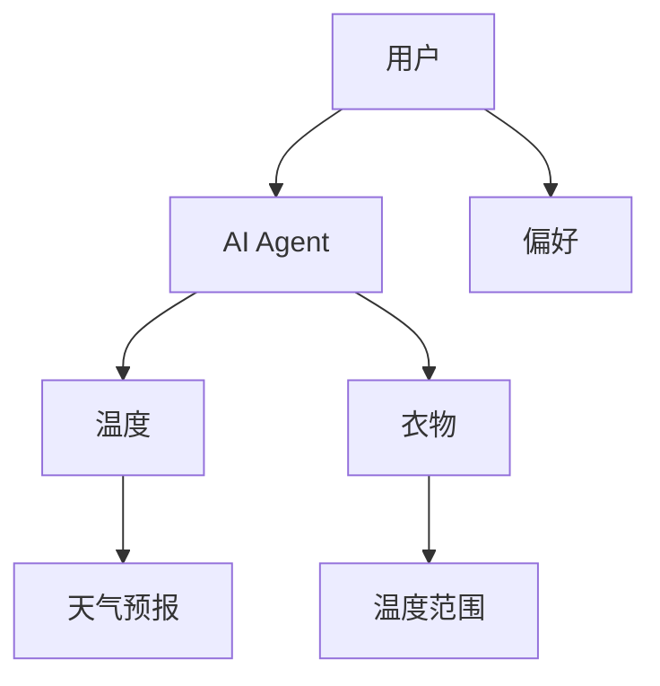
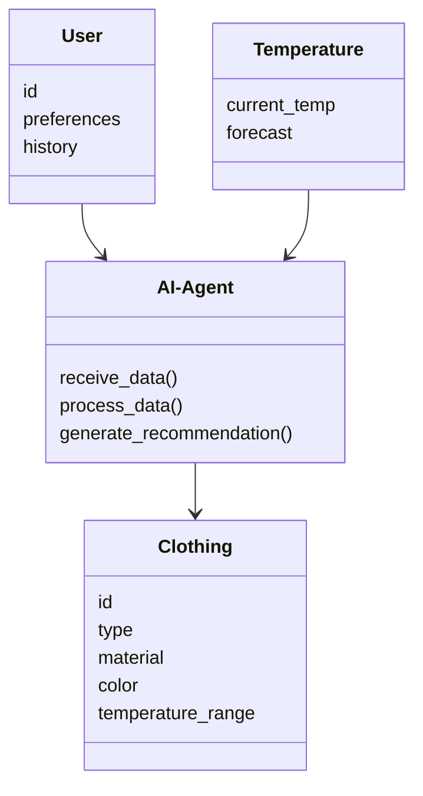
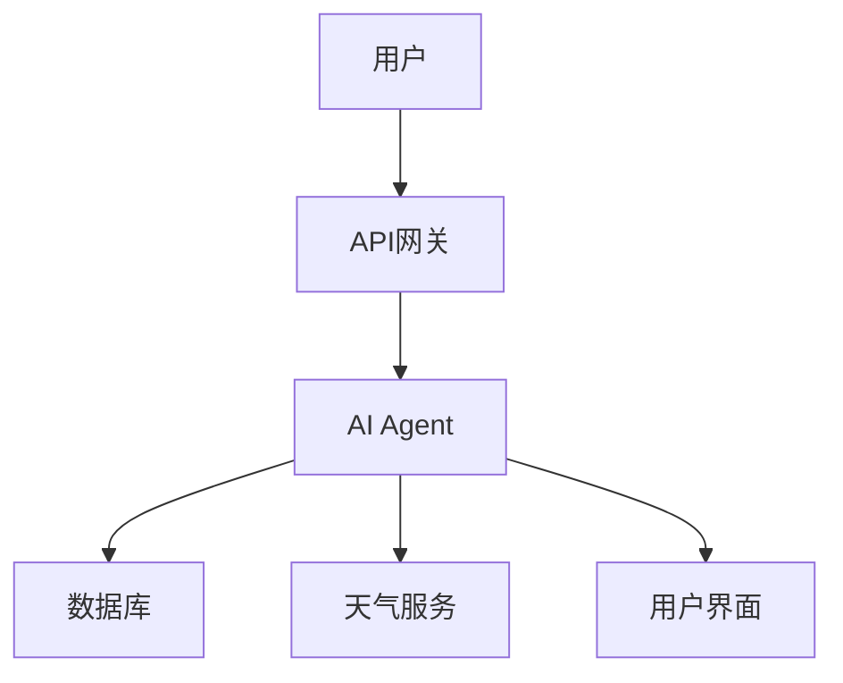
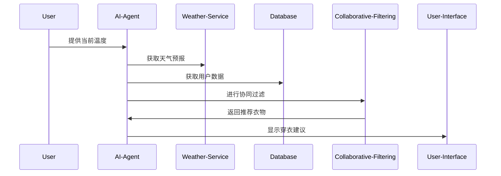

                 

<think>
嗯，我现在需要为这本书设计一个详细的目录大纲。首先，我得理解这本书的主题，是关于智能衣帽架结合AI Agent提供穿衣温度建议的。听起来像是一个智能家居设备，通过AI来帮助用户选择合适的衣物，考虑温度等因素。

首先，背景介绍是必不可少的。我应该从问题背景开始，讨论智能家居的发展趋势，个性化穿衣需求的兴起，以及气候变化对穿衣的影响。然后描述问题，比如用户在选择衣物时遇到的痛点，温度如何影响穿衣决策，以及智能设备在穿衣建议中的作用。接下来，我需要介绍如何解决这些问题，解释智能衣帽架的概念，以及AI Agent在其中的应用。最后，明确概念结构和核心要素，可能需要绘制一些图表来辅助说明。

接下来是核心概念与联系。这里需要详细解释AI Agent的基本原理，包括其定义、分类，以及在智能衣帽架中的具体角色。同时，分析穿衣建议系统的核心要素，如用户数据、环境数据和衣物数据，可能需要通过表格或对比图来展示。最后，绘制实体关系图（ER图）来展示系统中各实体之间的关系。

算法原理部分，我需要详细讲解协同过滤、聚类分析等推荐算法，并用mermaid流程图展示算法步骤。同时，提供Python代码示例，并解释数学模型和公式，比如使用用户-物品矩阵和相似度计算方法。

系统分析与架构设计是关键。这部分需要描述系统的功能设计，包括用户界面、数据采集、AI处理和穿衣建议生成等模块。绘制领域模型的类图和系统架构图，展示各模块之间的协作关系。此外，设计系统接口和交互流程，可能需要用序列图来展示用户与系统之间的互动。

项目实战部分，提供环境安装指导，详细介绍如何安装必要的库和工具。然后，展示核心代码实现，包括数据处理、模型训练和建议生成等部分，每个步骤都需要详细解读。最后，通过实际案例分析，展示系统在不同场景下的应用，并进行详细解读。

最后，总结与展望部分，总结本书的主要内容，讨论当前技术的局限性，并展望未来的发展方向。同时，给出最佳实践的提示，提醒读者在实施过程中需要注意的问题，以及如何优化系统性能。最后，列出一些拓展阅读资料，帮助读者进一步学习相关知识。

在撰写过程中，我需要确保每个章节的内容详实，逻辑清晰，结构合理。同时，使用图表和代码示例来增强说明效果，确保读者能够轻松理解复杂的概念和技术细节。
</think>

# 目录大纲：《智能衣帽架：AI Agent的穿衣温度建议》

## 1. 背景介绍

### 1.1 问题背景与需求分析

#### 1.1.1 智能家居的发展趋势
智能家居设备的普及，AI技术的快速发展，用户对个性化服务的需求增加。

#### 1.1.2 个性化穿衣需求的兴起
用户希望根据个人喜好和环境变化获得个性化的穿衣建议。

#### 1.1.3 气候变化对穿衣的影响
气候变化导致温度波动频繁，穿衣决策更加依赖实时环境数据。

#### 1.1.4 智能设备在穿衣建议中的作用
智能衣帽架通过AI技术整合用户数据和环境信息，提供智能穿衣建议。

### 1.2 问题描述

#### 1.2.1 用户穿衣选择的痛点
- 传统穿衣选择依赖经验，缺乏个性化和科学性。
- 用户难以快速获取适合当前环境的穿衣建议。
- 穿衣选择过程耗时，影响生活效率。

#### 1.2.2 温度对穿衣决策的影响
- 不同温度下，用户需要选择不同材质和厚度的衣物。
- 温度预测对穿衣建议的准确性至关重要。

#### 1.2.3 智能设备在穿衣建议中的应用
- AI技术能够分析用户数据和环境信息，提供精准的穿衣建议。
- 智能衣帽架通过实时环境监测和用户行为分析，优化穿衣推荐。

### 1.3 问题解决

#### 1.3.1 智能衣帽架的概念
智能衣帽架是一种结合AI技术的智能家居设备，能够根据环境数据和用户需求提供穿衣建议。

#### 1.3.2 AI Agent在穿衣建议中的应用
AI Agent负责数据采集、分析和决策，为用户提供个性化的穿衣建议。

#### 1.3.3 温度预测与穿衣建议的结合
系统通过温度预测模型，结合用户数据，生成适合当前温度的穿衣方案。

### 1.4 概念结构与核心要素

#### 1.4.1 核心概念
- AI Agent：负责数据处理和决策。
- 穿衣建议：根据温度和用户需求生成建议。
- 温度预测：基于历史数据预测未来温度。

#### 1.4.2 概念属性对比
| 概念 | 属性 | 描述 |
|------|------|------|
| AI Agent | 功能 | 数据采集、分析、决策 |
| 穿衣建议 | 类型 | 温度适配、场合适配 |
| 温度预测 | 方法 | 时间序列分析、机器学习模型 |

#### 1.4.3 系统架构
- 用户与系统交互，系统通过AI Agent分析数据，生成穿衣建议。
- 系统架构包括数据采集模块、AI处理模块和用户界面模块。

## 2. 核心概念与联系

### 2.1 AI Agent的基本原理

#### 2.1.1 AI Agent的定义与分类
AI Agent是能够感知环境并执行任务的智能实体，分为简单反射Agent和基于模型的反射Agent。

#### 2.1.2 AI Agent的核心功能
- 感知：采集环境数据和用户信息。
- 推理：分析数据，生成穿衣建议。
- 决策：根据分析结果做出最优选择。

#### 2.1.3 AI Agent在智能衣帽架中的角色
AI Agent负责数据处理和决策，为用户提供个性化的穿衣建议。

### 2.2 穿衣建议系统的核心要素

#### 2.2.1 用户数据
- 用户基本信息：年龄、性别、体型。
- 穿衣偏好：颜色、风格、场合。
- 健康状况：过敏、活动强度。

#### 2.2.2 环境数据
- 当前温度、湿度、空气质量。
- 天气预报：未来24小时温度变化。

#### 2.2.3 衣物数据
- 衣物类型：外套、衬衫、裤子。
- 材质：棉、羊毛、聚酯纤维。
- 颜色：白色、黑色、蓝色。
- 适用温度范围：最低、最高温度。

### 2.3 实体关系图（ER图）



## 3. 算法原理

### 3.1 协同过滤算法

#### 3.1.1 基本原理
基于用户相似性推荐相似用户的穿衣选择。

#### 3.1.2 实现步骤
1. 收集用户行为数据。
2. 计算用户相似度。
3. 推荐相似用户的衣物。

#### 3.1.3 代码实现

```python
def collaborative_filtering(user_id, user_data):
    # 计算用户相似度
    similarity = {}
    for user in user_data:
        if user != user_id:
            similarity[user] = calculate_similarity(user_data[user_id], user_data[user])
    # 推荐衣物
    recommendations = []
    for user in sorted(similarity, key=lambda x: similarity[x], reverse=True)[:5]:
        recommendations.extend(user_data[user]['clothing'])
    return recommendations
```

### 3.2 聚类分析

#### 3.2.1 基本原理
根据衣物属性进行聚类，推荐适合当前温度的衣物。

#### 3.2.2 实现步骤
1. 数据预处理。
2. 衣物聚类。
3. 根据温度推荐衣物。

#### 3.2.3 代码实现

```python
from sklearn.cluster import KMeans

def clustering_recommendation(clothing_data, temperature):
    # 数据预处理
    features = clothing_data[['weight', 'thickness']]
    # 聚类
    kmeans = KMeans(n_clusters=3).fit(features)
    # 推荐衣物
    recommendations = []
    for i in range(len(clothing_data)):
        if kmeans.predict([features[i]])[0] == target_cluster:
            if clothing_data['temperature_range'][i].includes(temperature):
                recommendations.append(clothing_data['clothing'][i])
    return recommendations
```

### 3.3 深度学习模型

#### 3.3.1 基本原理
使用神经网络模型预测温度和推荐衣物。

#### 3.3.2 实现步骤
1. 数据准备。
2. 模型训练。
3. 温度预测和推荐衣物。

#### 3.3.3 代码实现

```python
import tensorflow as tf
from tensorflow.keras import layers

def deep_learning_model():
    model = tf.keras.Sequential([
        layers.Dense(64, activation='relu'),
        layers.Dense(32, activation='relu'),
        layers.Dense(1, activation='sigmoid')
    ])
    model.compile(optimizer='adam', loss='binary_crossentropy', metrics=['accuracy'])
    return model

# 训练模型
model = deep_learning_model()
model.fit(x_train, y_train, epochs=10, batch_size=32)
```

## 4. 系统分析与架构设计

### 4.1 系统功能设计

#### 4.1.1 领域模型



### 4.2 系统架构设计



### 4.3 系统接口设计

- 用户输入接口：收集用户数据和偏好。
- 数据接口：与天气服务和数据库交互。
- 输出接口：显示穿衣建议和温度预测。

### 4.4 系统交互流程



## 5. 项目实战

### 5.1 环境安装

安装Python、TensorFlow、Scikit-learn、Mermaid CLI。

### 5.2 核心代码实现

#### 5.2.1 数据处理

```python
import pandas as pd

data = pd.read_csv('clothing_data.csv')
```

#### 5.2.2 模型训练

```python
model = deep_learning_model()
model.fit(x_train, y_train, epochs=10, batch_size=32)
```

#### 5.2.3 推荐生成

```python
recommendations = collaborative_filtering(user_id, user_data)
```

### 5.3 案例分析

分析一个用户在不同温度下的穿衣建议，展示系统如何根据温度和用户偏好推荐衣物。

## 6. 总结与展望

### 6.1 小结

总结本书的主要内容，强调AI Agent在智能衣帽架中的重要性。

### 6.2 展望

讨论当前技术的局限性，展望未来的发展方向，如更精确的温度预测和更个性化的推荐算法。

### 6.3 注意事项

提醒读者在实施过程中需要注意的问题，如数据隐私和模型优化。

### 6.4 拓展阅读

推荐相关书籍和资源，帮助读者进一步学习和深入理解。

---

作者：AI天才研究院 & 禅与计算机程序设计艺术

