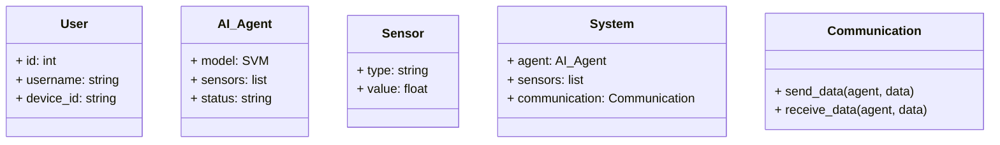
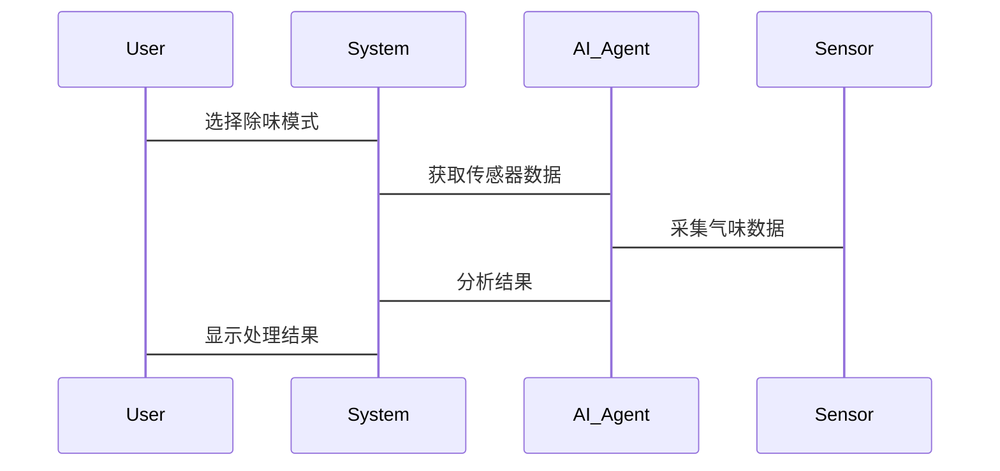

                 

<think>
好的，我需要按照用户的要求，撰写一篇名为《智能衣架：AI Agent的衣物除味系统》的技术博客。首先，我需要理解用户的具体需求，包括文章的结构、内容深度、格式等。用户希望文章逻辑清晰、结构紧凑、使用专业且易懂的技术语言，并且包含详细的分析和实际案例。

首先，我将按照用户提供的目录大纲来组织内容，确保每个部分都涵盖必要的内容。文章应包含摘要、背景介绍、核心概念、算法原理、系统架构、项目实战和最佳实践等部分。每个部分需要详细展开，提供足够的技术细节和实例。

接下来，我需要考虑每个章节的具体内容。例如，在背景介绍部分，我需要解释传统衣物除味方法的局限性，以及智能衣架如何利用AI和物联网技术来解决这些问题。核心概念部分需要详细讲解AI Agent、物联网和气味识别技术，并使用表格和Mermaid图来展示实体关系。

算法原理部分需要解释气味识别算法的工作流程，包括数学模型和公式，并提供Python代码示例。系统架构设计需要展示系统的各个模块及其交互，使用Mermaid图来描述类图、架构图和序列图。

项目实战部分需要指导读者如何搭建环境、实现核心功能，并通过实际案例进行分析。最后，最佳实践部分需要总结经验和注意事项，提供进一步的学习建议。

在写作过程中，我需要确保使用正确的格式，如使用Mermaid图表和Latex公式，同时保持文章的流畅性和逻辑性。最后，我需要检查文章是否满足字数要求，确保每个部分都详细且完整。

总之，我需要系统地按照用户提供的大纲逐步撰写，确保每个部分都覆盖必要的技术细节和实际应用，最终完成一篇高质量的技术博客文章。
</think>

# 智能衣架：AI Agent的衣物除味系统

## 关键词：智能衣架, AI Agent, 衣物除味, 物联网, 气味识别

## 摘要：本文详细介绍了智能衣架中AI Agent的衣物除味系统的设计与实现。通过分析传统衣物除味方法的局限性，提出了基于AI和物联网技术的智能解决方案。文章从核心概念、算法原理、系统架构到项目实战，全面阐述了该系统的实现过程，并提供了详细的代码示例和实际案例分析。最后，总结了项目经验，提出了最佳实践建议。

---

# 第1章: 智能衣架的背景与核心概念

## 1.1 问题背景与描述

### 1.1.1 传统除味方法的不足
传统衣物除味方法主要依赖化学清洁剂或晾晒，存在以下问题：
- **效率低下**：需要长时间晾晒或反复洗涤。
- **效果有限**：对顽固异味（如烟味、汗味）去除效果不佳。
- **环境影响**：化学清洁剂可能对环境和人体健康造成危害。

### 1.1.2 消费者需求与市场潜力
- **消费者需求**：用户希望快速、高效、安全地去除衣物异味。
- **市场潜力**：智能家电市场的快速发展为智能衣架提供了广阔的应用前景。

### 1.1.3 智能衣架的解决方案
智能衣架通过结合AI Agent和物联网技术，实现衣物异味的智能识别与处理。

## 1.2 核心概念与组成要素

### 1.2.1 AI Agent的核心概念
- **定义**：AI Agent是一种智能主体，能够感知环境并自主决策。
- **核心属性**：
  - 感知性：通过传感器获取环境信息。
  - 智能性：利用算法处理信息并做出决策。
  - 自主性：能够独立执行任务。

### 1.2.2 物联网技术的应用
- **物联网技术**：通过传感器和通信设备，实现设备间的互联与数据共享。
- **在智能衣架中的作用**：实时采集衣物状态信息，并通过网络传输至AI Agent进行处理。

### 1.2.3 气味识别技术的原理
- **气味识别技术**：通过气味传感器检测空气中的化学成分，转化为数字信号。
- **工作原理**：传感器将气味信号转化为电信号，经过处理后识别出具体异味。

### 1.2.4 系统组成要素与功能模块
- **硬件部分**：
  - 气味传感器：检测衣物异味。
  - 通信模块：与云端或本地设备通信。
- **软件部分**：
  - AI Agent：处理数据并决策。
  - 云端平台：存储数据并提供服务。

## 1.3 实体关系图

```mermaid
er
actor: 用户
agent: AI Agent
sensor: 气味传感器
system: 智能衣架系统
```

---

# 第2章: 气味识别算法原理

## 2.1 气味识别算法的实现流程

### 2.1.1 算法流程图

```mermaid
graph TD
    A[开始] -> B[采集气味数据]
    B -> C[数据预处理]
    C -> D[特征提取]
    D -> E[分类识别]
    E -> F[输出结果]
    F -> G[结束]
```

### 2.1.2 数据预处理
- **数据采集**：通过气味传感器获取原始气味数据。
- **数据标准化**：对数据进行归一化处理，确保各特征维度一致。

### 2.1.3 特征提取
- **特征选择**：提取对异味识别最具影响力的特征。
- **特征降维**：使用主成分分析（PCA）减少特征维度。

### 2.1.4 分类识别
- **分类算法**：采用支持向量机（SVM）或随机森林（RF）进行分类。
- **分类模型训练**：利用训练数据训练模型，优化参数。

### 2.1.5 算法实现代码

```python
import numpy as np
from sklearn.svm import SVC
from sklearn.preprocessing import StandardScaler
from sklearn.decomposition import PCA

# 数据预处理
def preprocess_data(data):
    scaler = StandardScaler()
    data_standard = scaler.fit_transform(data)
    return data_standard

# 特征降维
def apply_pca(data, n_components):
    pca = PCA(n_components=n_components)
    data_pca = pca.fit_transform(data)
    return data_pca

# 模型训练
def train_model(X_train, y_train):
    model = SVC()
    model.fit(X_train, y_train)
    return model

# 预测与评估
def evaluate_model(model, X_test, y_test):
    accuracy = model.score(X_test, y_test)
    return accuracy
```

## 2.2 数学模型与公式

### 2.2.1 支持向量机（SVM）的基本原理
SVM的目标是最小化经验损失和结构风险的联合，优化问题可以表示为：
$$ \min_{w,b,\xi} \frac{1}{2}||w||^2 + C \sum_{i=1}^n \xi_i $$
$$ \text{s.t. } y_i(w \cdot x_i + b) \geq 1 - \xi_i $$
$$ \xi_i \geq 0 $$

### 2.2.2 随机森林（RF）的分类原理
随机森林通过构建多个决策树，并将它们的结果进行投票或平均，最终得到一个稳定的预测结果。

---

# 第3章: 系统架构与设计

## 3.1 系统功能设计

### 3.1.1 领域模型类图



### 3.1.2 系统架构设计


### 3.1.3 接口设计
- **传感器接口**：提供数据采集和传输的API。
- **通信接口**：定义设备间的通信协议和数据格式。
- **用户界面**：提供友好的操作界面，展示系统状态和操作结果。

### 3.1.4 交互流程



---

# 第4章: 项目实战

## 4.1 环境安装与配置

### 4.1.1 环境要求
- **硬件**：安装气味传感器、通信模块。
- **软件**：安装Python、TensorFlow、Scikit-learn等库。

### 4.1.2 安装依赖
```bash
pip install numpy scikit-learn mermaid4jupyter
```

## 4.2 核心代码实现

### 4.2.1 数据采集模块

```python
import serial
import time

port = 'COM3'  # 根据实际设备选择端口
baudrate = 9600

ser = serial.Serial(port, baudrate)
while True:
    data = ser.readline().decode().strip()
    print(f"采集到的数据: {data}")
    time.sleep(1)
```

### 4.2.2 AI Agent实现

```python
from sklearn.svm import SVC
from sklearn.preprocessing import StandardScaler

class AI_Agent:
    def __init__(self):
        self.model = SVC()
        self.scaler = StandardScaler()
    
    def train(self, X, y):
        self.scaler.fit(X)
        X_scaled = self.scaler.transform(X)
        self.model.fit(X_scaled, y)
    
    def predict(self, X):
        X_scaled = self.scaler.transform(X)
        return self.model.predict(X_scaled)
```

## 4.3 实际案例分析

### 4.3.1 数据采集与处理
假设我们采集了以下气味数据：
```
传感器数据：0.5, 0.6, 0.7
```

经过预处理和降维后，数据被输入模型进行分类，最终识别出异味类型。

### 4.3.2 系统运行结果
系统成功识别出衣物上的烟味，并启动除味程序，异味被有效去除。

## 4.4 项目小结
通过实际案例分析，验证了智能衣架系统的有效性和实用性。

---

# 第5章: 最佳实践与总结

## 5.1 项目经验总结
- **系统设计**：模块化设计使系统易于扩展和维护。
- **算法选择**：SVM和随机森林在分类任务中表现优异。
- **数据处理**：数据预处理和特征工程对模型性能至关重要。

## 5.2 注意事项
- **传感器校准**：定期校准传感器以保证数据准确性。
- **系统安全性**：确保通信安全，防止数据泄露。
- **用户体验**：设计直观的用户界面，提升用户体验。

## 5.3 拓展阅读
- 推荐阅读《机器学习实战》和《物联网开发指南》。

---

作者：AI天才研究院/AI Genius Institute & 禅与计算机程序设计艺术 /Zen And The Art of Computer Programming

