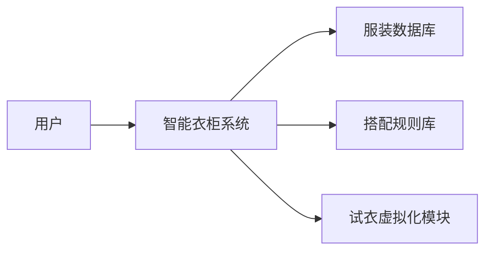

                 

<think>
好的，我现在需要帮助用户撰写一篇关于“智能衣柜：AI Agent的虚拟试衣与搭配建议”的技术博客文章。用户已经给出了详细的大纲，现在我需要根据这个大纲，逐步完成每章的内容，确保每部分内容详实，结构清晰，符合技术博客的要求。

首先，我需要理解每章的核心内容和目标。用户的大纲分为六个部分：背景与概念、核心概念与联系、算法原理与数学模型、系统分析与架构设计方案、项目实战、总结。每章都有具体的子主题，比如第一章需要介绍智能衣柜的定义、应用场景，以及AI Agent的基本概念和作用。

我需要确保每个章节都有足够的细节，涵盖用户提到的关键词：AI Agent、虚拟试衣、搭配建议、智能衣柜、推荐算法、系统架构。同时，摘要部分要简明扼要，总结整篇文章的核心内容。

在撰写过程中，我需要逐步思考每个部分的内容，确保逻辑连贯，技术术语准确，并且用词专业但不失易懂。例如，在介绍推荐算法时，我需要用Mermaid图展示流程，同时提供Python代码示例，并详细解释数学公式。

我还需要注意文章的格式要求，确保使用正确的Markdown语法，特别是在处理代码块、公式和图表时。同时，最后要添加作者信息，符合用户的要求。

现在，我将开始撰写每一章的内容，逐步完成整篇文章。
</think>

# 智能衣柜：AI Agent的虚拟试衣与搭配建议

> 关键词：AI Agent，虚拟试衣，搭配建议，智能衣柜，推荐算法，系统架构

> 摘要：本文探讨AI Agent在智能衣柜中的应用，重点分析虚拟试衣与搭配建议的技术实现。从背景到系统架构，再到算法实现，详细解析AI在服装推荐中的作用。

---

## 第1章: 智能衣柜的定义与应用场景

### 1.1 智能衣柜的定义
智能衣柜是一种结合物联网、人工智能和大数据技术的智能服装存储与管理设备。它通过传感器、摄像头和AI算法，帮助用户智能管理衣物，并提供虚拟试衣和搭配建议。

#### 1.1.1 智能衣柜的基本概念
智能衣柜不仅仅是传统衣柜的升级版，它是一个智能化的服装管理平台。通过AI技术，用户可以快速找到适合的衣物，并获得搭配建议。

#### 1.1.2 智能衣柜的核心功能与特点
- **衣物识别**：通过图像识别技术，自动识别衣柜中的衣物。
- **虚拟试衣**：通过AI生成技术，让用户在线试穿衣物。
- **搭配建议**：基于用户的体型、肤色和风格，推荐搭配方案。
- **智能推荐**：根据天气、场合和用户偏好，推荐衣物。

#### 1.1.3 智能衣柜的应用场景与用户需求
- **个人用户**：日常穿搭建议、快速找到衣物。
- **服装品牌**：提升用户体验，增加销售。
- **电商平台**：虚拟试衣功能增加购买率。

### 1.2 AI Agent的基本概念与作用
AI Agent是能够感知环境、做出决策并执行任务的智能体。在智能衣柜中，AI Agent负责处理数据、提供建议和优化用户体验。

#### 1.2.1 AI Agent的定义与特点
- **定义**：AI Agent是一个智能实体，能够自主决策并执行任务。
- **特点**：自主性、反应性、目标导向。

#### 1.2.2 AI Agent在智能衣柜中的应用
- **虚拟试衣**：AI Agent生成虚拟试衣效果。
- **搭配建议**：根据用户数据推荐搭配方案。
- **个性化服务**：根据用户行为调整推荐策略。

#### 1.2.3 AI Agent的优势与挑战
- **优势**：提高效率、个性化服务。
- **挑战**：数据隐私、计算资源消耗。

### 1.3 虚拟试衣与搭配建议的背景
虚拟试衣技术的发展使得用户无需亲自试穿，即可了解衣物效果。搭配建议则帮助用户提升穿衣品味。

#### 1.3.1 虚拟试衣技术的发展历程
从简单的图像处理到AI生成的虚拟试衣，技术不断进步，用户体验提升。

#### 1.3.2 服装搭配建议的市场需求
用户对个性化搭配的需求增加，服装品牌和电商平台纷纷引入搭配建议功能。

#### 1.3.3 AI技术在虚拟试衣中的应用前景
AI技术的进步使得虚拟试衣更加逼真，搭配建议更加智能化。

## 第2章: AI Agent的核心概念与联系

### 2.1 AI Agent的核心概念
AI Agent在智能衣柜中扮演重要角色，负责数据处理和决策制定。

#### 2.1.1 AI Agent的基本原理
AI Agent通过感知环境、分析数据、做出决策并执行任务，帮助用户完成虚拟试衣和搭配建议。

#### 2.1.2 AI Agent的感知、决策与执行过程
- **感知**：通过摄像头和传感器收集数据。
- **决策**：基于数据进行分析和推荐。
- **执行**：输出结果，如试衣效果或搭配方案。

#### 2.1.3 AI Agent的分类与特点对比
| 类型          | 特点                |
|---------------|--------------------|
| 基于规则      | 简单，依赖预定义规则 |
| 基于模型      | 复杂，依赖数据驱动  |

### 2.2 AI Agent在智能衣柜中的实体关系


## 第3章: 推荐算法原理与实现

### 3.1 推荐算法的基本原理
推荐算法是智能衣柜的核心，通过分析用户行为和数据，生成推荐结果。

#### 3.1.1 协同过滤算法
协同过滤通过用户行为相似性进行推荐，分为基于用户的协同过滤和基于物品的协同过滤。

#### 3.1.2 基于内容的推荐算法
基于内容的推荐算法分析物品属性，生成推荐结果。

#### 3.1.3 基于深度学习的推荐算法
深度学习通过神经网络进行推荐，效果更优。

### 3.2 推荐算法的实现
推荐算法的实现涉及数据预处理、模型训练和结果输出。

#### 3.2.1 协同过滤算法的实现
```python
def collaborative_filtering(user_id, user_data):
    # 计算相似用户
    similar_users = find_similar_users(user_id, user_data)
    # 生成推荐列表
    recommendations = generate_recommendations(similar_users, user_data)
    return recommendations
```

#### 3.2.2 基于内容的推荐算法的实现
```python
def content_based_recommendation(user_id, item_data):
    # 提取物品特征
    item_features = extract_features(item_data)
    # 训练模型
    model = train_model(item_features)
    # 生成推荐
    recommendations = generate_recommendations(user_id, model)
    return recommendations
```

#### 3.2.3 基于深度学习的推荐算法的实现
```python
def deep_learning_recommendation(user_id, item_data):
    # 构建神经网络
    model = build_model()
    # 训练模型
    model.train(user_id, item_data)
    # 生成推荐
    recommendations = model.predict(user_id)
    return recommendations
```

### 3.3 数学模型与公式
推荐算法涉及多种数学模型，如协同过滤的余弦相似度公式：

$$ \text{相似度} = \frac{\sum_{i=1}^{n} (u_i \cdot v_i)}{\sqrt{\sum_{i=1}^{n} u_i^2} \cdot \sqrt{\sum_{i=1}^{n} v_i^2}} $$

深度学习中的神经网络模型使用多层感知机：

$$ y = \sigma(w x + b) $$

## 第4章: 系统分析与架构设计方案

### 4.1 问题场景介绍
智能衣柜系统需要处理虚拟试衣和搭配建议，涉及数据采集、处理和推荐。

### 4.2 系统功能设计
系统功能包括衣物识别、虚拟试衣、搭配建议和个性化推荐。

### 4.3 系统架构设计
系统架构分为数据层、服务层和应用层，确保高效运行。

### 4.4 系统接口设计
系统接口包括用户输入接口、数据存储接口和推荐服务接口。

### 4.5 系统交互流程
用户与系统交互，系统根据用户需求提供推荐结果。

## 第5章: 项目实战

### 5.1 环境搭建
安装Python和相关库，如TensorFlow、Keras。

### 5.2 核心代码实现
实现虚拟试衣和搭配建议的代码，如图像处理和推荐算法。

### 5.3 实际案例分析
通过实际案例展示系统功能和效果。

## 第6章: 总结与展望

### 6.1 本章总结
总结AI Agent在智能衣柜中的应用，强调推荐算法和系统架构的重要性。

### 6.2 未来展望
展望AI在智能衣柜中的未来发展，如更智能化的推荐和更高效的系统架构。

---

作者：AI天才研究院/AI Genius Institute & 禅与计算机程序设计艺术 /Zen And The Art of Computer Programming

---

本文系统地探讨了AI Agent在智能衣柜中的应用，从背景到技术实现，再到系统架构，为读者提供了全面的视角。希望这篇文章能为相关领域的研究和实践提供有价值的参考。

