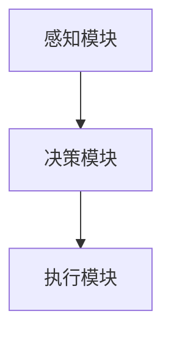
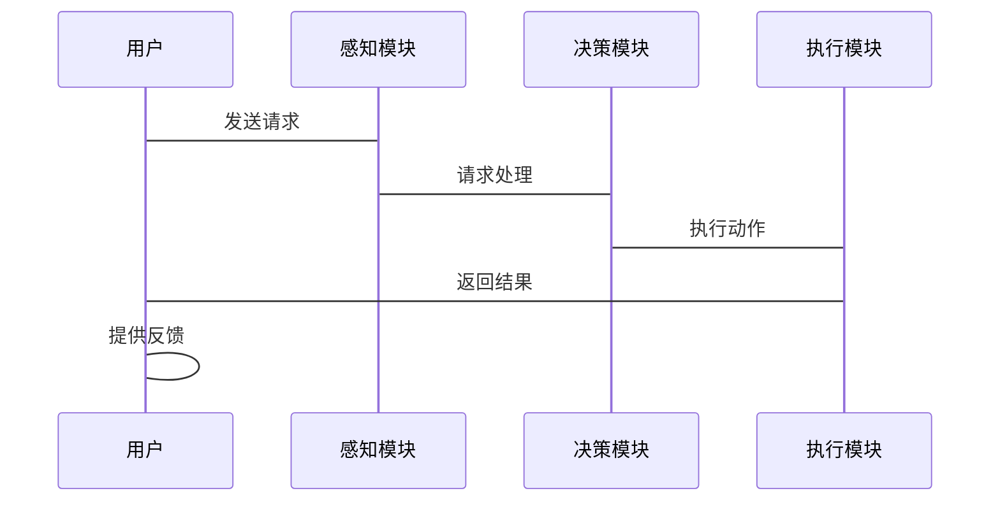

                 


# 《构建AI Agent常见挑战及解决方案》

> 关键词：AI Agent，人工智能，机器学习，挑战，解决方案，系统架构

> 摘要：本文将探讨构建AI Agent过程中常见的挑战，并提供相应的解决方案。文章从AI Agent的基本概念出发，分析其在数据获取、模型训练、系统架构等方面的难点，并结合实际案例，提出优化策略和实施方法。通过系统化的分析和具体的代码实现，帮助读者全面理解AI Agent的构建过程。

---

## 第1章：AI Agent概述

### 1.1 AI Agent的基本概念

AI Agent（人工智能代理）是指能够感知环境并采取行动以实现目标的智能实体。它可以是一个软件程序、机器人或任何具备自主决策能力的系统。AI Agent的核心目标是通过与环境的交互，实现特定任务的高效完成。

#### 1.1.1 AI Agent的类型与特点

AI Agent可以根据智能水平、任务类型和应用场景分为多种类型：

1. **反应式AI Agent**：基于当前感知做出反应，不具备长期记忆。例如，简单的聊天机器人。
2. **认知式AI Agent**：具备复杂推理和规划能力，能够处理复杂任务。例如，自动驾驶系统。
3. **协作式AI Agent**：能够与其他Agent或人类协作完成任务。例如，团队协作机器人。

#### 1.1.2 AI Agent的应用场景

AI Agent广泛应用于多个领域：

1. **智能家居**：控制家庭设备，优化能源使用。
2. **自动驾驶**：处理环境感知和决策。
3. **智能助手**：如Siri、Alexa，提供信息查询和任务管理。

### 1.2 AI Agent的发展历程

AI Agent的概念起源于20世纪60年代的知识库系统。随着计算能力的提升和算法的进步，AI Agent逐步从简单脚本发展为复杂的智能系统。

#### 1.2.1 从简单脚本到复杂系统

早期的AI Agent主要用于简单的规则执行，如专家系统。随着机器学习的兴起，AI Agent开始具备学习和自适应能力。

#### 1.2.2 AI Agent技术的演进

近年来，深度学习和强化学习的突破推动了AI Agent的发展。例如，AlphaGo展示了复杂决策能力的实现。

### 1.3 AI Agent的核心功能与架构

AI Agent的架构通常包括感知层、决策层和执行层。

#### 1.3.1 感知与理解

感知层通过传感器或数据接口获取环境信息。例如，摄像头、麦克风等设备输入的数据。

#### 1.3.2 决策与执行

决策层基于感知信息做出决策。例如，使用深度学习模型进行预测和分类。

#### 1.3.3 学习与优化

学习层通过反馈机制优化模型。例如，强化学习中的奖励机制。

### 1.4 AI Agent的挑战与边界

尽管AI Agent在多个领域取得显著进展，但仍面临诸多挑战。

#### 1.4.1 当前技术的局限性

- 数据依赖性：需要大量高质量数据进行训练。
- 可解释性：复杂的模型难以解释决策过程。
- 实时性：在实时环境中需要快速决策。

#### 1.4.2 AI Agent的适用范围与限制

AI Agent适用于数据驱动的任务，但难以处理高度不确定或需要人类情感的任务。

---

## 第2章：AI Agent的数据挑战

### 2.1 数据获取与处理

数据是AI Agent的核心资源，其质量和多样性直接影响性能。

#### 2.1.1 数据来源的多样性

AI Agent可以从多种来源获取数据，包括：

- **结构化数据**：如数据库中的表格数据。
- **非结构化数据**：如文本、图像和视频。

#### 2.1.2 数据清洗与预处理

数据清洗是确保数据质量的关键步骤，包括：

- 去除噪声数据。
- 处理缺失值。
- 标准化和归一化。

#### 2.1.3 数据质量评估

评估数据质量需要考虑：

- 数据的完整性。
- 数据的准确性和一致性。
- 数据的相关性。

#### 2.1.4 数据增强技术

通过数据增强技术提升数据多样性，例如：

- 图像旋转、翻转和裁剪。
- 文本数据的同义词替换和句式变化。

### 2.2 数据安全与隐私保护

数据安全是构建AI Agent时必须考虑的重要因素。

#### 2.2.1 数据泄露风险

数据泄露可能导致严重的安全问题，如身份盗窃和金融欺诈。

#### 2.2.2 数据加密与匿名化

通过加密技术保护数据隐私，例如：

- 使用哈希函数加密敏感信息。
- 应用数据匿名化处理，如k-匿名化。

#### 2.2.3 数据合规性要求

遵守数据保护法规，如GDPR（通用数据保护条例）。

### 2.3 数据量与模型训练

数据量直接影响模型的训练效果。

#### 2.3.1 数据量对模型性能的影响

- 数据量不足可能导致过拟合。
- 数据量过多可能增加计算成本。

#### 2.3.2 数据增强技术的应用

数据增强可以有效缓解数据量不足的问题，例如：

- 使用图像数据增强技术增加训练样本。
- 应用文本数据增强技术扩展语料库。

#### 2.3.3 数据集的划分与管理

合理划分训练集、验证集和测试集，例如：

- 训练集用于模型训练。
- 验证集用于超参数调优。
- 测试集用于最终评估。

---

## 第3章：AI Agent的模型训练与优化

### 3.1 模型选择与训练策略

选择合适的模型架构是训练高效AI Agent的关键。

#### 3.1.1 模型选择

根据任务需求选择模型架构，例如：

- 使用CNN处理图像数据。
- 使用RNN处理序列数据。

#### 3.1.2 超参数调优

超参数包括学习率、批次大小和正则化系数等。通过网格搜索或随机搜索优化超参数。

#### 3.1.3 模型训练的收敛性问题

通过调整学习率和优化算法（如Adam）加速模型收敛。

### 3.2 模型泛化能力的提升

提升模型的泛化能力，使其在 unseen 数据上表现良好。

#### 3.2.1 数据增强对模型泛化的影响

数据增强可以增加模型的鲁棒性，例如：

- 在图像分类任务中，数据增强可以提高模型对光照变化的适应能力。

#### 3.2.2 迁移学习的应用

利用预训练模型进行迁移学习，例如：

- 使用ImageNet预训练的ResNet模型进行图像分类任务的迁移。

#### 3.2.3 预训练与微调策略

通过预训练模型在大规模数据集上进行训练，然后在特定任务上进行微调。

---

## 第4章：AI Agent的系统架构与设计

### 4.1 系统架构设计

AI Agent的系统架构通常包括感知层、决策层和执行层。

#### 4.1.1 系统功能模块

- **感知模块**：负责数据采集和处理。
- **决策模块**：负责策略选择和优化。
- **执行模块**：负责输出结果并执行动作。

#### 4.1.2 系统架构图



### 4.2 系统交互设计

系统交互设计决定了AI Agent与用户或环境的互动方式。

#### 4.2.1 交互流程

- 用户输入请求。
- 系统处理请求并返回结果。
- 用户反馈结果。

#### 4.2.2 交互流程图



### 4.3 系统接口设计

系统接口是AI Agent与其他系统或用户交互的桥梁。

#### 4.3.1 接口设计原则

- **标准化接口**：使用通用协议，如HTTP。
- **模块化设计**：接口松耦合，便于扩展。

#### 4.3.2 接口实现示例

使用RESTful API设计接口：

```http
POST /api/v1/agent/action
Content-Type: application/json
{
  "input": "用户输入"
}
```

---

## 第5章：AI Agent的项目实战

### 5.1 项目介绍

以一个简单的智能助手为例，展示AI Agent的构建过程。

#### 5.1.1 项目背景

开发一个基于语音识别的智能助手，实现语音命令的识别和执行。

### 5.2 核心代码实现

使用Python和深度学习框架（如TensorFlow）实现模型训练和部署。

#### 5.2.1 环境配置

安装必要的库：

```bash
pip install tensorflow keras numpy
```

#### 5.2.2 核心代码

模型训练代码示例：

```python
import tensorflow as tf
from tensorflow import keras

# 数据准备
(x_train, y_train), (x_test, y_test) = keras.datasets.mnist.load_data()

# 模型构建
model = keras.Sequential([
    keras.layers.Flatten(),
    keras.layers.Dense(128, activation='relu'),
    keras.layers.Dense(10, activation='softmax')
])

# 模型编译
model.compile(optimizer='adam', loss='sparse_categorical_crossentropy', metrics=['accuracy'])

# 模型训练
model.fit(x_train, y_train, epochs=5, batch_size=128, validation_data=(x_test, y_test))
```

### 5.3 项目总结

通过项目实战，展示从环境配置到代码实现的全过程，总结经验教训。

---

## 第6章：AI Agent的最佳实践与未来展望

### 6.1 最佳实践

#### 6.1.1 数据处理

- 确保数据质量和多样性。
- 处理数据泄露风险。

#### 6.1.2 模型优化

- 选择合适的模型架构。
- 进行充分的调参和验证。

### 6.2 小结

总结全书内容，强调构建AI Agent的关键点和注意事项。

### 6.3 未来展望

探讨AI Agent技术的未来发展趋势，如通用人工智能（AGI）的实现。

---

## 第7章：结论

### 7.1 作者总结

AI Agent的构建是一个复杂但极具挑战性的任务，需要综合考虑数据、模型和系统架构等多个方面。

### 7.2 致谢

感谢读者的支持和参与，感谢在写作过程中提供帮助的同事和朋友。

### 7.3 参考文献

列出书中引用的主要文献和资源。

---

## 作者：AI天才研究院/AI Genius Institute & 禅与计算机程序设计艺术 /Zen And The Art of Computer Programming

---

**本文由AI天才研究院撰写，转载请注明出处。**

