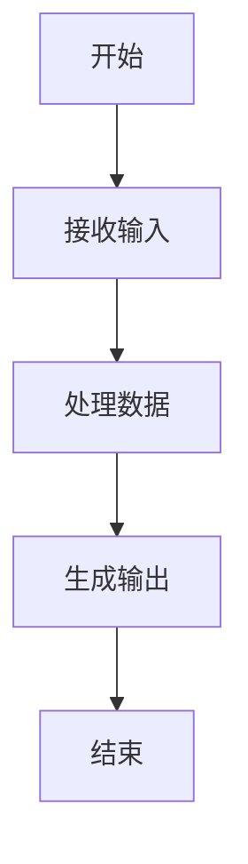
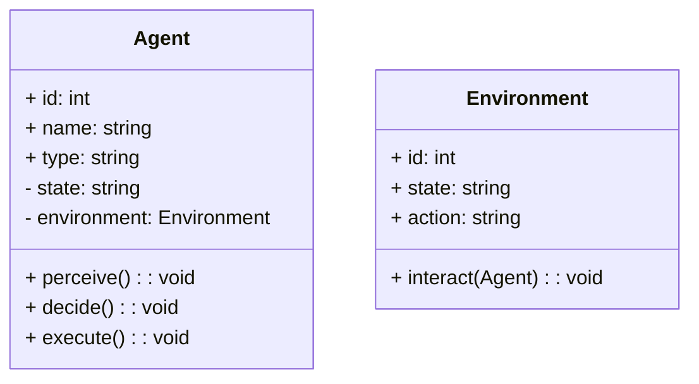
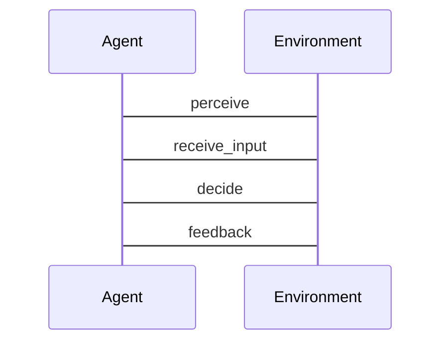

                 

<think>
好的，我现在需要帮助用户撰写一篇关于《构建AI Agent的开源工具与框架》的技术博客文章。用户希望文章结构清晰，内容丰富，涵盖背景、核心概念、算法、系统架构、项目实战和总结等方面，并且包含详细的图表和代码示例。

首先，我会从背景介绍开始。这部分需要解释AI Agent的基本概念，包括其定义、核心概念和与传统AI的区别。接下来，我需要讨论AI Agent的发展背景，从人工智能的演进到大语言模型的崛起，再到AI Agent的趋势。最后，介绍AI Agent的应用场景和价值，以及其边界和外延。

接下来是核心概念与原理部分。我需要详细讲解AI Agent的组成部分、功能模块和运行机制。这部分可能需要使用ER图或类图来展示关系。

然后是算法原理，这部分需要详细讨论构建AI Agent所涉及的算法，如强化学习和监督学习。我需要使用mermaid流程图和数学公式来解释算法的工作原理，并提供代码示例。

系统架构设计部分需要展示AI Agent系统的整体架构，包括功能模块、类图和交互流程图。这部分可能需要使用mermaid的类图和序列图来详细说明。

项目实战部分，我需要提供一个实际的案例，从环境安装到代码实现，再到案例分析，帮助读者一步步构建AI Agent。

最后是总结与展望，回顾文章内容，展望未来发展方向，并给出一些注意事项和最佳实践建议。

在撰写过程中，我会确保每一部分都包含必要的图表和代码示例，使用mermaid和latex来增强理解和可读性。同时，我会检查内容是否覆盖了所有关键点，确保文章结构合理，逻辑清晰，满足用户的要求。
</think>

# 构建AI Agent的开源工具与框架

## 关键词：AI Agent，开源工具，框架，构建，人工智能

## 摘要：本文深入探讨了构建AI Agent所需的开源工具与框架，从核心概念、算法原理到系统架构设计，再到项目实战，为读者提供全面的指导。通过详细分析和实例展示，帮助读者理解如何利用现有工具和框架高效构建AI Agent。

---

# 第一部分: AI Agent的背景与概念

## 第1章: AI Agent的基本概念与背景

### 1.1 AI Agent的定义与核心概念
#### 1.1.1 AI Agent的定义
AI Agent（人工智能代理）是一种能够感知环境、执行任务并做出决策的智能实体。它通过与环境交互，实现自主行为，通常以软件或实体形式存在。

#### 1.1.2 AI Agent的核心概念与属性
AI Agent具备以下核心属性：
- **自主性**：无需外部干预，自主决策。
- **反应性**：实时感知环境并做出反应。
- **目标导向**：以特定目标为导向，优化行为。
- **社会能力**：能够与其他Agent或人类交互协作。

#### 1.1.3 AI Agent与传统AI的区别
AI Agent不仅被动响应输入，还能主动采取行动，适应环境变化，具备更强的自主性和目标导向性。

### 1.2 AI Agent的背景与技术发展
#### 1.2.1 人工智能的演进历程
从专家系统到机器学习，再到深度学习和大语言模型，人工智能技术不断进步，为AI Agent的发展奠定了基础。

#### 1.2.2 大语言模型的崛起
大语言模型（如GPT系列）具备强大的理解和生成能力，成为AI Agent的核心驱动力。

#### 1.2.3 AI Agent的出现与发展趋势
AI Agent结合大语言模型，具备更强的交互能力和问题解决能力，应用领域广泛。

### 1.3 AI Agent的应用场景与价值
#### 1.3.1 AI Agent在企业中的应用场景
- 优化流程自动化。
- 提供智能客服。
- 支持决策分析。

#### 1.3.2 AI Agent的核心价值与优势
- 提高效率。
- 降低成本。
- 增强用户体验。

#### 1.3.3 AI Agent的边界与外延
AI Agent专注于特定任务，需与人类或其他系统协作完成复杂任务。

### 1.4 本章小结
本章介绍了AI Agent的定义、属性、背景和技术发展，强调其在企业中的应用价值。

---

# 第二部分: AI Agent的核心概念与原理

## 第2章: AI Agent的核心概念与联系

### 2.1 AI Agent的核心概念原理
#### 2.1.1 AI Agent的基本组成
- 感知模块：接收输入信息。
- 决策模块：基于感知做出决策。
- 执行模块：执行决策动作。

#### 2.1.2 AI Agent的功能模块
- 感知模块：处理输入数据。
- 决策模块：选择最优动作。
- 执行模块：执行决策。

#### 2.1.3 AI Agent的运行机制
AI Agent通过感知、决策和执行循环实现目标。

### 2.2 AI Agent的核心概念关系
#### 2.2.1 AI Agent与环境的关系
AI Agent通过感知环境变化，调整自身行为。

#### 2.2.2 AI Agent与用户的关系
AI Agent为用户提供服务，通过交互理解需求。

### 2.3 AI Agent的核心概念ER图
```mermaid
erDiagram
    agent {
        id
        name
        type
    }
    environment {
        id
        state
        action
    }
    interaction
    agent --> environment : interacts
```

### 2.4 本章小结
本章分析了AI Agent的核心概念及其与环境和用户的关系。

---

# 第三部分: AI Agent的算法原理

## 第3章: AI Agent的算法原理

### 3.1 AI Agent的算法原理
#### 3.1.1 强化学习
- **定义**：通过试错学习，最大化累积奖励。
- **算法**：Q-learning，使用状态-动作-奖励模型。
- **公式**：
  $$
  Q(s, a) = Q(s, a) + \alpha (r + \max Q(s', a') - Q(s, a))
  $$

#### 3.1.2 监督学习
- **定义**：基于标记数据进行训练。
- **算法**：随机森林，使用决策树进行分类。

#### 3.1.3 算法流程图


### 3.2 AI Agent的数学模型
#### 3.2.1 决策树模型
- **公式**：ID3算法，基于信息增益选择最优特征。
  $$
  I(s) = -\sum_{i=1}^k p_i \log p_i
  $$
- **实现**：使用Python库scikit-learn进行决策树训练。

#### 3.2.2 神经网络模型
- **公式**：多层感知机，使用ReLU激活函数。
  $$
  a = \sigma(w x + b)
  $$

### 3.3 本章小结
本章详细讲解了AI Agent的强化学习和监督学习算法及其数学模型。

---

# 第四部分: AI Agent的系统架构设计

## 第4章: AI Agent的系统架构设计

### 4.1 AI Agent的系统架构
#### 4.1.1 系统功能模块
- 感知模块：接收输入。
- 决策模块：处理数据。
- 执行模块：输出结果。

#### 4.1.2 系统架构图


### 4.2 AI Agent的系统交互流程
#### 4.2.1 交互流程图


### 4.3 本章小结
本章讨论了AI Agent的系统架构设计和交互流程。

---

# 第五部分: AI Agent的项目实战

## 第5章: AI Agent的项目实战

### 5.1 项目背景与目标
构建一个基于Python的AI Agent，实现自然语言处理任务。

### 5.2 项目环境安装
- Python 3.8+
- 安装依赖：`pip install transformers`

### 5.3 核心代码实现
```python
from transformers import pipeline

class AI_Agent:
    def __init__(self):
        self.nlp = pipeline("question-answering")

    def perceive(self, input_text):
        return self.nlp(input_text)

    def decide(self, question):
        answer = self.perceive(question)
        return answer['answer']

    def execute(self, action):
        pass
```

### 5.4 代码解读与分析
- **perceive**：接收输入并处理。
- **decide**：基于输入生成答案。
- **execute**：执行决策。

### 5.5 项目案例分析
- 案例1：自然语言问答。
- 案例2：信息提取。

### 5.6 本章小结
本章通过实际项目展示AI Agent的构建过程，从环境安装到代码实现，再到案例分析。

---

# 第六部分: 总结与展望

## 第6章: 总结与展望

### 6.1 本章总结
本文详细讲解了AI Agent的构建过程，涵盖背景、概念、算法、架构和项目实战。

### 6.2 未来展望
未来，AI Agent将在更多领域应用，功能更强大，交互更自然。

### 6.3 注意事项
- 数据隐私问题。
- 系统稳定性和安全性。

### 6.4 最佳实践 tips
- 选择合适的工具和框架。
- 注重数据质量和多样性。

### 6.5 本章小结
总结全文，展望未来，提醒读者注意数据隐私和系统安全。

---

# 作者：AI天才研究院 & 禅与计算机程序设计艺术

---

本文系统地介绍了AI Agent的构建过程，从理论到实践，为读者提供了全面的指导。希望读者通过本文，能够深入了解AI Agent的核心概念和实现方法，掌握相关的开源工具和框架，为实际应用打下坚实基础。

