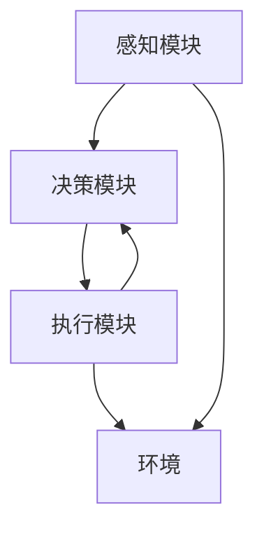
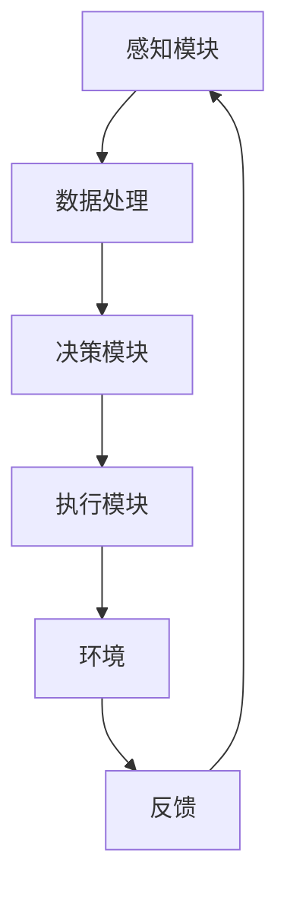
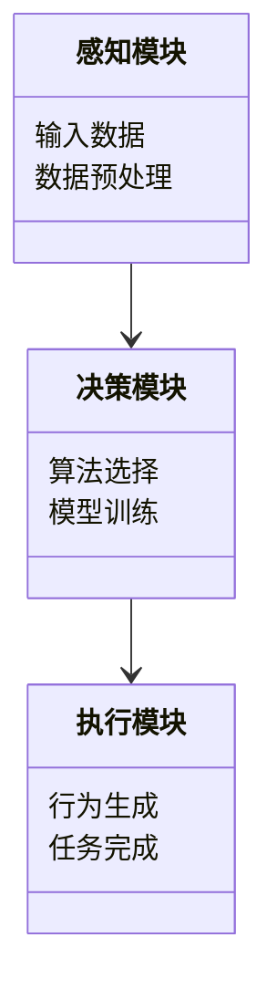

                 


# 《构建AI Agent的技术栈选择指南》

---

## 关键词：
AI Agent, 技术栈选择, 系统架构设计, 项目实战, 最佳实践

---

## 摘要：
构建AI Agent是一项复杂的任务，涉及多学科知识和多种技术的综合应用。本文将从AI Agent的核心概念出发，逐步分析技术栈选择的策略与方法，深入探讨系统架构设计的要点，并通过具体案例展示如何从零到一构建一个完整的AI Agent。文章内容涵盖技术背景、核心原理、系统设计、项目实现以及最佳实践，旨在为读者提供一套系统化的技术栈选择指南，帮助他们在实际项目中做出明智的技术决策。

---

## 正文：

---

# 第一部分: 引言

## 第1章: AI Agent概述

### 1.1 AI Agent的基本概念
AI Agent（人工智能代理）是一种能够感知环境、自主决策并执行任务的智能实体。它通过传感器获取环境信息，利用推理能力分析信息，最终做出行动决策以实现目标。

- **AI Agent的核心特征**：
  - 自主性：能够自主决策，无需外部干预。
  - 反应性：能够实时感知环境并做出反应。
  - 目标导向：所有行动都围绕实现特定目标展开。
  - 社交能力：能够与其他系统或人类进行交互。

- **AI Agent的应用场景**：
  - 智能助手（如 Siri、Alexa）。
  - 自动驾驶系统。
  - 机器人控制。
  - 游戏AI。

---

### 1.2 构建AI Agent的必要性
随着AI技术的快速发展，AI Agent在企业中的价值日益凸显。它能够提高效率、降低成本，并为企业创造新的竞争优势。

- **当前AI技术的发展趋势**：
  - 深度学习的普及。
  - 强化学习的崛起。
  - 自然语言处理的进步。
- **AI Agent在企业中的价值**：
  - 提高业务流程自动化水平。
  - 优化资源分配。
  - 提升用户体验。
- **构建AI Agent的挑战与机遇**：
  - 技术复杂性高。
  - 数据依赖性强。
  - 市场需求旺盛。

---

### 1.3 本书的目的与结构
本书旨在为读者提供一套系统化的技术栈选择指南，帮助他们在构建AI Agent时做出明智的决策。

- **本书的目标**：
  - 帮助读者理解AI Agent的核心概念。
  - 提供技术栈选择的策略与方法。
  - 指导读者从零到一构建AI Agent。
- **本书的结构安排**：
  - 引言：介绍AI Agent的基本概念和构建必要性。
  - 技术栈选择：详细分析AI Agent的核心技术及其选择策略。
  - 系统设计：探讨AI Agent的系统架构和实现细节。
  - 项目实战：通过具体案例展示AI Agent的构建过程。
  - 最佳实践：总结技术选型的经验与注意事项。

---

## 第2章: AI Agent的技术栈选择背景

### 2.1 问题背景
构建AI Agent需要选择合适的技术栈，以满足功能需求和性能要求。

- **AI Agent的核心问题**：
  - 如何实现感知与决策？
  - 如何保证系统的实时性和可靠性？
  - 如何处理复杂环境中的不确定性？
- **技术栈选择的复杂性**：
  - 需要考虑算法、编程语言、框架、工具和云服务。
  - 不同场景下的技术要求不同。

---

### 2.2 问题描述
AI Agent的技术栈选择需要考虑多个因素。

- **AI Agent的功能需求**：
  - 感知能力：通过传感器获取环境信息。
  - 决策能力：基于感知信息做出决策。
  - 执行能力：通过执行器与环境交互。
- **技术栈选择的关键因素**：
  - 算法的复杂性。
  - 数据的处理能力。
  - 系统的可扩展性。

---

### 2.3 问题解决
通过分析不同技术的优劣势，制定技术栈选择的策略。

- **技术栈选择的策略**：
  - 确定需求：明确AI Agent的功能需求。
  - 选择算法：根据需求选择合适的算法。
  - 选择框架：基于算法选择合适的框架。
  - 选择工具：根据框架选择合适的开发工具。
  - 选择云服务：根据需求选择合适的云服务。

---

### 2.4 边界与外延
明确AI Agent的边界，避免技术选型的误区。

- **AI Agent的边界**：
  - 仅关注感知与决策，不涉及执行器。
  - 不处理物理世界的交互，仅处理数字世界的数据。
- **相关技术的对比**：
  - AI Agent与传统软件的区别。
  - AI Agent与机器人控制的区别。

---

### 2.5 概念结构与核心要素
构建AI Agent需要关注的核心要素。

- **AI Agent的核心要素**：
  - 感知模块：负责获取环境信息。
  - 决策模块：负责分析信息并做出决策。
  - 执行模块：负责执行决策。
- **技术栈的核心组件**：
  - 数据处理框架：如 TensorFlow、PyTorch。
  - 算法库：如 Scikit-learn、Keras。
  - 开发工具：如 VS Code、PyCharm。

---

## 第3章: AI Agent的核心概念与联系

### 3.1 AI Agent的核心概念原理
AI Agent的核心概念包括感知、决策和执行。

- **感知模块**：
  - 通过传感器获取环境信息。
  - 使用数据处理技术对信息进行预处理。
- **决策模块**：
  - 基于感知信息，通过算法做出决策。
  - 使用强化学习或监督学习进行训练。
- **执行模块**：
  - 根据决策结果，通过执行器与环境交互。
  - 支持多轮交互，直到任务完成。

---

### 3.2 AI Agent的核心概念特征对比

| **概念**      | **特征**                              |
|----------------|--------------------------------------|
| 感知模块       | 数据采集、信息处理                   |
| 决策模块       | 算法选择、模型训练                   |
| 执行模块       | 行为生成、结果反馈                   |
| 系统架构       | 模块化设计、高可用性                 |
| 技术栈选择     | 算法优先、框架适配                   |

---

### 3.3 AI Agent的系统架构设计



---

## 第4章: AI Agent的技术原理

### 4.1 AI Agent的算法原理
AI Agent的算法选择直接影响系统的性能。

- **监督学习**：
  - 通过标记数据训练模型。
  - 常见算法：随机森林、支持向量机。
- **无监督学习**：
  - 通过数据聚类或降维。
  - 常见算法：K-means、t-SNE。
- **强化学习**：
  - 通过奖励机制优化决策。
  - 常见算法：Q-Learning、Deep Q-Network。

---

### 4.2 AI Agent的系统架构



---

## 第5章: AI Agent的系统设计

### 5.1 系统功能设计
AI Agent的功能模块包括感知、决策和执行。

- **感知模块**：
  - 传感器数据采集。
  - 数据预处理。
- **决策模块**：
  - 算法选择。
  - 模型训练。
- **执行模块**：
  - 行为生成。
  - 任务完成。

---

### 5.2 系统架构设计



---

## 第6章: AI Agent的项目实战

### 6.1 环境搭建
AI Agent的开发需要搭建合适的环境。

- **编程语言**：
  - Python：主流的AI开发语言。
  - Java：适合企业级开发。
- **框架选择**：
  - TensorFlow：深度学习框架。
  - PyTorch：动态计算图框架。
- **工具安装**：
  - Anaconda：虚拟环境管理工具。
  - Jupyter：开发与调试工具。

---

### 6.2 系统核心实现

```python
import numpy as np
from sklearn import tree

# 感知模块
def感知数据():
    return np.random.rand(100, 2)

# 决策模块
def决策模型():
    clf = tree.DecisionTreeClassifier()
    return clf

# 执行模块
def执行动作(决策结果):
    return "完成任务"
```

---

## 第7章: AI Agent的最佳实践

### 7.1 技术选型注意事项
AI Agent的技术选型需要综合考虑多个因素。

- **算法选择**：
  - 根据任务需求选择合适的算法。
  - 考虑算法的计算复杂度。
- **框架选择**：
  - 根据团队熟悉度选择框架。
  - 考虑框架的社区支持。

---

### 7.2 性能优化技巧
AI Agent的性能优化需要从多个方面入手。

- **数据优化**：
  - 数据清洗。
  - 数据增强。
- **模型优化**：
  - 调参。
  - 使用早停法。

---

## 附录

### 附录A: AI Agent相关工具列表
| **工具名称** | **功能描述**           |
|--------------|-----------------------|
| TensorFlow   | 深度学习框架           |
| PyTorch      | 动态计算图框架           |
| Scikit-learn | 机器学习工具包         |
| Keras        | 高度灵活的神经网络库     |

---

## 作者信息

作者：AI天才研究院/AI Genius Institute & 禅与计算机程序设计艺术 /Zen And The Art of Computer Programming

--- 

**说明**：以上为《构建AI Agent的技术栈选择指南》的文章大纲和部分内容。完整文章将按照上述结构展开，每个部分均包含详细的讲解和案例分析。

