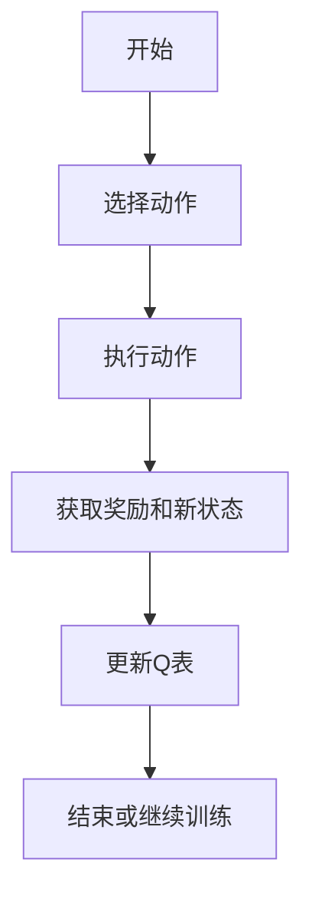
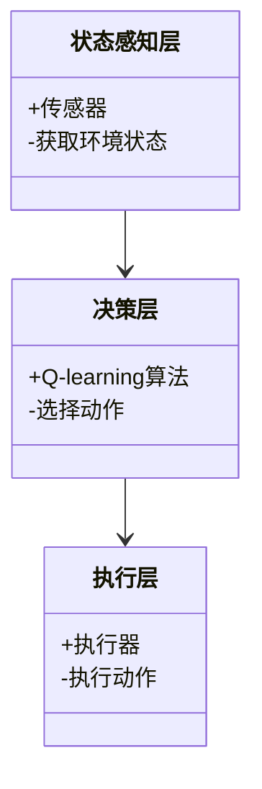
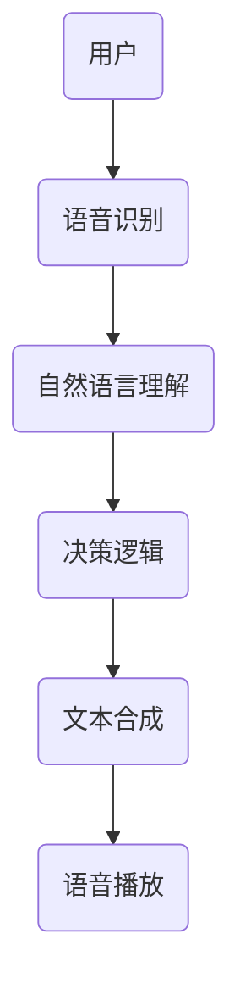

                 

<think>
好，我现在需要帮助用户撰写一篇关于“构建AI Agent的技术栈选择：权衡与决策”的技术博客文章。用户已经给出了一个详细的目录大纲，我需要根据这个大纲逐步完成每一部分的内容。

首先，我需要理解整个文章的结构。文章分为五个主要部分：背景与基础、技术栈选择、核心算法原理、系统架构设计、项目实战。每个部分下又有多个章节，每个章节还有小节。我的任务是按照这个结构，逐步填充内容，确保每一部分都详细且符合技术博客的专业性要求。

我首先从第1章开始，介绍AI Agent的基本概念和背景。这里需要定义什么是AI Agent，它的特点，以及它与传统软件的区别。同时，还要讨论AI Agent的应用场景和分类，为后续的技术栈选择打下基础。

接下来是第2章，详细分析技术栈的选择。这里需要比较不同技术栈的特点、优缺点，以及如何根据项目需求进行选择。可能需要列出一些常用的技术栈，并进行对比分析。

第3章是关于AI Agent的核心算法原理，需要详细讲解几种关键算法，如强化学习和监督学习，并用mermaid流程图和数学公式来辅助说明。这部分需要确保读者能够理解算法的工作原理以及它们在AI Agent中的应用。

第4章讨论系统架构设计，包括分层架构、微服务架构和混合架构。需要画出系统的架构图，并解释每种架构的优缺点以及适用场景。

最后是第5章，通过一个具体的项目实战来展示如何构建AI Agent。这包括环境安装、代码实现、案例分析等，帮助读者将理论应用到实践中。

在整个写作过程中，我需要确保每一部分都包含足够的细节，比如公式、图表、代码示例等，以增强文章的可读性和专业性。同时，要注意语言的逻辑性和连贯性，确保读者能够轻松理解内容。

在撰写过程中，可能会遇到一些挑战，比如如何用简单易懂的语言解释复杂的算法，或者如何选择合适的图表来辅助说明。我需要反复检查和调整，确保每个部分都达到最佳效果。

总的来说，我会按照用户提供的大纲，逐步完成每一部分的内容，确保文章结构清晰、内容详实，并符合技术博客的专业要求。这将是一个系统而详细的过程，需要耐心和细致的工作。
</think>

# 构建AI Agent的技术栈选择：权衡与决策

## 关键词：AI Agent，技术栈，权衡，决策，算法，系统架构

## 摘要：本文将详细探讨构建AI Agent过程中技术栈的选择策略。从AI Agent的基本概念和应用场景出发，分析不同技术栈的特点和优缺点，结合实际案例和系统架构设计，帮助读者做出明智的技术决策。

---

# 第一部分: AI Agent技术栈选择的背景与基础

## 第1章: AI Agent的基本概念与背景

### 1.1 AI Agent的定义与特点

AI Agent（人工智能代理）是一种能够感知环境、执行任务并做出决策的智能实体。它通过传感器获取信息，利用推理能力解决问题，并通过执行器与环境交互。AI Agent的特点包括：

- **自主性**：能够在没有外部干预的情况下运行。
- **反应性**：能够实时感知环境并做出响应。
- **目标导向**：以实现特定目标为导向进行决策。
- **学习能力**：能够通过经验改进性能。

### 1.2 AI Agent的应用场景

AI Agent广泛应用于多个领域，包括：

- **智能助手**：如Siri、Alexa等，提供语音交互服务。
- **企业自动化**：用于流程自动化、任务调度等场景。
- **游戏AI**：在游戏开发中用于智能NPC的行为决策。

### 1.3 AI Agent的分类与技术栈概览

AI Agent可以分为三类：

1. **基于规则的AI Agent**：通过预定义的规则进行决策，适用于简单任务。
2. **基于模型的AI Agent**：利用知识库或模型进行推理，适用于复杂任务。
3. **基于机器学习的AI Agent**：通过机器学习算法学习策略，适用于动态环境。

---

## 第2章: AI Agent技术栈的选择与权衡

### 2.1 技术栈选择的核心要素

选择AI Agent技术栈时需要考虑以下因素：

1. **模型选择**：选择适合任务的模型，如强化学习、监督学习等。
2. **开发框架**：选择高效的框架，如TensorFlow、PyTorch等。
3. **数据处理与存储**：选择合适的数据处理方式和存储方案。
4. **推理引擎**：选择高效的推理引擎以优化性能。

### 2.2 技术栈对比分析

以下是对几种常见技术栈的对比分析：

| 技术栈 | 优点 | 缺点 |
|--------|------|------|
| 基于规则的AI Agent | 实现简单，适合任务明确 | 难以应对复杂场景 |
| 基于模型的AI Agent | 能够处理复杂问题 | 开发复杂度高 |
| 基于机器学习的AI Agent | 适应性强，适合动态环境 | 需大量数据和计算资源 |

### 2.3 技术栈选择的优缺点分析

- **基于规则的AI Agent**：适用于简单任务，开发成本低，但难以扩展。
- **基于模型的AI Agent**：能够处理复杂问题，但开发难度大。
- **基于机器学习的AI Agent**：适应性强，但需要大量数据和计算资源。

---

## 第3章: AI Agent的核心算法原理

### 3.1 强化学习算法

强化学习是一种通过试错学习的方法，适用于需要与环境交互的任务。

#### 3.1.1 Q-learning算法

Q-learning是一种经典的强化学习算法，通过Q表记录状态-动作的值，并通过策略迭代更新Q表。

**公式**：
$$ Q(s, a) = Q(s, a) + \alpha (r + \max Q(s', a') - Q(s, a)) $$

**流程图**：



### 3.2 监督学习算法

监督学习通过标记数据训练模型，适用于分类和回归任务。

#### 3.2.1 分类任务中的监督学习

- **逻辑回归**：用于二分类任务。
- **支持向量机（SVM）**：适用于高维数据分类。

### 3.3 联合概率图模型

联合概率图模型通过概率推理进行决策，适用于不确定性问题。

#### 3.3.1 马尔可夫决策过程

马尔可夫决策过程（MDP）将环境建模为状态、动作、奖励和转移概率的组合。

**公式**：
$$ V(s) = \max_{a} \sum_{s'} P(s'|s,a) V(s') + r(s,a) $$

---

## 第4章: AI Agent的系统架构设计

### 4.1 系统架构概述

AI Agent的系统架构设计需要考虑功能模块的划分和接口设计。

#### 4.1.1 分层架构

分层架构将系统划分为感知层、决策层和执行层。

**类图**：



### 4.2 系统功能设计

系统功能设计需要明确领域模型和功能模块划分。

#### 4.2.1 领域模型设计

领域模型描述系统的业务逻辑和数据关系。

**领域模型图**：



---

## 第5章: AI Agent的项目实战

### 5.1 项目环境

#### 5.1.1 环境安装

安装所需的开发框架和工具，例如：

- Python 3.8+
- TensorFlow/PyTorch
- OpenAI API

#### 5.1.2 核心实现

以下是基于强化学习的AI Agent代码示例：

```python
import numpy as np
import gym

# 初始化环境
env = gym.make('CartPole-v1')
env.seed(42)

# 超参数
alpha = 0.01
gamma = 0.99

# 初始化Q表
Q = np.zeros([env.observation_space.shape[0], env.action_space.n])

# Q-learning算法
def qlearning(env, alpha, gamma, episodes=1000):
    for episode in range(episodes):
        state = env.reset()
        for _ in range(1000):
            # 选择动作
            action = np.argmax(Q[state])
            # 执行动作
            next_state, reward, done, _ = env.step(action)
            # 更新Q表
            Q[state][action] += alpha * (reward + gamma * np.max(Q[next_state]) - Q[state][action])
            state = next_state
            if done:
                break

# 训练模型
qlearning(env, alpha, gamma)
```

---

## 第6章: 总结与展望

### 6.1 总结

构建AI Agent需要综合考虑技术栈的选择、算法的实现和系统的架构设计。通过权衡不同技术栈的优缺点，结合实际项目需求，做出最优选择。

### 6.2 注意事项

- 确保数据质量和多样性。
- 选择合适的开发框架和工具。
- 优化算法性能，减少计算成本。

### 6.3 拓展阅读

- 《强化学习：算法与应用》
- 《机器学习实战》
- 《深度学习》

---

# 作者：AI天才研究院 & 禅与计算机程序设计艺术

