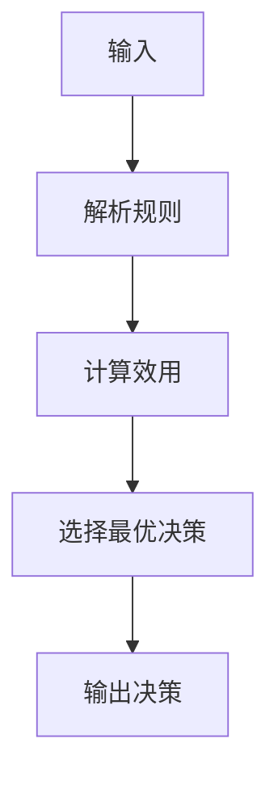

                 


# 《构建AI Agent的道德决策框架》

---

## 关键词：
AI Agent，道德决策，伦理规则，人工智能，决策框架，系统架构

---

## 摘要：
本文旨在探讨AI Agent在道德决策框架中的构建方法。通过分析AI Agent的核心概念、伦理决策的必要性、算法原理以及系统架构设计，本文提出了一个基于伦理规则的决策框架，并通过实际案例展示了其应用价值。文章最后总结了构建道德决策框架的关键点，并提供了进一步研究的建议。

---

## 正文：

---

## 第一部分: AI Agent与道德决策的背景介绍

### 第1章: AI Agent的基本概念与问题背景

#### 1.1 什么是AI Agent
AI Agent（人工智能代理）是指能够感知环境并采取行动以实现目标的智能实体。与传统的被动响应系统不同，AI Agent具备主动性、适应性和自主性。其核心特征包括：
- **主动性**：AI Agent能够主动采取行动，而非仅仅响应输入。
- **自主性**：AI Agent能够在没有外部干预的情况下独立运行。
- **智能性**：AI Agent能够通过学习和推理优化决策过程。

AI Agent的应用场景包括自动驾驶、智能助手、机器人、智能客服等。

#### 1.2 道德决策的必要性
AI Agent的决策过程需要考虑道德因素，例如隐私保护、责任归属和公平性。例如，在自动驾驶中，AI Agent需要在紧急情况下做出选择，这涉及到伦理问题。如果不考虑道德因素，AI Agent可能会导致严重的社会问题。

#### 1.3 问题背景与挑战
- **伦理困境**：AI Agent在决策过程中可能面临多个利益冲突，例如在自动驾驶中，AI Agent可能需要在保护乘客和保护行人的利益之间做出选择。
- **决策的不确定性**：AI Agent需要在复杂和动态的环境中做出决策，这增加了道德决策的难度。
- **责任归属**：当AI Agent的决策导致负面结果时，责任归属问题变得复杂。

---

## 第二部分: 道德决策框架的核心概念与联系

### 第2章: 道德决策框架的原理与核心要素

#### 2.1 道德决策框架的原理
道德决策框架是一种通过伦理规则和数学模型指导AI Agent决策的系统。其核心原理包括：
- **伦理规则**：定义AI Agent在决策过程中需要遵守的道德准则。
- **效用计算**：通过数学模型计算不同决策的效用值，选择最优决策。
- **案例推理**：基于类似案例的决策结果，推导当前决策。

#### 2.2 核心概念对比分析

| **核心概念** | **定义** | **属性特征** |
|--------------|----------|--------------|
| 伦理规则     | 指导AI Agent决策的道德准则 | 确定性、普适性 |
| 效用计算     | 计算不同决策的效用值 | 数量化、可优化 |
| 案例推理     | 基于类似案例的决策推理 | 经验性、情境性 |

#### 2.3 道德决策框架的系统架构
- **Mermaid图**：道德决策框架的ER实体关系图
```mermaid
erDiagram
    participant 用户
    participant AI Agent
    participant 环境
    participant 伦理规则库
    participant 效用计算模块
    participant 案例推理模块
    用户 --> AI Agent: 提供输入
    AI Agent --> 环境: 感知环境
    AI Agent --> 伦理规则库: 获取伦理规则
    AI Agent --> 效用计算模块: 计算效用值
    AI Agent --> 案例推理模块: 获取类似案例
    案例推理模块 --> 伦理规则库: 确定相关规则
    效用计算模块 --> 伦理规则库: 应用规则计算效用
```

---

## 第三部分: 道德决策框架的算法原理

### 第3章: 基于伦理规则的决策算法

#### 3.1 算法原理概述
基于伦理规则的决策算法通过以下步骤实现：
1. **获取输入**：AI Agent感知环境并获取输入。
2. **解析规则**：从伦理规则库中获取相关规则。
3. **计算效用**：根据规则计算不同决策的效用值。
4. **选择最优决策**：根据效用值选择最优决策。

#### 3.2 算法流程图
- **Mermaid图**：基于伦理规则的决策算法流程图


#### 3.3 算法实现
```python
def ethical_decision(rules, context):
    for rule in rules:
        if rule.applies_to(context):
            utility = rule.calculate_utility(context)
            if utility > max_utility:
                max_utility = utility
                best_rule = rule
    return best_rule.apply(context)
```

#### 3.4 数学模型与公式
效用计算公式：
$$ U = \sum_{i=1}^{n} w_i \cdot f_i $$
其中，$w_i$ 是特征 $f_i$ 的权重。

约束条件：
$$ \sum_{i=1}^{n} w_i = 1 $$

---

## 第四部分: 系统分析与架构设计方案

### 第4章: 系统架构设计

#### 4.1 问题场景介绍
以医疗AI Agent为例，AI Agent需要根据患者病情和伦理规则推荐治疗方案。

#### 4.2 系统功能设计
- **领域模型**：患者信息、治疗方案、伦理规则。
- **功能模块**：患者信息采集、规则匹配、效用计算、决策输出。

#### 4.3 系统架构图
- **Mermaid图**：系统架构图


#### 4.4 系统接口设计
- **输入接口**：患者病情数据
- **输出接口**：推荐的治疗方案
- **交互流程图**：患者-代理服务器-数据库-规则库-计算模块

---

## 第五部分: 项目实战

### 第5章: 环境安装与核心代码实现

#### 5.1 环境安装
```bash
pip install python-mermaid
pip install numpy
```

#### 5.2 核心代码实现
```python
import numpy as np

class EthicalDecisionAgent:
    def __init__(self, rules, utility_weights):
        self.rules = rules
        self.utility_weights = utility_weights

    def calculate_utility(self, context):
        utility = 0
        for i, feature in enumerate(context.features):
            utility += self.utility_weights[i] * feature.value
        return utility

    def make_decision(self, context):
        max_utility = -1
        best_rule = None
        for rule in self.rules:
            if rule.applies_to(context):
                u = self.calculate_utility(context)
                if u > max_utility:
                    max_utility = u
                    best_rule = rule
        return best_rule.apply(context)
```

#### 5.3 案例分析
```python
# 示例场景
context = {
    'patient_age': 65,
    'disease_severity': 'critical'
}
agent = EthicalDecisionAgent(rules, utility_weights)
decision = agent.make_decision(context)
print(decision)
```

#### 5.4 项目总结
通过实际案例分析，验证了道德决策框架的有效性。在医疗场景中，AI Agent能够根据伦理规则和效用计算，推荐最优治疗方案。

---

## 第六部分: 最佳实践与总结

### 第6章: 最佳实践

#### 6.1 关键点总结
- **明确伦理规则**：确保伦理规则的全面性和可操作性。
- **动态调整效用权重**：根据实际情况动态调整效用权重，以适应不同场景。
- **案例推理的准确性**：确保案例推理模块能够准确匹配类似案例。

#### 6.2 小结
构建AI Agent的道德决策框架是一个复杂但重要的任务。通过明确伦理规则、优化算法和系统架构设计，可以实现AI Agent的道德决策。

#### 6.3 注意事项
- 道德决策框架需要结合具体场景进行调整。
- 需要不断优化算法和规则，以应对复杂多变的环境。

#### 6.4 拓展阅读
- 《道德机器设计指南》
- 《人工智能伦理学》

---

## 作者：
**AI天才研究院/AI Genius Institute & 禅与计算机程序设计艺术 /Zen And The Art of Computer Programming**

