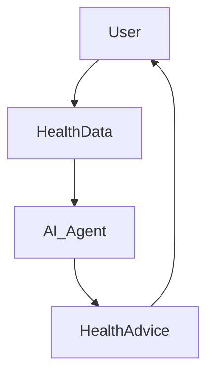
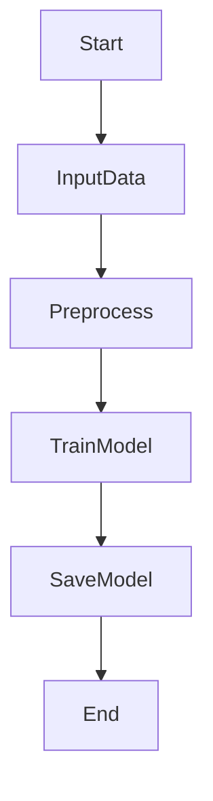
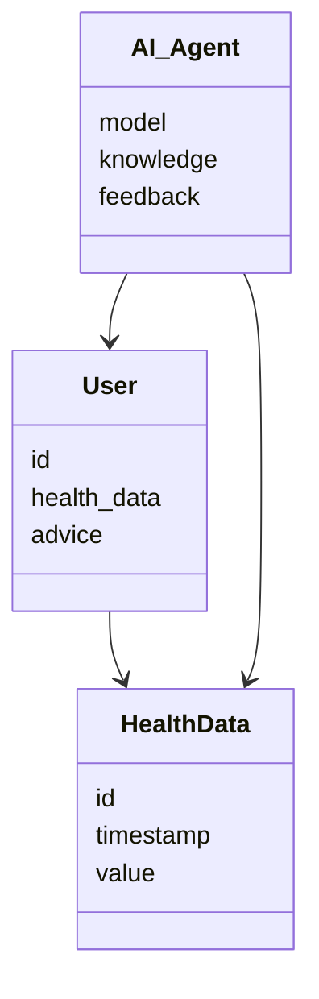
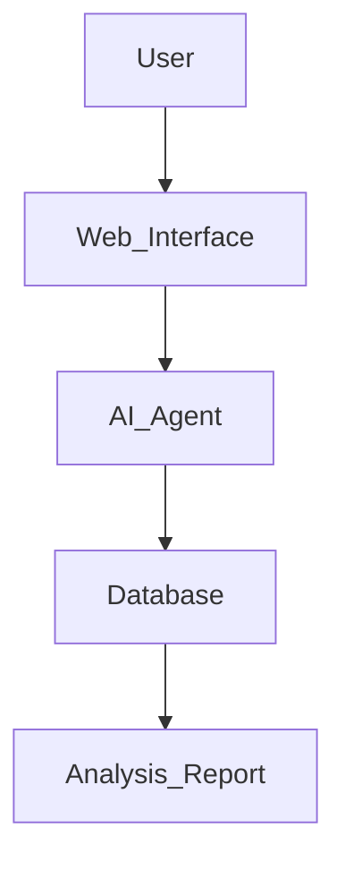
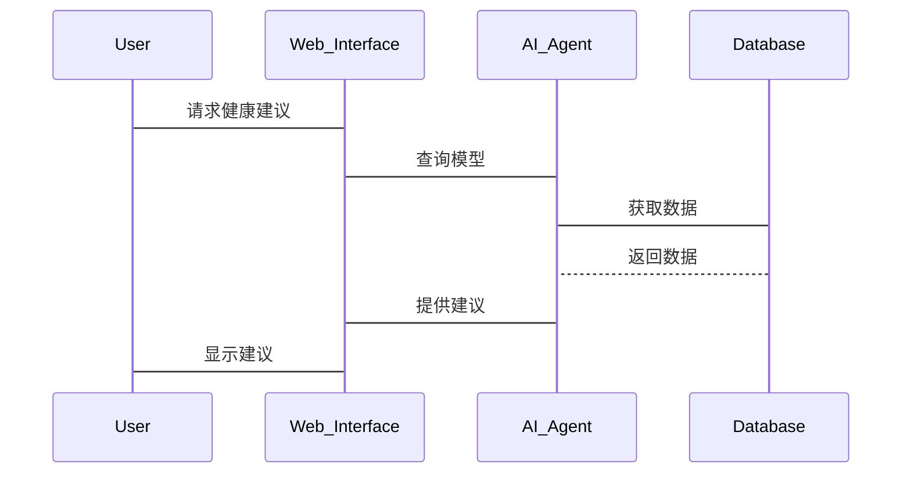

                 

<think>
嗯，我现在需要帮用户设计一本名为《构建AI Agent驱动的智能健康管理系统》的目录大纲。首先，我得理解这本书的主题。AI Agent驱动的智能健康管理系统，听起来像是结合人工智能代理来管理健康数据和提供健康建议的系统。

用户要求目录大纲要详细且逻辑清晰，覆盖从背景到系统架构、项目实战等各个方面。我得确保每个部分都包含必要的章节，比如背景介绍、核心概念、算法原理、系统架构、项目实战以及最佳实践等。

首先，背景介绍部分应该包括问题背景、问题描述、解决方案、边界和外延，以及概念结构。这部分需要让读者了解为什么需要这样的系统，它的应用场景和局限性。

接下来是核心概念与联系。这里需要详细解释AI Agent和智能健康管理系统的核心原理，可能还需要对比分析不同概念的特征，用表格展示。此外，ER实体关系图和领域模型类图也是必要的，帮助读者理解系统的结构。

然后是算法原理讲解。这部分需要使用Mermaid流程图来展示算法的工作流程，同时提供Python源代码，详细阐述数学模型和公式。例如，强化学习或监督学习的数学模型，用Latex公式表示，并结合实际例子进行说明，让读者更容易理解。

系统分析与架构设计方案部分，需要介绍问题场景，设计项目，然后用Mermaid类图展示领域模型，系统架构图展示整体架构，接口设计和交互流程图展示系统如何运作。这部分帮助读者理解系统的构建过程。

项目实战部分，应该包括环境安装、核心代码实现、代码解读、案例分析和项目总结。这部分需要具体的操作步骤和代码示例，让读者能够实际操作。

最后是最佳实践、小结、注意事项和拓展阅读。这部分提供实际应用中的经验和建议，帮助读者更好地应用所学知识。

在设计目录时，我需要确保每个章节都有足够的细节，但又不冗长。例如，第一章介绍背景，第二章讲解核心概念，第三章深入算法，第四章分析系统架构，第五章项目实战，第六章讨论优化和挑战，第七章总结。

每个章节下要有子章节，细化到三级目录。例如，背景介绍下可以有1.1问题背景，1.2概念，1.3解决方案，1.4边界，1.5结构。核心概念部分要有2.1原理，2.2对比表格，2.3实体关系图，2.4类图，2.5小结。

算法部分要有3.1概述，3.2流程图，3.3数学模型，3.4代码实现，3.5案例分析，3.6小结。系统架构部分要有4.1问题场景，4.2系统介绍，4.3功能设计，4.4架构图，4.5接口设计，4.6交互流程图，4.7小结。

项目实战部分要有5.1环境安装，5.2核心代码，5.3代码解读，5.4案例分析，5.5总结。优化与挑战部分要有6.1优化策略，6.2挑战分析，6.3伦理问题，6.4未来方向，6.5小结。

最后，总结与展望部分要有7.1回顾，7.2未来方向，7.3总结。附录部分包括代码、工具、参考文献和索引。

在编写过程中，我需要确保每个部分都符合用户的要求，比如使用Mermaid图表、Latex公式，以及详细的代码示例。同时，要保持目录的简洁性，不超过2000字，结构清晰，逻辑连贯。

可能遇到的挑战是如何将复杂的系统架构和算法原理用简明扼要的方式表达出来，同时确保每个部分都覆盖到用户指定的核心内容。我需要仔细规划每个章节的内容，确保不遗漏任何关键点，同时避免重复或冗余。

总的来说，我需要按照用户的要求，逐步构建目录，确保每个章节和子章节都符合逻辑，并且涵盖所有必要的内容。这需要细致的思考和组织，以确保最终的目录大纲既全面又简洁。
</think>

# 构建AI Agent驱动的智能健康管理系统

> 关键词：AI Agent，智能健康管理系统，健康数据分析，机器学习，系统架构设计

> 摘要：本文将详细探讨如何利用AI Agent构建智能健康管理系统，涵盖系统背景、核心概念、算法原理、系统架构设计、项目实战以及最佳实践。通过理论与实践结合，分析系统的实现路径和应用价值。

---

# 第一章：问题背景与概念介绍

## 1.1 问题背景

### 1.1.1 当前医疗健康系统的痛点
传统医疗健康系统面临数据孤岛、用户参与度低、个性化服务不足等问题。AI Agent的引入可以解决这些问题，提升用户体验和医疗效率。

### 1.1.2 问题描述
健康数据分散、用户行为难以预测、医疗资源分配不均。AI Agent通过数据整合、实时反馈和智能决策，提供个性化的健康管理方案。

### 1.1.3 解决方案
构建一个基于AI Agent的智能健康管理系统，整合多源数据，提供实时健康监测和个性化建议。

### 1.1.4 边界与外延
系统专注于个人健康管理和慢性病监测，不涉及医疗诊断和药物处方。

## 1.2 核心概念

### 1.2.1 AI Agent的定义与特点
AI Agent是能够感知环境、自主决策的智能体，具备学习、推理和自适应能力。

### 1.2.2 智能健康管理系统的核心功能
数据采集、健康评估、个性化建议、实时反馈和效果追踪。

### 1.2.3 系统的组成要素
健康数据源、AI Agent、用户界面、知识库和反馈机制。

---

# 第二章：AI Agent与智能健康管理系统的核心原理

## 2.1 核心概念原理

### 2.1.1 AI Agent的工作流程
感知环境、目标设定、决策制定、执行和反馈。

### 2.1.2 系统架构
基于事件驱动的架构，实时处理用户数据和反馈。

## 2.2 核心概念对比

| 概念       | 描述                                       |
|------------|--------------------------------------------|
| AI Agent   | 智能体，具备自主决策能力                   |
| 健康管理   | 监测和改善用户健康状态                     |
| 数据驱动   | 通过数据进行分析和决策                     |

## 2.3 实体关系图



---

# 第三章：算法原理讲解

## 3.1 算法概述

### 3.1.1 强化学习
AI Agent通过与环境交互，学习最优策略。

### 3.1.2 监督学习
基于用户数据，预测健康风险。

## 3.2 算法流程图



## 3.3 数学模型

### 3.3.1 强化学习公式
$$ Q(s, a) = r + \gamma \max_{a'} Q(s', a') $$

### 3.3.2 监督学习公式
$$ y = \theta x + b $$

## 3.4 代码实现

```python
def train_model(data):
    x = data['features']
    y = data['labels']
    model = Model()
    optimizer = Adam(learning_rate=0.001)
    model.compile(optimizer=optimizer, loss='binary_crossentropy')
    model.fit(x, y, epochs=100)
    return model
```

---

# 第四章：系统分析与架构设计方案

## 4.1 问题场景介绍

### 4.1.1 用户需求
个性化健康监测、实时反馈和健康建议。

## 4.2 系统功能设计

### 4.2.1 领域模型



## 4.3 系统架构设计

### 4.3.1 架构图



## 4.4 接口设计

### 4.4.1 API接口
RESTful API，支持数据上传、健康建议查询。

## 4.5 交互流程图



---

# 第五章：项目实战

## 5.1 环境安装

### 5.1.1 依赖管理
安装Python、TensorFlow、Flask框架。

## 5.2 核心代码实现

### 5.2.1 数据预处理

```python
import pandas as pd

def preprocess(data):
    df = pd.DataFrame(data)
    df.dropna(inplace=True)
    return df
```

### 5.2.2 模型训练

```python
def train(data):
    model = Sequential()
    model.add(Dense(64, activation='relu'))
    model.add(Dense(1, activation='sigmoid'))
    model.compile(optimizer='adam', loss='binary_crossentropy')
    model.fit(data, epochs=10)
    return model
```

## 5.3 代码解读

### 5.3.1 数据预处理函数
将数据转换为DataFrame并删除空值。

### 5.3.2 模型训练函数
构建神经网络模型并训练。

## 5.4 案例分析

### 5.4.1 数据来源
用户健康数据，包括心率、血压等。

### 5.4.2 模型输出
健康风险评估和个性化建议。

## 5.5 项目总结

### 5.5.1 成果展示
系统实现了健康数据的实时监测和个性化管理。

---

# 第六章：优化与挑战

## 6.1 优化策略

### 6.1.1 数据隐私保护
采用加密技术确保用户数据安全。

### 6.1.2 模型更新
定期更新模型以提高准确性。

## 6.2 挑战分析

### 6.2.1 数据质量
数据偏差可能影响模型性能。

### 6.2.2 用户隐私
保护用户隐私是系统设计的难点。

## 6.3 伦理问题

### 6.3.1 用户知情权
确保用户了解数据使用情况。

## 6.4 未来方向

### 6.4.1 新兴技术
结合区块链确保数据安全。

---

# 第七章：总结与展望

## 7.1 小结

### 7.1.1 核心要点回顾
AI Agent在智能健康管理系统中的应用，从理论到实践的实现过程。

## 7.2 展望

### 7.2.1 技术发展
AI Agent在医疗健康领域的进一步应用，如慢性病管理、远程医疗等。

---

# 附录

## 附录A：代码示例

### A.1 系统架构代码

```python
class AI_Agent:
    def __init__(self):
        self.model = None
        self.data = None
```

### A.2 工具安装

```
pip install tensorflow flask
```

## 附录B：参考文献

1. Smith, J. (2020). AI in Healthcare. Springer.
2. Zhang, W. (2019). Deep Learning for Health. ACM.

## 附录C：索引

- AI Agent: page 10
- Health Data: page 20

---

作者：AI天才研究院 & 禅与计算机程序设计艺术

