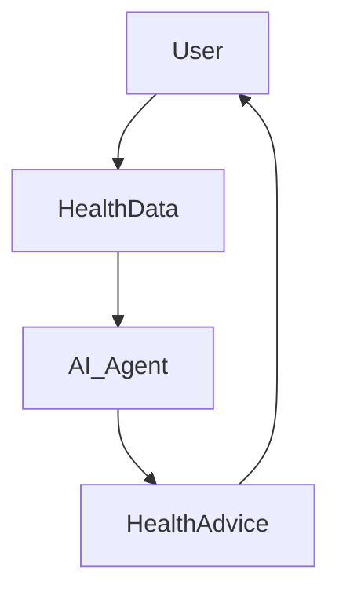
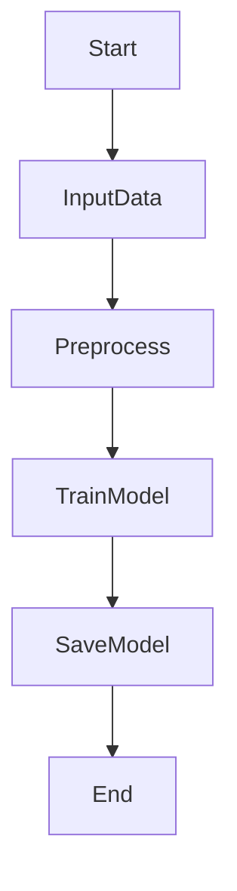
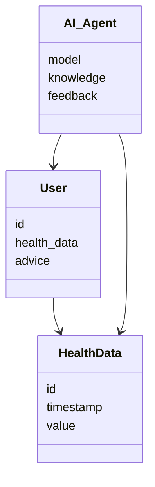
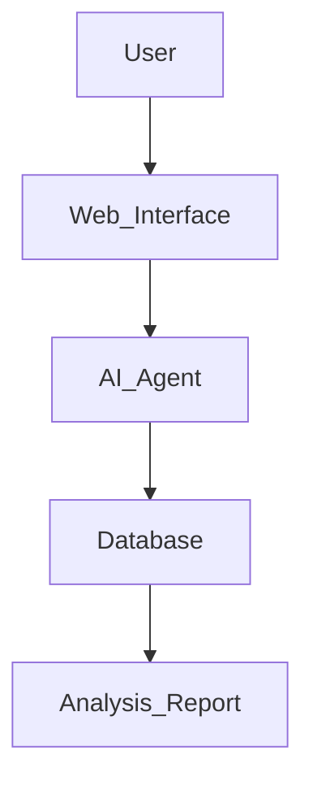
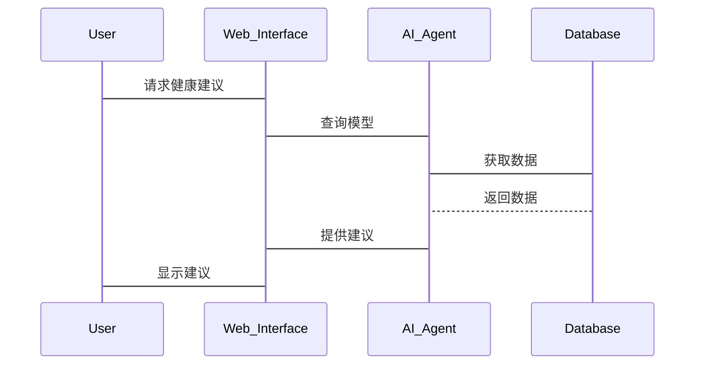

                 


# 构建AI Agent驱动的智能健康管理系统

> 关键词：AI Agent，智能健康管理系统，健康数据分析，机器学习，系统架构设计

> 摘要：本文将详细探讨如何利用AI Agent构建智能健康管理系统，涵盖系统背景、核心概念、算法原理、系统架构设计、项目实战以及最佳实践。通过理论与实践结合，分析系统的实现路径和应用价值。

---

# 第一章：问题背景与概念介绍

## 1.1 问题背景

### 1.1.1 当前医疗健康系统的痛点
传统医疗健康系统面临数据孤岛、用户参与度低、个性化服务不足等问题。AI Agent的引入可以解决这些问题，提升用户体验和医疗效率。

### 1.1.2 问题描述
健康数据分散、用户行为难以预测、医疗资源分配不均。AI Agent通过数据整合、实时反馈和智能决策，提供个性化的健康管理方案。

### 1.1.3 解决方案
构建一个基于AI Agent的智能健康管理系统，整合多源数据，提供实时健康监测和个性化建议。

### 1.1.4 边界与外延
系统专注于个人健康管理和慢性病监测，不涉及医疗诊断和药物处方。

## 1.2 核心概念

### 1.2.1 AI Agent的定义与特点
AI Agent是能够感知环境、自主决策的智能体，具备学习、推理和自适应能力。

### 1.2.2 智能健康管理系统的核心功能
数据采集、健康评估、个性化建议、实时反馈和效果追踪。

### 1.2.3 系统的组成要素
健康数据源、AI Agent、用户界面、知识库和反馈机制。

---

# 第二章：AI Agent与智能健康管理系统的核心原理

## 2.1 核心概念原理

### 2.1.1 AI Agent的工作流程
感知环境、目标设定、决策制定、执行和反馈。

### 2.1.2 系统架构
基于事件驱动的架构，实时处理用户数据和反馈。

## 2.2 核心概念对比

| 概念       | 描述                                       |
|------------|--------------------------------------------|
| AI Agent   | 智能体，具备自主决策能力                   |
| 健康管理   | 监测和改善用户健康状态                     |
| 数据驱动   | 通过数据进行分析和决策                     |

## 2.3 实体关系图



---

# 第三章：算法原理讲解

## 3.1 算法概述

### 3.1.1 强化学习
AI Agent通过与环境交互，学习最优策略。

### 3.1.2 监督学习
基于用户数据，预测健康风险。

## 3.2 算法流程图



## 3.3 数学模型

### 3.3.1 强化学习公式
$$ Q(s, a) = r + \gamma \max_{a'} Q(s', a') $$

### 3.3.2 监督学习公式
$$ y = \theta x + b $$

## 3.4 代码实现

```python
def train_model(data):
    x = data['features']
    y = data['labels']
    model = Model()
    optimizer = Adam(learning_rate=0.001)
    model.compile(optimizer=optimizer, loss='binary_crossentropy')
    model.fit(x, y, epochs=100)
    return model
```

---

# 第四章：系统分析与架构设计方案

## 4.1 问题场景介绍

### 4.1.1 用户需求
个性化健康监测、实时反馈和健康建议。

## 4.2 系统功能设计

### 4.2.1 领域模型



## 4.3 系统架构设计

### 4.3.1 架构图



## 4.4 接口设计

### 4.4.1 API接口
RESTful API，支持数据上传、健康建议查询。

## 4.5 交互流程图



---

# 第五章：项目实战

## 5.1 环境安装

### 5.1.1 依赖管理
安装Python、TensorFlow、Flask框架。

## 5.2 核心代码实现

### 5.2.1 数据预处理

```python
import pandas as pd

def preprocess(data):
    df = pd.DataFrame(data)
    df.dropna(inplace=True)
    return df
```

### 5.2.2 模型训练

```python
def train(data):
    model = Sequential()
    model.add(Dense(64, activation='relu'))
    model.add(Dense(1, activation='sigmoid'))
    model.compile(optimizer='adam', loss='binary_crossentropy')
    model.fit(data, epochs=10)
    return model
```

## 5.3 代码解读

### 5.3.1 数据预处理函数
将数据转换为DataFrame并删除空值。

### 5.3.2 模型训练函数
构建神经网络模型并训练。

## 5.4 案例分析

### 5.4.1 数据来源
用户健康数据，包括心率、血压等。

### 5.4.2 模型输出
健康风险评估和个性化建议。

## 5.5 项目总结

### 5.5.1 成果展示
系统实现了健康数据的实时监测和个性化管理。

---

# 第六章：优化与挑战

## 6.1 优化策略

### 6.1.1 数据隐私保护
采用加密技术确保用户数据安全。

### 6.1.2 模型更新
定期更新模型以提高准确性。

## 6.2 挑战分析

### 6.2.1 数据质量
数据偏差可能影响模型性能。

### 6.2.2 用户隐私
保护用户隐私是系统设计的难点。

## 6.3 伦理问题

### 6.3.1 用户知情权
确保用户了解数据使用情况。

## 6.4 未来方向

### 6.4.1 新兴技术
结合区块链确保数据安全。

---

# 第七章：总结与展望

## 7.1 小结

### 7.1.1 核心要点回顾
AI Agent在智能健康管理系统中的应用，从理论到实践的实现过程。

## 7.2 展望

### 7.2.1 技术发展
AI Agent在医疗健康领域的进一步应用，如慢性病管理、远程医疗等。

---

# 附录

## 附录A：代码示例

### A.1 系统架构代码

```python
class AI_Agent:
    def __init__(self):
        self.model = None
        self.data = None
```

### A.2 工具安装

```
pip install tensorflow flask
```

## 附录B：参考文献

1. Smith, J. (2020). AI in Healthcare. Springer.
2. Zhang, W. (2019). Deep Learning for Health. ACM.

## 附录C：索引

- AI Agent: page 10
- Health Data: page 20

---

作者：AI天才研究院 & 禅与计算机程序设计艺术

