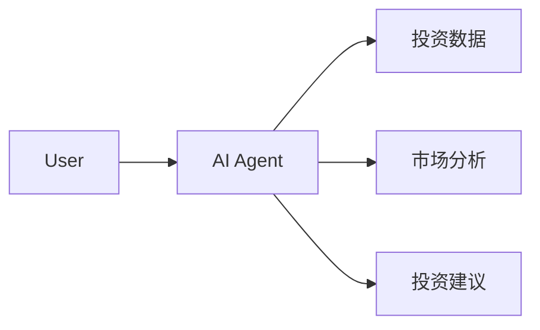
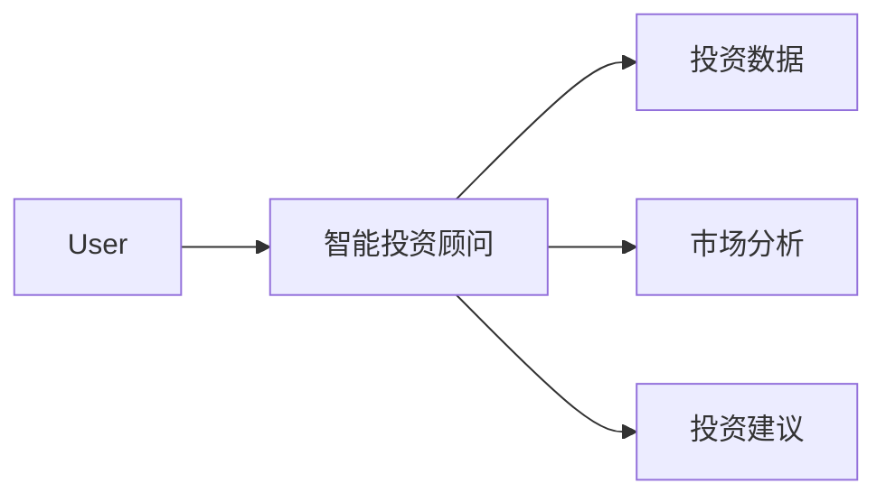

                 


# 构建AI Agent驱动的智能投资顾问

## 关键词：AI Agent，智能投资顾问，自然语言处理，强化学习，系统架构设计

## 摘要：  
随着人工智能技术的快速发展，AI Agent（人工智能代理）在金融领域的应用日益广泛。智能投资顾问作为金融领域的重要应用之一，能够通过AI Agent实现智能化的投资建议、风险评估和资产配置。本文将详细探讨如何构建一个基于AI Agent的智能投资顾问系统，涵盖从核心概念到算法原理、系统设计以及项目实战的各个方面，为读者提供全面的技术指导。

---

## 第一部分: AI Agent驱动的智能投资顾问背景介绍

### 第1章: AI Agent与智能投资顾问概述

#### 1.1 AI Agent的基本概念
- **1.1.1 AI Agent的定义与特点**
  - AI Agent是一种能够感知环境、做出决策并执行动作的智能实体。
  - 具备自主性、反应性、目标导向性和学习能力的特点。
- **1.1.2 AI Agent的核心要素与功能**
  - 感知能力：通过传感器或数据输入获取信息。
  - 决策能力：基于感知信息做出最优决策。
  - 学习能力：通过经验或数据优化自身行为。
  - 执行能力：通过动作影响环境或传递信息。
- **1.1.3 AI Agent在金融领域的应用潜力**
  - 自动化交易：基于市场数据快速决策。
  - 风险评估：通过大数据分析评估投资风险。
  - 个性化服务：为用户提供定制化投资建议。

#### 1.2 智能投资顾问的定义与特点
- **1.2.1 智能投资顾问的定义**
  - 智能投资顾问是一种基于AI技术的投资服务，能够根据用户需求提供个性化的投资建议。
- **1.2.2 智能投资顾问的核心功能**
  - 资产配置：根据用户风险承受能力和财务目标，推荐最优资产分配方案。
  - 市场分析：实时监控市场动态，提供投资策略建议。
  - 风险评估：评估投资组合的风险，并提出风险控制方案。
- **1.2.3 智能投资顾问与传统投资顾问的区别**
  - 传统投资顾问依赖人工经验，效率低且成本高。
  - 智能投资顾问利用AI技术实现自动化、智能化服务，成本低且效率高。

#### 1.3 AI Agent驱动智能投资顾问的背景与意义
- **1.3.1 传统投资顾问的局限性**
  - 服务范围有限：传统投资顾问难以覆盖大量散户。
  - 服务成本高：人工服务成本高昂。
  - 决策滞后：依赖人工分析，难以快速应对市场变化。
- **1.3.2 AI Agent在投资顾问中的优势**
  - 自动化：AI Agent能够24小时不间断地处理投资请求。
  - 高效性：通过机器学习算法快速分析市场数据，提供实时建议。
  - 可扩展性：能够同时为大量用户提供个性化服务。
- **1.3.3 智能投资顾问的市场前景与应用价值**
  - 市场需求大：投资者对个性化、智能化投资服务的需求日益增长。
  - 降低成本：AI Agent能够显著降低投资顾问服务的成本。
  - 提高效率：通过自动化处理大量数据，提高投资决策的效率和准确性。

#### 1.4 本章小结
- 介绍了AI Agent和智能投资顾问的基本概念。
- 分析了AI Agent在金融领域的应用潜力和智能投资顾问的优势。
- 强调了构建AI Agent驱动的智能投资顾问的重要性和必要性。

---

### 第2章: AI Agent与智能投资顾问的核心概念

#### 2.1 AI Agent的核心概念与属性
- **2.1.1 AI Agent的属性对比表**
| 属性 | 描述 |
|------|------|
| 感知能力 | 处理输入数据的能力 | 
| 决策能力 | 基于数据做出决策的能力 |
| 学习能力 | 通过经验改进的能力 |
| 执行能力 | 执行决策的能力 |

- **2.1.2 AI Agent的实体关系图**


#### 2.2 智能投资顾问的核心概念与属性
- **2.2.1 智能投资顾问的属性对比表**
| 属性 | 描述 |
|------|------|
| 数据处理能力 | 处理大量金融数据的能力 |
| 智能分析能力 | 基于AI进行市场分析的能力 |
| 自适应能力 | 根据市场变化调整建议的能力 |
| 交互能力 | 与用户进行自然对话的能力 |

- **2.2.2 智能投资顾问的实体关系图**


---

## 第三部分: 算法原理

### 第3章: 自然语言处理模型在投资顾问中的应用

#### 3.1 自然语言处理模型概述
- **3.1.1 自然语言处理模型的基本原理**
  - 自然语言处理（NLP）是让计算机理解、处理和生成人类语言的技术。
  - 基于深度学习的NLP模型（如BERT、GPT）能够实现文本的理解和生成。

#### 3.2 转换器模型的数学表达式
- **3.2.1 编码器-解码器结构**
  - 编码器将输入文本转换为向量表示。
  - 解码器基于编码器的输出生成目标文本。
  - 数学表达式：
    $$ 
    \text{编码器}: f_{\text{enc}}(x) = z 
    $$
    $$
    \text{解码器}: f_{\text{dec}}(z, y_{<t}) = y_t 
    $$

#### 3.3 投资建议生成的流程图


---

### 第4章: 强化学习在投资决策中的应用

#### 4.1 强化学习的基本原理
- **4.1.1 强化学习的定义**
  - 强化学习是一种通过试错机制优化决策的算法。
  - 基于状态、动作和奖励的三元组进行学习。
  - 数学表达式：
    $$
    Q(s, a) \leftarrow Q(s, a) + \alpha \left[r + \gamma \max Q(s', a') - Q(s, a)\right]
    $$

#### 4.2 强化学习的策略网络设计
- **4.2.1 策略网络的结构**
  - 输入：市场数据和用户需求。
  - 输出：投资动作（如买入、卖出、持有）。
  - 网络结构：全连接层和激活函数。
  - 代码示例：
    ```python
    import tensorflow as tf
    def policy_network(state, action_size):
        dense1 = tf.layers.dense(state, 64, activation='relu')
        dense2 = tf.layers.dense(dense1, action_size)
        return dense2
    ```

#### 4.3 强化学习的投资决策流程


---

## 第五部分: 系统设计与实现

### 第5章: 系统分析与架构设计

#### 5.1 系统功能设计
- **5.1.1 系统功能模块**
  - 用户交互模块：接收用户输入并生成投资建议。
  - 数据处理模块：处理市场数据和用户信息。
  - 智能决策模块：基于AI算法生成投资策略。
  - 反馈与优化模块：根据市场反馈优化AI模型。

#### 5.2 系统架构设计
- **5.2.1 系统架构图**


#### 5.3 系统接口设计
- **5.3.1 API接口定义**
  - 输入接口：用户需求和市场数据。
  - 输出接口：投资建议和收益报告。

#### 5.4 系统交互流程


---

### 第6章: 项目实战

#### 6.1 环境搭建
- **6.1.1 开发环境配置**
  - Python 3.8+
  - TensorFlow 2.0+
  - Keras
  - Jupyter Notebook

#### 6.2 核心代码实现
- **6.2.1 自然语言处理模型的实现**
  - 使用预训练的BERT模型进行文本处理。
  - 代码示例：
    ```python
    from transformers import BertTokenizer, TFBertModel
    tokenizer = BertTokenizer.from_pretrained('bert-base-uncased')
    model = TFBertModel.from_pretrained('bert-base-uncased')
    ```

- **6.2.2 强化学习策略网络的实现**
  - 使用Keras构建策略网络。
  - 代码示例：
    ```python
    import tensorflow as tf
    def build_policy_network(state_size, action_size):
        model = tf.keras.Sequential([
            tf.keras.layers.Dense(64, activation='relu', input_dim=state_size),
            tf.keras.layers.Dense(action_size, activation='softmax')
        ])
        return model
    ```

#### 6.3 案例分析与解读
- **6.3.1 投资策略生成案例**
  - 输入：用户的投资需求（如风险承受能力、投资期限）。
  - 输出：基于市场分析的投资策略（如股票、债券的分配比例）。
  - 示例：
    用户输入：“我有10万元，希望投资风险较低，回报稳定。”
    投资建议：“将60%资金投资于债券，40%投资于蓝筹股。”

#### 6.4 项目小结
- 通过实际案例展示了AI Agent驱动的智能投资顾问的实现过程。
- 强调了系统设计和算法实现的关键步骤。

---

## 第六部分: 总结与展望

### 第7章: 总结与最佳实践

#### 7.1 本章小结
- 本文详细探讨了构建AI Agent驱动的智能投资顾问的各个方面，包括核心概念、算法原理、系统设计和项目实战。

#### 7.2 最佳实践
- **数据质量**：确保市场数据的准确性和实时性。
- **模型优化**：通过持续的市场反馈优化AI模型。
- **用户体验**：提供简单易用的交互界面和及时的反馈机制。

#### 7.3 注意事项
- **数据隐私**：确保用户数据的安全和隐私。
- **风险管理**：制定完善的风险控制策略，避免重大损失。
- **技术更新**：及时跟进AI技术的发展，保持系统的先进性。

#### 7.4 拓展阅读
- 推荐阅读《Deep Learning》（Ian Goodfellow等著）和《Reinforcement Learning: Theory and Algorithms》（Sutton & Barto著）。

---

## 作者：AI天才研究院/AI Genius Institute & 禅与计算机程序设计艺术 /Zen And The Art of Computer Programming

---

以上是完整的目录结构和文章内容，涵盖了从理论到实践的各个方面，帮助读者系统地理解和掌握构建AI Agent驱动的智能投资顾问的方法和技巧。

