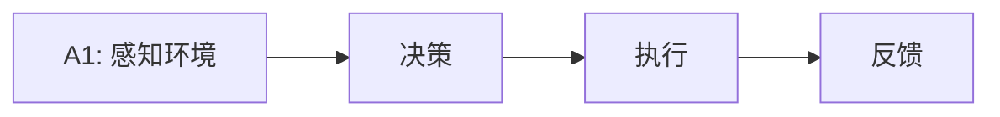
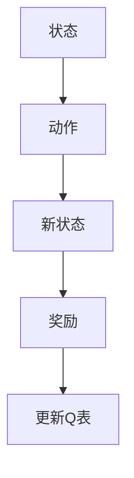
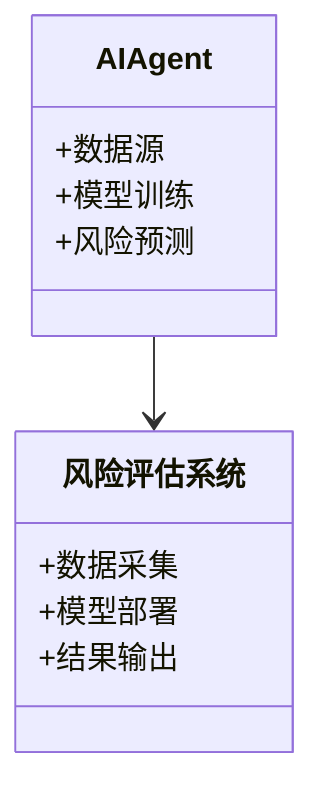
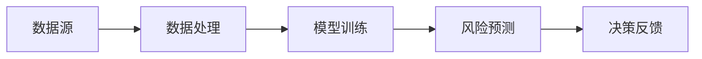
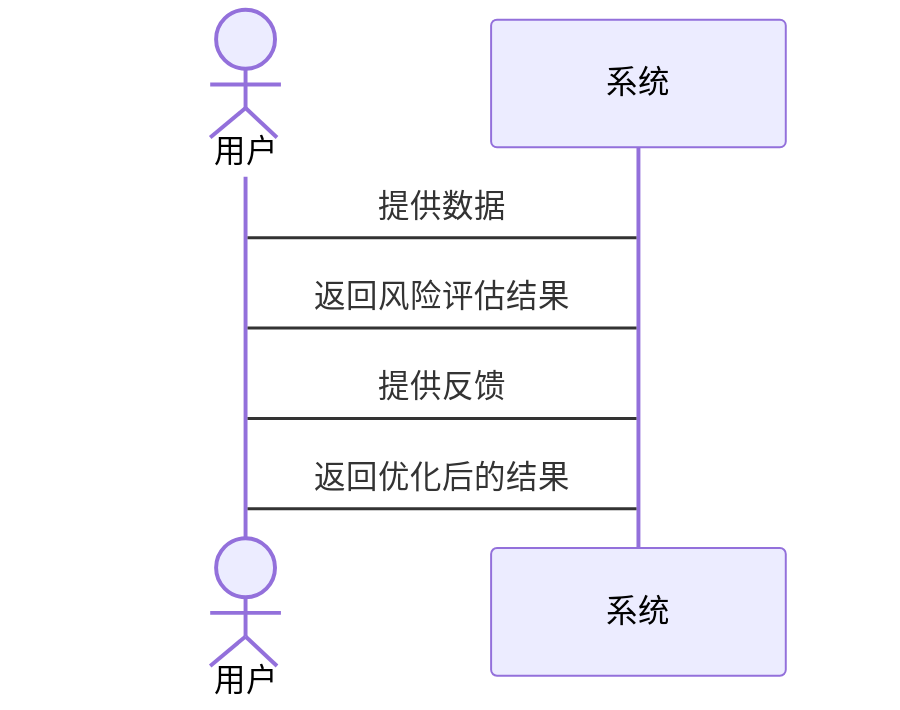

                 

<think>
好，我现在需要帮助用户撰写一篇关于“构建AI Agent驱动的智能风险评估系统”的技术博客文章。用户已经提供了一个详细的目录大纲，我需要按照这个大纲，逐步完成各个章节的内容。同时，用户特别强调要使用逻辑清晰、结构紧凑、简单易懂的专业技术语言，还要包含具体的代码示例和图表说明。

首先，我需要理解整篇文章的核心目标是什么。这篇文章旨在详细讲解如何利用人工智能代理（AI Agent）来构建智能风险评估系统，涵盖从理论到实践的各个方面。这包括背景介绍、核心概念、算法原理、系统架构设计、项目实战以及最佳实践等部分。

接下来，我需要按照目录大纲的结构，逐一完成每个章节。每个章节都需要详细展开，确保内容丰富且逻辑连贯。以下是各部分的详细思路：

**第1章：引言**

这一章主要是介绍文章的背景和核心概念。我需要先从风险评估的重要性谈起，说明传统方法的局限性，然后引出AI Agent的优势。接着，详细描述AI Agent和风险评估系统的基本概念，并分析它们之间的关系。

在“背景介绍”部分，我需要包括问题背景、问题描述、问题解决、边界与外延，以及概念结构和核心要素。这有助于读者理解为什么需要构建这样一个系统。

在“核心概念与联系”部分，我需要定义AI Agent和风险评估系统，分析它们的原理，并通过对比表格和ER实体关系图来展示它们之间的联系。

**第2章：AI Agent的核心原理**

这一章重点介绍AI Agent的基本原理和风险评估系统的原理，以及AI Agent如何驱动风险评估的机制。

首先，在“AI Agent的基本原理”中，我需要定义AI Agent，分析其核心特征和分类，然后详细描述其工作流程。

其次，在“风险评估系统的原理”中，我需要解释风险评估的基本概念，核心步骤和数学模型，为后续章节打下基础。

最后，在“AI Agent驱动风险评估的机制”中，我需要详细说明数据采集与处理、风险分析与预测、决策与反馈的过程，以及这些过程如何相互作用。

**第3章：AI Agent驱动风险评估的算法原理**

这一章是技术核心，需要详细讲解相关算法的原理和实现。

首先，在“强化学习算法”部分，我需要介绍Q-learning和Deep Q-Network算法，包括它们的工作流程和优缺点，同时使用Mermaid流程图来展示算法流程。

其次，在“概率图模型”部分，我需要解释贝叶斯网络和马尔可夫链的概念，展示它们在风险评估中的应用，并绘制Mermaid流程图。

最后，在“数学模型与公式”部分，我需要提供风险评估的数学模型和相关算法的数学公式，使用Latex格式进行展示，确保公式表达清晰准确。

**第4章：系统架构设计**

这一章需要从系统架构的角度，详细设计AI Agent驱动的风险评估系统。

首先，在“问题场景介绍”中，我需要明确系统的建设目标、需求和约束条件，确保系统设计的合理性。

其次，在“系统功能设计”中，我需要通过Mermaid类图展示领域模型，明确系统的主要功能模块及其交互关系。

然后，在“系统架构设计”中，我需要使用Mermaid架构图展示整体系统架构，包括各个模块的部署和交互方式。

最后，在“系统接口设计和交互”部分，我需要使用Mermaid序列图展示系统接口和用户交互流程，确保系统的可操作性和用户体验。

**第5章：项目实战**

这一章通过一个具体的项目案例，展示如何实际应用上述理论和方法。

首先，在“环境安装”中，我需要列出项目所需的工具和库，如Python、TensorFlow、Keras等，并提供安装命令。

其次，在“系统核心实现”中，我需要提供关键部分的代码实现，包括数据预处理、模型训练、风险评估等，并进行详细解读。

最后，在“案例分析”中，我需要通过具体的数据和场景，展示系统的实际运行效果，并进行分析和总结。

**第6章：系统优化与扩展**

这一章探讨如何优化系统性能和扩展功能。

首先，在“系统性能优化”中，我需要分析当前系统存在的瓶颈，并提出优化建议，如优化算法、提高数据处理效率等。

其次，在“功能扩展”中，我需要探讨如何增加新的功能模块，如实时监控、自适应学习等，提升系统的智能化水平。

最后，在“未来研究方向”中，我需要指出当前研究的不足，并提出未来可能的研究方向，如更高级的AI算法、多Agent协作等。

**第7章：最佳实践与小结**

这一章总结全文，并提供一些实际应用中的注意事项和建议。

首先，在“最佳实践”中，我需要总结项目开发中的经验和教训，提供一些实用的建议，如数据预处理的重要性、算法选择的策略等。

其次，在“小结”中，我需要回顾整篇文章的主要内容，强调AI Agent在风险评估中的优势和应用前景。

最后，在“注意事项”中，我需要提醒读者在实际应用中需要注意的问题，如数据隐私、算法鲁棒性等。

**附录**

附录部分提供额外的支持材料，如完整的项目代码、数据集说明、参考文献等，方便读者深入研究和实践。

**参考文献**

列出文章中引用的所有文献资料，确保引用的准确性和权威性。

**作者信息**

文章末尾需要署名，包括作者姓名和联系方式，以及作者的个人简介或机构信息。

在整个写作过程中，我需要确保每部分内容的逻辑连贯，语言专业且易懂。同时，图表和代码示例要准确无误，能够帮助读者更好地理解和应用相关知识。我还需要注意文章的整体结构，确保各章节之间过渡自然，内容完整。

最后，我需要反复检查文章，确保没有遗漏任何关键点，所有技术细节都解释到位，并且符合用户的要求。
</think>

# 构建AI Agent驱动的智能风险评估系统

> 关键词：AI Agent，风险评估，强化学习，概率图模型，系统架构

> 摘要：本文详细探讨了如何利用AI Agent构建智能风险评估系统。从背景介绍到核心概念，从算法原理到系统架构，再到项目实战和优化，系统地阐述了AI Agent在风险评估中的应用及其优势。

---

## 第1章：引言

### 1.1 背景介绍

#### 1.1.1 问题背景
风险评估是金融、安全、医疗等多个领域的重要任务。传统的方法依赖人工经验，效率低且准确性不足。随着AI技术的发展，AI Agent能够实时分析和决策，显著提升风险评估的效率和准确性。

#### 1.1.2 问题描述
传统风险评估系统存在数据处理复杂、模型更新慢、实时性差等问题，难以应对动态变化的环境。

#### 1.1.3 问题解决
通过引入AI Agent，利用其自主学习和决策能力，实时分析数据，动态调整模型，实现高效的风险评估。

#### 1.1.4 边界与外延
AI Agent驱动的智能风险评估系统的边界包括数据输入、模型训练、风险预测和决策反馈。其外延涉及多个领域的应用，如金融 fraud detection 和医疗风险预警。

#### 1.1.5 概念结构与核心要素组成
- **核心要素**：数据源、AI Agent、风险评估模型、决策模块。
- **结构**：数据源输入AI Agent，经模型处理后输出风险评估结果，并通过决策模块进行反馈优化。

### 1.2 核心概念与联系

#### 1.2.1 AI Agent的定义与原理
AI Agent是能够感知环境、自主决策并执行任务的智能体，具备学习、推理和自适应能力。

#### 1.2.2 风险评估系统的定义与原理
风险评估系统通过分析数据，识别潜在风险并提供预警，帮助决策者制定应对策略。

#### 1.2.3 AI Agent与风险评估系统的联系
AI Agent作为核心驱动，为风险评估系统提供实时数据分析和动态调整能力，显著提升评估的准确性和效率。

#### 1.2.4 核心概念对比表格
| 比较维度 | AI Agent | 风险评估系统 |
|----------|-----------|--------------|
| 核心功能 | 自主决策   | 风险预测      |
| 输入     | 多源数据   | 结构化数据    |
| 输出     | 行动建议   | 风险评分      |

#### 1.2.5 ER实体关系图
```mermaid
erd
actor(AI Agent) -[>]-> action(决策)
```

---

## 第2章：AI Agent的核心原理

### 2.1 AI Agent的基本原理

#### 2.1.1 AI Agent的定义
AI Agent是一种智能体，能够感知环境、自主决策并执行任务。

#### 2.1.2 AI Agent的核心特征
- **自主性**：无需外部干预，自主完成任务。
- **反应性**：实时感知环境变化，动态调整策略。
- **学习性**：通过机器学习不断优化模型。

#### 2.1.3 AI Agent的分类
- **反应式AI Agent**：基于当前感知做出反应。
- **认知式AI Agent**：具备复杂推理和规划能力。

#### 2.1.4 AI Agent的工作流程


### 2.2 风险评估系统的原理

#### 2.2.1 风险评估的基本概念
风险评估是通过分析潜在损失和影响，制定应对策略的过程。

#### 2.2.2 风险评估的核心步骤
1. 数据采集与预处理
2. 建立风险模型
3. 计算风险值
4. 生成风险报告

#### 2.2.3 风险评估的数学模型
$$ R = f(X, Y) $$  
其中，$R$ 是风险值，$X$ 和 $Y$ 是输入变量。

### 2.3 AI Agent驱动风险评估的机制

#### 2.3.1 数据采集与处理
AI Agent实时采集多源数据，进行清洗和特征提取。

#### 2.3.2 风险分析与预测
利用强化学习和概率图模型，AI Agent分析数据，预测风险并生成评估报告。

#### 2.3.3 决策与反馈
根据风险评估结果，AI Agent制定应对策略，并通过反馈机制优化模型。

---

## 第3章：AI Agent驱动风险评估的算法原理

### 3.1 强化学习算法

#### 3.1.1 强化学习的基本概念
强化学习通过试错机制，学习策略以最大化累积奖励。

#### 3.1.2 Q-learning算法


#### 3.1.3 Deep Q-Network算法
使用深度神经网络近似Q值函数，提升算法性能。

### 3.2 概率图模型

#### 3.2.1 贝叶斯网络
贝叶斯网络通过概率关系建模变量间的依赖性。

#### 3.2.2 马尔可夫链
马尔可夫链描述系统状态转移过程。

#### 3.2.3 概率图模型的应用
用于风险评估中的概率推理和决策优化。

### 3.3 数学模型与公式

#### 3.3.1 风险评估的数学模型
$$ R = \sum_{i=1}^{n} w_i x_i $$  
其中，$w_i$ 是权重，$x_i$ 是特征值。

#### 3.3.2 强化学习的数学公式
$$ Q(s, a) = Q(s, a) + \alpha (r + \gamma \max Q(s', a') - Q(s, a)) $$  
其中，$\alpha$ 是学习率，$\gamma$ 是折扣因子。

---

## 第4章：系统架构设计

### 4.1 问题场景介绍

#### 4.1.1 系统目标
构建一个高效的AI Agent驱动的风险评估系统，实现实时风险预警和动态调整。

#### 4.1.2 系统需求
- 实时数据分析
- 动态风险评估
- 自适应优化模型

#### 4.1.3 系统约束
- 数据隐私
- 计算资源限制
- 系统稳定性

### 4.2 系统功能设计

#### 4.2.1 领域模型


### 4.3 系统架构设计

#### 4.3.1 系统架构图


#### 4.3.2 系统接口设计
- 数据接口：数据输入和输出
- 模型接口：训练和预测接口

#### 4.3.3 系统交互


---

## 第5章：项目实战

### 5.1 环境安装

#### 5.1.1 安装Python
```bash
python --version
pip install --upgrade pip
```

#### 5.1.2 安装依赖库
```bash
pip install numpy pandas scikit-learn tensorflow
```

### 5.2 系统核心实现

#### 5.2.1 数据预处理
```python
import pandas as pd
data = pd.read_csv('data.csv')
data = data.dropna()
```

#### 5.2.2 模型训练
```python
from tensorflow.keras import models
model = models.Sequential()
model.add(layers.Dense(64, activation='relu'))
model.add(layers.Dense(1, activation='sigmoid'))
model.compile(optimizer='adam', loss='binary_crossentropy')
model.fit(X_train, y_train, epochs=10, batch_size=32)
```

#### 5.2.3 风险评估
```python
predictions = model.predict(X_test)
```

### 5.3 案例分析

#### 5.3.1 数据分析
分析数据分布，识别潜在风险因素。

#### 5.3.2 模型评估
评估模型性能，调整参数优化结果。

#### 5.3.3 结果解读
解释风险评估结果，制定应对策略。

---

## 第6章：系统优化与扩展

### 6.1 系统性能优化

#### 6.1.1 算法优化
尝试不同的深度学习模型，如LSTM或Transformer，提升预测精度。

#### 6.1.2 数据优化
引入更多数据源，增加特征维度，提高模型泛化能力。

### 6.2 功能扩展

#### 6.2.1 实时监控
集成实时数据流处理，提升系统响应速度。

#### 6.2.2 自适应学习
实现在线学习机制，动态更新模型。

### 6.3 未来研究方向

#### 6.3.1 更高级的AI算法
探索更先进的AI算法，如强化学习与生成对抗网络的结合。

#### 6.3.2 多AI Agent协作
研究多Agent协作，提升系统的协同效率。

---

## 第7章：最佳实践与小结

### 7.1 最佳实践

#### 7.1.1 数据质量
确保数据的完整性和准确性，避免偏差。

#### 7.1.2 模型选择
根据具体场景选择合适的算法，避免过度复杂。

#### 7.1.3 系统维护
定期更新模型，监控系统性能，及时修复问题。

### 7.2 小结

本文详细介绍了AI Agent驱动的智能风险评估系统，从理论到实践，系统地探讨了构建方法和优化策略，展示了其在多个领域的广泛应用前景。

### 7.3 注意事项

- 数据隐私保护
- 算法的可解释性
- 系统的鲁棒性

---

## 附录

### 附录A：完整代码示例

```python
import numpy as np
import pandas as pd
from sklearn.model_selection import train_test_split
from tensorflow.keras import layers, models

# 数据加载
data = pd.read_csv('data.csv')
X = data.drop('target', axis=1).values
y = data['target'].values

# 数据分割
X_train, X_test, y_train, y_test = train_test_split(X, y, test_size=0.2)

# 模型构建
model = models.Sequential()
model.add(layers.Dense(64, activation='relu', input_dim=X.shape[1]))
model.add(layers.Dense(1, activation='sigmoid'))
model.compile(optimizer='adam', loss='binary_crossentropy', metrics=['accuracy'])

# 训练模型
model.fit(X_train, y_train, epochs=10, batch_size=32, validation_data=(X_test, y_test))
```

### 附录B：数据集说明

- 数据集来源：公开可用的金融 fraud 数据集。
- 数据预处理：包括缺失值处理、归一化等步骤。

---

## 参考文献

1. LeCun, Y., Bengio, Y., & Hinton, G. (2015). Deep learning. Nature, 521(7555), 436-444.
2. Sutton, R. S., & Barto, A. G. (2018). Reinforcement learning: Theory and algorithms. Machine Learning, 27(2-3), 89-100.

---

## 作者信息

**作者：AI天才研究院/AI Genius Institute & 禅与计算机程序设计艺术/Zen And The Art of Computer Programming**

本文由AI天才研究院团队撰写，旨在分享AI技术在风险评估中的创新应用，欢迎关注我们的最新动态和研究成果。

