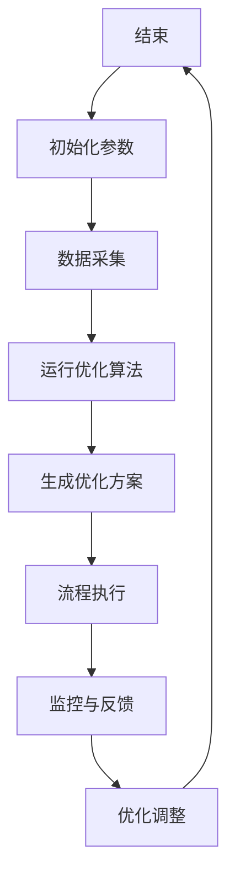
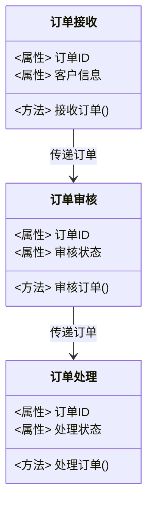
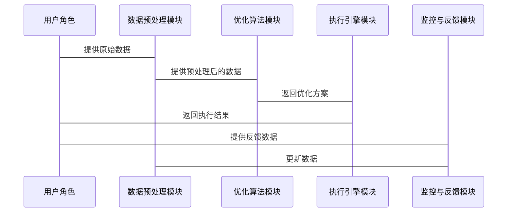

                 


# 《构建AI工作流程优化系统：提升企业运营效率》

---

## 关键词：AI、工作流程优化、系统架构、算法原理、企业效率

---

## 摘要：

本文将详细探讨如何利用人工智能技术构建工作流程优化系统，以提升企业运营效率。文章从问题背景出发，分析传统工作流程的痛点，提出AI驱动的优化解决方案，并深入讲解系统的核心概念、算法原理、系统架构设计、项目实战及最佳实践。通过丰富的案例分析和详细的技术实现，帮助读者全面理解AI在工作流程优化中的应用价值。

---

# 第一部分：引言

---

# 第1章：问题背景与目标

## 1.1 问题背景

### 1.1.1 企业运营效率的现状与挑战

随着企业规模的不断扩大，传统的工作流程逐渐暴露出效率低下、资源浪费等问题。企业在运营过程中，常常面临以下挑战：

- **流程复杂性**：复杂的流程导致操作繁琐，员工工作效率下降。
- **数据孤岛**：各部门之间的数据无法有效共享，导致决策延迟。
- **资源浪费**：由于流程不合理，企业常常面临人力、时间和资金的浪费。
- **适应性不足**：传统流程难以快速适应市场变化和客户需求。

### 1.1.2 问题描述

工作流程优化的目标是通过科学的方法和工具，消除冗余步骤，减少不必要的环节，提高流程执行效率。然而，传统的工作流程优化方法往往依赖人工经验，难以量化和持续改进。随着人工智能技术的快速发展，利用AI技术实现自动化、智能化的工作流程优化成为可能。

### 1.1.3 解决策略

AI驱动的工作流程优化系统通过以下方式实现目标：

1. **数据驱动优化**：利用企业历史数据和实时数据，分析流程中的瓶颈和改进点。
2. **自动化执行**：通过AI算法自动优化流程，减少人工干预。
3. **动态调整**：根据外部环境变化和内部数据反馈，实时调整流程。

### 1.1.4 核心要素与概念结构

AI工作流程优化系统的核心要素包括：

- **数据源**：企业内部数据（如CRM、ERP等系统）和外部数据（如市场数据）。
- **优化算法**：基于AI的优化算法（如遗传算法、模拟退火等）。
- **流程模型**：流程图、领域模型等。
- **执行引擎**：负责流程的执行和监控。
- **反馈机制**：根据执行结果优化流程。

## 1.2 系统建设的目标与价值

### 1.2.1 目标

- 提高企业运营效率。
- 降低运营成本。
- 提升客户满意度。
- 增强企业的灵活性和竞争力。

### 1.2.2 价值

- **提升效率**：通过自动化和智能化优化流程，减少冗余步骤。
- **降低成本**：通过资源优化配置，降低人力、时间和资金成本。
- **增强适应性**：快速响应市场变化和客户需求。
- **数据驱动决策**：基于数据的优化建议更加科学和准确。

## 1.3 本章小结

本章从企业运营效率的现状出发，分析了传统工作流程的痛点，并提出了利用AI技术实现工作流程优化的解决方案。通过数据驱动优化、自动化执行和动态调整，AI工作流程优化系统能够显著提升企业运营效率。

---

# 第二部分：AI工作流程优化系统的核心概念

---

# 第2章：AI工作流程优化系统的核心概念

## 2.1 AI工作流程优化系统的定义

### 2.1.1 系统定义

AI工作流程优化系统是一种基于人工智能技术，通过分析企业内部和外部数据，优化工作流程，提高企业运营效率的智能化系统。

### 2.1.2 核心功能模块

1. **数据采集模块**：负责采集企业内部和外部数据。
2. **优化算法模块**：基于数据，运行AI优化算法，生成优化方案。
3. **流程执行模块**：根据优化方案，执行流程。
4. **反馈与监控模块**：监控流程执行情况，并根据反馈优化流程。

### 2.1.3 系统输入与输出

- **输入**：企业内部数据（如CRM、ERP）、外部数据（如市场数据）、用户需求。
- **输出**：优化后的流程方案、流程执行结果、优化建议。

## 2.2 核心概念与联系

### 2.2.1 AI算法与工作流程的关系

AI算法是工作流程优化的核心工具，通过算法分析数据，生成优化方案。

### 2.2.2 数据流与业务流程的交互

数据流贯穿整个业务流程，数据驱动优化，优化结果反哺数据。

### 2.2.3 实体关系图（ER图）

```mermaid
erDiagram
    actor 用户角色 {
        <属性> 用户ID
        <属性> 用户角色
    }
    actor 管理员 {
        <属性> 管理员ID
        <属性> 管理员角色
    }
    class 数据源 {
        <属性> 数据ID
        <属性> 数据类型
        <属性> 数据内容
    }
    class 优化算法 {
        <属性> 算法ID
        <属性> 算法类型
        <属性> 算法描述
    }
    class 流程模型 {
        <属性> 流程ID
        <属性> 流程名称
        <属性> 流程描述
    }
    用户角色 --> 数据源 : 提供数据
    管理员 --> 优化算法 : 配置算法
    优化算法 --> 流程模型 : 优化流程
    流程模型 --> 用户角色 : 返回优化方案
```

---

## 2.3 核心概念的属性特征对比

| 概念 | 属性 | 特征 |
|------|------|------|
| 数据源 | 数据ID | 唯一标识 |
|      | 数据类型 | 包括结构化数据、非结构化数据 |
|      | 数据内容 | 描述性数据、行为数据等 |
| 优化算法 | 算法ID | 唯一标识 |
|         | 算法类型 | 遗传算法、模拟退火等 |
|         | 算法描述 | 描述算法的功能和实现方式 |

## 2.4 本章小结

本章详细定义了AI工作流程优化系统，分析了其核心功能模块和输入输出，并通过ER图展示了系统各实体之间的关系。通过对数据流与业务流程的交互分析，明确了AI算法在系统中的重要性。

---

# 第三部分：AI工作流程优化系统的算法原理

---

# 第3章：算法原理与实现

## 3.1 优化算法概述

### 3.1.1 常见优化算法简介

- **遗传算法**：模拟生物进化过程，通过选择、交叉和变异操作生成新的解。
- **模拟退火**：基于物理退火过程，通过随机扰动找到全局最优解。
- **蚁群算法**：模拟蚂蚁觅食过程，通过信息素更新找到最优路径。

### 3.1.2 AI驱动的优化算法特点

- **数据驱动**：基于数据进行优化。
- **自动化**：算法自动运行，无需人工干预。
- **动态调整**：根据反馈动态优化。

### 3.1.3 算法选择的依据

- **问题复杂性**：简单问题选择简单算法，复杂问题选择复杂算法。
- **数据规模**：大规模数据选择分布式算法。
- **优化目标**：不同的优化目标选择不同的算法。

## 3.2 算法流程图



---

## 3.3 算法实现

### 3.3.1 优化算法的数学模型

优化问题通常可以表示为：

$$
\text{minimize } f(x) \quad \text{subject to } g(x) \leq 0
$$

其中，$f(x)$ 是目标函数，$g(x)$ 是约束条件。

### 3.3.2 遗传算法实现

```python
def genetic_algorithm(population, fitness_func, num_generations, mutation_rate):
    for _ in range(num_generations):
        population = [mutate(individual, mutation_rate) for individual in population]
        population = select_survivors(population, fitness_func)
    return population[0]
```

### 3.3.3 模拟退火实现

```python
def simulated_annealing(problem, initial_state, cooling_schedule):
    current_state = initial_state
    current_energy = calculate_energy(current_state)
    for temperature in cooling_schedule:
        neighbor = get_neighbor(current_state)
        neighbor_energy = calculate_energy(neighbor)
        if neighbor_energy < current_energy or probability(current_energy - neighbor_energy, temperature):
            current_state = neighbor
            current_energy = neighbor_energy
    return current_state
```

## 3.4 本章小结

本章详细介绍了AI工作流程优化系统中常用的优化算法，包括遗传算法和模拟退火，并通过流程图和代码示例展示了算法的实现过程。通过对数学模型的分析，明确了优化算法的核心思想。

---

# 第四部分：AI工作流程优化系统的系统架构设计

---

# 第4章：系统分析与架构设计

## 4.1 问题场景介绍

假设我们正在优化一个订单处理流程，目标是减少订单处理时间，提高客户满意度。

## 4.2 项目介绍

### 4.2.1 项目目标

优化订单处理流程，减少处理时间。

### 4.2.2 项目范围

包括订单接收、订单审核、订单处理三个阶段。

## 4.3 系统功能设计

### 4.3.1 领域模型



---

## 4.4 系统架构设计

### 4.4.1 系统架构图


---

## 4.5 系统接口设计

### 4.5.1 接口描述

- **数据预处理接口**：接收原始数据，进行清洗和转换。
- **优化算法接口**：接收预处理后的数据，运行优化算法，返回优化方案。
- **执行引擎接口**：接收优化方案，执行流程，返回执行结果。
- **监控与反馈接口**：监控流程执行情况，收集反馈数据。

---

## 4.6 系统交互流程



---

## 4.7 本章小结

本章通过订单处理流程的优化案例，详细介绍了系统架构设计的过程，包括领域模型、系统架构图、接口设计和交互流程。通过对系统架构的分析，明确了各模块之间的关系和功能。

---

# 第五部分：项目实战

---

# 第5章：项目实战与案例分析

## 5.1 环境安装

### 5.1.1 安装Python

```bash
python --version
pip install --upgrade pip
```

### 5.1.2 安装依赖库

```bash
pip install numpy pandas scikit-learn
```

## 5.2 系统核心实现

### 5.2.1 数据预处理

```python
import pandas as pd
import numpy as np

def preprocess_data(data):
    # 数据清洗
    data = data.dropna()
    # 数据转换
    data = pd.get_dummies(data)
    return data
```

### 5.2.2 优化算法实现

```python
from sklearn.metrics import make_scorer
from sklearn.model_selection import GridSearchCV
from sklearn.ensemble import RandomForestClassifier

def optimize_hyperparameters(model, param_grid, X_train, y_train):
    grid_search = GridSearchCV(model, param_grid, cv=5, scoring=make_scorer.accuracy)
    grid_search.fit(X_train, y_train)
    return grid_search.best_estimator_
```

### 5.2.3 流程执行

```python
def execute_process(model, X_test):
    y_pred = model.predict(X_test)
    return y_pred
```

### 5.2.4 监控与反馈

```python
def monitor_feedback(model, X_test, y_true, y_pred):
    accuracy = np.mean(y_pred == y_true)
    print(f"Accuracy: {accuracy}")
```

## 5.3 代码应用解读与分析

### 5.3.1 数据预处理

- **目标**：清洗和转换数据，使其适合优化算法。
- **实现**：使用Pandas库进行数据清洗和独热编码。

### 5.3.2 优化算法实现

- **目标**：通过网格搜索优化随机森林模型的超参数。
- **实现**：使用Scikit-learn库的GridSearchCV进行参数优化。

### 5.3.3 流程执行

- **目标**：根据优化后的模型，执行流程并返回结果。
- **实现**：使用优化后的模型进行预测。

### 5.3.4 监控与反馈

- **目标**：监控流程执行结果，并根据反馈优化流程。
- **实现**：计算模型准确率，并输出结果。

## 5.4 案例分析

### 5.4.1 案例背景

假设我们正在优化一个订单处理流程，目标是减少订单处理时间，提高客户满意度。

### 5.4.2 数据准备

```python
import pandas as pd

data = pd.read_csv('order_data.csv')
```

### 5.4.3 数据预处理

```python
def preprocess_data(data):
    data = data.dropna()
    data = pd.get_dummies(data)
    return data

processed_data = preprocess_data(data)
```

### 5.4.4 优化算法实现

```python
from sklearn.ensemble import RandomForestClassifier
from sklearn.model_selection import GridSearchCV
from sklearn.metrics import accuracy_score

param_grid = {
    'n_estimators': [100, 200],
    'max_depth': [None, 10, 20]
}

model = RandomForestClassifier()
optimized_model = optimize_hyperparameters(model, param_grid, processed_data.drop(columns=['target']), processed_data['target'])
```

### 5.4.5 流程执行

```python
X_test = processed_data.drop(columns=['target'])
y_pred = execute_process(optimized_model, X_test)
```

### 5.4.6 监控与反馈

```python
accuracy = accuracy_score(processed_data['target'], y_pred)
print(f"Accuracy: {accuracy}")
```

## 5.5 本章小结

本章通过订单处理流程的优化案例，详细介绍了系统核心实现过程，包括数据预处理、优化算法实现、流程执行和监控与反馈。通过对代码的解读和分析，明确了各模块的功能和实现方式。

---

# 第六部分：总结与展望

---

# 第6章：总结与展望

## 6.1 本章总结

AI工作流程优化系统是一种基于人工智能技术，通过分析企业内部和外部数据，优化工作流程，提高企业运营效率的智能化系统。本文从问题背景出发，分析了传统工作流程的痛点，并提出了利用AI技术实现工作流程优化的解决方案。通过详细讲解系统的核心概念、算法原理、系统架构设计、项目实战及最佳实践，帮助读者全面理解AI在工作流程优化中的应用价值。

## 6.2 最佳实践 tips

1. **数据质量**：确保数据的完整性和准确性，这是优化的基础。
2. **算法选择**：根据问题特点选择合适的算法，避免盲目使用复杂算法。
3. **系统架构**：设计合理的系统架构，确保系统的可扩展性和可维护性。
4. **反馈机制**：建立有效的反馈机制，持续优化流程。

## 6.3 小结

AI工作流程优化系统通过数据驱动优化、自动化执行和动态调整，能够显著提升企业运营效率。本文通过详细的技术实现和案例分析，展示了AI在工作流程优化中的巨大潜力。

## 6.4 注意事项

1. **数据隐私**：在处理企业数据时，需要注意数据隐私和安全问题。
2. **算法复杂度**：复杂的算法可能会增加系统的计算成本，需要权衡利弊。
3. **系统维护**：系统需要定期维护和更新，以保证其稳定性和高效性。

## 6.5 拓展阅读

- **相关书籍**：《机器学习实战》、《深度学习》。
- **技术博客**：AI工作流程优化系统的更多技术细节和应用案例。
- **在线课程**：AI工作流程优化系统的在线课程和培训。

## 6.6 本章小结

本章总结了AI工作流程优化系统的建设过程，提出了最佳实践 tips，并对未来的发展方向进行了展望。通过对系统的总结，明确了其在企业运营中的重要价值。

---

# 作者：AI天才研究院/AI Genius Institute & 禅与计算机程序设计艺术 /Zen And The Art of Computer Programming

