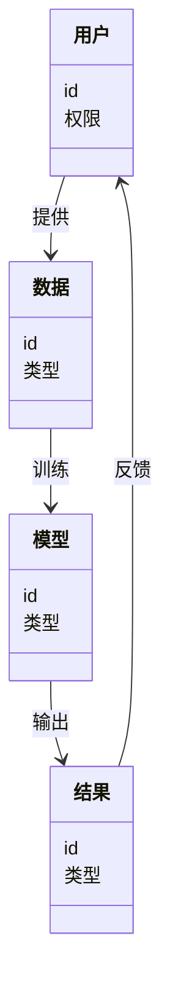
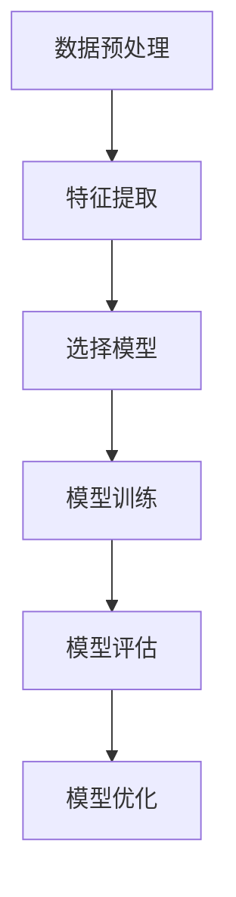
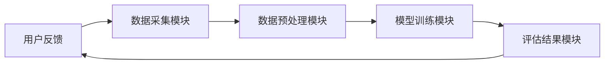
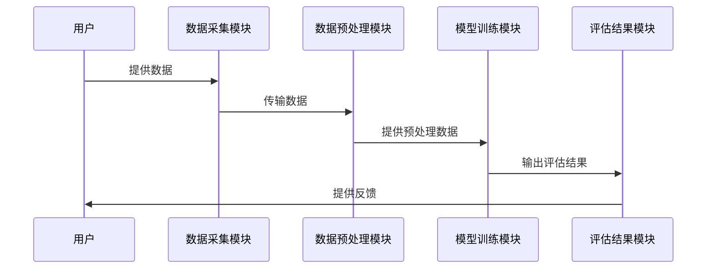

                 


# 构建AI驱动的企业创新绩效评估系统

## 关键词：AI驱动、企业创新、绩效评估、机器学习、深度学习

## 摘要：本文详细探讨了如何利用人工智能技术构建企业创新绩效评估系统。从问题背景、核心概念到算法实现，再到系统架构和项目实战，全面解析了AI在企业创新绩效评估中的应用。通过具体案例分析，展示了如何利用机器学习和深度学习模型，结合数据特征分析和智能算法优化，构建高效的创新绩效评估系统。

---

## 第一部分: AI驱动的企业创新绩效评估系统概述

### 第1章: 问题背景与目标

#### 1.1 问题背景
企业创新绩效评估是衡量企业创新能力的重要指标，传统的评估方法依赖于人工分析和经验判断，存在主观性强、效率低下、数据孤岛等问题。随着人工智能技术的快速发展，利用AI技术构建智能化的绩效评估系统成为企业创新管理的重要方向。

#### 1.2 问题描述
企业创新绩效评估的主要挑战包括：
- 数据来源多样，难以统一处理；
- 评估指标复杂，难以量化；
- 传统方法效率低，难以实时反馈。

AI技术在绩效评估中的潜力主要体现在：
- 数据挖掘和分析能力；
- 智能预测和优化能力；
- 实时反馈和个性化建议能力。

#### 1.3 问题解决思路
通过AI技术实现创新绩效评估的思路包括：
- 数据收集与清洗：整合多源异构数据，建立统一的数据标准；
- 智能分析与预测：利用机器学习和深度学习模型，对数据进行分析和预测；
- 结果反馈与优化：根据评估结果，提供反馈和改进建议，形成闭环优化。

#### 1.4 系统边界与外延
系统功能边界包括：
- 数据采集模块：负责数据的收集和预处理；
- 模型训练模块：负责模型的训练和优化；
- 评估结果模块：负责结果的展示和反馈。

系统外部接口包括：
- 数据接口：与企业数据源对接；
- 用户接口：与企业用户交互；
- 第三方服务接口：与云服务、大数据平台等对接。

系统可扩展性体现在：
- 支持多种数据源接入；
- 支持多种算法模型扩展；
- 支持多维度评估指标定制。

#### 1.5 概念结构与核心要素
核心概念包括：
- 数据：企业创新活动的相关数据，如专利、论文、项目等；
- 模型：用于评估的机器学习和深度学习模型；
- 指标：评估创新绩效的核心指标，如创新速度、创新质量等。

核心要素组成包括：
- 数据采集与预处理；
- 模型训练与优化；
- 结果展示与反馈。

---

## 第2章: 核心概念与联系

### 2.1 核心概念原理
AI驱动的创新绩效评估系统的核心原理包括：
- 数据特征分析：提取数据的关键特征，为模型提供有效的输入；
- 智能分析：利用机器学习和深度学习算法，对数据进行智能分析和预测；
- 绩效评估：基于分析结果，生成创新绩效评估报告。

### 2.2 属性特征对比
以下是数据特征和模型特征的对比表：

| 属性 | 数据特征 | 模型特征 |
|------|----------|----------|
| 类型 | 文本、数值、时间 | 分类模型、回归模型、聚类模型 |
| 特征 | 维度、相关性、分布 | 准确率、召回率、F1值 |
| 作用 | 描述创新活动 | 评估创新绩效 |

### 2.3 ER实体关系图
```mermaid
er
  actor: 用户
  model: 模型
  data: 数据
  result: 结果
  actor --> data: 提供
  data --> model: 训练
  model --> result: 输出
  result --> actor: 反馈
```

### 2.4 领域模型类图


---

## 第3章: 算法原理与实现

### 3.1 算法原理
#### 3.1.1 机器学习基础
机器学习是AI驱动的创新绩效评估系统的核心技术之一。常用算法包括：
- 线性回归：用于预测连续型指标；
- 支持向量机：用于分类问题；
- 随机森林：用于特征重要性分析。

#### 3.1.2 深度学习模型
深度学习模型在处理复杂数据和非线性关系方面具有优势。常用模型包括：
- 卷积神经网络（CNN）：适用于图像数据；
- 循环神经网络（RNN）：适用于时间序列数据；
- Transformer：适用于自然语言处理任务。

### 3.2 算法实现
#### 3.2.1 机器学习模型训练过程
以下是机器学习模型的训练流程图：



#### 3.2.2 Python源代码实现
以下是机器学习模型的Python代码示例：

```python
import pandas as pd
from sklearn.model_selection import train_test_split
from sklearn.ensemble import RandomForestClassifier
from sklearn.metrics import accuracy_score

# 数据加载
data = pd.read_csv('innovation.csv')
X = data.drop('label', axis=1)
y = data['label']

# 数据分割
X_train, X_test, y_train, y_test = train_test_split(X, y, test_size=0.2)

# 模型训练
model = RandomForestClassifier()
model.fit(X_train, y_train)

# 模型预测
y_pred = model.predict(X_test)

# 模型评估
accuracy = accuracy_score(y_test, y_pred)
print(f'模型准确率：{accuracy}')
```

#### 3.2.3 数学模型和公式
以下是随机森林模型的数学公式：

$$
f(x) = \sum_{i=1}^{n} \text{树}_i(x)
$$

其中，$\text{树}_i$ 表示随机森林中的第i棵决策树，$x$ 是输入数据。

---

## 第4章: 系统分析与架构设计方案

### 4.1 系统架构设计
以下是系统架构图：



### 4.2 接口设计
系统接口包括：
- 数据接口：与企业数据源对接；
- 用户接口：与企业用户交互；
- 第三方服务接口：与云服务、大数据平台等对接。

### 4.3 交互设计
以下是用户与系统交互的序列图：



---

## 第5章: 项目实战

### 5.1 环境安装
以下是项目实战的环境安装步骤：
1. 安装Python：`pip install python`
2. 安装必要的库：`pip install pandas scikit-learn`
3. 下载数据集：`wget https://example.com/innovation.csv`

### 5.2 核心实现
以下是核心实现的Python代码：

```python
import pandas as pd
from sklearn.ensemble import RandomForestClassifier
from sklearn.metrics import accuracy_score

# 数据加载
data = pd.read_csv('innovation.csv')
X = data.drop('label', axis=1)
y = data['label']

# 数据分割
X_train, X_test, y_train, y_test = train_test_split(X, y, test_size=0.2)

# 模型训练
model = RandomForestClassifier()
model.fit(X_train, y_train)

# 模型预测
y_pred = model.predict(X_test)

# 模型评估
accuracy = accuracy_score(y_test, y_pred)
print(f'模型准确率：{accuracy}')
```

### 5.3 案例分析
通过实际案例分析，展示了如何利用机器学习模型对企业创新绩效进行评估。以下是案例分析的详细步骤：
1. 数据预处理：清洗数据，提取特征；
2. 模型训练：选择合适的模型，进行训练；
3. 模型评估：评估模型的准确率、召回率等指标；
4. 结果反馈：根据评估结果，提供反馈和优化建议。

---

## 第6章: 最佳实践

### 6.1 小结
通过本文的详细讲解，读者可以系统地了解如何利用AI技术构建企业创新绩效评估系统。从数据处理到模型训练，再到系统架构设计，每一步都至关重要。

### 6.2 注意事项
在实际应用中，需要注意以下几点：
- 数据的质量和完整性；
- 模型的可解释性和透明度；
- 系统的安全性和稳定性。

### 6.3 拓展阅读
建议读者进一步阅读以下内容：
- 《机器学习实战》
- 《深度学习入门：基于Python和Keras》
- 《企业创新管理：AI驱动的绩效评估》

---

## 作者：AI天才研究院 & 禅与计算机程序设计艺术

