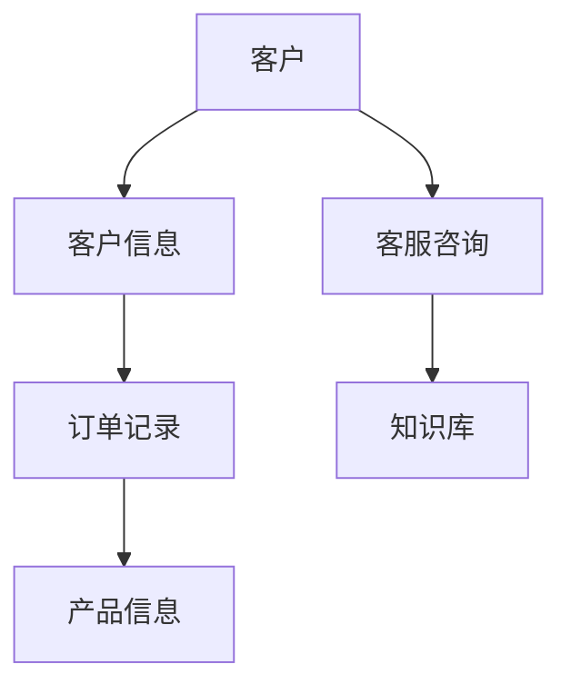
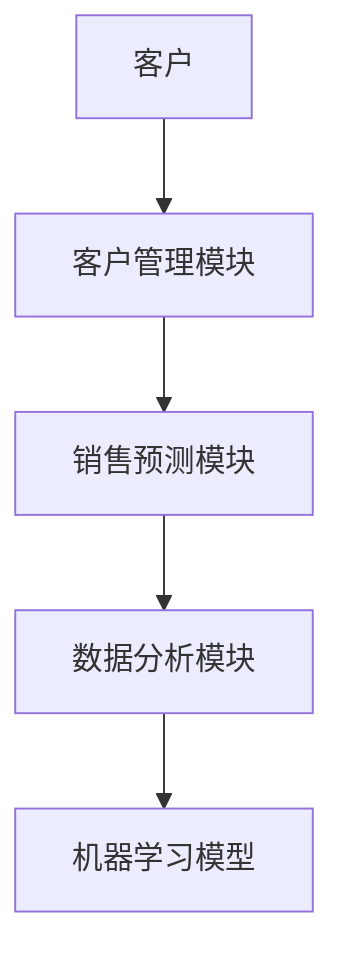

                 


# 构建AI驱动的企业客户关系管理(CRM)系统

> 关键词：AI驱动，CRM系统，客户关系管理，机器学习，自然语言处理，客户数据分析

> 摘要：本文详细探讨了如何构建一个基于人工智能的客户关系管理系统（CRM）。通过分析CRM的核心功能、AI驱动CRM的优势、算法原理、系统架构设计以及项目实战，本文为读者提供了从理论到实践的全面指导。文章还结合了实际案例和代码示例，帮助读者更好地理解和应用AI技术来优化企业CRM系统。

---

## 第一部分: AI驱动CRM系统的背景与概念

### 第1章: 企业客户关系管理(CRM)概述

#### 1.1 CRM的核心概念与功能

- **1.1.1 CRM的定义与核心功能**  
  CRM（Customer Relationship Management）是指企业通过管理与客户的互动，优化客户体验，提高客户忠诚度，从而实现业务目标的过程。其核心功能包括客户信息管理、销售预测、客户互动、营销自动化等。

- **1.1.2 CRM在企业管理中的作用**  
  CRM系统能够帮助企业提高客户满意度、降低客户流失率、提升销售效率，并通过数据分析支持决策。

- **1.1.3 CRM系统的演进与发展趋势**  
  传统CRM系统主要依赖人工操作，而现代AI驱动的CRM系统通过引入机器学习、自然语言处理等技术，实现了智能化的客户管理。

#### 1.2 AI驱动CRM的背景与意义

- **1.2.1 AI技术在企业管理中的应用现状**  
  AI技术在企业管理中的应用日益广泛，尤其是在客户数据分析、预测性分析和自动化服务方面表现突出。

- **1.2.2 AI驱动CRM的核心价值**  
  AI驱动CRM能够通过实时数据分析，提供精准的客户洞察，优化销售流程，提升客户体验，并降低企业运营成本。

- **1.2.3 AI驱动CRM的市场前景与挑战**  
  市场对智能化CRM的需求不断增加，但企业在数据隐私、技术门槛和实施成本方面仍面临挑战。

#### 1.3 本章小结  
本章介绍了CRM的核心概念、功能和作用，分析了AI驱动CRM的背景与意义，并指出了其市场前景与挑战。

---

### 第2章: AI驱动CRM的核心概念与联系

#### 2.1 AI驱动CRM的核心概念

- **2.1.1 AI技术在CRM中的应用场景**  
  AI技术在CRM中的应用包括客户画像构建、销售预测、智能客服、自动化营销等。

- **2.1.2 数据驱动的客户洞察**  
  通过分析客户数据，企业可以深入了解客户需求、行为习惯和偏好，从而提供个性化的服务。

- **2.1.3 智能化的客户互动与决策**  
  AI驱动的CRM系统能够实时分析客户互动数据，提供智能化的决策支持。

#### 2.2 CRM系统的核心要素与属性

- **2.2.1 客户数据模型**  
  客户数据模型是CRM系统的基础，包括客户基本信息、交易记录、互动历史等。

- **2.2.2 业务流程模型**  
  业务流程模型描述了CRM系统中的关键业务流程，如销售流程、客户服务流程等。

- **2.2.3 系统功能模块**  
  系统功能模块包括客户管理、销售管理、营销管理、数据分析等。

#### 2.3 AI驱动CRM的实体关系图



#### 2.4 本章小结  
本章详细阐述了AI驱动CRM的核心概念，分析了CRM系统的核心要素，并通过实体关系图展示了系统的构成。

---

## 第二部分: AI驱动CRM的算法原理与数学模型

### 第3章: AI驱动CRM的算法原理与数学模型

#### 3.1 常见AI算法在CRM中的应用

- **3.1.1 分类算法**  
  分类算法用于客户 churn 预测、销售机会分类等场景。

- **3.1.2 聚类算法**  
  聚类算法用于客户分群、市场细分等场景。

- **3.1.3 自然语言处理(NLP)**  
  NLP技术用于客户情感分析、意图识别等场景。

#### 3.2 分类算法的数学模型

- **3.2.1 线性回归模型**  
  $$y = \beta_0 + \beta_1x + \epsilon$$

- **3.2.2 逻辑回归模型**  
  $$P(y=1|x) = \frac{e^{\beta_0 + \beta_1x}}{1 + e^{\beta_0 + \beta_1x}}$$

#### 3.3 算法实现与代码示例

```python
import numpy as np
from sklearn.linear_model import LogisticRegression

# 示例数据
X = np.array([[1, 2], [3, 4], [5, 6]])
y = np.array([0, 1, 0])

# 训练模型
model = LogisticRegression()
model.fit(X, y)

# 预测
print(model.predict([[2, 3]]))
```

#### 3.4 本章小结  
本章介绍了常见AI算法在CRM中的应用，并通过数学公式和代码示例详细讲解了分类算法的原理和实现。

---

## 第三部分: AI驱动CRM系统的分析与架构设计

### 第4章: AI驱动CRM系统的分析与架构设计

#### 4.1 系统功能设计

- **4.1.1 客户信息管理模块**  
  包括客户信息的录入、查询和更新功能。

- **4.1.2 销售预测模块**  
  基于历史销售数据和机器学习模型，预测未来销售情况。

- **4.1.3 自动化客户互动模块**  
  包括自动化的邮件营销、智能客服等功能。

#### 4.2 系统架构设计



#### 4.3 系统接口设计

- **4.3.1 API接口设计**  
  提供RESTful API接口，方便与其他系统的集成。

- **4.3.2 数据接口设计**  
  支持多种数据格式的导入和导出，如CSV、JSON等。

#### 4.4 系统交互设计

```mermaid
sequenceDiagram
    客户 -->+> 客户管理模块: 查询客户信息
    客户管理模块 -->+> 数据分析模块: 获取客户数据
    数据分析模块 -->+> 机器学习模型: 进行预测
    机器学习模型 -->+> 客户管理模块: 返回预测结果
    客户管理模块 -->+> 客户: 显示预测结果
```

#### 4.5 本章小结  
本章详细设计了AI驱动CRM系统的功能模块、架构、接口和交互流程，并通过Mermaid图展示了系统的整体架构。

---

## 第四部分: 项目实战

### 第5章: AI驱动CRM系统的项目实战

#### 5.1 环境安装与配置

- **5.1.1 安装Python环境**  
  使用Anaconda或virtualenv创建独立的Python环境。

- **5.1.2 安装依赖库**  
  安装numpy、pandas、scikit-learn等机器学习库。

#### 5.2 系统核心实现

```python
import pandas as pd
from sklearn.model

