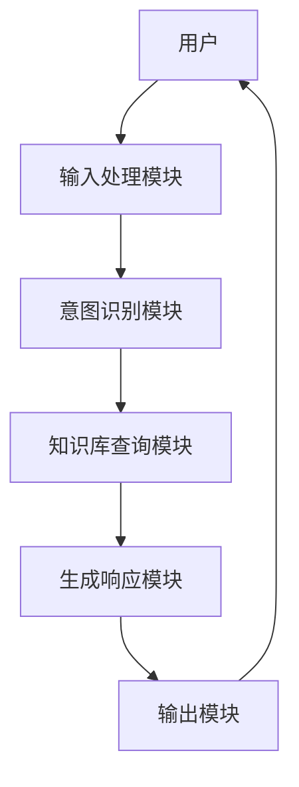

                 

<think>
好的，我现在需要按照用户的要求，逐步构建《构建AI驱动的企业智能助手：从概念到落地》的目录大纲。用户已经提供了一个详细的结构，现在我需要仔细分析每个部分，确保内容详实、结构合理。

首先，标题和摘要部分是关键。标题需要吸引人，同时明确主题。摘要则要简明扼要地概括整本书的核心内容，让读者一目了然地了解书的主旨。

接下来是目录结构。第一部分是背景与概念，涵盖企业智能助手的背景、问题背景和核心概念。这部分需要为读者打下坚实的基础，让他们理解为什么需要AI驱动的企业智能助手，以及它的基本结构。

第二部分是核心技术与原理，重点讲解AI模型和NLP技术，以及对话系统。这里需要详细解释相关技术，包括它们的工作原理和在企业智能助手中的应用，可能需要结合Mermaid图和数学公式来说明。

第三部分是系统设计与架构，涉及系统架构设计、功能流程设计和交互设计。这部分需要具体的系统架构图和交互序列图，帮助读者理解系统的整体结构和各部分如何协作。

第四部分是项目实战，从环境安装到代码实现，再到案例分析，让读者能够实际操作，理解如何将理论应用到实践中。可能需要提供详细的代码示例和实际案例分析，帮助读者更好地掌握。

最后是最佳实践和小结，总结全书内容，并给出实际应用中的注意事项和未来趋势。这不仅帮助读者巩固所学知识，还能引导他们进一步学习和实践。

在编写过程中，需要注意每个章节的逻辑连贯性，确保从理论到实践逐步深入。同时，使用清晰的技术语言，避免过于复杂的术语，让读者能够轻松理解。

现在，我需要检查每个部分是否覆盖了用户的要求，确保每个小节都有足够的细节，并且结构合理，内容完整。如果有遗漏的地方，需要及时补充。最终目标是为读者提供一本结构清晰、内容详实的技术博客文章，帮助他们从概念到落地，全面理解AI驱动的企业智能助手。
</think>

# 构建AI驱动的企业智能助手：从概念到落地

> 关键词：AI驱动，企业智能助手，自然语言处理，对话系统，系统架构

> 摘要：本文将深入探讨如何构建一个AI驱动的企业智能助手，从概念到落地，详细分析其背景、核心技术和系统架构，并通过实际案例展示如何实现和应用这一系统。

---

## # 第一部分: 企业智能助手的背景与概念

### ## 第1章: 企业智能助手的背景与现状

#### ### 1.1 企业智能助手的背景与现状
- **背景介绍**：随着人工智能技术的快速发展，企业智能助手逐渐从传统的工具性角色转变为智能化的决策支持系统。这种转变不仅提升了企业的效率，还为企业提供了更深层次的数据分析和决策支持。
- **现状分析**：当前市场中，许多企业已经开始采用AI驱动的智能助手，这些工具通过自然语言处理和机器学习技术，能够理解并执行复杂的指令，显著提升了企业的生产力。

#### ### 1.2 问题背景与解决思路
- **问题背景**：传统的企业助手往往依赖于固定的规则和预定义的流程，难以应对复杂多变的业务需求。这种局限性使得企业在处理非结构化数据和复杂任务时效率低下。
- **解决思路**：引入AI技术，特别是自然语言处理和机器学习，可以赋予企业助手更强的适应性和学习能力，使其能够更智能地处理各种复杂任务。

#### ### 1.3 核心概念与结构
- **核心概念**：企业智能助手通过自然语言处理技术，能够理解和生成人类语言，结合机器学习模型，实现对业务数据的分析和预测。
- **概念结构**：企业智能助手通常包括数据输入、意图识别、知识处理和结果输出四个核心模块，每个模块都有其独特的功能和交互方式。

---

## # 第二部分: 核心技术与原理

### ## 第2章: AI模型与NLP技术

#### ### 2.1 AI模型的核心原理
- **浅层模型与深度学习**：浅层模型如决策树和逻辑回归在处理简单任务时表现良好，但面对复杂问题时，深度学习模型如神经网络显示出更强的适应性。
- **大模型的训练与优化**：通过大量数据的训练，大模型能够捕获数据中的深层特征，从而在各种任务中表现出色。

#### ### 2.2 自然语言处理（NLP）技术
- **NLP的基本概念**：自然语言处理是研究如何让计算机理解和生成人类语言的学科，主要包括文本处理、语义分析和生成三个主要步骤。
- **常用NLP模型**：如BERT、GPT等模型在文本生成和理解任务中表现出色，广泛应用于企业智能助手的对话系统中。

#### ### 2.3 对话系统与交互设计
- **对话系统的分类**：基于规则的对话系统适用于简单的任务，而基于深度学习的系统能够处理更复杂的对话。
- **交互设计优化**：通过用户研究和数据反馈，不断优化对话流程和用户体验，确保系统能够准确理解用户意图并提供有效的帮助。

---

## # 第三部分: 系统设计与架构

### ## 第3章: 系统架构设计

#### ### 3.1 系统模块划分
- **核心模块功能**：输入处理模块负责接收用户输入，意图识别模块分析用户的意图，知识库查询模块检索相关信息，生成响应模块构建输出内容，输出模块将结果传递给用户。
- **模块依赖关系**：各模块之间相互依赖，形成一个完整的处理流程，确保系统的高效运行。

#### ### 3.2 功能流程设计
- **用户请求处理流程**：用户输入请求，系统首先进行意图识别，然后查询知识库，生成响应并输出结果。
- **系统响应生成流程**：通过NLP技术分析用户需求，结合知识库中的数据，生成符合用户期望的回复。

#### ### 3.3 系统架构图


---

## # 第四部分: 项目实战与实现

### ## 第4章: 企业智能助手的实现

#### ### 4.1 环境安装
- **开发环境搭建**：安装Python、TensorFlow、Keras等必要的开发工具和库，确保系统能够顺利运行。
- **依赖管理**：使用pip安装所需的第三方库，如transformers、numpy等，为后续的模型训练和部署做好准备。

#### ### 4.2 系统核心实现源代码
```python
import transformers
from transformers import AutoTokenizer, AutoModelForQuestionAnswering

# 加载预训练模型
tokenizer = AutoTokenizer.from_pretrained('bert-base-chinese')
model = AutoModelForQuestionAnswering.from_pretrained('bert-base-chinese')

# 定义问题回答函数
def answer_question(question, context):
    inputs = tokenizer.encode_plus(question, context, add_special_tokens=True, return_tensors='pt')
    outputs = model(**inputs)
    start_logits = outputs.start_logits
    end_logits = outputs.end_logits
    start = torch.argmax(start_logits).item()
    end = torch.argmax(end_logits).item()
    answer = context[start:end+1]
    return answer
```

#### ### 4.3 代码应用解读与分析
- **代码功能解读**：上述代码使用了BERT模型进行问题回答，通过编码器将输入的问题和上下文转换为模型可以处理的形式，然后通过解码器生成回答。
- **实际案例分析**：例如，当用户询问“如何提高企业效率？”时，系统会从知识库中提取相关策略并生成详细的回答。

#### ### 4.4 实际案例分析和详细讲解
- **案例分析**：通过实际项目案例，展示企业智能助手在客户支持、数据查询等场景中的应用，分析其带来的效率提升和成本节约。

#### ### 4.5 项目小结
- **项目总结**：总结项目实现的关键点，强调系统设计和实现中的难点，如模型选择、数据处理和系统优化。
- **经验分享**：分享在项目实施过程中积累的经验和教训，为后续类似项目提供参考。

---

## # 第五部分: 最佳实践与小结

### ## 第5章: 最佳实践与小结

#### ### 5.1 最佳实践
- **数据质量**：确保训练数据的多样性和代表性，避免数据偏差影响模型性能。
- **模型优化**：通过持续的训练和优化，提升模型的准确性和响应速度。
- **用户体验**：注重对话的流畅性和准确性，提供多轮对话支持，提升用户的使用体验。

#### ### 5.2 小结
- **全书总结**：从概念到落地，系统地介绍了AI驱动的企业智能助手的构建过程，涵盖技术选型、系统设计和实际实现。
- **未来展望**：随着AI技术的不断进步，企业智能助手将具备更强的智能性和适应性，为企业带来更大的价值。

---

## 作者：AI天才研究院 & 禅与计算机程序设计艺术

---

通过以上目录结构，我们可以清晰地看到构建AI驱动的企业智能助手需要涵盖的各个方面，从理论到实践，层层深入，确保系统能够高效、稳定地运行，为企业的智能化转型提供强有力的支持。

