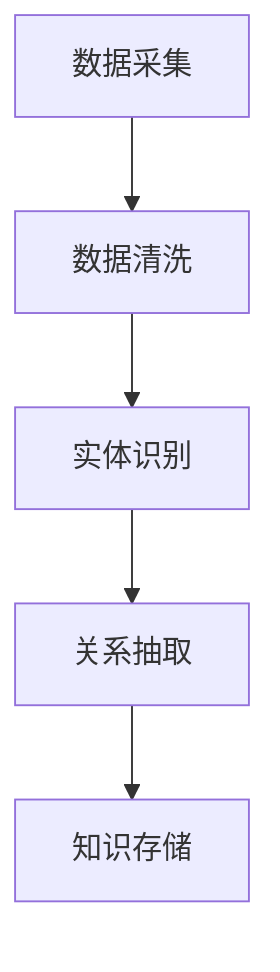
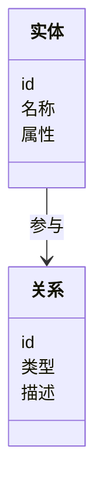
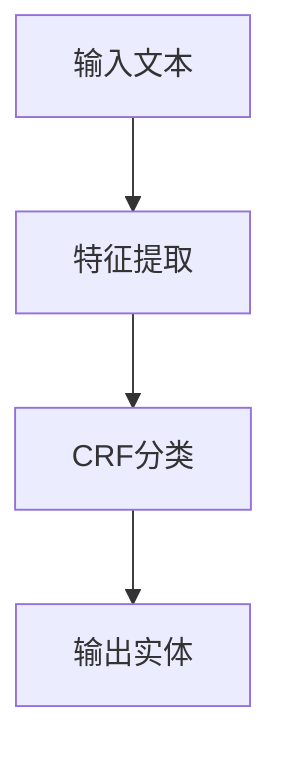
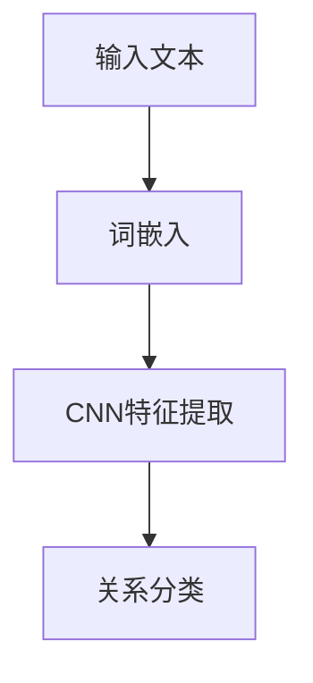
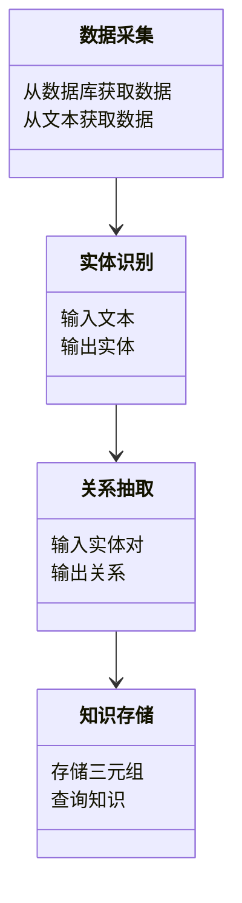
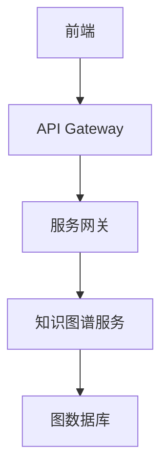

                 

<think>
好的，我需要帮助用户撰写一篇关于《构建AI驱动的企业知识图谱：深化领域理解》的技术博客文章。用户已经提供了详细的大纲，现在我需要按照大纲逐步完成每个章节的内容。首先，我需要理解每个章节的要求，包括背景介绍、核心概念、算法原理、系统架构、项目实战以及最佳实践等部分。

首先，我会从背景与概述部分开始，介绍知识图谱的基本概念和AI驱动的重要性。然后，我会详细讲解知识图谱的核心概念，包括实体识别、关系抽取等技术。接下来，我会深入探讨相关的算法原理，并用数学公式和代码示例来说明。之后，我会分析系统的架构设计，包括功能设计、架构图和接口设计。在项目实战部分，我将提供一个具体的案例，展示如何构建企业知识图谱，并在代码中详细解读。最后，我会总结最佳实践和注意事项，为读者提供实用的建议。

在写作过程中，我需要确保内容逻辑清晰，结构紧凑，语言专业但易懂。我会使用Mermaid图来辅助说明实体关系、算法流程和系统架构。同时，我会嵌入数学公式，确保其正确无误，并用代码示例帮助读者理解算法实现。

现在，我开始撰写文章，确保每个部分都符合用户的要求，并且内容详实、结构合理。
</think>

# 构建AI驱动的企业知识图谱：深化领域理解

> **关键词**：知识图谱, AI驱动, 企业应用, 领域理解, 实体识别, 关系抽取, 系统架构  
> **摘要**：本文深入探讨如何利用人工智能技术构建企业知识图谱，分析其核心概念、算法原理、系统架构及项目实战。通过详细的技术解读和案例分析，帮助读者理解知识图谱在企业中的应用价值和实现方法。

---

## 第一部分: 企业知识图谱的背景与概述

### 第1章: 知识图谱的定义与构建背景

#### 1.1 知识图谱的定义与核心概念

知识图谱是一种以结构化方式表示知识的网络，由实体（Entity）、属性（Attribute）和关系（Relation）组成。实体可以是人、组织、产品等，属性描述实体的特征，关系描述实体之间的联系。例如，实体“苹果”可以有属性“颜色”和“形状”，并与其他实体（如“水果”）有关系。

知识图谱的构建流程包括数据采集、实体识别、关系抽取和知识存储。其价值在于将分散的数据整合成可理解的知识网络，为企业提供高效的决策支持。

**知识图谱的核心要素**：
- **实体**：知识图谱的基本单位，代表现实世界中的具体事物。
- **属性**：描述实体的特征，如“苹果的颜色是红色”。
- **关系**：描述实体之间的联系，如“苹果属于水果”。

#### 1.2 AI驱动知识图谱的必要性

传统知识图谱构建依赖人工标注，效率低且成本高。AI技术的引入极大提升了构建效率和准确性。例如，自然语言处理（NLP）技术可以自动从文本中提取实体和关系，显著减少人工干预。

**AI在知识图谱中的作用**：
- **自动化处理**：利用机器学习模型自动识别实体和关系。
- **高效扩展**：通过深度学习技术快速构建大规模知识图谱。
- **动态更新**：实时更新知识图谱，保持信息的准确性。

---

## 第二部分: 知识图谱的核心概念与技术

### 第2章: 知识图谱的构建与管理

#### 2.1 知识图谱的构建流程

构建知识图谱通常包括以下步骤：
1. **数据采集**：收集结构化数据（如数据库）和非结构化数据（如文本）。
2. **数据清洗**：去除噪声数据，确保数据质量。
3. **实体识别**：识别文本中的实体。
4. **关系抽取**：识别实体之间的关系。
5. **知识存储**：将实体和关系存储在知识库中。

**构建流程的可视化**：



#### 2.2 知识图谱的表示与建模

知识图谱可以通过图数据库（如Neo4j）存储，使用三元组（头实体，关系，尾实体）表示知识。例如，三元组（“苹果”，“属于”，“水果”）表示苹果属于水果类别。

**知识图谱的领域模型**：



---

## 第三部分: 知识图谱的算法原理与实现

### 第3章: 知识图谱构建的算法原理

#### 3.1 实体识别算法

**基于条件随机场（CRF）的实体识别算法**：

CRF是一种概率模型，常用于序列标注任务，如实体识别。其核心思想是利用上下文信息进行分类。

**CRF的数学模型**：

$$ P(y|x) = \frac{\exp(\sum_{i=1}^{n} w_i x_i)}{\sum_{y} \exp(\sum_{i=1}^{n} w_i x_i)} $$

**算法流程**：



**Python实现示例**：

```python
import CRF
from sklearn.metrics import accuracy_score

# 训练CRF模型
model = CRF()
model.train(train_data)

# 预测实体
test_sentences = ["这是一个测试句子"]
predicted = model.predict(test_sentences)

# 计算准确率
accuracy = accuracy_score(predicted, true_labels)
print(f"准确率: {accuracy}")
```

#### 3.2 关系抽取算法

**基于卷积神经网络（CNN）的关系抽取算法**：

CNN通过卷积操作提取文本中的局部特征，常用于关系抽取任务。

**CNN的数学模型**：

$$ f(x) = \max(0, x \cdot w + b) $$

**算法流程**：



**Python实现示例**：

```python
import torch
import torch.nn as nn

# 定义CNN模型
class CNN(nn.Module):
    def __init__(self):
        super(CNN, self).__init__()
        self.conv = nn.Conv2d(1, 100, kernel_size=3, stride=1, padding=1)
        self.fc = nn.Linear(100, output_size)

    def forward(self, x):
        x = F.relu(self.conv(x))
        x = x.view(x.size(0), -1)
        x = self.fc(x)
        return x

# 训练模型
model = CNN()
model.train(train_loader)
```

---

## 第四部分: 知识图谱的系统架构与设计

### 第4章: 知识图谱系统的架构设计

#### 4.1 功能设计

知识图谱系统主要包括数据采集、实体识别、关系抽取和知识存储功能模块。

**功能模块的领域模型**：



#### 4.2 系统架构设计

**系统架构的mermaid图**：



---

## 第五部分: 项目实战

### 第5章: 企业知识图谱的实战应用

#### 5.1 项目介绍

以构建企业产品知识图谱为例，目标是从企业产品文档中提取产品信息，构建产品知识图谱。

#### 5.2 核心实现代码

**实体识别的Python代码示例**：

```python
from spacy.lang.zh import Chinese
import spacy

# 加载中文模型
nlp = spacy.load("zh")

# 定义实体识别函数
def identify_entities(text):
    doc = nlp(text)
    entities = []
    for ent in doc.ents:
        entities.append((ent.start, ent.end, ent.label))
    return entities

# 示例文本
text = "我们的产品是苹果手机。"
print(identify_entities(text))
```

**关系抽取的Python代码示例**：

```python
from transformers import RobertaTokenizer, RobertaForQuestionAnswering
import torch

# 加载模型
tokenizer = RobertaTokenizer.from_pretrained('roberta-base')
model = RobertaForQuestionAnswering.from_pretrained('roberta-base')

# 定义关系抽取函数
def extract_relation(text):
    inputs = tokenizer(text, return_tensors='pt')
    outputs = model(**inputs)
    start = outputs.start_logits.argmax()
    end = outputs.end_logits.argmax()
    return text[start:end+1]

# 示例文本
text = "苹果手机属于电子产品。"
print(extract_relation(text))
```

---

## 第六部分: 总结与展望

### 第6章: 知识图谱的总结与展望

#### 6.1 最佳实践

1. **数据质量**：确保数据来源可靠，清洗充分。
2. **模型优化**：选择合适的模型参数，提升准确率。
3. **安全问题**：保护知识图谱中的敏感信息。

#### 6.2 未来展望

知识图谱将与区块链、物联网等技术结合，拓展更多应用场景。

---

## 参考文献

1. 知识图谱相关论文
2. 深度学习相关书籍
3. 开源工具文档

---

**作者**：AI天才研究院/AI Genius Institute & 禅与计算机程序设计艺术 /Zen And The Art of Computer Programming

