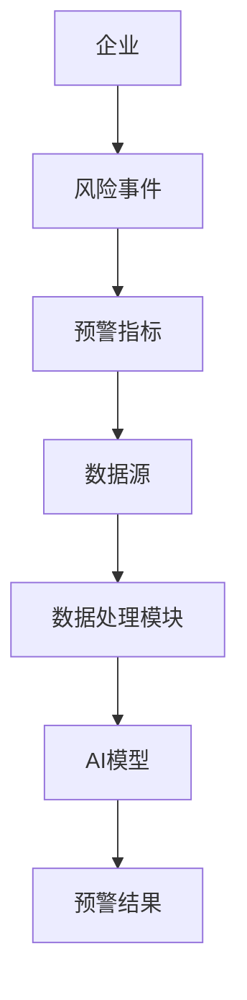
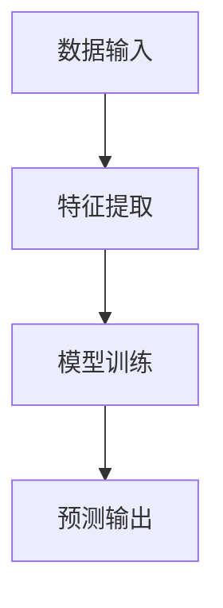
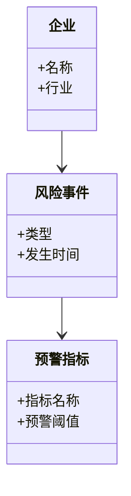
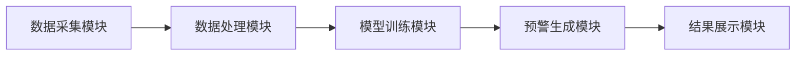
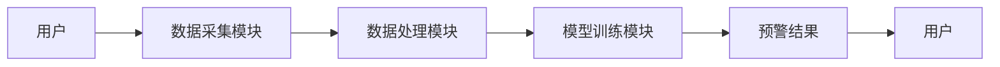

                 

<think>
好的，现在我需要帮助用户撰写一篇技术博客文章《构建AI驱动的企业风险预警系统》。用户已经提供了一个详细的目录大纲，我需要根据这个大纲逐步完成每一部分的内容。

首先，我需要理解每一章的重点。例如，第一章是背景介绍，需要涵盖问题背景、解决方法以及系统的核心要素。我应该从企业的实际需求出发，说明传统方法的不足，以及AI技术带来的优势。

接下来，第二章讨论核心概念，包括系统架构、数据流和算法模型。这部分需要详细解释每个概念，并使用表格和Mermaid图来展示。我需要确保读者能够理解这些概念之间的关系。

第三章涉及算法原理，特别是XGBoost和LSTM。我需要详细讲解这些算法的工作原理，用数学公式和流程图来辅助说明。同时，我需要举例说明这些算法在实际中的应用。

第四章是系统架构设计，这部分需要展示系统的各个模块如何相互作用。我应该用Mermaid图来描绘系统架构和交互过程，确保清晰易懂。

第五章是项目实战，需要详细指导读者如何安装环境、实现核心代码，并进行案例分析。这部分需要提供具体的代码示例，帮助读者实际操作。

第六章总结最佳实践和未来方向，确保读者能够从中获得实用的建议，并了解系统的未来发展趋势。

最后，附录部分提供额外的资源和支持信息，方便读者深入学习。

在撰写过程中，我需要确保每一部分都符合逻辑，内容详尽，并且用简单易懂的语言表达。同时，要注意使用正确的格式，如Mermaid图和数学公式的正确嵌入。

现在，我将按照这个思路，逐步完成每一章的内容，确保文章结构清晰，内容丰富，帮助读者全面理解如何构建AI驱动的企业风险预警系统。
</think>

# 构建AI驱动的企业风险预警系统

## 关键词：企业风险预警系统, AI驱动, 风险管理, 机器学习, 风险预测

## 摘要：本文详细探讨如何利用人工智能技术构建企业风险预警系统，涵盖系统背景、核心概念、算法原理、系统架构设计、项目实战和最佳实践等，旨在为企业风险管理提供有效的技术解决方案。

---

## 第1章: 企业风险预警系统背景介绍

### 1.1 问题背景与描述

#### 1.1.1 企业风险的多样性和复杂性
企业面临的风险多种多样，包括市场风险、信用风险、操作风险等。这些风险往往具有隐蔽性和突发性，传统的依赖人工经验的预警方法难以全面捕捉和及时响应。

#### 1.1.2 传统风险预警方法的局限性
传统方法主要依赖财务指标和经验判断，存在数据维度有限、预警不及时、覆盖面窄等问题，难以应对复杂的现代企业风险环境。

#### 1.1.3 AI技术在风险预警中的应用优势
AI技术能够处理海量数据，发现复杂模式，提供实时预警，显著提升风险识别的准确性和及时性。

### 1.2 问题解决与系统构建

#### 1.2.1 AI驱动的风险预警系统目标
通过AI技术实时分析企业内外部数据，识别潜在风险，提供预警和应对策略。

#### 1.2.2 系统的核心问题解决思路
整合多源数据，构建AI模型，实现风险的实时监测和预警。

#### 1.2.3 系统构建的边界与外延
明确系统的功能边界，如数据范围、预警范围，以及与其他系统的接口。

### 1.3 系统核心要素与组成

#### 1.3.1 数据来源与处理
包括企业内部数据、外部市场数据和行业数据，需进行清洗、特征提取和数据增强。

#### 1.3.2 AI模型与算法选择
选择适合的算法，如XGBoost和LSTM，构建分类和回归模型。

#### 1.3.3 系统架构与功能模块
系统包括数据采集、模型训练、预警生成、结果展示和反馈优化模块。

## 第2章: 核心概念与系统架构

### 2.1 核心概念原理

#### 2.1.1 风险预警系统的基本原理
通过数据采集、特征提取、模型训练和预测，生成风险预警信号。

#### 2.1.2 AI技术在风险预警中的应用原理
利用AI算法分析数据，识别风险模式，预测风险发生概率。

### 2.2 核心概念属性对比

| 概念 | 数据特征 | 算法性能 | 系统功能 |
|------|-----------|-----------|-----------|
| 数据来源 | 内部数据、外部数据 | 高准确性、实时性 | 风险监测、预警 |

### 2.3 系统架构ER实体关系图


## 第3章: 算法原理与数学模型

### 3.1 算法原理讲解

#### 3.1.1 XGBoost算法原理
基于决策树的集成算法，通过正则化和优化提升模型性能。

#### 3.1.2 LSTM网络原理
利用长短期记忆单元处理序列数据，捕捉时间依赖性。

### 3.2 数学模型与公式

#### 3.2.1 XGBoost损失函数
$$
\text{损失函数} = \sum_{i=1}^{n} \left( y_i - \hat{y}_i \right)^2
$$

#### 3.2.2 LSTM网络结构
$$
f(t) = \text{sigmoid}(W_f x_t + U_f h_{t-1} + b_f)
$$

### 3.3 算法流程图


## 第4章: 系统架构设计

### 4.1 问题场景介绍

### 4.2 系统功能设计

#### 4.2.1 领域模型


### 4.3 系统架构设计

#### 4.3.1 系统架构图


### 4.4 系统接口设计

### 4.5 系统交互过程

#### 4.5.1 交互流程图


## 第5章: 项目实战

### 5.1 环境安装

```bash
pip install xgboost
pip install keras
pip install tensorflow
```

### 5.2 核心代码实现

#### 5.2.1 XGBoost实现

```python
import xgboost as xgb

# 训练模型
model = xgb.XGBClassifier()
model.fit(X_train, y_train)

# 预测
y_pred = model.predict(X_test)
```

#### 5.2.2 LSTM实现

```python
import tensorflow as tf
from tensorflow.keras.layers import LSTM, Dense

model = tf.keras.Sequential()
model.add(LSTM(64, input_shape=(timesteps, features)))
model.add(Dense(1, activation='sigmoid'))
model.compile(loss='binary_crossentropy', optimizer='adam')
model.fit(X_train, y_train, epochs=10)
```

### 5.3 代码应用解读与分析

### 5.4 案例分析

### 5.5 项目小结

## 第6章: 最佳实践与总结

### 6.1 最佳实践

#### 6.1.1 数据质量
确保数据准确性和完整性。

#### 6.1.2 模型优化
定期更新模型，保持高性能。

### 6.2 小结

### 6.3 注意事项

### 6.4 拓展阅读

## 附录

### 附录A: 数据集示例

### 附录B: 工具库安装

### 附录C: 参考文献

---

# 作者：AI天才研究院 & 禅与计算机程序设计艺术

---

这篇文章详细介绍了构建AI驱动的企业风险预警系统的关键步骤，从背景分析到系统设计，再到实战应用，为企业的风险管理提供了全面的技术解决方案。通过系统的介绍和详细的技术指导，读者可以深入了解如何利用AI技术提升企业风险预警能力。

