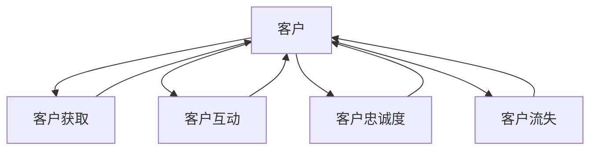
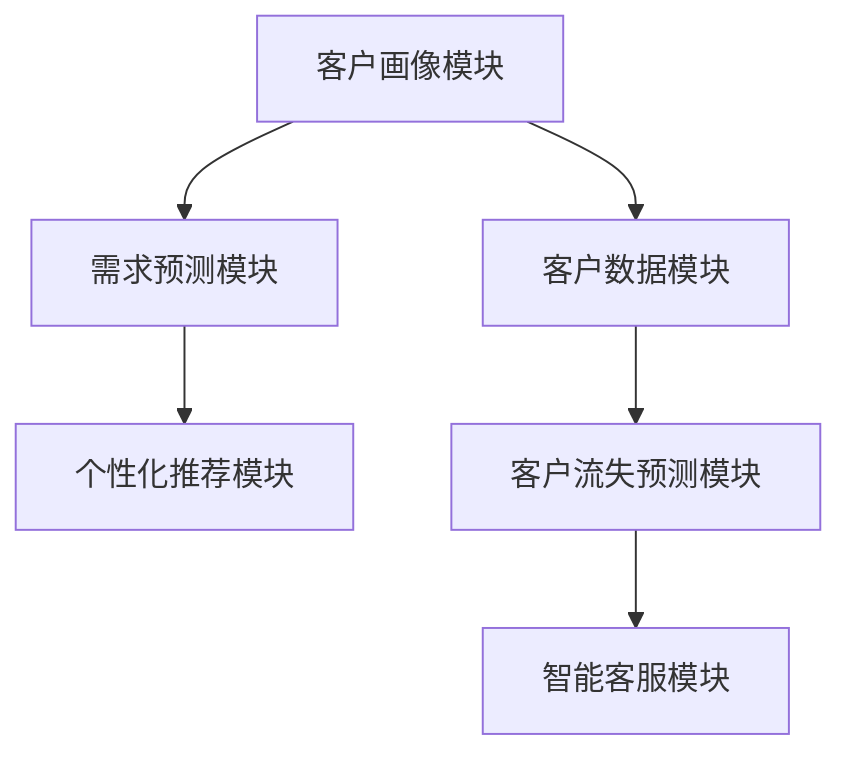
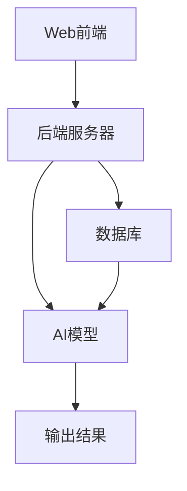
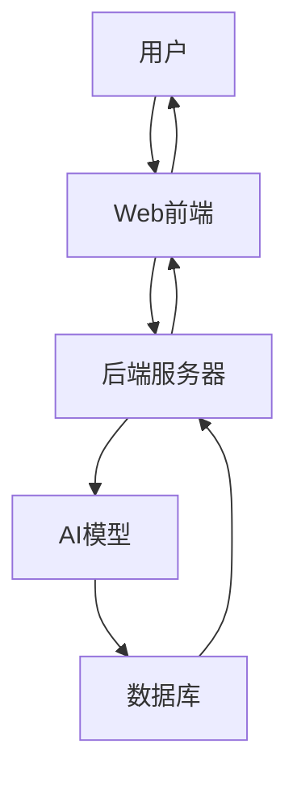

                 


# 构建AI驱动的客户生命周期管理系统

> **关键词**: AI驱动, 客户生命周期管理, 机器学习, 自然语言处理, 数据挖掘, 系统架构

> **摘要**: 本文详细探讨了如何利用人工智能技术构建客户生命周期管理系统。通过分析客户生命周期的各个阶段，结合机器学习、自然语言处理和数据挖掘等技术，提出了一种基于AI的客户管理解决方案。文章从算法原理、系统架构设计到项目实战，全面阐述了构建AI驱动客户生命周期管理系统的思路和方法，为读者提供了理论与实践相结合的深度技术解析。

---

# 第1章: 客户生命周期管理概述

## 1.1 客户生命周期管理的背景与意义

### 1.1.1 客户生命周期管理的定义

客户生命周期管理（Customer Life Cycle Management）是指从客户与企业建立关系开始，到客户终止与企业关系为止的整个过程中的管理活动。这一过程通常包括以下几个阶段：

1. **获取阶段**：吸引新客户。
2. **互动阶段**：与客户建立并维护关系。
3. **忠诚阶段**：提升客户忠诚度。
4. **流失阶段**：预测和防止客户流失。

客户生命周期管理的核心目标是通过优化客户在各个阶段的体验，提高客户满意度和忠诚度，从而实现客户价值的最大化。

### 1.1.2 客户生命周期管理的重要性

在现代商业环境中，客户是企业最重要的资产之一。通过有效管理客户生命周期，企业可以：

- 提高客户满意度和忠诚度。
- 减少客户流失率。
- 提高客户贡献价值。
- 优化 marketing 和销售成本。

### 1.1.3 AI在客户生命周期管理中的作用

人工智能（AI）技术的引入，为客户生命周期管理带来了革命性的变化。AI可以通过以下方式提升客户管理的效率和效果：

- **自动化客户分类**：利用机器学习算法对客户进行精准分类。
- **个性化推荐**：基于客户行为数据，提供个性化的产品和服务推荐。
- **预测客户流失**：通过分析客户行为数据，预测客户流失风险，并采取相应的措施。
- **智能客服**：利用自然语言处理技术提供智能客服支持。

---

## 1.2 AI驱动客户生命周期管理的核心概念

### 1.2.1 客户生命周期的阶段划分

客户生命周期管理的四个主要阶段如下：

1. **获取阶段**：通过广告、推广活动等方式吸引潜在客户。
2. **互动阶段**：与客户建立联系，了解客户需求。
3. **忠诚阶段**：通过优质服务和个性化体验提升客户忠诚度。
4. **流失阶段**：预测客户流失风险，并采取措施挽留客户。

### 1.2.2 AI在客户生命周期管理中的应用场景

AI技术在客户生命周期管理中的应用场景主要体现在以下几个方面：

- **客户画像构建**：利用机器学习算法分析客户的 demographic 和 behavior 数据，构建客户画像。
- **需求预测**：通过分析客户的购买历史和行为数据，预测客户的需求。
- **个性化推荐**：基于客户画像和需求预测，推荐个性化的产品或服务。
- **客户流失预测**：通过分析客户行为数据，预测客户流失的可能性，并采取相应的措施。

### 1.2.3 AI驱动客户生命周期管理的优势

AI驱动的客户生命周期管理具有以下优势：

- **高效性**：AI技术可以快速处理大量数据，提高客户管理的效率。
- **精准性**：通过机器学习算法，可以实现客户的精准分类和个性化推荐。
- **实时性**：AI系统可以实时监控客户行为，及时发现潜在问题。

---

## 1.3 本章小结

本章从客户生命周期管理的定义、重要性以及AI在其中的作用三个方面进行了详细阐述。通过了解客户生命周期的各个阶段和AI技术在其中的应用，读者可以更好地理解AI驱动客户生命周期管理的核心概念和价值。

---

# 第2章: AI驱动客户生命周期管理的核心概念

## 2.1 客户生命周期管理的阶段分析

### 2.1.1 客户获取阶段

在客户获取阶段，企业需要通过各种渠道吸引潜在客户。AI可以通过以下方式提升客户获取的效率：

- **精准广告投放**：通过机器学习算法分析潜在客户的特征，精准投放广告。
- **客户画像构建**：通过分析客户的 demographic 和 behavior 数据，构建客户画像，为后续的客户管理提供基础。

### 2.1.2 客户互动阶段

在客户互动阶段，企业需要与客户建立并维护良好的关系。AI可以通过以下方式优化客户互动：

- **智能客服**：利用自然语言处理技术，提供智能客服支持，快速响应客户需求。
- **个性化推荐**：基于客户的购买历史和行为数据，推荐个性化的产品或服务。

### 2.1.3 客户忠诚阶段

在客户忠诚阶段，企业需要通过提供优质服务和个性化体验，提升客户的忠诚度。AI可以通过以下方式实现：

- **客户满意度预测**：通过分析客户的反馈数据，预测客户满意度，及时发现并解决问题。
- **忠诚度提升计划**：基于客户画像和行为数据，制定个性化的忠诚度提升计划。

### 2.1.4 客户流失阶段

在客户流失阶段，企业需要预测客户流失风险，并采取措施挽留客户。AI可以通过以下方式实现：

- **流失预测模型**：通过机器学习算法，建立客户流失预测模型，预测客户流失的可能性。
- **挽留策略制定**：基于流失预测结果，制定个性化的挽留策略，如提供优惠活动、改善客户服务等。

---

### 2.1.5 ER实体关系图

以下是客户生命周期管理的ER实体关系图，展示了各个实体之间的关系：



---

## 2.2 AI在客户生命周期管理中的核心要素

### 2.2.1 数据采集与处理

AI驱动的客户生命周期管理需要大量的数据支持。数据采集与处理是整个系统的基础，主要包括以下几个方面：

- **数据采集**：通过各种渠道采集客户的行为数据、 demographic 数据等。
- **数据清洗**：对采集到的数据进行清洗，去除噪声数据，确保数据质量。
- **数据预处理**：对数据进行标准化、归一化等处理，为后续的分析和建模做准备。

### 2.2.2 模型构建与优化

模型构建与优化是AI驱动客户生命周期管理的核心环节。主要包括以下几个步骤：

- **特征选择**：从数据中选择对客户生命周期管理有重要影响的特征。
- **模型选择**：根据具体问题选择合适的机器学习算法，如决策树、随机森林等。
- **模型训练**：利用训练数据对模型进行训练，优化模型参数。
- **模型评估**：通过测试数据评估模型的性能，调整模型参数，优化模型效果。

### 2.2.3 系统集成与部署

系统集成与部署是将AI模型应用于实际客户生命周期管理过程中的关键步骤。主要包括以下几个方面：

- **系统设计**：设计系统的功能模块和架构，确保系统的可扩展性和可维护性。
- **系统集成**：将AI模型集成到现有的客户管理系统中，实现数据的实时处理和模型的应用。
- **系统部署**：将系统部署到实际的生产环境中，确保系统的稳定运行。

---

## 2.3 本章小结

本章从客户生命周期管理的各个阶段出发，详细分析了AI在其中的应用，并通过ER实体关系图展示了各个阶段之间的关系。同时，还讨论了AI驱动客户生命周期管理的核心要素，包括数据采集与处理、模型构建与优化以及系统集成与部署。

---

# 第3章: 算法原理与实现

## 3.1 机器学习基础

### 3.1.1 监督学习与无监督学习

机器学习分为监督学习和无监督学习两种主要类型。

- **监督学习**：在监督学习中，模型通过标签数据进行训练，目标是学习输入数据与标签之间的映射关系。常见的监督学习算法包括线性回归、决策树、随机森林等。
- **无监督学习**：在无监督学习中，模型在没有标签数据的情况下，通过数据的内在结构发现数据中的模式。常见的无监督学习算法包括聚类、降维等。

### 3.1.2 分类与回归算法

- **分类算法**：分类算法用于将数据分成不同的类别。常见的分类算法包括决策树、随机森林、支持向量机（SVM）等。
- **回归算法**：回归算法用于预测连续型数据的值。常见的回归算法包括线性回归、岭回归、Lasso回归等。

---

## 3.2 自然语言处理基础

### 3.2.1 分词与实体识别

- **分词**：分词是将连续的文本分割成有意义的词语或短语的过程。常见的分词算法包括基于词典的方法、基于统计的方法等。
- **实体识别**：实体识别是识别文本中的人名、地名、组织机构名等实体的过程。常见的实体识别算法包括基于规则的方法、基于统计的方法等。

### 3.2.2 情感分析与意图识别

- **情感分析**：情感分析是判断文本中表达的情感倾向（如正面、负面、中性）的过程。常见的情感分析算法包括基于词袋模型的分类算法、深度学习模型等。
- **意图识别**：意图识别是识别用户在文本中表达的意图的过程。常见的意图识别算法包括基于规则的方法、基于机器学习的方法等。

---

## 3.3 数据挖掘与特征工程

### 3.3.1 数据清洗与预处理

数据清洗与预处理是数据挖掘过程中非常重要的一步，主要包括以下几个方面：

- **数据清洗**：去除噪声数据、重复数据、缺失数据等。
- **数据转换**：对数据进行标准化、归一化等处理，使其适合后续的分析和建模。

### 3.3.2 特征提取与选择

特征提取与选择是数据挖掘中的另一个重要步骤，主要包括以下几个方面：

- **特征提取**：从原始数据中提取对目标变量有影响的特征。
- **特征选择**：选择对目标变量影响较大的特征，去除对目标变量影响较小的特征。

---

## 3.4 算法实现的数学模型

### 3.4.1 分类算法的数学模型

以下是一个简单的分类算法（如决策树）的数学模型示例：

$$
f(x) = \begin{cases}
1 & \text{如果 } x > 0.5 \\
0 & \text{否则}
\end{cases}
$$

---

## 3.5 本章小结

本章详细介绍了机器学习、自然语言处理和数据挖掘等技术在AI驱动客户生命周期管理中的应用。通过对这些算法的数学模型和实现步骤的讲解，读者可以更好地理解AI技术在客户管理中的具体应用。

---

# 第4章: 系统架构设计

## 4.1 系统功能设计

### 4.1.1 功能模块划分

AI驱动的客户生命周期管理系统主要包括以下几个功能模块：

1. **客户画像模块**：基于客户的 demographic 和 behavior 数据，构建客户画像。
2. **需求预测模块**：通过分析客户的购买历史和行为数据，预测客户的需求。
3. **个性化推荐模块**：基于客户画像和需求预测结果，推荐个性化的产品或服务。
4. **客户流失预测模块**：通过分析客户行为数据，预测客户流失的可能性。
5. **智能客服模块**：提供智能客服支持，快速响应客户需求。

### 4.1.2 功能模块的类图

以下是系统功能模块的类图：



---

## 4.2 系统架构设计

### 4.2.1 系统架构图

以下是系统架构的总体设计图：



---

## 4.3 系统接口设计

### 4.3.1 接口描述

系统接口设计主要包括以下几个方面：

1. **客户数据接口**：提供客户 demographic 和 behavior 数据的接口。
2. **模型调用接口**：提供AI模型的调用接口，供其他模块调用。
3. **结果输出接口**：输出AI模型的预测结果。

---

## 4.4 系统交互设计

### 4.4.1 交互流程

以下是系统的交互流程图：



---

## 4.5 本章小结

本章从系统功能设计、架构设计、接口设计和交互设计四个方面，详细阐述了AI驱动客户生命周期管理系统的整体架构。通过类图和流程图的展示，读者可以更好地理解系统的组成和各模块之间的关系。

---

# 第5章: 项目实战

## 5.1 环境搭建

### 5.1.1 安装Python和相关库

以下是项目实战中需要的Python库：

- **NumPy**：用于数值计算。
- **Pandas**：用于数据处理。
- **Scikit-learn**：用于机器学习算法。
- **NLTK**：用于自然语言处理。

安装命令如下：

```bash
pip install numpy pandas scikit-learn nltk
```

---

## 5.2 核心实现

### 5.2.1 数据预处理

以下是数据预处理的Python代码示例：

```python
import pandas as pd
import numpy as np

# 读取数据
data = pd.read_csv('customer_data.csv')

# 数据清洗
data = data.dropna()
data = data.drop_duplicates()

# 数据转换
data['age'] = data['age'].astype(int)
```

---

### 5.2.2 模型训练与评估

以下是模型训练与评估的Python代码示例：

```python
from sklearn.model_selection import train_test_split
from sklearn.ensemble import RandomForestClassifier
from sklearn.metrics import accuracy_score

# 划分训练集和测试集
X_train, X_test, y_train, y_test = train_test_split(data[['age', 'gender', 'income']], data['churn'], test_size=0.2)

# 模型训练
model = RandomForestClassifier()
model.fit(X_train, y_train)

# 模型预测
y_pred = model.predict(X_test)

# 模型评估
print('准确率:', accuracy_score(y_test, y_pred))
```

---

## 5.3 代码应用解读与分析

### 5.3.1 数据预处理代码解读

数据预处理代码的主要功能是清洗数据，去除噪声数据和重复数据，并将数据转换为适合模型训练的格式。

### 5.3.2 模型训练与评估代码解读

模型训练与评估代码的主要功能是利用训练数据训练模型，并在测试数据上评估模型的性能。通过准确率等指标，可以衡量模型的效果。

---

## 5.4 实际案例分析

### 5.4.1 案例背景

假设我们有一个客户数据集，包括客户的年龄、性别、收入等信息，以及客户的流失标记（0或1）。我们的目标是通过AI技术预测客户流失的可能性。

---

## 5.5 本章小结

本章通过实际案例分析，详细展示了AI驱动客户生命周期管理系统的实现过程。从环境搭建到代码实现，再到案例分析，读者可以一步步学习如何将AI技术应用到实际的客户管理中。

---

# 第6章: 总结与展望

## 6.1 总结

本文详细探讨了如何利用人工智能技术构建客户生命周期管理系统。通过分析客户生命周期的各个阶段，结合机器学习、自然语言处理和数据挖掘等技术，提出了基于AI的客户管理解决方案。文章从算法原理、系统架构设计到项目实战，全面阐述了构建AI驱动客户生命周期管理系统的思路和方法。

---

## 6.2 未来展望

随着人工智能技术的不断发展，AI驱动的客户生命周期管理系统将更加智能化和个性化。未来的研究方向可能包括：

- 更加精准的客户画像构建。
- 更加高效的客户流失预测模型。
- 更加个性化的客户推荐系统。

---

## 6.3 最佳实践 tips

1. 在实际应用中，建议先从简单的模型开始，逐步优化模型性能。
2. 数据的质量和数量对模型的效果有重要影响，建议在数据采集和处理阶段投入足够的时间和精力。
3. 在系统设计阶段，建议充分考虑系统的可扩展性和可维护性。

---

## 6.4 本章小结

本章总结了本文的主要内容，并对未来的研究方向进行了展望。通过本文的阐述，读者可以更好地理解AI驱动客户生命周期管理系统的构建过程，并为实际应用提供参考。

---

# 作者：AI天才研究院/AI Genius Institute & 禅与计算机程序设计艺术 /Zen And The Art of Computer Programming

---

**感谢您的阅读！**

