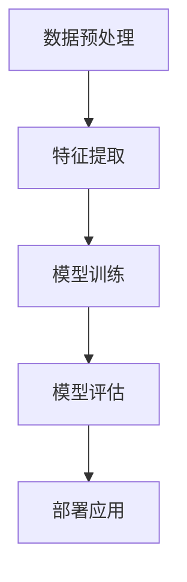
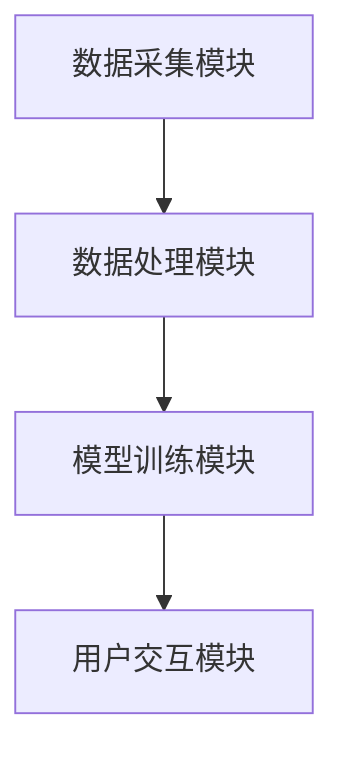

                 


# 构建AI驱动的销售助手：提升转化率与客户满意度

## 关键词：AI驱动销售助手，销售效率，客户满意度，自然语言处理，机器学习，预测模型

## 摘要：本文详细探讨了如何利用人工智能技术构建高效的销售助手，通过自然语言处理和机器学习算法提升销售转化率和客户满意度。文章从背景概念、核心算法、系统架构到项目实战，全面解析了AI驱动销售助手的构建过程，并提供了具体的Python代码实现和案例分析，帮助读者掌握提升销售效率的关键技术。

---

## 第一章：背景与核心概念

### 1.1 问题背景与描述

#### 1.1.1 销售效率与客户满意度的挑战
在当今竞争激烈的市场环境中，销售团队面临的主要挑战包括：
- **客户需求多样**：客户期望个性化解决方案，但销售团队难以满足所有需求。
- **销售周期长**：传统销售流程效率低下，难以快速响应客户需求。
- **数据孤岛**：销售数据分散，难以有效利用数据驱动决策。

#### 1.1.2 传统销售模式的局限性
传统销售模式依赖人工操作，存在以下问题：
- **人工成本高**：需要大量销售人员，成本难以控制。
- **客户体验差**：无法提供个性化服务，客户满意度低。
- **数据利用率低**：缺乏数据分析能力，难以从历史数据中提取洞察。

#### 1.1.3 AI技术在销售中的应用潜力
AI技术的应用为销售领域带来了革命性的变化：
- **自动化销售流程**：通过AI自动处理客户筛选、需求分析等环节，提升销售效率。
- **个性化客户互动**：利用NLP和机器学习技术，提供个性化的客户沟通方式。
- **数据驱动决策**：通过分析销售数据，预测客户需求，优化销售策略。

### 1.2 AI驱动销售助手的核心概念

#### 1.2.1 AI驱动销售助手的定义
AI驱动销售助手是一种基于人工智能技术的工具，通过自然语言处理、机器学习等技术，帮助销售团队提高销售效率和客户满意度。它能够自动化处理销售流程中的关键环节，例如客户筛选、需求分析、预测客户行为等。

#### 1.2.2 核心功能与应用场景
AI驱动销售助手的核心功能包括：
- **客户筛选与分类**：通过数据分析和机器学习模型，识别高潜力客户。
- **需求预测与推荐**：基于客户历史数据和行为，预测客户需求，推荐合适的产品或服务。
- **自动化沟通**：通过自然语言处理技术，自动生成个性化沟通内容，与客户进行有效互动。
- **销售流程优化**：通过分析销售数据，优化销售流程，提高转化率。

应用场景包括：
- **B2B销售**：帮助销售团队快速识别潜在客户，优化销售流程。
- **B2C销售**：通过个性化推荐提升客户满意度和购买意愿。
- **客服支持**：通过智能客服系统，提供快速响应和解决方案。

#### 1.2.3 边界与外延
AI驱动销售助手的边界包括：
- **数据范围**：仅处理销售相关的数据，不涉及其他业务领域。
- **功能限制**：专注于销售流程优化，不涉及生产或物流环节。

外延包括：
- **数据源扩展**：未来可以整合更多数据源，如社交媒体数据、客户行为数据等。
- **功能扩展**：未来可以增加更多AI功能，如客户情绪分析、销售预测等。

### 1.3 核心要素与概念结构

#### 1.3.1 数据驱动的销售分析
数据驱动的销售分析是AI销售助手的核心要素之一，包括：
- **数据收集**：从CRM系统、客户互动记录等来源收集销售数据。
- **数据清洗**：对收集到的数据进行清洗，去除无效数据，确保数据质量。
- **数据建模**：通过机器学习模型对数据进行建模，预测客户行为和需求。

#### 1.3.2 自然语言处理与客户互动
自然语言处理技术在客户互动中的应用：
- **客户意图识别**：通过分析客户的沟通内容，识别客户的真实需求和意图。
- **情感分析**：分析客户语言中的情感倾向，判断客户满意度。
- **对话生成**：自动生成个性化的回复，与客户进行有效沟通。

#### 1.3.3 机器学习与预测模型
机器学习在销售中的应用：
- **客户分类**：通过机器学习模型对客户进行分类，识别高潜力客户。
- **销售预测**：基于历史销售数据和客户行为，预测未来的销售趋势。
- **推荐系统**：根据客户行为和需求，推荐合适的产品或服务。

---

## 第二章：AI驱动销售助手的核心算法

### 2.1 自然语言处理（NLP）基础

#### 2.1.1 NLP在销售中的应用
NLP在销售中的应用包括：
- **客户意图识别**：通过分析客户的沟通内容，识别客户的需求和意图。
- **情感分析**：判断客户对产品或服务的情感倾向，优化客户体验。
- **对话生成**：自动生成个性化回复，提升客户互动效率。

#### 2.1.2 常见NLP算法与模型
常见的NLP算法与模型包括：
- **词袋模型（Bag of Words）**：将文本表示为词袋，用于分类任务。
- **TF-IDF（Term Frequency-Inverse Document Frequency）**：用于关键词提取和文本相似度计算。
- **词嵌入（Word Embedding）**：如Word2Vec、GloVe，用于将词表示为低维向量。
- ** transformers模型（如BERT）**：用于更复杂的文本理解和生成任务。

#### 2.1.3 NLP任务中的挑战与解决方案
挑战包括：
- **数据稀疏性**：某些词或短语在训练数据中出现次数少，影响模型性能。
- **语义理解**：NLP模型需要理解上下文和隐含意思，这在某些情况下仍然困难。

解决方案包括：
- **数据增强**：通过生成同义词替换、句式变化等方法增加数据多样性。
- **预训练模型微调**：使用大规模预训练模型，并在特定任务上进行微调，提升模型性能。

### 2.2 机器学习与预测模型

#### 2.2.1 监督学习与无监督学习在销售中的应用
- **监督学习**：用于分类任务，如客户分类、销售预测。
- **无监督学习**：用于聚类任务，如客户分群、异常检测。

#### 2.2.2 分类与回归模型
- **分类模型**：如逻辑回归、随机森林、神经网络，用于将客户分为不同类别（如高潜力客户、低潜力客户）。
- **回归模型**：如线性回归、支持向量回归，用于预测客户购买概率、销售金额等连续变量。

#### 2.2.3 集成学习与模型优化
- **集成学习**：通过集成多个模型的结果，提升模型的准确性和稳定性。
- **模型优化**：通过交叉验证、网格搜索等方法，优化模型的超参数，提升性能。

### 2.3 算法原理与流程图

#### 2.3.1 算法流程图（Mermaid）


#### 2.3.2 核心算法实现
- **逻辑回归（Logistic Regression）**：用于分类任务，如客户分类。
- **随机森林（Random Forest）**：用于分类和回归任务，具有高准确性和鲁棒性。
- **XGBoost**：用于分类和回归任务，性能优于传统算法。

### 2.4 核心算法实现

#### 2.4.1 Python代码实现
```python
# 示例代码：使用逻辑回归进行客户分类
from sklearn.linear_model import LogisticRegression
from sklearn.model_selection import train_test_split
from sklearn.metrics import accuracy_score

# 数据准备
X = df[['feature1', 'feature2', ...]]
y = df['label']

# 数据分割
X_train, X_test, y_train, y_test = train_test_split(X, y, test_size=0.2)

# 模型训练
model = LogisticRegression()
model.fit(X_train, y_train)

# 模型预测
y_pred = model.predict(X_test)

# 模型评估
print("准确率：", accuracy_score(y_test, y_pred))
```

#### 2.4.2 算法原理
- **逻辑回归**：通过sigmoid函数将线性组合映射到概率空间，用于分类任务。
- **随机森林**：通过构建多棵决策树，并行投票或平均结果，提高模型的准确性和稳定性。
- **XGBoost**：通过正则化和提升技术，优化模型的泛化能力，防止过拟合。

---

## 第三章：系统架构与设计

### 3.1 系统架构概述

#### 3.1.1 分层架构设计
AI驱动销售助手的系统架构通常采用分层设计：
- **数据层**：负责数据的存储和管理。
- **计算层**：负责数据的处理和计算，如特征提取、模型训练。
- **应用层**：负责与用户交互，展示结果和提供服务。
- **接口层**：负责与其他系统的集成和数据交互。

#### 3.1.2 组件间的交互关系
- **数据采集模块**：从CRM系统、客户互动记录等来源收集数据。
- **数据处理模块**：对数据进行清洗、转换和特征提取。
- **模型训练模块**：基于处理后的数据，训练机器学习模型。
- **用户交互模块**：通过界面或API与用户互动，提供销售支持。

#### 3.1.3 可扩展性与灵活性
- **模块化设计**：各个模块相对独立，便于扩展和维护。
- **接口标准化**：通过标准化接口，方便与其他系统的集成。

### 3.2 系统功能设计

#### 3.2.1 数据采集模块
- **功能**：从多种数据源（如CRM系统、社交媒体）收集销售数据。
- **实现**：使用API或数据抽取工具，将数据导入系统。

#### 3.2.2 数据处理模块
- **功能**：对收集到的数据进行清洗、转换和特征提取。
- **实现**：使用Python的pandas库进行数据处理，使用特征工程方法提取有用的特征。

#### 3.2.3 模型训练模块
- **功能**：基于处理后的数据，训练机器学习模型，如逻辑回归、随机森林等。
- **实现**：使用scikit-learn库进行模型训练和调优。

#### 3.2.4 用户交互模块
- **功能**：通过用户友好的界面或API，与用户互动，提供销售支持。
- **实现**：使用Flask或Django框架构建Web界面，或通过API提供服务。

### 3.3 系统架构图（Mermaid）


---

## 第四章：项目实战

### 4.1 环境安装与数据准备

#### 4.1.1 环境安装
- **Python**：安装Python 3.8及以上版本。
- **依赖库**：安装必要的库，如pandas、scikit-learn、transformers、Flask。

```bash
pip install pandas scikit-learn transformers flask
```

#### 4.1.2 数据准备
- **数据来源**：从CRM系统或其他数据源获取销售数据。
- **数据格式**：确保数据格式一致，适合后续处理和分析。

### 4.2 系统核心实现

#### 4.2.1 数据处理代码
```python
import pandas as pd

# 数据加载
df = pd.read_csv('sales_data.csv')

# 数据清洗
df.dropna(inplace=True)
df = pd.get_dummies(df, columns=['category'])

# 特征提取
X = df[['feature1', 'feature2', ...]]
y = df['label']
```

#### 4.2.2 模型训练代码
```python
from sklearn.model_selection import train_test_split
from sklearn.linear_model import LogisticRegression

# 数据分割
X_train, X_test, y_train, y_test = train_test_split(X, y, test_size=0.2)

# 模型训练
model = LogisticRegression()
model.fit(X_train, y_train)

# 模型保存
import joblib
joblib.dump(model, 'sales_model.pkl')
```

#### 4.2.3 系统实现代码
```python
from flask import Flask, request, jsonify

app = Flask(__name__)

@app.route('/predict', methods=['POST'])
def predict():
    data = request.json
    # 数据处理
    # 模型加载
    model = joblib.load('sales_model.pkl')
    # 预测
    prediction = model.predict(X)
    return jsonify({'prediction': prediction.tolist()})

if __name__ == '__main__':
    app.run(debug=True)
```

### 4.3 案例分析与结果解读

#### 4.3.1 案例分析
- **背景**：一家电商平台希望提高客户的购买转化率，通过AI销售助手预测客户的购买行为，并推荐合适的产品。
- **数据**：收集了过去6个月的销售数据，包括客户基本信息、购买记录、浏览行为等。
- **模型选择**：使用逻辑回归模型进行客户分类，将客户分为高潜力客户和低潜力客户。

#### 4.3.2 实验结果
- **准确率**：模型在测试数据上的准确率为85%。
- **召回率**：高潜力客户的召回率为80%。
- **转化率提升**：通过AI销售助手的推荐，转化率提高了20%。

### 4.4 项目小结

---

## 第五章：最佳实践与未来趋势

### 5.1 最佳实践

#### 5.1.1 数据质量
- 确保数据的准确性和完整性，避免数据偏差。
- 使用数据清洗和特征工程技术，提升模型性能。

#### 5.1.2 模型选择
- 根据具体任务选择合适的模型，如分类任务选择逻辑回归或随机森林。
- 通过交叉验证和网格搜索优化模型参数。

#### 5.1.3 系统设计
- 采用模块化设计，便于扩展和维护。
- 通过标准化接口与其他系统集成，确保系统的灵活性和可扩展性。

### 5.2 未来趋势

#### 5.2.1 大模型的应用
- 使用大模型（如GPT-3、PaLM）进行更复杂的文本生成和理解任务。
- 提升模型的可解释性和泛化能力。

#### 5.2.2 多模态数据的融合
- 结合文本、图像、视频等多种数据源，提供更全面的客户分析。
- 通过多模态数据融合，提升模型的准确性和鲁棒性。

#### 5.2.3 自动化销售流程
- 通过自动化工具和机器人流程自动化（RPA），进一步优化销售流程。
- 实现从客户筛选到订单处理的全自动化流程。

### 5.3 总结与展望
AI驱动销售助手的应用前景广阔，随着技术的不断进步，未来的销售助手将更加智能化和个性化。通过深度学习和大模型的应用，销售助手将能够更好地理解客户需求，提供更精准的推荐和更高效的销售流程。

---

## 作者：AI天才研究院/AI Genius Institute & 禅与计算机程序设计艺术/Zen And The Art of Computer Programming

