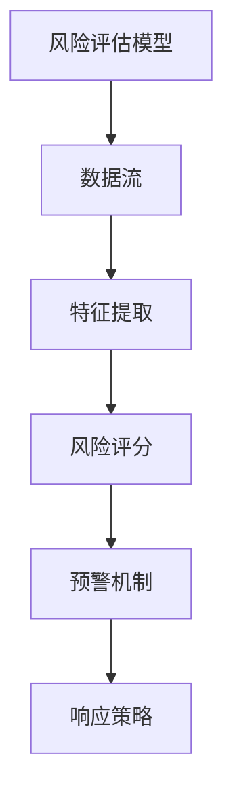
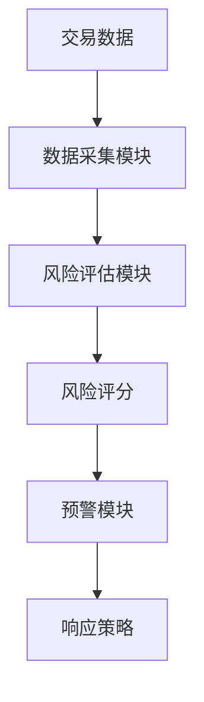
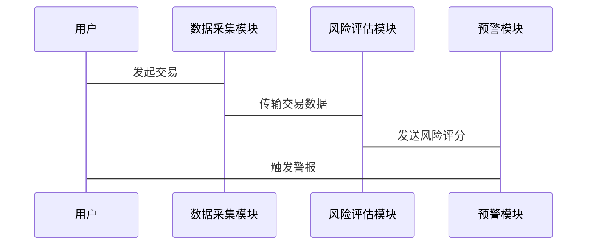

                 


# 构建AI驱动的风控系统：实时监控与风险预警

> 关键词：AI风控系统、实时监控、风险预警、时间序列分析、异常检测、系统架构设计

> 摘要：本文详细介绍了如何构建一个AI驱动的风控系统，重点探讨了实时监控与风险预警的核心技术。通过分析AI在风控系统中的应用，结合时间序列分析、异常检测等算法，阐述了如何利用这些技术实现高效的风险预警。同时，本文还提供了系统架构设计、项目实战和最佳实践等实用内容，帮助读者全面理解并掌握构建AI驱动的风控系统的全过程。

---

# 第一部分：AI驱动的风控系统概述

## 第1章：风控系统与AI驱动技术的结合

### 1.1 风险控制与实时监控的重要性

#### 1.1.1 风险控制的基本概念
风险控制是通过识别、评估和应对潜在风险，以降低或消除其对系统或业务的影响。在金融、医疗、交通等领域，风险控制是保障系统稳定运行的核心任务。

#### 1.1.2 实时监控在金融领域的应用
实时监控是指通过实时数据流分析，快速识别异常情况并发出预警。在金融领域，实时监控常用于欺诈检测、市场波动监测和交易风险管理。

#### 1.1.3 AI技术在风险预警中的作用
AI技术通过机器学习算法，能够从海量数据中发现潜在风险模式，显著提高风险预警的准确性和实时性。AI驱动的风控系统能够自动调整模型参数，适应数据变化，从而实现更高效的预警。

---

### 1.2 AI驱动风控系统的背景与现状

#### 1.2.1 传统风控系统的局限性
传统风控系统通常依赖规则引擎或简单的统计模型，难以应对复杂多变的实时风险。其局限性包括计算效率低、模型更新慢、难以处理非结构化数据等。

#### 1.2.2 AI技术如何提升风控能力
AI技术通过引入深度学习、时间序列分析等方法，能够更精准地识别风险特征，并实现模型的自动优化。此外，AI还能够处理非结构化数据，如文本、图像等，显著扩展了风控系统的应用范围。

#### 1.2.3 当前市场中的AI驱动风控系统实例
当前，许多金融机构已经开始采用AI驱动的风控系统。例如，某银行通过实时分析交易数据，利用深度学习模型预测欺诈交易，显著降低了欺诈风险。

---

### 1.3 风险预警的核心要素

#### 1.3.1 数据采集与处理
数据采集是风控系统的第一步，主要包括数据源的选择、数据清洗和特征提取。高质量的数据是模型准确性的基础。

#### 1.3.2 风险评估模型
风险评估模型是风控系统的核心，用于将数据转化为风险评分或预警信号。常用的模型包括逻辑回归、随机森林、神经网络等。

#### 1.3.3 预警机制与响应策略
预警机制是指在检测到潜在风险时，系统自动触发警报并执行预定义的响应策略。响应策略可能包括暂停交易、调整信用额度或通知相关负责人。

---

# 第二部分：AI驱动风控系统的理论基础

## 第2章：AI驱动风控系统的理论基础

### 2.1 数据流与风险评估模型

#### 2.1.1 数据流的定义与分类
数据流是指在系统中流动的数据，包括输入数据、处理数据和输出数据。数据流可以分为结构化数据和非结构化数据。

#### 2.1.2 风险评估模型的构建
风险评估模型的构建包括特征选择、模型训练和模型验证三个步骤。特征选择是关键，直接影响模型的性能。

#### 2.1.3 数据流与模型的关系
数据流为模型提供输入，模型通过分析数据流生成风险评分。数据流的质量和数量直接影响模型的性能。

---

### 2.2 核心概念与联系

#### 2.2.1 AI驱动风控系统的核心概念
AI驱动风控系统的核心概念包括数据流、风险评估模型和预警机制。

#### 2.2.2 概念属性特征对比表格
| 概念       | 属性               | 特征               |
|------------|--------------------|--------------------|
| 数据流     | 输入数据           | 结构化与非结构化    |
| 风险评估模型 | 分析工具           | 逻辑回归、神经网络  |
| 预警机制   | 响应策略           | 自动触发警报       |

#### 2.2.3 ER实体关系图架构的Mermaid流程图


---

### 2.3 算法原理

#### 2.3.1 时间序列分析
时间序列分析是一种统计方法，用于分析随时间变化的数据。常用算法包括ARIMA、GARCH等。

#### 2.3.2 异常检测
异常检测是指识别数据中的异常值。常用方法包括基于统计的孤立森林和基于机器学习的Isolation Forest算法。

#### 2.3.3 风险评估模型
风险评估模型可以通过逻辑回归或神经网络构建。例如，逻辑回归模型可以用于二分类任务，预测交易是否为欺诈。

---

## 第3章：系统分析与架构设计方案

### 3.1 问题场景介绍

#### 3.1.1 风险监控的场景分析
在金融交易中，实时监控交易数据，识别异常交易行为，预防欺诈。

#### 3.1.2 系统的目标与范围
系统目标是实现实时风险预警，降低欺诈交易风险。系统范围包括数据采集、模型训练和预警触发。

#### 3.1.3 系统的约束与假设
数据实时性要求高，系统必须支持高并发；模型需要定期更新，以适应数据分布的变化。

---

### 3.2 系统功能设计

#### 3.2.1 风险数据采集模块
负责采集交易数据，包括交易时间、金额、地点等。

#### 3.2.2 风险评估模块
负责对交易数据进行分析，生成风险评分。

#### 3.2.3 风险预警模块
负责根据风险评分触发预警，并执行响应策略。

---

### 3.3 系统架构设计

#### 3.3.1 系统架构图的Mermaid流程图


#### 3.3.2 系统接口设计
系统接口包括数据采集接口、模型调用接口和预警触发接口。

#### 3.3.3 系统交互的Mermaid序列图


---

## 第4章：项目实战

### 4.1 环境安装与配置

#### 4.1.1 Python环境的安装
安装Python 3.8以上版本，推荐使用Anaconda。

#### 4.1.2 相关库的安装
安装numpy、pandas、scikit-learn、tensorflow等库。

#### 4.1.3 数据库的配置
选择一个数据库，如MySQL或MongoDB，用于存储交易数据。

---

### 4.2 系统核心实现

#### 4.2.1 数据采集模块
```python
import pandas as pd
import requests

# 从API获取交易数据
response = requests.get('https://api.example.com/transactions')
data = response.json()
df = pd.DataFrame(data)
```

#### 4.2.2 风险评估模块
```python
from sklearn.linear_model import LogisticRegression
from sklearn.model_selection import train_test_split

# 数据预处理
X = df.drop('label', axis=1)
y = df['label']

X_train, X_test, y_train, y_test = train_test_split(X, y, test_size=0.2)

# 训练逻辑回归模型
model = LogisticRegression()
model.fit(X_train, y_train)
```

#### 4.2.3 风险预警模块
```python
# 实时监控交易数据
def monitor_transactions():
    while True:
        transaction = get_next_transaction()
        prediction = model.predict(transaction)
        if prediction == 1:
            send_alarm()
```

---

### 4.3 案例分析与详细讲解

#### 4.3.1 实际案例分析
以某银行的欺诈检测系统为例，展示如何通过AI驱动的风控系统实时检测欺诈交易。

#### 4.3.2 代码应用解读与分析
分析上述代码，解释每个部分的功能和作用。

---

## 第5章：最佳实践、小结与注意事项

### 5.1 最佳实践

#### 5.1.1 数据质量
确保数据的准确性和完整性，数据清洗是关键。

#### 5.1.2 模型优化
定期更新模型，避免过拟合和欠拟合，使用交叉验证。

#### 5.1.3 系统监控
实时监控系统性能，及时发现并解决问题。

---

### 5.2 小结

本文详细介绍了如何构建一个AI驱动的风控系统，从理论到实践，全面覆盖了系统设计、算法实现和项目实战。通过本文的学习，读者可以掌握构建高效实时风控系统的核心技术。

---

### 5.3 注意事项

- 数据隐私和安全问题需要特别注意，确保符合相关法律法规。
- 模型需要定期更新，以适应数据分布的变化。
- 系统性能优化是持续任务，需要不断监控和调整。

---

### 5.4 拓展阅读

推荐相关书籍和论文，帮助读者进一步深入学习AI驱动的风控系统。

---

作者：AI天才研究院/AI Genius Institute & 禅与计算机程序设计艺术 /Zen And The Art of Computer Programming

