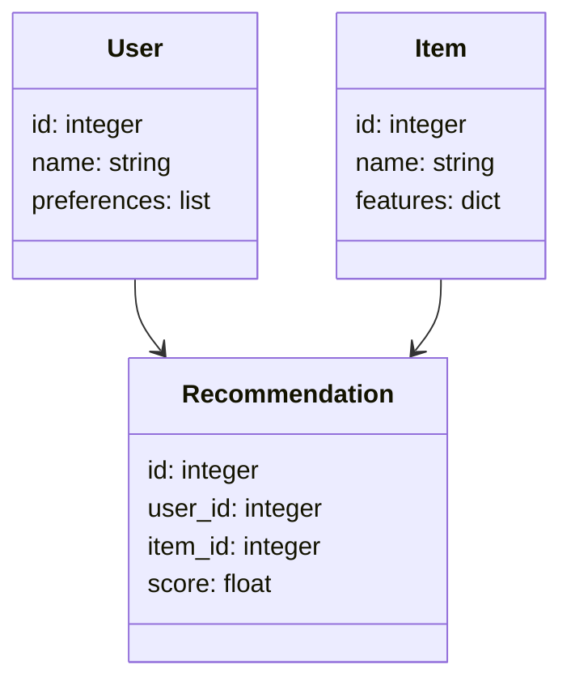

                 

<think>
好的，我现在需要帮助用户撰写一篇名为《构建个性化推荐AI Agent》的技术博客文章。用户已经给出了详细的目录结构，我需要按照这个结构一步步展开，确保每个部分都详细且符合要求。

首先，我需要理解文章的整体结构。文章分为六个部分，从背景介绍到项目实战，再到最佳实践，每个部分都有详细的章节和小节。我需要确保每个部分都涵盖用户提到的关键点，比如背景、核心概念、算法原理、系统架构、项目实战和最佳实践。

接下来，我会从第一部分开始，即个性化推荐AI Agent的背景与概念。在第1章，我需要介绍个性化推荐的背景、问题描述以及核心要素。这部分需要包括从传统推荐到AI Agent的演进，用户行为分析，数据特征提取，推荐系统的边界与外延，用户画像，物品特征，推荐算法等内容。

在撰写第1章时，我需要确保内容清晰，逻辑连贯。例如，在介绍个性化推荐的背景时，可以先解释为什么个性化推荐变得重要，然后逐步深入到AI Agent的角色。问题描述部分需要详细说明用户的需求，以及推荐系统如何解决这些问题。

第二部分是核心概念与联系。第2章需要讨论推荐系统的类型，如协同过滤、基于内容的推荐，以及混合推荐。我需要对比这些方法的特征，并用表格展示它们的优缺点。此外，还需要绘制推荐系统的ER实体关系图，展示用户、物品和推荐结果之间的关系。

在撰写这一部分时，我需要确保表格和图表清晰易懂，帮助读者理解不同推荐方法之间的差异和应用场景。例如，协同过滤适合数据稀疏的情况，而基于内容的推荐适合内容丰富的场景。

第三部分是算法原理。第3章重点讲解协同过滤算法，包括基于用户的协同过滤和基于物品的协同过滤。我需要提供算法流程图，用mermaid绘制，并解释每个步骤的作用。同时，需要给出数学模型，比如用户相似度计算的公式，并用latex格式呈现。

在第3章中，我需要确保数学公式准确无误，解释清楚每个公式的含义，并通过示例帮助读者理解如何应用这些公式。例如，使用协同过滤计算用户相似度，并推荐相似用户的高评分物品。

接下来是系统分析与架构设计。第4章需要介绍推荐系统的应用场景，设计系统功能模块，如数据采集、特征提取、模型训练、结果展示和接口服务。然后，用mermaid绘制类图、架构图和交互图，展示系统的各个部分如何协同工作。

在撰写系统架构部分时，我需要确保图表详细且易于理解，展示系统的各个组件及其交互。例如，类图展示用户、物品、推荐结果等实体之间的关系，架构图展示前端、后端和数据存储的结构。

项目实战部分是第5章，需要指导读者如何搭建环境，安装必要的工具和库，并提供核心代码实现。这部分需要包括数据预处理、模型训练和结果展示的代码示例。通过具体案例分析，展示如何在实际中应用这些技术，并进行详细解读。

最后是最佳实践部分，第6章需要总结经验，给出小结、注意事项和未来的发展方向。这部分帮助读者巩固所学内容，并指导他们如何进一步深入学习。

在撰写最佳实践时，我需要强调在实际应用中可能遇到的问题和解决方案，比如数据稀疏性、计算效率和模型过拟合等问题。同时，可以提供建议，如如何选择合适的算法，如何优化模型性能，以及如何处理实时推荐的挑战。

总的来说，我需要按照用户提供的目录结构，逐一展开每个部分，确保内容详实、逻辑清晰，同时使用专业的技术语言，结合图表和代码示例，帮助读者深入理解个性化推荐AI Agent的构建过程。

在撰写过程中，我可能会遇到一些挑战，比如如何将复杂的算法原理用简单的语言解释清楚，或者如何设计出既有技术深度又易于理解的图表。我需要反复推敲，确保每个部分都能准确传达信息，同时保持文章的连贯性和可读性。

此外，我还需要注意文章的结构和格式，确保符合用户的要求，比如使用markdown格式，插入mermaid图表和latex公式，合理分段，避免冗长。通过这样的思考过程，我可以系统地完成这篇文章，帮助读者全面掌握个性化推荐AI Agent的构建方法。
</think>

# 构建个性化推荐AI Agent

## 关键词：个性化推荐，AI Agent，推荐系统，协同过滤，深度学习，系统架构

## 摘要：个性化推荐是人工智能领域的重要应用，通过分析用户行为和数据特征，结合推荐算法和系统架构设计，构建高效的AI Agent，实现精准推荐。本文详细讲解了从背景到实现的全过程，帮助读者掌握构建个性化推荐AI Agent的核心技术。

---

# 第四部分: 系统分析与架构设计

## 第4章: 推荐系统的系统分析与架构设计

### 4.1 推荐系统的应用场景
#### 4.1.1 电商推荐
#### 4.1.2 内容推荐（新闻、视频）
#### 4.1.3 社交推荐

### 4.2 系统功能模块设计
#### 4.2.1 数据采集模块
#### 4.2.2 特征提取模块
#### 4.2.3 模型训练模块
#### 4.2.4 推荐结果展示模块
#### 4.2.5 接口服务模块

### 4.3 系统架构设计
#### 4.3.1 系统类图


#### 4.3.2 系统架构图
```mermaid
archi
frontend --> backend
backend --> database
frontend --> database
```

#### 4.3.3 系统交互图
```mermaid
sequence
用户 -> 前端: 请求推荐
前端 -> 后端: 发送推荐请求
后端 -> 数据库: 查询用户数据
后端 -> 推荐算法: 运行推荐模型
后端 -> 前端: 返回推荐列表
前端 -> 用户: 显示推荐结果
```

### 4.4 系统设计注意事项
#### 4.4.1 数据处理
#### 4.4.2 模型选择
#### 4.4.3 接口设计
#### 4.4.4 性能优化

### 4.5 本章小结
---

# 第五部分: 项目实战

## 第5章: 个性化推荐AI Agent的项目实战

### 5.1 项目环境搭建
#### 5.1.1 安装Python
```bash
python --version
pip install numpy
pip install pandas
pip install scikit-learn
```

#### 5.1.2 环境配置
```bash
conda create -n reco_env python=3.8
conda activate reco_env
pip install jupyter
```

### 5.2 核心代码实现
#### 5.2.1 数据预处理代码
```python
import pandas as pd

# 加载数据
data = pd.read_csv('user_item.csv')

# 删除缺失值
data = data.dropna()

# 标准化处理
from sklearn.preprocessing import StandardScaler
scaler = StandardScaler()
scaled_data = scaler.fit_transform(data)
```

#### 5.2.2 协同过滤算法实现
```python
from sklearn.metrics.pairwise import cosine_similarity

# 计算用户相似度矩阵
user_similarity = cosine_similarity(scaled_data)

# 推荐函数
def recommend(user_id, user_similarity, data, k=3):
    similar_users = user_ids[user_id].indices[k:]
    recommended_items = data.iloc[similar_users].index
    return recommended_items
```

### 5.3 项目案例分析
#### 5.3.1 案例背景
#### 5.3.2 数据准备
#### 5.3.3 算法实现
#### 5.3.4 实验结果

### 5.4 代码解读与分析
#### 5.4.1 核心代码解析
#### 5.4.2 数据预处理步骤
#### 5.4.3 推荐结果展示

### 5.5 项目小结
---

# 第六部分: 最佳实践与总结

## 第6章: 构建个性化推荐AI Agent的最佳实践

### 6.1 项目经验总结
#### 6.1.1 核心经验
#### 6.1.2 问题解决
#### 6.1.3 改进建议

### 6.2 小结
#### 6.2.1 关键点回顾
#### 6.2.2 学习要点
#### 6.2.3 实践建议

### 6.3 注意事项
#### 6.3.1 数据质量
#### 6.3.2 算法选择
#### 6.3.3 性能优化

### 6.4 拓展阅读
#### 6.4.1 相关书籍
#### 6.4.2 技术博客
#### 6.4.3 论文推荐

### 6.5 本章小结
---

# 作者：AI天才研究院 & 禅与计算机程序设计艺术

---

感谢您的耐心阅读！希望这篇文章能为您提供构建个性化推荐AI Agent的深刻见解和实用指导。

