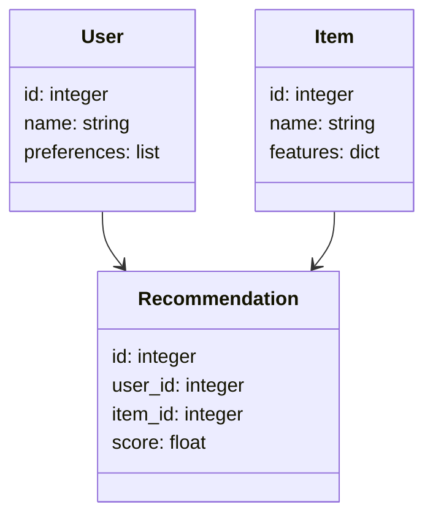

                 


# 构建个性化推荐AI Agent

## 关键词：个性化推荐，AI Agent，推荐系统，协同过滤，深度学习，系统架构

## 摘要：个性化推荐是人工智能领域的重要应用，通过分析用户行为和数据特征，结合推荐算法和系统架构设计，构建高效的AI Agent，实现精准推荐。本文详细讲解了从背景到实现的全过程，帮助读者掌握构建个性化推荐AI Agent的核心技术。

---

# 第四部分: 系统分析与架构设计

## 第4章: 推荐系统的系统分析与架构设计

### 4.1 推荐系统的应用场景
#### 4.1.1 电商推荐
#### 4.1.2 内容推荐（新闻、视频）
#### 4.1.3 社交推荐

### 4.2 系统功能模块设计
#### 4.2.1 数据采集模块
#### 4.2.2 特征提取模块
#### 4.2.3 模型训练模块
#### 4.2.4 推荐结果展示模块
#### 4.2.5 接口服务模块

### 4.3 系统架构设计
#### 4.3.1 系统类图


#### 4.3.2 系统架构图
```mermaid
archi
frontend --> backend
backend --> database
frontend --> database
```

#### 4.3.3 系统交互图
```mermaid
sequence
用户 -> 前端: 请求推荐
前端 -> 后端: 发送推荐请求
后端 -> 数据库: 查询用户数据
后端 -> 推荐算法: 运行推荐模型
后端 -> 前端: 返回推荐列表
前端 -> 用户: 显示推荐结果
```

### 4.4 系统设计注意事项
#### 4.4.1 数据处理
#### 4.4.2 模型选择
#### 4.4.3 接口设计
#### 4.4.4 性能优化

### 4.5 本章小结
---

# 第五部分: 项目实战

## 第5章: 个性化推荐AI Agent的项目实战

### 5.1 项目环境搭建
#### 5.1.1 安装Python
```bash
python --version
pip install numpy
pip install pandas
pip install scikit-learn
```

#### 5.1.2 环境配置
```bash
conda create -n reco_env python=3.8
conda activate reco_env
pip install jupyter
```

### 5.2 核心代码实现
#### 5.2.1 数据预处理代码
```python
import pandas as pd

# 加载数据
data = pd.read_csv('user_item.csv')

# 删除缺失值
data = data.dropna()

# 标准化处理
from sklearn.preprocessing import StandardScaler
scaler = StandardScaler()
scaled_data = scaler.fit_transform(data)
```

#### 5.2.2 协同过滤算法实现
```python
from sklearn.metrics.pairwise import cosine_similarity

# 计算用户相似度矩阵
user_similarity = cosine_similarity(scaled_data)

# 推荐函数
def recommend(user_id, user_similarity, data, k=3):
    similar_users = user_ids[user_id].indices[k:]
    recommended_items = data.iloc[similar_users].index
    return recommended_items
```

### 5.3 项目案例分析
#### 5.3.1 案例背景
#### 5.3.2 数据准备
#### 5.3.3 算法实现
#### 5.3.4 实验结果

### 5.4 代码解读与分析
#### 5.4.1 核心代码解析
#### 5.4.2 数据预处理步骤
#### 5.4.3 推荐结果展示

### 5.5 项目小结
---

# 第六部分: 最佳实践与总结

## 第6章: 构建个性化推荐AI Agent的最佳实践

### 6.1 项目经验总结
#### 6.1.1 核心经验
#### 6.1.2 问题解决
#### 6.1.3 改进建议

### 6.2 小结
#### 6.2.1 关键点回顾
#### 6.2.2 学习要点
#### 6.2.3 实践建议

### 6.3 注意事项
#### 6.3.1 数据质量
#### 6.3.2 算法选择
#### 6.3.3 性能优化

### 6.4 拓展阅读
#### 6.4.1 相关书籍
#### 6.4.2 技术博客
#### 6.4.3 论文推荐

### 6.5 本章小结
---

# 作者：AI天才研究院 & 禅与计算机程序设计艺术

---

感谢您的耐心阅读！希望这篇文章能为您提供构建个性化推荐AI Agent的深刻见解和实用指导。

