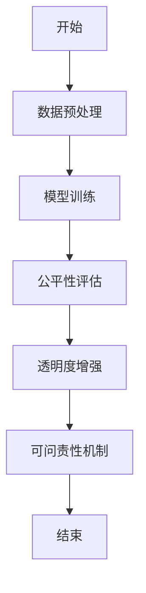
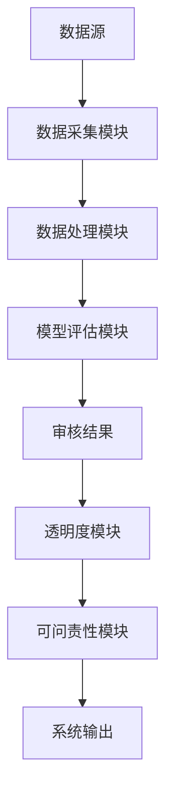
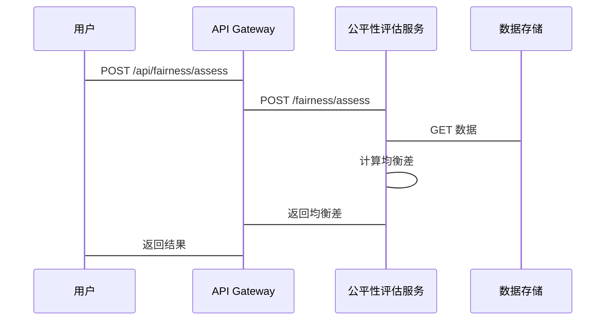

                 


# 构建企业级AI伦理审核框架：确保AI应用的公平性、透明度与可问责性

> 关键词：AI伦理审核框架，公平性，透明度，可问责性，企业级AI应用，伦理审核

> 摘要：随着人工智能技术的快速发展，AI应用在企业级场景中的普及带来了诸多伦理挑战。本文旨在探讨如何构建一个有效的AI伦理审核框架，确保AI应用的公平性、透明度与可问责性。通过详细分析核心概念、算法原理、系统架构及项目实战，本文为构建 robust 的 AI 伦理审核框架提供理论与实践指导。

## 第一章：AI伦理审核框架的背景与重要性

### 1.1 AI技术的快速发展与伦理挑战

#### 1.1.1 AI技术的快速发展及其应用领域

人工智能（AI）技术近年来取得了显著进展，广泛应用于多个领域，包括医疗、金融、交通和教育等。这些应用提升了效率，但也带来了伦理问题。

#### 1.1.2 AI应用中的伦理问题与挑战

AI应用可能导致偏见、透明度不足和责任不清等问题。例如，招聘中的AI系统可能因为训练数据的偏见而歧视某些群体。

#### 1.1.3 伦理审核框架的必要性与意义

构建伦理审核框架有助于确保AI应用符合伦理标准，提升用户信任，并符合法规要求。

### 1.2 企业级AI应用的伦理问题

#### 1.2.1 公平性问题

AI系统可能在决策过程中不公平地对待某些群体。

#### 1.2.2 透明度问题

用户难以理解AI决策过程，导致信任缺失。

#### 1.2.3 可问责性问题

当AI系统出现问题时，责任归属不明确。

---

## 第二章：AI伦理审核框架的核心概念

### 2.1 公平性、透明度与可问责性的定义

#### 2.1.1 公平性的定义与实现

公平性指AI系统不应基于种族、性别等因素歧视任何人。

#### 2.1.2 透明度的定义与实现

透明度指AI系统的决策过程可被用户理解。

#### 2.1.3 可问责性的定义与实现

可问责性指AI系统的行为可追溯，明确责任归属。

### 2.2 AI伦理审核框架的核心原则

#### 2.2.1 公平性原则

AI系统应公平对待所有用户。

#### 2.2.2 透明度原则

系统需清晰解释决策过程。

#### 2.2.3 可问责性原则

系统需记录行为，并明确责任。

### 2.3 核心概念的联系与对比

#### 2.3.1 公平性与透明度的对比

| 特性   | 公平性                  | 透明度                  |
|--------|-------------------------|--------------------------|
| 定义   | 决策无偏见               | 决策过程可解释           |
| 实现   | 使用脱敏数据、对抗训练   | 提供解释界面、日志记录    |

#### 2.3.2 透明度与可问责性的对比

| 特性   | 透明度                  | 可问责性                |
|--------|-------------------------|--------------------------|
| 定义   | 决策过程可解释           | 行为可追溯，责任明确     |
| 实现   | 提供解释、日志记录       | 记录操作日志、审计机制    |

#### 2.3.3 公平性与可问责性的对比

| 特性   | 公平性                  | 可问责性                |
|--------|-------------------------|--------------------------|
| 定义   | 决策无偏见               | 行为可追溯，责任明确     |
| 实现   | 使用脱敏数据、对抗训练   | 记录操作日志、审计机制    |

### 2.4 核心概念的ER实体关系图


---

## 第三章：AI伦理审核框架的算法原理

### 3.1 数据预处理与特征提取

#### 3.1.1 数据清洗与标准化

处理缺失值、异常值和重复数据，标准化特征以消除量纲影响。

#### 3.1.2 特征选择与降维

使用特征重要性评估选择关键特征，应用PCA等方法降维。

### 3.2 模型评估与公平性分析

#### 3.2.1 基于偏见分析的模型评估

识别模型在不同群体中的表现差异，计算公平性指标如均衡差。

#### 3.2.2 基于对抗训练的公平性提升

使用对抗网络消除偏见，确保模型决策公平。

### 3.3 透明度与可解释性增强

#### 3.3.1 层次化可解释模型的设计

采用可解释模型如线性回归或树模型，分解决策过程。

#### 3.3.2 基于规则的透明度增强

制定透明度规则，确保系统决策可被解释。

### 3.4 可问责性机制的设计

#### 3.4.1 基于日志的可追溯性设计

记录系统行为日志，便于追溯和审核。

#### 3.4.2 基于责任分配的可问责性机制

明确责任分配，建立责任追究机制。

### 3.5 算法流程图



### 3.6 数学公式

#### 3.6.1 公平性评估指标

$$ \text{均衡差} = \sum_{i} \left| P(y=1 | x_i, a_i) - P(y=1 | x_i, a_j) \right| $$

#### 3.6.2 对抗训练目标函数

$$ \mathcal{L} = \mathcal{L}_{\text{main}} + \lambda \mathcal{L}_{\text{adv}} $$

---

## 第四章：AI伦理审核框架的系统分析与架构设计

### 4.1 问题场景介绍

#### 4.1.1 典型AI应用场景中的伦理问题

医疗诊断中的偏见，金融贷款中的不公平决策，司法判决中的透明度问题。

#### 4.1.2 企业级AI系统的伦理审核需求

确保企业AI系统的决策透明、公平，并可追溯。

### 4.2 系统功能设计

#### 4.2.1 数据采集与处理模块

采集、清洗和预处理数据，确保数据质量和一致性。

#### 4.2.2 模型评估与审核模块

评估模型的公平性，识别和修正偏见。

#### 4.2.3 透明度与可解释性模块

提供透明的决策解释，增强用户信任。

#### 4.2.4 可问责性与日志管理模块

记录系统行为，明确责任归属。

### 4.3 系统架构设计

#### 4.3.1 分层架构设计

前端、业务逻辑和数据访问层分离，便于维护和扩展。

#### 4.3.2 微服务架构设计

各功能模块独立部署，通过API交互，提高系统灵活性。

#### 4.3.3 数据流与功能模块交互图



### 4.4 系统架构图


### 4.5 系统接口设计

定义RESTful API接口，如`POST /api/fairness/assess`用于公平性评估。

### 4.6 系统交互图



---

## 第五章：项目实战——构建企业级AI伦理审核框架

### 5.1 环境安装与配置

#### 5.1.1 开发环境搭建

安装Python、Jupyter Notebook和必要的库，如TensorFlow、Scikit-learn、Fairlearn。

#### 5.1.2 依赖库安装

使用pip安装所需库，如`pip install fairlearn scikit-learn tensorflow`.

### 5.2 核心代码实现

#### 5.2.1 数据预处理代码

```python
import pandas as pd
from sklearn.preprocessing import StandardScaler

# 数据加载
data = pd.read_csv('data.csv')

# 数据清洗
data.dropna()
data = data.drop_duplicates()

# 特征选择
features = data[['age', 'income', 'education']]
label = data['loan_decision']

# 标准化
scaler = StandardScaler()
features_scaled = scaler.fit_transform(features)
```

#### 5.2.2 公平性评估代码

```python
from fairlearn import MaxMinClassifier

# 初始化模型
model = MaxMinClassifier()

# 训练模型
model.fit(features_scaled, label)

# 公平性评估
print(model.score(features_scaled, label))
```

#### 5.2.3 透明度增强代码

```python
from sklearn.tree import DecisionTreeClassifier
from sklearn.inspection import permutation_importance

# 初始化模型
model = DecisionTreeClassifier()

# 训练模型
model.fit(features_scaled, label)

# 计算特征重要性
result = permutation_importance(model, features_scaled, label, n_repeats=10)
print(result.importances_mean)
```

#### 5.2.4 可问责性机制代码

```python
import logging
import datetime

# 日志记录
logger = logging.getLogger(__name__)
logger.setLevel(logging.INFO)
handler = logging.StreamHandler()
logger.addHandler(handler)

def log_system_behavior(action):
    logger.info(f"{datetime.datetime.now()} - {action}")
```

### 5.3 实际案例分析

#### 5.3.1 案例介绍

以贷款审批为例，使用构建的框架评估和优化AI决策过程。

#### 5.3.2 公平性评估结果

通过模型评估发现特定群体的贷款拒绝率偏高，调整模型以消除偏见。

#### 5.3.3 透明度增强效果

通过特征重要性分析，用户理解AI决策的主要因素。

#### 5.3.4 可问责性机制的应用

记录每次决策的日志，确保在出现问题时可追溯责任。

### 5.4 项目小结

通过本项目，读者掌握了构建AI伦理审核框架的关键步骤和方法，能够实际应用于企业级AI系统。

---

## 第六章：最佳实践与小结

### 6.1 最佳实践

#### 6.1.1 数据处理建议

使用多样化的数据集，确保模型的泛化能力。

#### 6.1.2 模型选择建议

选择可解释性强的模型，便于分析和调整。

#### 6.1.3 透明度增强建议

提供用户友好的解释界面，提升用户体验。

#### 6.1.4 可问责性机制建议

建立完善的日志记录和审计机制，确保责任可追溯。

### 6.2 小结

构建企业级AI伦理审核框架是一项复杂但必要的任务，需要综合考虑公平性、透明度和可问责性。

### 6.3 注意事项

定期审查和更新伦理审核框架，以应对新技术和法规的变化。

### 6.4 拓展阅读

推荐阅读《AI Ethics in Action》和《Ethics of AI Systems》深入了解相关知识。

---

## 作者

**作者：** AI天才研究院/AI Genius Institute & 禅与计算机程序设计艺术/Zen And The Art of Computer Programming

---

以上是《构建企业级AI伦理审核框架：确保AI应用的公平性、透明度与可问责性》的完整目录大纲和内容概述，涵盖了从背景到实践的各个方面，为构建 robust 的AI伦理审核框架提供了详细的指导和见解。

