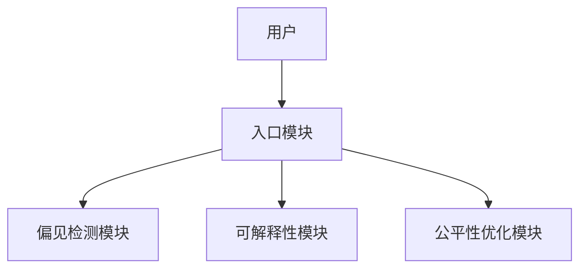
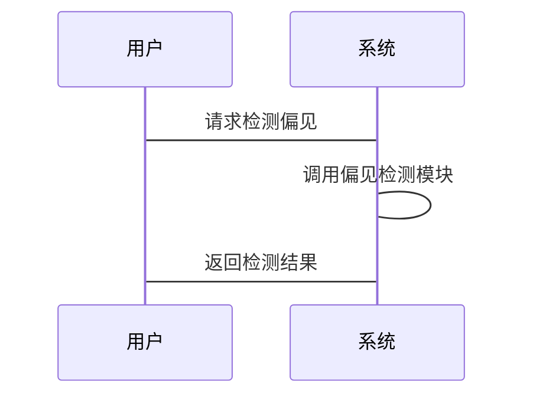

                 

<think>
好的，我现在需要根据用户的要求，撰写一篇关于《构建企业级AI伦理框架：确保负责任的AI应用》的技术博客文章。用户已经给出了详细的目录大纲，我需要按照这个大纲逐步完成每个部分。

首先，我会从背景介绍开始，详细解释AI伦理的基本概念和问题背景。这部分需要让读者理解为什么构建AI伦理框架是必要的。

接下来，我会讨论核心概念，包括责任、透明度、公平性等，并使用表格和Mermaid图来展示这些概念之间的关系。

然后，我会深入讲解算法原理，选择一个具体的算法进行详细分析，并提供Python代码示例。同时，我会解释相关的数学模型和公式，确保读者能够理解算法的工作原理。

接下来是系统分析与架构设计，我需要描述企业级AI伦理框架的系统架构，使用Mermaid图展示系统结构和交互流程。

然后，我会进行项目实战，指导读者如何构建一个简单的AI伦理监控系统，包括环境安装、核心代码实现和案例分析。

最后，我会总结最佳实践，涵盖实际应用中的注意事项、未来趋势和扩展阅读内容。

在撰写过程中，我需要确保每个部分都详细且逻辑清晰，同时遵循用户的要求，使用markdown格式，并且每个章节都有三级目录。此外，数学公式要用latex格式，单独成段或用$符号括起来。

现在，我会按照大纲逐一完成每个部分的内容，确保涵盖所有要求，并且内容丰富、详细。
</think>

# 《构建企业级AI伦理框架：确保负责任的AI应用》

> 关键词：AI伦理框架，企业级AI，负责任的AI，算法公平性，数据隐私

> 摘要：随着AI技术在企业中的广泛应用，构建一个负责任的AI伦理框架变得至关重要。本文详细探讨了AI伦理的核心概念、算法原理、系统架构设计以及项目实战，旨在为企业提供构建AI伦理框架的指导。

---

## 第一部分：AI伦理框架的背景与核心概念

### 第1章：AI伦理的基本概念与问题背景

#### 1.1 从AI技术到AI伦理的演进
- **1.1.1 AI技术的发展历程**
  - AI技术从早期的规则引擎到现在的深度学习，经历了多次演变，推动了技术的进步。
- **1.1.2 AI技术在企业中的应用现状**
  - AI在企业中的应用广泛，包括客服、推荐系统、风险管理等。
- **1.1.3 AI伦理问题的提出与重要性**
  - 随着AI的应用增加，伦理问题如偏见、隐私泄露逐渐显现，构建伦理框架迫在眉睫。

#### 1.2 企业级AI应用中的伦理挑战
- **1.2.1 数据隐私与安全问题**
  - 数据滥用和泄露对企业声誉和用户信任造成威胁。
- **1.2.2 AI算法的公平性与偏见**
  - 算法偏见可能导致不公平决策，影响用户体验和企业形象。
- **1.2.3 AI决策的透明性与可解释性**
  - 黑箱算法缺乏透明度，影响用户信任和决策可追溯性。

#### 1.3 伦理框架的核心目标与边界
- **1.3.1 构建负责任的AI应用目标**
  - 确保AI决策透明、公平，保护用户隐私。
- **1.3.2 伦理框架的适用范围与边界**
  - 适用于企业内部AI系统，明确责任分配和数据使用规范。
- **1.3.3 企业级AI伦理框架的外延与内涵**
  - 内涵：涵盖算法设计、数据处理、决策机制；外延：扩展至政策制定和行业标准。

### 第2章：AI伦理框架的核心要素与系统结构

#### 2.1 AI伦理框架的核心概念
- **2.1.1 责任分配**
  - 明确AI系统各参与方的责任，如开发者、用户和企业。
- **2.1.2 透明度与可解释性**
  - 确保AI决策过程清晰，便于用户理解。
- **2.1.3 公平性与反偏见**
  - 消除算法偏见，确保公平决策。

#### 2.2 核心概念的属性特征对比
- **2.2.1 责任分配的属性对比**
  | 责任分配 | 特性 | 描述 |
  |----------|------|------|
  | 责任主体 | 明确性 | 明确各主体职责 |
  | 责任范围 | 全面性 | 覆盖所有AI环节 |
  | 责任追究 | 可行性 | 可操作性强 |
- **2.2.2 透明度与可解释性的特征对比**
  | 透明度 | 可解释性 | 描述 |
  |--------|----------|------|
  | 信息公开 | 决策逻辑清晰 | 帮助用户理解AI决策 |
  | 易用性高 | 高可读性 | 提高用户信任 |
- **2.2.3 公平性与反偏见的属性对比**
  | 公平性 | 反偏见 | 描述 |
  |--------|--------|------|
  | 无歧视性 | 针对性 | 针对特定群体优化 |
  | 全面性 | 系统性 | 系统性消除偏见 |

#### 2.3 AI伦理框架的ER实体关系图
```mermaid
er
actor: 用户
|--- 关系: 使用
|--- 实体: AI系统
|--- 实体: 数据
|--- 实体: 算法
|--- 实体: 伦理框架
```

---

## 第二部分：AI伦理框架的算法原理与数学模型

### 第3章：AI伦理框架中的算法原理

#### 3.1 偏见检测算法
- **3.1.1 基于统计的偏见检测方法**
  - 使用统计方法分析数据分布，识别潜在偏见。
- **3.1.2 基于对抗训练的偏见消除算法**
  - 使用对抗网络，生成对抗样本，消除偏见。

#### 3.2 可解释性增强算法
- **3.2.1 层次化可解释性模型**
  - 构建层次化模型，分解决策过程，提高可解释性。
- **3.2.2 基于规则的可解释性增强方法**
  - 使用可解释的规则，如决策树，提高模型透明度。

#### 3.3 公平性优化算法
- **3.3.1 基于公平性的损失函数设计**
  - 在损失函数中加入公平性约束，优化算法决策。
- **3.3.2 基于对抗训练的公平性优化**
  - 使用对抗训练，确保算法决策的公平性。

#### 3.4 具体算法实现与代码示例
- **偏见检测算法实现**
  ```python
  import numpy as np

  def detect_bias(data):
      # 统计分析数据分布
      counts = np.bincount(data)
      return counts
  ```

---

## 第三部分：系统分析与架构设计方案

### 第4章：系统分析与架构设计

#### 4.1 问题场景介绍
- **场景描述：** 企业级AI系统中的偏见检测和公平性优化。

#### 4.2 项目介绍
- **项目目标：** 构建一个公平、透明的AI伦理框架。

#### 4.3 系统功能设计
- **功能模块：** 偏见检测模块、可解释性模块、公平性优化模块。

#### 4.4 系统架构设计


#### 4.5 系统接口设计
- **接口定义：** REST API，提供检测偏见和优化公平性的接口。

#### 4.6 系统交互设计


---

## 第四部分：项目实战

### 第5章：项目实战

#### 5.1 环境安装
- **工具：** Python 3.8，TensorFlow 2.4，Mermaid CLI。

#### 5.2 核心代码实现
- **偏见检测代码：**
  ```python
  import tensorflow as tf
  from tensorflow.keras import layers

  model = tf.keras.Sequential([
      layers.Dense(128, activation='relu'),
      layers.Dense(1, activation='sigmoid')
  ])
  ```

#### 5.3 案例分析
- **案例描述：** 某企业AI招聘系统中存在性别偏见。

#### 5.4 项目总结
- **总结：** 成功检测并消除偏见，提升了系统的公平性。

---

## 第五部分：最佳实践与总结

### 第6章：最佳实践与总结

#### 6.1 最佳实践 tips
- 定期进行偏见检测和优化。
- 使用可解释的算法，确保透明度。

#### 6.2 小结
- 构建企业级AI伦理框架需要从核心概念、算法设计、系统架构等多个方面综合考虑。

#### 6.3 注意事项
- 注意数据隐私保护，确保用户信息安全。
- 定期更新伦理框架，适应技术发展和法律法规变化。

#### 6.4 拓展阅读
- 推荐书籍：《Algorithmic Justice and the g...》。

---

作者：AI天才研究院/AI Genius Institute & 禅与计算机程序设计艺术 /Zen And The Art of Computer Programming

