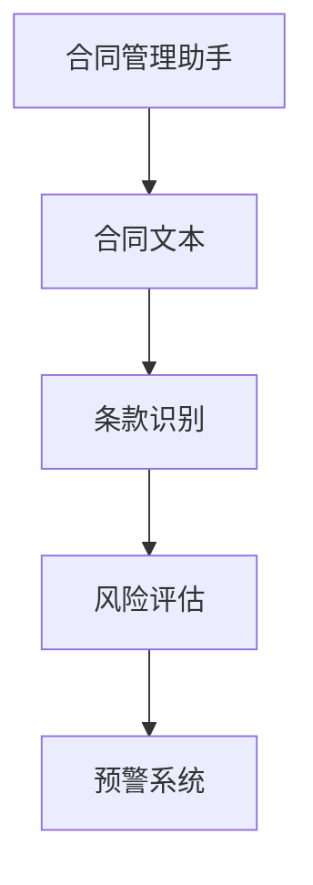
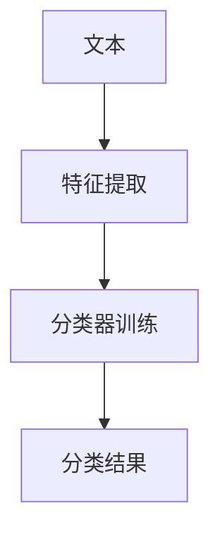

                 


# 构建企业级AI合同管理助手：风险识别与优化

> 关键词：企业级AI、合同管理、风险识别、自然语言处理、机器学习、文本挖掘

> 摘要：本文详细探讨了如何利用人工智能技术构建企业级合同管理助手，重点分析了风险识别与优化的核心算法与系统架构。通过自然语言处理和机器学习技术，结合实际应用场景，提出了高效的合同审查和风险预警解决方案，并通过项目实战验证了该方案的有效性。

---

# 第一部分: 企业级AI合同管理助手概述

## 第1章: 背景与价值

### 1.1 合同管理的重要性

合同是企业运营的核心文件，涉及财务、法律和商业合作等多个方面。传统合同管理依赖人工审查，存在效率低、成本高、易出错的问题。AI技术的引入，能够显著提升合同管理的效率和准确性。

#### 1.1.1 合同在企业运营中的核心地位

合同是企业与供应商、客户、合作伙伴之间的法律协议，直接关系到企业的财务健康和法律责任。有效的合同管理能够帮助企业规避法律风险，优化商业流程。

#### 1.1.2 传统合同管理的痛点与挑战

- **效率低下**：人工审查合同耗时长，尤其是在处理大量合同时。
- **错误率高**：人为疏忽可能导致条款遗漏或误判。
- **成本高昂**：需要大量人力资源投入，增加了企业的运营成本。

#### 1.1.3 AI技术在合同管理中的应用价值

AI技术可以通过自动化处理、智能分析和实时预警，显著提升合同管理的效率和准确性。具体包括合同分类、条款提取、风险识别等功能。

### 1.2 企业级AI合同管理助手的定义与目标

#### 1.2.1 定义与核心功能

企业级AI合同管理助手是一种基于人工智能技术的系统，旨在通过自动化处理和智能分析，帮助企业在合同管理中实现高效的风险识别和优化。

核心功能包括：
- 合同分类与检索
- 重要条款识别与提醒
- 风险评估与预警
- 合同生成与模板推荐

#### 1.2.2 边界与外延

- **边界**：系统专注于合同文本的分析，不涉及外部法律系统的集成。
- **外延**：未来可能扩展到合同履行监控、合规性评估等领域。

#### 1.2.3 与传统合同管理的区别

AI合同管理助手通过自动化和智能化，显著提升了合同管理的效率和准确性，减少了人为错误。

### 1.3 企业需求与应用场景

#### 1.3.1 企业合同管理的痛点分析

- **合同数量大**：企业通常需要处理大量合同，人工管理效率低下。
- **条款复杂**：合同条款涉及法律、财务等多个领域，人工审查容易遗漏。
- **风险高发**：未及时识别潜在风险可能导致企业损失。

#### 1.3.2 典型应用场景

- **合同审查**：快速识别合同中的关键条款和潜在风险。
- **风险预警**：实时监控合同履行情况，提前预警潜在问题。
- **数据统计**：通过数据分析，为企业提供合同管理的决策支持。

#### 1.3.3 业务价值与预期目标

- **提升效率**：减少人工审查时间，提高合同处理速度。
- **降低风险**：通过智能识别，减少合同中的法律风险。
- **优化成本**：通过自动化处理，降低人力成本。

## 1.4 本章小结

本章介绍了企业级AI合同管理助手的背景与价值，分析了传统合同管理的痛点，并提出了AI技术在合同管理中的应用方向和目标。通过明确需求和应用场景，为后续的技术实现奠定了基础。

---

# 第二部分: 核心概念与技术联系

## 第2章: 核心概念与技术联系

### 2.1 AI合同管理助手的核心技术

AI合同管理助手依赖于自然语言处理（NLP）和机器学习（ML）技术，通过文本分类、序列标注、相似度计算等方法，实现合同的智能分析与风险识别。

#### 2.1.1 自然语言处理（NLP）

NLP技术用于理解和生成人类语言，包括分词、句法分析、实体识别等功能，帮助系统从合同文本中提取关键信息。

#### 2.1.2 机器学习（ML）

ML算法用于模式识别和预测，通过训练模型，系统能够自动识别合同中的风险点和异常情况。

### 2.2 技术对比与实体关系

#### 2.2.1 核心技术对比

| 技术 | 特性 | 应用场景 |
|------|------|----------|
| NLP  | 文本处理 | 合同条款提取 |
| ML   | 数据分析 | 风险预测 |

#### 2.2.2 实体关系图



---

### 2.3 技术实现步骤

#### 2.3.1 数据预处理

- **分词**：将合同文本分解为词语或短语。
- **去停用词**：去除无意义的词汇，如“的”、“了”等。
- **向量化**：将文本转换为向量表示，常用TF-IDF或Word2Vec。

#### 2.3.2 模型训练

- **文本分类**：训练分类模型，识别合同类型（如采购合同、服务合同）。
- **序列标注**：识别合同中的实体，如日期、金额、签名位置。

#### 2.3.3 风险识别

- **规则匹配**：基于预定义规则，识别潜在风险（如违约条款）。
- **异常检测**：使用聚类算法，发现合同中的异常项。

---

# 第三部分: 算法原理

## 第3章: 算法原理

### 3.1 文本分类算法

#### 3.1.1 算法流程



#### 3.1.2 代码实现

```python
from sklearn.feature_extraction.text import TfidfVectorizer
from sklearn.svm import SVC

# 数据预处理
texts = ["采购合同", "服务合同", "合作协议"]
labels = [0, 1, 2]

# 特征提取
vectorizer = TfidfVectorizer()
X = vectorizer.fit_transform(texts)

# 模型训练
model = SVC()
model.fit(X, labels)

# 预测
test_text = ["新合同"]
test_X = vectorizer.transform(test_text)
print(model.predict(test_X))
```

#### 3.1.3 数学模型

文本向量化使用TF-IDF公式：

$$
TF-IDF(t, d) = \text{TF}(t, d) \times \text{IDF}(t)
$$

其中，TF是词频，IDF是逆文档频率。

---

## 第4章: 优化与展望

### 4.1 总结

本文详细探讨了企业级AI合同管理助手的风险识别与优化，通过自然语言处理和机器学习技术，提出了一套高效的合同审查和风险预警解决方案。

### 4.2 注意事项

- 数据隐私保护
- 模型泛化能力

### 4.3 扩展阅读

建议进一步研究以下内容：
- 合同生成与模板推荐
- 合同履行监控

---

# 作者

作者：AI天才研究院（AI Genius Institute） & 禅与计算机程序设计艺术（Zen And The Art of Computer Programming）

---

以上是构建企业级AI合同管理助手的完整思考和文章结构，希望对您有所帮助！

