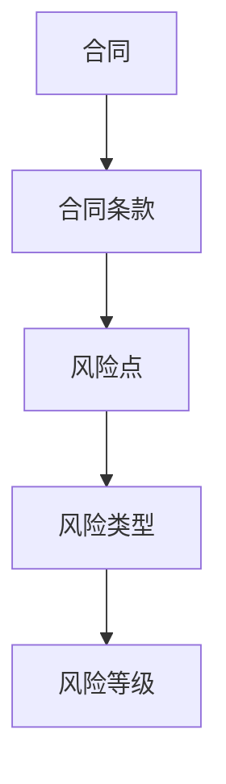
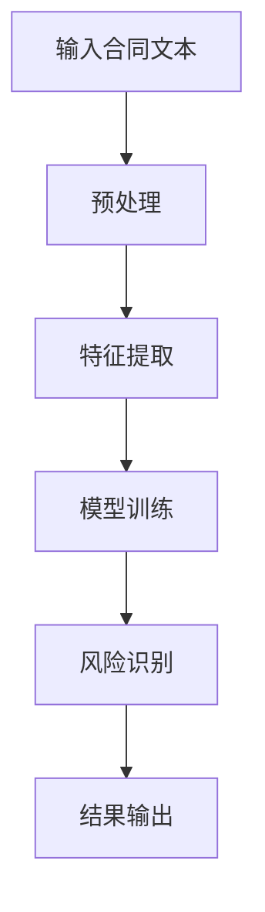
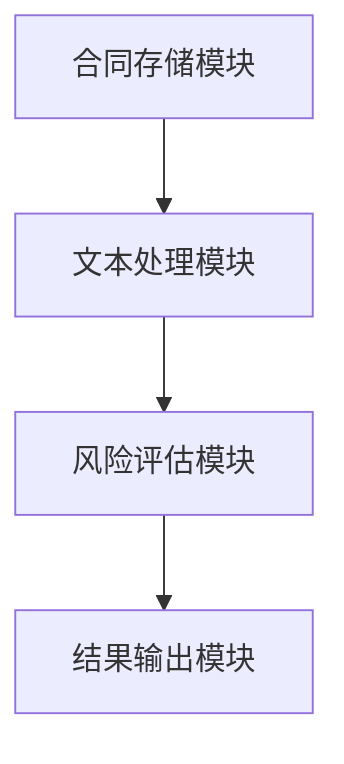

                 


# 构建企业级AI合同管理系统：风险识别与优化

---

## 关键词：

- 企业级AI合同管理系统
- 风险识别
- AI文本分析
- 深度学习模型
- 合同优化

---

## 摘要：

本文详细探讨了构建企业级AI合同管理系统的全过程，重点分析了AI技术在合同风险识别与优化中的应用。通过介绍系统的背景、核心概念、算法原理、系统架构设计、项目实战以及最佳实践，本文为读者提供了一套完整的解决方案，帮助企业在合同管理中实现智能化、高效化和风险可控化。

---

## 正文：

### 第1章：问题背景与需求分析

#### 1.1 问题背景

在企业运营中，合同管理是核心业务之一，涉及供应商、客户、合作伙伴等多方关系。传统合同管理方式依赖人工操作，存在效率低、易出错、风险高等问题。随着AI技术的发展，利用自然语言处理（NLP）和机器学习等技术，可以实现合同的智能化管理。

#### 1.2 问题描述

合同管理的主要问题包括：

1. **效率低**：人工审核合同耗时长，容易遗漏关键条款。
2. **风险高**：合同中的法律条款复杂，人工难以准确识别潜在风险。
3. **信息分散**：合同数据分散在不同系统中，难以统一管理。
4. **缺乏智能化**：传统合同管理缺乏数据分析和预测能力。

AI技术的应用可以解决这些问题，通过自动化处理和智能分析，提升合同管理的效率和准确性。

#### 1.3 问题解决

AI合同管理系统通过以下方式解决问题：

1. **自动提取关键信息**：利用NLP技术从合同文本中提取关键信息，如金额、期限、违约条款等。
2. **风险识别**：通过训练好的模型识别合同中的潜在风险，如模糊条款、不合理条款等。
3. **智能分类与存储**：将合同按类型、金额、风险等级等进行分类存储，便于检索和管理。

#### 1.4 系统边界与外延

系统功能边界包括合同录入、文本分析、风险识别、存储与检索等功能。系统与外部系统的交互包括企业ERP、CRM等系统的集成，确保合同数据的完整性和一致性。

#### 1.5 核心概念与组成

系统核心要素包括合同文本、风险识别模型、分类系统等。系统功能模块包括合同存储模块、文本处理模块、风险评估模块等。

### 第2章：AI合同管理系统的核心概念与联系

#### 2.1 核心概念原理

合同文本分析是利用NLP技术对合同内容进行处理，提取关键词、实体识别等。风险识别模型通过训练数据，识别合同中的潜在风险。

#### 2.2 概念属性特征对比

以下是合同文本与风险类型对比表：

| 特征 | 合同文本 | 风险类型 |
|------|----------|----------|
| 类型 | 文本内容 | 法律风险、财务风险、合规风险 |
| 关键词 | 金额、期限、违约条款 | 不合理条款、模糊条款 |
| 处理方式 | 分词、实体识别 | 风险分类、风险评分 |

#### 2.3 ER实体关系图



### 第3章：AI合同管理系统的算法原理

#### 3.1 算法原理概述

AI合同管理系统主要使用深度学习模型，如LSTM和注意力机制，进行文本分析和风险识别。

#### 3.2 算法流程图



#### 3.3 算法实现代码

```python
import tensorflow as tf
from tensorflow.keras import layers

# 示例代码：简单文本分类模型
model = tf.keras.Sequential([
    layers.Embedding(input_dim=10000, output_dim=16),
    layers.LSTM(64),
    layers.Dense(1, activation='sigmoid')
])
model.compile(optimizer='adam', loss='binary_crossentropy', metrics=['accuracy'])
```

### 第4章：系统分析与架构设计方案

#### 4.1 系统功能设计

系统功能模块包括合同存储模块、文本处理模块、风险评估模块等。

#### 4.2 系统架构设计



#### 4.3 系统接口设计

系统接口包括合同录入接口、风险识别接口等。

### 第5章：项目实战

#### 5.1 环境安装

需要安装Python、TensorFlow、Keras等环境。

#### 5.2 核心代码实现

```python
import tensorflow as tf
from tensorflow.keras import layers

# 示例代码：简单文本分类模型
model = tf.keras.Sequential([
    layers.Embedding(input_dim=10000, output_dim=16),
    layers.LSTM(64),
    layers.Dense(1, activation='sigmoid')
])
model.compile(optimizer='adam', loss='binary_crossentropy', metrics=['accuracy'])
```

#### 5.3 案例分析

通过实际案例分析，展示系统的实际应用效果。

### 第6章：总结与展望

#### 6.1 最佳实践

总结项目中的最佳实践，如数据预处理的重要性、模型调优的技巧等。

#### 6.2 小结

回顾全文，强调AI合同管理系统的价值和意义。

#### 6.3 注意事项

提醒读者在实际应用中需要注意的问题，如数据隐私保护等。

#### 6.4 拓展阅读

推荐相关领域的书籍和资源，供读者深入学习。

---

## 作者：AI天才研究院/AI Genius Institute & 禅与计算机程序设计艺术 /Zen And The Art of Computer Programming

---

**本文由AI天才研究院倾心撰写，转载请注明出处。**

