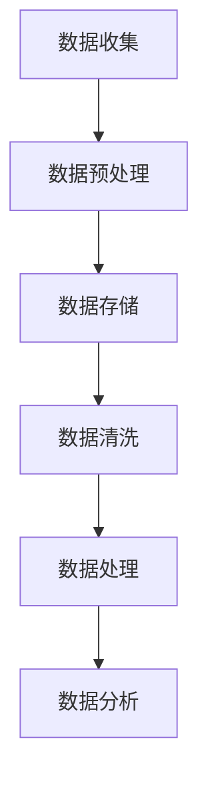
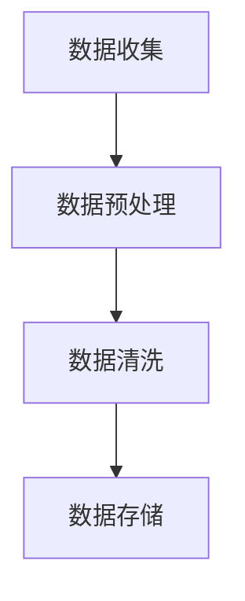
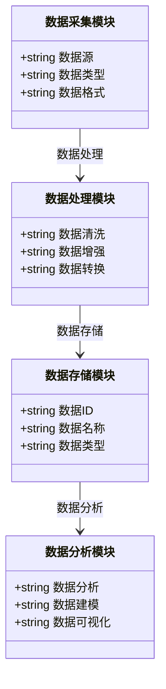
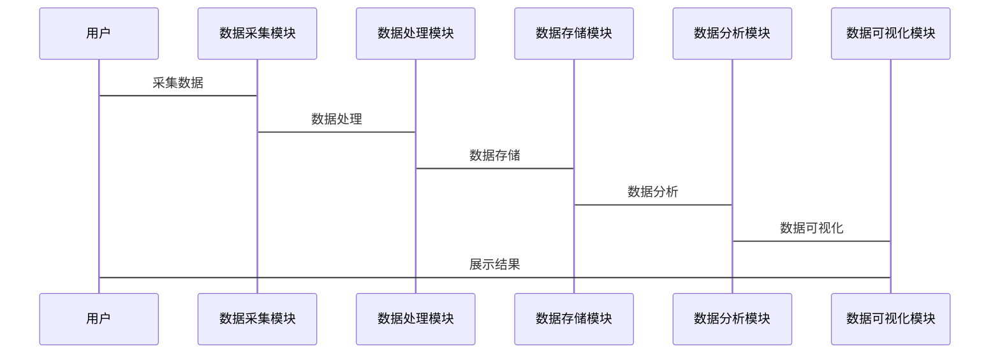

                 

<think>
好，我需要根据用户的要求，帮助他构建一个关于“构建企业级AI数据治理助手：确保数据质量与一致性”的书籍目录大纲。我需要仔细分析用户的需求，确保目录结构合理、内容全面。

首先，用户希望这本书有逻辑清晰、结构紧凑、简单易懂的结构，每个章节和小节都要吸引读者。同时，内容需要涵盖从背景到系统架构设计，再到项目实战的各个方面，确保全面覆盖主题。

接下来，我应该按照用户提供的示例结构来组织内容。用户已经提供了一个详细的示例，分为七部分，每一部分都有明确的章节和小节。我需要遵循这个结构，同时根据用户的要求进行调整和补充。

首先，我考虑第一部分：企业级AI数据治理助手的背景与重要性。这部分需要介绍数据治理的基本概念、AI时代数据治理的重要性以及数据质量与一致性的核心要素。

第二部分是数据治理的核心概念与原理。我需要详细解释数据治理的框架与流程，数据质量与一致性的关键点，以及数据治理与AI的关系。

第三部分是数据治理的算法原理与数学模型。这部分需要涵盖数据清洗与预处理算法，数据增强与数据标准化，以及这些算法的Python实现和流程图。

第四部分是数据治理的系统架构与设计方案。这部分需要讨论系统架构设计、功能设计、接口设计和交互设计。

第五部分是数据治理的项目实战。这部分需要包括环境安装、代码实现、案例分析和项目总结。

最后，第六部分是数据治理的最佳实践与总结。这部分需要涵盖最佳实践、小结、注意事项和拓展阅读。

在编写过程中，我需要确保每个章节和小节都有明确的主题，并且内容之间逻辑连贯。同时，要按照用户的要求，使用mermaid流程图和Python代码示例来辅助说明，确保技术细节清晰明了。

现在，我开始详细构建目录大纲，确保每一部分都覆盖了必要的内容，并且结构合理，符合用户的要求。我需要检查每个小节是否详细且有深度，确保读者能够通过这本书全面理解企业级AI数据治理助手的构建过程。
</think>

# 构建企业级AI数据治理助手：确保数据质量与一致性

> 关键词：数据治理，AI，数据质量，一致性，企业级，数据清洗，数据增强

> 摘要：随着人工智能技术的快速发展，数据治理在企业级AI应用中的重要性日益凸显。本篇文章详细探讨了构建企业级AI数据治理助手的关键步骤，包括数据治理的核心概念、算法原理、系统架构设计以及项目实战。通过本文，读者将深入了解如何确保数据质量与一致性，为企业级AI应用提供坚实的数据基础。

---

# 第1章 数据治理的背景与重要性

## 1.1 数据治理的基本概念
### 1.1.1 数据治理的定义
数据治理是指对数据的全生命周期进行管理，确保数据的完整性、准确性和一致性。它涵盖了数据的采集、存储、处理、分析和应用等各个环节。

### 1.1.2 数据治理的核心目标
- 确保数据质量：数据的完整性、准确性、一致性、及时性和安全性。
- 提高数据利用率：通过规范数据管理流程，最大化数据的价值。
- 降低数据风险：避免数据冗余、数据孤岛和数据泄露等问题。

### 1.1.3 数据治理在企业中的作用
- 为企业决策提供可靠的数据支持。
- 提高企业的运营效率。
- 降低数据管理的成本。

## 1.2 数据治理与AI的结合
### 1.2.1 AI时代数据治理的新挑战
- 数据量的爆炸式增长。
- 数据来源的多样性。
- 数据隐私和安全问题。

### 1.2.2 数据治理在AI应用中的关键作用
- 数据治理是AI模型训练的基础。
- 数据治理确保AI系统的可解释性和可靠性。
- 数据治理帮助企业在AI时代保持竞争优势。

### 1.2.3 企业级AI数据治理助手的定义
企业级AI数据治理助手是一种智能化工具，用于辅助企业进行数据的全生命周期管理，确保数据质量与一致性，为AI应用提供高质量的数据支持。

## 1.3 数据质量与一致性的核心要素
### 1.3.1 数据质量的定义与关键指标
- 数据质量是指数据的准确性、完整性、一致性、及时性和安全性。
- 关键指标包括：完整性、准确性、一致性、唯一性、规范性和及时性。

### 1.3.2 数据一致性的定义与实现方法
- 数据一致性是指同一数据在不同系统或不同存储介质中保持一致。
- 实现方法包括：数据清洗、数据标准化、数据关联和数据验证。

### 1.3.3 数据治理与数据安全的关系
- 数据安全是数据治理的重要组成部分。
- 数据治理确保数据在存储和传输过程中的安全性。
- 数据安全为数据治理提供技术支持。

## 1.4 本章小结
本章介绍了数据治理的基本概念、核心目标和在企业中的作用，重点探讨了数据治理与AI的结合，以及数据质量与一致性的核心要素。通过本章的学习，读者可以理解数据治理的重要性和其在企业级AI应用中的关键作用。

---

# 第2章 数据治理的核心概念

## 2.1 数据治理的框架与流程
### 2.1.1 数据治理的框架体系
- 数据治理框架包括数据策略、数据政策、数据标准和数据流程。
- 数据策略是数据治理的核心，数据政策是数据治理的实施细则。

### 2.1.2 数据治理的主要流程
- 数据收集：包括数据采集、数据预处理和数据存储。
- 数据处理：包括数据清洗、数据转换和数据增强。
- 数据分析：包括数据分析、数据建模和数据可视化。
- 数据应用：包括数据应用、数据监控和数据优化。

### 2.1.3 数据治理的边界与外延
- 数据治理的边界是数据的全生命周期管理。
- 数据治理的外延包括数据安全、数据隐私和数据合规。

## 2.2 数据质量与一致性的关键点
### 2.2.1 数据质量的核心要素
- 数据的准确性：确保数据的正确性。
- 数据的完整性：确保数据的完整性。
- 数据的及时性：确保数据的及时性。

### 2.2.2 数据一致性的影响因素
- 数据来源的多样性。
- 数据格式的不统一。
- 数据存储的不一致。

### 2.2.3 数据治理中的实体关系图（ER图）
通过ER图可以清晰地展示数据实体之间的关系，帮助我们更好地理解数据结构。

```mermaid
erDiagram
    actor 用户 {
        +string 用户ID
        +string 用户名
        +string 密码
    }
    actor 数据源 {
        +string 数据ID
        +string 数据名称
        +string 数据类型
    }
    actor 数据存储 {
        +string 数据ID
        +string 数据名称
        +string 数据类型
    }
    用户 --> 数据源: 提供数据
    数据源 --> 数据存储: 存储数据
    数据存储 --> 用户: 提供数据
```

## 2.3 数据治理与AI的关系
### 2.3.1 数据治理在AI中的角色
- 数据治理是AI模型训练的基础。
- 数据治理确保AI系统的可解释性和可靠性。

### 2.3.2 数据治理对AI模型的影响
- 数据质量直接影响AI模型的性能。
- 数据一致性确保AI模型的稳定性。

### 2.3.3 数据治理的未来发展趋势
- 数据治理将更加智能化和自动化。
- 数据治理将更加注重数据隐私和安全。

## 2.4 本章小结
本章详细讲解了数据治理的框架与流程，数据质量与一致性的关键点，以及数据治理与AI的关系。通过本章的学习，读者可以更好地理解数据治理的核心概念和其在企业级AI应用中的重要作用。

---

# 第3章 数据清洗与预处理算法

## 3.1 数据清洗的基本原理
### 3.1.1 数据清洗的目标与步骤
- 数据清洗的目标是确保数据的准确性、完整性和一致性。
- 数据清洗的步骤包括数据收集、数据预处理和数据存储。

### 3.1.2 常见的数据清洗算法
- 数据去重：去除重复数据。
- 数据填充：填补缺失数据。
- 数据转换：转换数据格式。

### 3.1.3 数据清洗的数学模型
数据清洗的数学模型可以通过以下步骤实现：

1. 数据去重：
$$
\text{去重后数据} = \text{去重前数据} \setminus \text{重复数据}
$$

2. 数据填充：
$$
\text{填充后数据} = \text{缺失值} \oplus \text{填充值}
$$

3. 数据转换：
$$
\text{转换后数据} = f(\text{原始数据})
$$

### 3.1.4 数据清洗的流程图


## 3.2 数据增强与数据标准化
### 3.2.1 数据增强的原理与方法
- 数据增强的原理是通过变换数据来增加数据的多样性。
- 数据增强的方法包括旋转、翻转、裁剪和调整亮度。

### 3.2.2 数据标准化的数学公式
$$
z = \frac{x - \mu}{\sigma}
$$

其中，$\mu$ 是均值，$\sigma$ 是标准差。

### 3.2.3 数据增强与数据标准化的对比分析
数据增强通过变换数据来增加数据的多样性，而数据标准化通过标准化处理来确保数据的均匀分布。

## 3.3 数据清洗的Python实现
### 3.3.1 数据清洗的代码实现
```python
import pandas as pd

# 数据收集
data = pd.read_csv('data.csv')

# 数据预处理
data.dropna(inplace=True)  # 删除缺失值
data.drop_duplicates(inplace=True)  # 去除重复值
data['new_column'] = data['column'].apply(lambda x: x.strip())  # 数据清洗

# 数据存储
data.to_csv('clean_data.csv', index=False)
```

### 3.3.2 数据清洗的流程图


## 3.4 本章小结
本章详细讲解了数据清洗的基本原理、数据增强与数据标准化的方法，以及数据清洗的Python实现。通过本章的学习，读者可以掌握数据清洗的核心算法和实现方法。

---

# 第4章 数据治理的系统架构与设计方案

## 4.1 系统架构设计
### 4.1.1 系统功能设计
- 数据采集模块：负责数据的采集和预处理。
- 数据处理模块：负责数据的清洗和增强。
- 数据存储模块：负责数据的存储和管理。
- 数据分析模块：负责数据的分析和建模。
- 数据可视化模块：负责数据的可视化和展示。

### 4.1.2 系统架构设计图


### 4.1.3 系统接口设计
- 数据采集接口：用于数据的采集和预处理。
- 数据处理接口：用于数据的清洗和增强。
- 数据存储接口：用于数据的存储和管理。
- 数据分析接口：用于数据的分析和建模。

## 4.2 系统交互设计
### 4.2.1 系统交互流程
1. 用户通过数据采集模块采集数据。
2. 数据采集模块将数据传输到数据处理模块。
3. 数据处理模块对数据进行清洗和增强。
4. 数据处理模块将处理后的数据传输到数据存储模块。
5. 数据存储模块将数据存储到数据库中。
6. 数据分析模块从数据库中获取数据进行分析和建模。
7. 数据分析模块将分析结果传输到数据可视化模块。
8. 数据可视化模块将分析结果以可视化形式展示给用户。

### 4.2.2 系统交互图


## 4.3 本章小结
本章详细讲解了数据治理系统的架构设计和交互设计，包括系统的功能模块、接口设计和交互流程。通过本章的学习，读者可以理解数据治理系统的整体架构和实现方法。

---

# 第5章 数据治理的项目实战

## 5.1 环境安装
### 5.1.1 安装Python
```bash
python --version
pip install --upgrade pip
```

### 5.1.2 安装Pandas和NumPy
```bash
pip install pandas numpy
```

## 5.2 代码实现
### 5.2.1 数据采集模块
```python
import pandas as pd

# 数据采集模块
def data_collection():
    data = pd.read_csv('data.csv')
    return data
```

### 5.2.2 数据处理模块
```python
import pandas as pd

# 数据处理模块
def data_processing(data):
    data.dropna(inplace=True)
    data.drop_duplicates(inplace=True)
    return data
```

### 5.2.3 数据存储模块
```python
import pandas as pd

# 数据存储模块
def data_storage(data):
    data.to_csv('clean_data.csv', index=False)
    return '数据存储完成'
```

### 5.2.4 数据分析模块
```python
import pandas as pd
import numpy as np

# 数据分析模块
def data_analysis(data):
    # 数据分析
    print(data.describe())
    # 数据建模
    model = np.random.randn(1)
    return model
```

### 5.2.5 数据可视化模块
```python
import pandas as pd
import matplotlib.pyplot as plt

# 数据可视化模块
def data_visualization(data):
    plt.hist(data['数值'], bins=10)
    plt.xlabel('数值')
    plt.ylabel('频率')
    plt.title('数据分布图')
    plt.show()
```

## 5.3 案例分析
### 5.3.1 数据采集与预处理
```python
data = data_collection()
data_processed = data_processing(data)
```

### 5.3.2 数据存储与分析
```python
data_storage(data_processed)
model = data_analysis(data_processed)
```

### 5.3.3 数据可视化
```python
data_visualization(data_processed)
```

## 5.4 项目总结
通过本项目，我们实现了数据治理的全过程，包括数据采集、数据处理、数据存储、数据分析和数据可视化。通过本项目的实践，读者可以更好地理解数据治理的核心流程和技术实现。

---

# 第6章 数据治理的最佳实践与总结

## 6.1 最佳实践
### 6.1.1 数据治理的策略
- 制定数据治理策略。
- 建立数据治理组织。
- 制定数据治理政策。

### 6.1.2 数据治理的工具
- 数据清洗工具：Pandas、NumPy。
- 数据可视化工具：Matplotlib、Seaborn。
- 数据存储工具：MySQL、MongoDB。

## 6.2 小结
通过本文的学习，读者可以全面理解企业级AI数据治理助手的构建过程，包括数据治理的核心概念、算法原理、系统架构设计以及项目实战。通过最佳实践的总结，读者可以更好地掌握数据治理的策略和工具。

## 6.3 注意事项
- 数据治理需要长期坚持，不能一蹴而就。
- 数据治理需要结合企业的实际情况，不能盲目照搬。

## 6.4 拓展阅读
- 《数据治理：从战略到实践》
- 《企业级数据架构设计》
- 《数据质量管理：方法与实践》

---

# 作者：AI天才研究院/AI Genius Institute & 禅与计算机程序设计艺术 /Zen And The Art of Computer Programming

---

**注意：** 以上内容为书籍目录大纲，具体内容需要根据实际需求进行详细编写。

