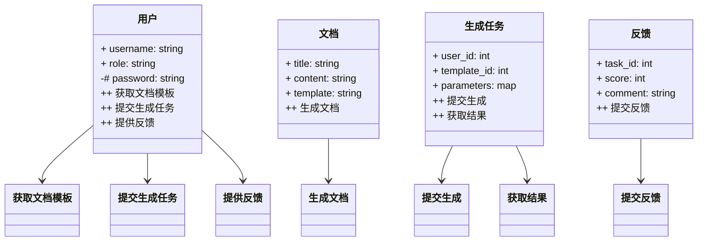
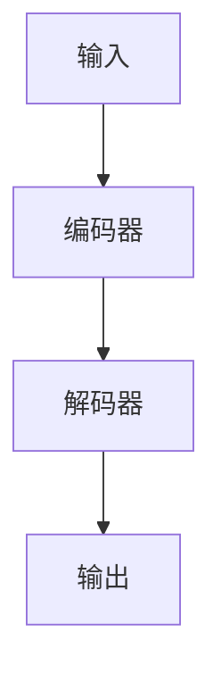

                 


# 构建企业级AI文档助手：自动化报告与提案生成

> 关键词：企业级AI文档助手，自动化报告生成，生成式AI，AI大模型，文档处理，系统架构设计

> 摘要：本文详细探讨了如何构建一个企业级AI文档助手，重点分析了其核心概念、算法原理、系统架构设计以及实际项目实现。通过理论与实践结合的方式，展示了如何利用生成式AI技术实现自动化报告与提案生成，为企业文档处理提供高效解决方案。

---

# 第一部分: 企业级AI文档助手的背景与核心概念

## 第1章: 问题背景与需求分析

### 1.1 问题背景

#### 1.1.1 传统文档处理的痛点
传统的文档处理流程依赖人工操作，存在效率低、错误率高、一致性差等问题。企业中的报告和提案生成需要大量时间和人力资源，尤其是在大规模生产环境中，人工处理的局限性更加明显。

#### 1.1.2 AI技术如何解决文档处理问题
生成式AI技术（如大语言模型）能够自动化处理文档生成任务，通过自然语言处理技术理解上下文并生成符合要求的内容。AI文档助手能够显著提高文档生成的效率和质量，降低企业的人力成本。

#### 1.1.3 企业级文档助手的定义与目标
企业级AI文档助手是一种基于生成式AI技术的企业级工具，旨在自动化生成高质量的报告和提案。其目标是通过智能化的文档处理能力，为企业提供高效、准确的文档生成解决方案。

---

## 第2章: 企业级AI文档助手的核心需求

### 2.1 自动化报告生成的需求

#### 2.1.1 高效性
AI文档助手需要能够在较短时间内生成高质量的报告，满足企业对快速响应的需求。

#### 2.1.2 一致性
生成的报告需要符合企业的风格和格式要求，确保内容的一致性。

#### 2.1.3 可定制性
AI文档助手应支持不同业务场景下的定制化需求，能够根据输入的参数生成不同类型的报告。

### 2.2 提案生成的关键功能

#### 2.2.1 内容生成
基于输入的主题和参数，生成符合要求的提案内容。

#### 2.2.2 数据整合
能够从多个数据源中获取相关信息，并将其整合到提案中。

#### 2.2.3 智能优化
根据上下文和目标，自动优化提案内容，确保其逻辑性和可读性。

### 2.3 企业级应用的特殊要求

#### 2.3.1 高可用性
企业级系统需要具备高可用性，确保在关键业务场景下稳定运行。

#### 2.3.2 安全性
文档助手需要具备数据安全和隐私保护能力，确保企业敏感信息的安全。

#### 2.3.3 扩展性
系统架构应具备良好的扩展性，能够适应企业未来业务发展的需求。

---

## 第3章: 生成式AI的核心概念

### 3.1 大语言模型的基本原理

#### 3.1.1 模型结构
大语言模型通常基于Transformer架构，通过自注意力机制和前馈网络实现文本生成。

#### 3.1.2 概率分布
模型通过概率分布预测下一个词，生成符合上下文的文本序列。

#### 3.1.3 损失函数
使用交叉熵损失函数来衡量生成结果与真实数据的差距。

---

### 3.2 生成式AI的工作机制

#### 3.2.1 解码器
解码器负责根据输入生成输出序列，通常采用贪心搜索或随机采样策略。

#### 3.2.2 多模态输入
模型可以接受文本、图像等多种输入形式，并生成相应的输出。

#### 3.2.3 温度参数
通过调整温度参数，控制生成文本的创造性与稳定性。

---

## 第4章: 企业级文档助手的核心要素

### 4.1 文档生成的流程

#### 4.1.1 输入处理
解析用户的输入，提取关键信息。

#### 4.1.2 内容生成
基于输入信息，生成符合要求的文档内容。

#### 4.1.3 格式化输出
将生成的内容格式化为最终的文档形式。

---

## 第5章: 生成式AI的挑战与解决方案

### 5.1 模型的可解释性

#### 5.1.1 黑箱问题
大模型的内部机制难以解释，可能影响企业的信任度。

#### 5.1.2 解释性增强
通过可视化技术或中间结果分析，提升模型的可解释性。

---

### 5.2 数据安全与隐私保护

#### 5.2.1 数据泄露风险
模型训练过程中可能涉及企业敏感数据，存在泄露风险。

#### 5.2.2 隐私保护措施
采用数据脱敏、联邦学习等技术，确保数据安全。

---

## 第6章: 企业级AI文档助手的未来趋势

### 6.1 技术进步
大语言模型的性能将不断提升，生成内容的准确性和创造性将显著增强。

### 6.2 应用场景扩展
AI文档助手将应用于更多业务场景，如市场分析、法律文件生成等。

### 6.3 人机协作
未来的文档生成将更加注重人机协作，AI助手将与人类专家协同工作，共同完成复杂的文档任务。

---

# 第二部分: 企业级AI文档助手的系统架构与设计

## 第7章: 系统分析与架构设计

### 7.1 问题场景与项目介绍

#### 7.1.1 企业级文档助手的应用场景
企业内部报告、市场分析、项目提案等场景。

#### 7.1.2 项目目标
开发一个支持多种文档类型生成的企业级AI文档助手。

#### 7.1.3 关键业务流程
输入解析、内容生成、格式化输出、反馈优化。

---

### 7.2 系统功能设计

#### 7.2.1 领域模型设计
- 实体：用户、文档、生成任务、反馈。
- 关系：用户发起生成任务，系统生成文档，用户提供反馈。

（类图示例：使用Mermaid绘制）



---

#### 7.2.2 系统架构设计
- 分层架构：前端、服务层、数据层。
- 技术选型：前端采用React，后端采用Spring Boot，数据库采用MySQL。

（架构图示例：使用Mermaid绘制）

```mermaid

```

---

## 第8章: 企业级AI文档助手的算法实现

### 8.1 生成式AI的数学模型

#### 8.1.1 Transformer模型
- 输入：文本序列。
- 输出：生成的文本序列。

（数学公式：交叉熵损失函数）

$$
\text{Loss} = -\sum_{i=1}^{n} \log p(y_i|x_{1..i-1})
$$

---

#### 8.1.2 解码器
- 输入：初始向量。
- 输出：生成的文本序列。

（流程图示例：使用Mermaid绘制）



---

## 第9章: 企业级AI文档助手的项目实战

### 9.1 环境安装

#### 9.1.1 安装Python
```bash
python --version
```

#### 9.1.2 安装依赖
```bash
pip install -r requirements.txt
```

---

### 9.2 系统核心实现

#### 9.2.1 前端代码
```javascript
function generateDocument(templateId, parameters) {
    fetch('/api/generate', {
        method: 'POST',
        headers: {
            'Content-Type': 'application/json',
        },
        body: JSON.stringify({
            template_id: templateId,
            parameters: parameters
        })
    })
    .then(response => response.json())
    .then(data => {
        // 处理生成的文档
    });
}
```

#### 9.2.2 后端代码
```java
@RestController
@RequestMapping("/api/generate")
class GenerateController {
    @PostMapping
    public ResponseEntity<Document> generate(@RequestBody GenerateRequest request) {
        // 生成文档逻辑
        return ResponseEntity.ok(document);
    }
}
```

---

## 第10章: 最佳实践与总结

### 10.1 最佳实践

#### 10.1.1 数据质量管理
确保训练数据的多样性和高质量，避免模型偏见。

#### 10.1.2 模型优化
通过调优超参数和剪枝技术，提升模型性能。

#### 10.1.3 安全措施
采用数据脱敏和访问控制技术，保障数据安全。

---

### 10.2 小结

企业级AI文档助手的构建涉及多方面的技术挑战，从模型选择到系统架构设计，每一步都需要精心规划。通过结合生成式AI技术与企业需求，我们可以实现高效、智能的文档生成解决方案。

---

# 作者：AI天才研究院 & 禅与计算机程序设计艺术

