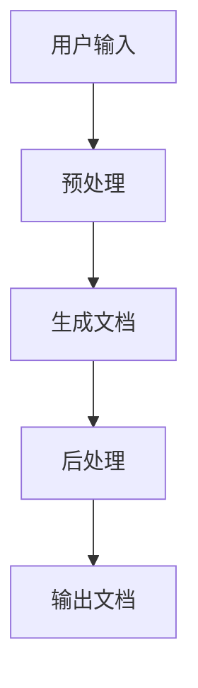

                 


# 构建企业级AI文档助手：自动生成报告与提案

## 关键词：AI文档助手、自然语言处理、自动生成报告、企业级AI应用、文档生成技术、AI技术

## 摘要：  
随着企业对高效文档生成需求的不断增加，AI文档助手逐渐成为企业级应用的重要工具。本文将从背景、核心概念、算法原理、系统架构、项目实战和最佳实践等方面详细探讨如何构建企业级AI文档助手，帮助用户实现自动化报告与提案生成。通过结合自然语言处理技术和深度学习模型，本文将为企业提供一套完整的解决方案，助力企业提升文档生成效率和质量。

---

## 第一部分：背景介绍

### 第1章：企业文档的重要性与需求

#### 1.1 企业文档的核心作用
- **文档在企业运营中的关键性**  
  文档是企业运行的核心支撑，包括业务流程、决策支持、项目管理等多个方面。高效文档管理能够显著提升企业效率，降低沟通成本。

- **文档管理对企业效率的影响**  
  传统文档管理依赖人工操作，效率低下且容易出错。AI文档助手通过自动化生成文档，能够大幅提高文档生成速度和准确性。

- **文档在决策支持中的价值**  
  文档不仅是信息的载体，更是决策的重要依据。AI文档助手能够快速生成结构化报告，为管理层提供实时数据支持。

#### 1.2 AI文档助手的需求背景
- **传统文档生成的痛点**  
  传统文档生成过程繁琐，依赖人工操作，效率低且容易出错。特别是在企业规模扩大时，文档生成任务变得更加复杂。

- **企业对自动化文档生成的迫切需求**  
  随着企业业务的扩展，对文档生成的效率和准确性要求越来越高。AI文档助手能够满足企业对自动化文档生成的需求，降低人力成本。

---

## 第二部分：核心概念与联系

### 第2章：AI文档助手的核心概念

#### 2.1 AI文档助手的定义与特征
- **定义**：AI文档助手是一种基于自然语言处理技术的工具，能够根据用户提供的输入生成结构化报告和提案。
- **特征**：
  - **自然语言理解**：能够理解用户输入的意图和需求。
  - **自动化生成**：基于理解生成高质量文档。
  - **可定制性**：支持不同格式和风格的文档生成。

#### 2.2 核心概念对比表
| 概念       | 传统文档工具         | AI文档助手         |
|------------|----------------------|----------------------|
| 输入方式     | 固定模板或手动输入     | 自然语言输入或半结构化输入 |
| 输出方式     | 预定义格式             | 自动生成结构化文档     |
| 生成效率     | 低                   | 高                   |
| 灵活性       | 低                   | 高                   |

#### 2.3 实体关系模型
```mermaid
erDiagram
    actor 用户 {
        用户ID
        用户角色
        用户偏好
    }
    document 文档 {
        文档ID
        文档内容
        文档格式
    }
    model AI模型 {
        模型ID
        模型类型
        模型参数
    }
    用户 --> 文档: 提交请求
    文档 --> 模型: 生成内容
```

---

## 第三部分：算法原理

### 第3章：自然语言处理与生成算法

#### 3.1 NLP模型基础
- **BERT模型**：用于文本理解，通过预训练任务捕获上下文信息。
- **GPT模型**：用于文本生成，基于上下文预测下一个词。

#### 3.2 文档生成流程


#### 3.3 模型训练与优化
- **训练目标**：最小化生成文本与真实文本的交叉熵损失。
  $$ \mathcal{L} = -\frac{1}{N}\sum_{i=1}^{N}\log p(y_i|x_i) $$
- **生成策略**：使用贪心算法或采样方法生成最优文本。

---

## 第四部分：系统分析与架构设计

### 第4章：系统架构设计

#### 4.1 项目背景与目标
- **目标**：构建一个支持企业级使用的AI文档生成系统，实现快速、准确的文档生成。

#### 4.2 功能模块设计
- **用户交互模块**：接收用户输入并生成文档。
- **文档生成模块**：调用AI模型生成内容。
- **存储模块**：存储生成的文档和用户偏好。

#### 4.3 系统架构图


#### 4.4 接口与交互设计
- **用户请求**：用户通过前端界面提交请求。
- **系统响应**：系统调用AI模型生成文档并返回结果。

---

## 第五部分：项目实战

### 第5章：AI文档助手的实现

#### 5.1 环境安装
- **Python环境**：安装Python 3.8及以上版本。
- **依赖库安装**：安装`transformers`、`pytorch`等库。

#### 5.2 核心代码实现
```python
from transformers import AutoTokenizer, AutoModelForCausalLM

tokenizer = AutoTokenizer.from_pretrained('gpt2')
model = AutoModelForCausalLM.from_pretrained('gpt2')

def generate_document(prompt, max_length=500):
    inputs = tokenizer.encode(prompt, return_tensors='pt')
    outputs = model.generate(inputs, max_length=max_length, do_sample=True)
    return tokenizer.decode(outputs[0], skip_special_tokens=True)
```

#### 5.3 实际案例分析
- **案例1**：生成会议记录。
- **案例2**：生成市场分析报告。

#### 5.4 项目总结
- **经验总结**：模型选择和调优对生成效果影响显著。
- **常见问题**：生成内容准确性不足，需要结合领域知识进行优化。

---

## 第六部分：最佳实践

### 第6章：AI文档助手的优化与维护

#### 6.1 使用建议
- **数据安全**：确保用户数据加密存储。
- **模型选择**：根据需求选择合适的NLP模型。
- **用户反馈**：建立反馈机制以优化生成效果。

#### 6.2 注意事项
- 避免过度依赖AI生成，需结合人工校对。
- 定期更新模型以适应新需求。

#### 6.3 拓展阅读
- 推荐阅读相关书籍和论文，深入理解NLP技术。

---

## 作者：AI天才研究院/AI Genius Institute & 禅与计算机程序设计艺术 /Zen And The Art of Computer Programming

---

以上是《构建企业级AI文档助手：自动生成报告与提案》的技术博客文章的完整目录和内容概览。文章详细探讨了AI文档助手的背景、核心概念、算法原理、系统架构、项目实战和最佳实践，为企业提供了一套完整的解决方案，助力企业提升文档生成效率和质量。

