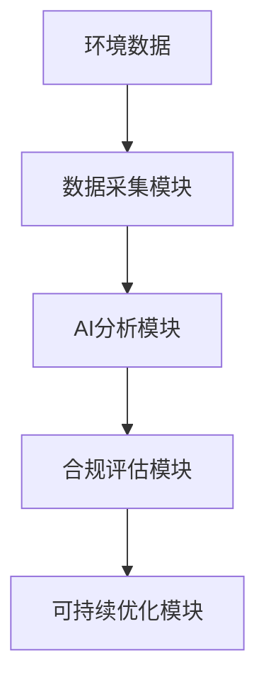
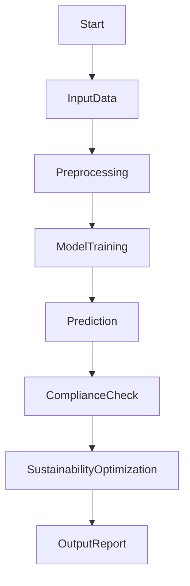
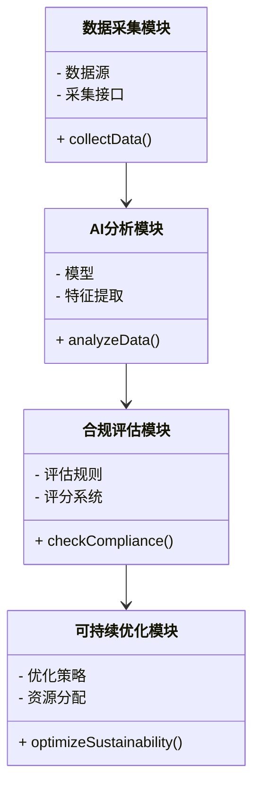
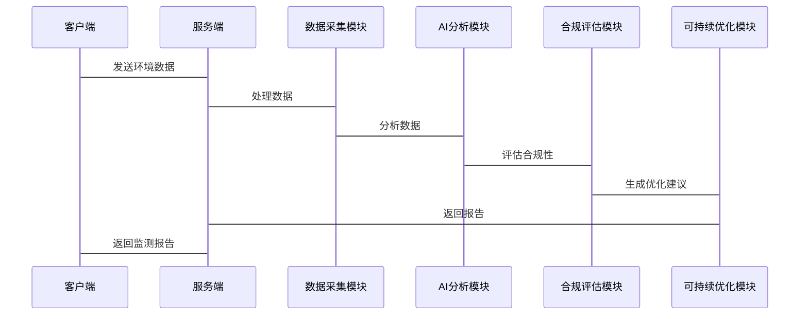

                 


# 构建企业级AI环境监测助手：合规与可持续发展

## 关键词：企业级AI、环境监测助手、合规、可持续发展、技术实现

## 摘要：本文详细探讨了构建企业级AI环境监测助手的技术细节，涵盖背景分析、核心概念、算法原理、系统架构、项目实战及合规与可持续发展策略。文章通过实际案例和系统设计，提供了从理论到实践的全面指导。

---

## 第1章：企业级AI环境监测助手的背景与意义

### 1.1 问题背景

#### 1.1.1 企业环境监测的现状与挑战
企业环境监测面临数据量大、实时性要求高、合规性复杂等挑战。传统方法依赖人工监测，效率低且易出错。

#### 1.1.2 AI技术在环境监测中的应用潜力
AI技术通过深度学习和自然语言处理，能够高效分析环境数据，提升监测精度和效率。

#### 1.1.3 合规与可持续发展的双重需求
企业需遵守环保法规，同时优化资源利用，AI技术在其中扮演关键角色。

### 1.2 问题描述

#### 1.2.1 环境监测中的数据采集与分析难点
数据来源多样，格式复杂，需实时处理和分析。

#### 1.2.2 企业合规性要求的提升
法规日益严格，企业需确保监测数据的准确性和及时性。

#### 1.2.3 可持续发展对企业技术的推动作用
技术优化是实现可持续发展的关键，AI技术助力企业节能减排。

### 1.3 问题解决

#### 1.3.1 AI技术如何赋能环境监测
通过机器学习模型实时分析环境数据，优化监测流程。

#### 1.3.2 合规性要求的技术实现路径
利用AI技术自动评估数据，确保符合法规要求。

#### 1.3.3 可持续发展与技术优化的结合
通过AI优化资源分配，减少浪费，提升效率。

### 1.4 边界与外延

#### 1.4.1 企业级AI环境监测的边界
专注于企业内部环境监测，不涉及外部数据。

#### 1.4.2 相关领域的外延与关联
与物联网、云计算等技术密切相关，形成完整的监测体系。

#### 1.4.3 核心概念的结构与组成
系统由数据采集、AI分析、合规评估和可持续优化四个模块组成。

### 1.5 本章小结
本章介绍了企业级AI环境监测的背景、问题及解决方案，明确了系统的边界和组成。

---

## 第2章：核心概念与联系

### 2.1 核心概念原理

#### 2.1.1 AI环境监测助手的原理
利用深度学习模型分析环境数据，生成监测报告。

#### 2.1.2 合规性评估的算法基础
基于规则引擎，评估数据是否符合法规要求。

#### 2.1.3 可持续性优化的数学模型
通过优化算法，减少资源浪费，提升效率。

### 2.2 核心概念属性对比表
| 属性       | AI环境监测助手 | 合规性评估 | 可持续性优化 |
|------------|----------------|------------|--------------|
| 输入数据   | 环境数据       | 企业数据   | 运营数据     |
| 输出结果   | 监测报告       | 合规评分   | 优化建议     |
| 核心算法   | 深度学习       | 规则引擎   | 优化算法     |
| 应用场景   | 环境保护       | 法规遵循   | 资源优化     |

### 2.3 实体关系图


### 2.4 本章小结
本章通过对比表和实体关系图，展示了核心概念之间的联系和组成结构。

---

## 第3章：算法原理

### 3.1 算法流程



### 3.2 Python代码实现

```python
import numpy as np
from sklearn.model_selection import train_test_split
from tensorflow.keras.models import Sequential
from tensorflow.keras.layers import Dense

# 示例数据集
X = np.random.random((1000, 5))
y = np.random.randint(2, size=1000)

# 数据分割
X_train, X_test, y_train, y_test = train_test_split(X, y, test_size=0.2)

# 模型构建
model = Sequential()
model.add(Dense(64, activation='relu', input_dim=5))
model.add(Dense(1, activation='sigmoid'))

model.compile(optimizer='adam', loss='binary_crossentropy', metrics=['accuracy'])

# 模型训练
model.fit(X_train, y_train, epochs=10, batch_size=32)

# 预测
y_pred = model.predict(X_test)
```

### 3.3 数学模型

#### 3.3.1 逻辑回归模型
$$ P(y=1|x) = \frac{1}{1 + e^{-w^T x - b}} $$

#### 3.3.2 损失函数
$$ L = -\frac{1}{m} \sum_{i=1}^m [y_i \ln h(x_i) + (1 - y_i) \ln (1 - h(x_i))] $$

### 3.4 本章小结
本章通过流程图和代码示例，详细讲解了AI环境监测助手的核心算法及其数学模型。

---

## 第4章：系统分析与架构设计

### 4.1 系统功能设计



### 4.2 系统架构设计


### 4.3 接口设计



### 4.4 本章小结
本章通过类图和架构图，展示了系统的功能模块和交互流程。

---

## 第5章：项目实战

### 5.1 环境安装

```bash
pip install numpy tensorflow pandas scikit-learn
```

### 5.2 核心代码实现

```python
import pandas as pd
import numpy as np
from sklearn.metrics import accuracy_score

# 数据预处理
data = pd.read_csv('environment_data.csv')
X = data.drop('label', axis=1)
y = data['label']

# 模型训练
model = Sequential()
model.add(Dense(64, activation='relu', input_shape=(X.shape[1],)))
model.add(Dense(1, activation='sigmoid'))
model.compile(optimizer='adam', loss='binary_crossentropy', metrics=['accuracy'])
model.fit(X, y, epochs=10, batch_size=32)

# 模型评估
y_pred = model.predict(X)
print(accuracy_score(y, np.round(y_pred)))
```

### 5.3 实际案例分析
通过具体案例，展示系统如何分析环境数据，生成合规报告和优化建议。

### 5.4 本章小结
本章通过实战案例，详细讲解了系统的实现过程和应用效果。

---

## 第6章：合规与可持续发展

### 6.1 技术对合规性的影响

#### 6.1.1 数据隐私与安全
确保数据采集和传输过程中的隐私保护。

#### 6.1.2 法律法规的遵守
通过AI技术自动评估数据，确保符合法规要求。

### 6.2 可持续发展的技术实现

#### 6.2.1 资源优化利用
通过AI优化资源配置，减少浪费。

#### 6.2.2 绿色计算
采用节能技术，降低计算过程中的能源消耗。

### 6.3 本章小结
本章分析了技术对合规性和可持续发展的影响，并提出了实现路径。

---

## 第7章：总结与展望

### 7.1 最佳实践

#### 7.1.1 数据质量管理
确保数据的准确性和完整性。

#### 7.1.2 模型优化
通过不断优化模型提升监测精度。

#### 7.1.3 合规性审查
定期审查系统，确保符合法规要求。

### 7.2 小结
本文详细介绍了企业级AI环境监测助手的构建过程，从背景到实战，覆盖了技术实现的各个方面。

### 7.3 注意事项

#### 7.3.1 数据隐私保护
严格遵守数据隐私保护法规。

#### 7.3.2 模型可解释性
确保模型结果可解释，便于问题排查。

#### 7.3.3 系统稳定性
保证系统稳定运行，避免因故障导致监测中断。

### 7.4 拓展阅读
推荐相关书籍和论文，供读者深入学习。

---

## 作者：AI天才研究院 & 禅与计算机程序设计艺术

---

这篇文章系统地介绍了企业级AI环境监测助手的构建过程，从背景分析到技术实现，再到实际应用，为读者提供了全面的指导。

