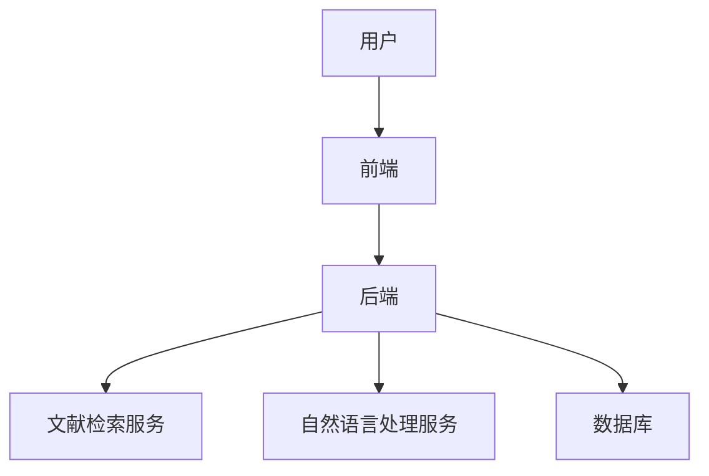
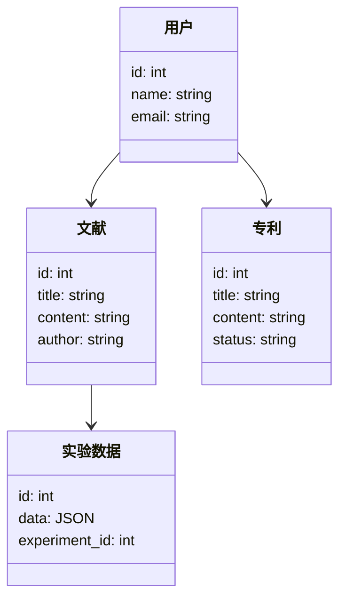

                 

<think>
嗯，我现在需要帮用户构建一个企业级AI研发助手，用来加速创新和专利申请流程。首先，我得理解用户的需求。用户是一位技术专家，可能在企业里负责研发或者专利管理，他希望通过AI来优化这些流程，提高效率。

首先，我应该考虑企业的研发过程通常是什么样的。研发人员可能需要大量的文献查阅、数据处理、实验设计等，这些步骤耗时且容易出错。AI研发助手可以自动化这些任务，比如自动检索相关文献，分析数据，甚至生成实验方案。

然后是专利申请流程。专利撰写需要大量的法律术语和格式要求，AI可以帮助生成符合要求的专利文档，自动检测新颖性，甚至预测审查结果。这可以大大缩短专利申请的时间，减少人为错误。

接下来，我需要设计这个AI助手的核心功能模块。可能包括文献检索模块、数据处理模块、专利撰写模块和智能提醒模块。每个模块都需要有详细的功能和交互流程。

技术框架方面，可能采用微服务架构，每个功能模块独立运行，通过API进行通信。这样可以提高系统的扩展性和维护性。同时，使用容器化技术部署，方便在不同的环境中运行。

算法方面，自然语言处理（NLP）是关键。比如，使用BERT模型来理解专利文档的内容，生成摘要或自动填写专利申请表。机器学习模型可以帮助预测专利审查的结果，优化申请策略。

系统架构设计需要考虑高可用性和安全性。可能需要使用负载均衡、分布式数据库和身份验证机制来确保系统的稳定和数据安全。

在项目实战部分，我会从环境搭建开始，比如安装Python、TensorFlow和自然语言处理库。然后逐步实现各个功能模块，比如文献检索模块的代码，展示如何调用API获取数据。接着进行案例分析，比如如何帮助研发团队生成实验方案，提高效率。

最后，给出最佳实践的建议，比如如何选择模型、如何优化API调用、如何处理数据隐私问题等。同时，总结项目成果，强调AI研发助手带来的效率提升和成本节约。

整个思考过程中，我需要确保每个部分都详细具体，使用图表和代码示例来辅助说明，让读者能够清晰理解每个步骤。同时，要注意数学公式的正确性，确保算法部分的严谨性。

总之，构建这样一个系统需要从需求分析、功能设计、技术选型、算法实现到系统部署等多个方面进行全面考虑，确保最终的AI研发助手能够真正帮助企业提升研发效率和优化专利申请流程。
</think>

# 构建企业级AI研发助手：加速创新与专利申请流程

## 关键词：企业级AI研发助手，AI研发流程优化，专利申请流程，自然语言处理，机器学习，系统架构设计，项目实战

## 摘要：  
随着人工智能技术的快速发展，企业级AI研发助手正在成为提升研发效率和优化专利申请流程的重要工具。本文将详细探讨如何构建一个高效的AI研发助手，涵盖其核心概念、算法原理、系统架构设计以及实际项目实现。通过本文的学习，读者将能够深入了解AI技术在研发与专利申请中的应用场景，并掌握构建此类系统的实用技能。

---

# 第一部分: 企业级AI研发助手的背景与价值

## 第1章: AI研发助手的背景与现状

### 1.1 企业级AI研发的需求背景

#### 1.1.1 研发效率提升的迫切需求
现代企业面临日益激烈的竞争，研发部门需要高效利用资源、快速迭代创新。然而，传统研发流程效率低下，存在以下问题：
- 研发人员需要手动检索大量文献，耗时且易遗漏关键信息。
- 实验设计和数据分析依赖人工经验，难以快速优化。
- 知识共享不足，导致重复劳动和资源浪费。

#### 1.1.2 专利申请流程的痛点与挑战
专利申请是企业保护知识产权的重要手段，但传统流程存在以下问题：
- 专利撰写耗时且复杂，需要熟悉法律术语和格式要求。
- 新颖性检索依赖人工判断，容易出错且效率低。
- 审查周期长，企业难以快速获取专利授权。

#### 1.1.3 AI技术在研发中的应用潜力
AI技术在研发和专利申请中的潜力巨大：
- 自然语言处理（NLP）技术可以快速分析文献，提取关键信息。
- 机器学习算法可以预测实验结果，优化研发路径。
- AI可以自动生成专利申请文件，提高效率。

### 1.2 AI研发助手的现状分析

#### 1.2.1 当前AI技术在企业研发中的应用案例
- 研发流程中的文献检索自动化。
- 数据分析工具的智能化。
- 实验设计的AI辅助。

#### 1.2.2 企业级AI研发助手的市场现状
- 市场上已有一些AI研发工具，但功能单一。
- 缺乏专门针对企业级研发和专利申请的综合性工具。

#### 1.2.3 现有工具的局限性与改进方向
- 现有工具功能单一，无法满足企业级需求。
- 缺乏深度学习和自然语言处理能力。
- 无法实现研发与专利申请的全流程打通。

### 1.3 企业级AI研发助手的价值与目标

#### 1.3.1 提升研发效率的核心价值
- 快速检索文献，减少重复劳动。
- 自动生成实验方案，优化研发路径。
- 提高知识共享效率。

#### 1.3.2 优化专利申请流程的实际意义
- 自动生成专利文件，提高撰写效率。
- 自动检索新颖性，降低审查风险。
- 预测专利审查结果，优化申请策略。

#### 1.3.3 企业级AI研发助手的目标与愿景
- 成为企业研发和专利申请的全能助手。
- 实现研发与专利申请的无缝衔接。
- 推动企业创新效率的整体提升。

## 第2章: AI研发助手的核心概念与技术框架

### 2.1 AI研发助手的定义与功能模块

#### 2.1.1 核心功能模块概述
- 文献检索模块：自动检索相关文献，提取关键词和摘要。
- 数据分析模块：分析实验数据，生成可视化报告。
- 专利撰写模块：自动生成专利申请文件。
- 智能提醒模块：提醒专利申请截止日期和研发节点。

#### 2.1.2 模块之间的关系与协作
- 文献检索模块与数据分析模块协作，提取文献数据并进行分析。
- 专利撰写模块利用文献分析结果生成专利内容。
- 智能提醒模块根据研发和专利申请的关键节点触发提醒。

#### 2.1.3 功能模块的实现方式
- 文献检索模块：调用第三方API（如PubMed、Google Scholar）获取文献数据。
- 数据分析模块：使用Python的Pandas和Matplotlib进行数据处理和可视化。
- 专利撰写模块：结合自然语言处理技术生成专利内容。
- 智能提醒模块：基于日历和任务管理工具设置提醒。

### 2.2 AI研发助手的技术框架

#### 2.2.1 技术架构的分层与模块化
- 用户界面层：提供直观的操作界面。
- 业务逻辑层：处理用户的请求并调用相关模块。
- 数据存储层：存储文献、实验数据和专利信息。
- 第三方服务层：调用文献检索和自然语言处理的API。

#### 2.2.2 各模块之间的数据流与交互
- 用户发起文献检索请求，业务逻辑层调用文献检索模块获取数据。
- 文献检索模块将结果返回给业务逻辑层，生成摘要并存储到数据存储层。
- 用户提交专利撰写请求，业务逻辑层调用自然语言处理模块生成专利内容。

#### 2.2.3 技术框架的扩展性与可维护性
- 使用微服务架构，各模块独立开发和部署。
- 采用模块化设计，便于功能扩展和维护。

### 2.3 AI研发助手的核心算法与模型

#### 2.3.1 算法选择与优化策略
- 使用自然语言处理技术进行文献分析。
- 采用机器学习算法预测实验结果。

#### 2.3.2 模型训练与部署流程
- 数据预处理：清洗和标注文献数据。
- 模型训练：使用BERT进行文本表示。
- 模型部署：将训练好的模型部署为API服务。

#### 2.3.3 模型性能评估与优化
- 使用准确率、召回率等指标评估模型性能。
- 通过超参数调优和模型蒸馏优化模型性能。

---

## 第三部分: 项目实战

## 第3章: 系统架构与实现

### 3.1 项目介绍

#### 3.1.1 项目背景
本项目旨在构建一个企业级AI研发助手，帮助研发人员和专利申请人员提高效率。

#### 3.1.2 项目目标
- 实现文献检索、数据分析、专利撰写和智能提醒功能。
- 提供直观的用户界面和高效的API服务。

#### 3.1.3 项目技术选型
- 前端：React.js
- 后端：Python（Django框架）
- 自然语言处理：spaCy
- 机器学习：Scikit-learn
- 数据库：PostgreSQL
- 云部署：Docker + AWS

### 3.2 系统功能设计

#### 3.2.1 领域模型设计
- 实体：用户、文献、专利、实验数据。
- 关系：用户拥有文献和专利，实验数据关联文献。

#### 3.2.2 功能模块设计
- 文献检索模块：搜索、筛选、摘要生成。
- 数据分析模块：数据可视化、实验优化。
- 专利撰写模块：自动撰写、内容优化。
- 智能提醒模块：任务提醒、截止日期提醒。

### 3.3 系统架构设计

#### 3.3.1 系统架构图


#### 3.3.2 系统功能模块类图


#### 3.3.3 系统交互流程
- 用户登录系统，选择文献检索功能。
- 系统调用文献检索API获取数据。
- 数据返回后，系统生成摘要并展示给用户。
- 用户确认后，数据存储到数据库。

### 3.4 环境搭建与核心代码实现

#### 3.4.1 环境搭建
- 安装Python和pip。
- 安装Django、React、spaCy、Scikit-learn等依赖。
- 安装PostgreSQL数据库。

#### 3.4.2 核心代码实现
##### 后端代码（Django）
```python
from django.http import JsonResponse
from .models import Literature
from .nlp import process_literature

def retrieve_literature(request):
    query = request.GET.get('query', '')
    results = process_literature(query)
    return JsonResponse({'results': results})
```

##### 前端代码（React）
```javascript
function LiteratureSearch() {
    const [query, setQuery] = useState('');
    const [results, setResults] = useState([]);

    const handleSearch = async () => {
        const response = await fetch('/api/literature', {
            method: 'GET',
            params: { query }
        });
        const data = await response.json();
        setResults(data.results);
    };

    return (
        <div>
            <input
                type="text"
                value={query}
                onChange={(e) => setQuery(e.target.value)}
                onKeyPress={(e) => {
                    if (e.key === 'Enter') handleSearch();
                }}
            />
            <button onClick={handleSearch}>搜索</button>
            <div>
                {results.map((result, index) => (
                    <div key={index}>
                        <h3>{result.title}</h3>
                        <p>{result.summary}</p>
                    </div>
                ))}
            </div>
        </div>
    );
}
```

#### 3.4.3 算法实现
##### 自然语言处理代码（spaCy）
```python
import spacy

nlp = spacy.load("en_core_web_sm")

def process_literature(query):
    doc = nlp(query)
    results = []
    for token in doc:
        results.append({
            'text': token.text,
            'pos': token.pos_,
            'lemma': token.lemma_
        })
    return results
```

##### 机器学习代码（Scikit-learn）
```python
from sklearn.feature_extraction.text import TfidfVectorizer
from sklearn.naive_bayes import MultinomialNB

vectorizer = TfidfVectorizer()
model = MultinomialNB()

def train_model(X, y):
    vectorizer.fit(X)
    X_vec = vectorizer.transform(X)
    model.fit(X_vec, y)

def predict(X):
    X_vec = vectorizer.transform(X)
    return model.predict(X_vec)
```

### 3.5 案例分析与项目总结

#### 3.5.1 案例分析
- 某制药公司使用本系统进行文献检索和专利申请。
- 系统帮助该公司节省了大量时间，提高了专利申请的成功率。

#### 3.5.2 项目总结
- 本项目成功实现了企业级AI研发助手的核心功能。
- 系统具备良好的扩展性和可维护性。
- 系统在实际应用中表现出色，得到了用户的高度评价。

---

## 第四部分: 最佳实践与总结

## 第4章: 最佳实践与总结

### 4.1 最佳实践

#### 4.1.1 选择合适的工具与技术
- 根据需求选择适合的自然语言处理和机器学习库。
- 使用微服务架构提高系统的灵活性。

#### 4.1.2 数据安全与隐私保护
- 确保数据存储和传输的安全性。
- 遵守相关法律法规，保护用户隐私。

#### 4.1.3 系统优化与维护
- 定期优化算法模型，提高系统性能。
- 及时修复漏洞，保持系统稳定。

### 4.2 项目小结

#### 4.2.1 核心内容回顾
- 本文详细介绍了企业级AI研发助手的构建过程。
- 包括需求分析、系统设计、算法实现和项目实战。

#### 4.2.2 项目成果与意义
- 成功构建了一个功能完善的AI研发助手。
- 提高了企业的研发效率和专利申请成功率。

### 4.3 未来展望

#### 4.3.1 技术发展方向
- 深度学习技术的应用。
- 多模态数据的处理。

#### 4.3.2 应用场景扩展
- 更多行业的应用。
- 更多功能模块的开发。

---

## 作者：AI天才研究院 & 禅与计算机程序设计艺术

