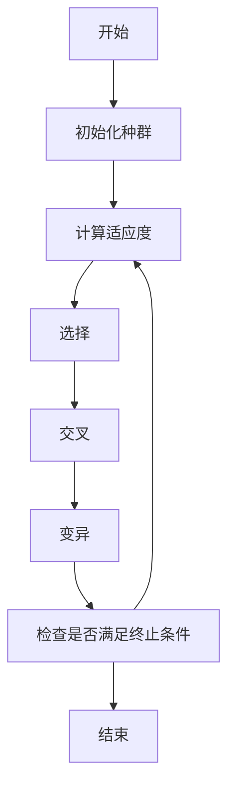
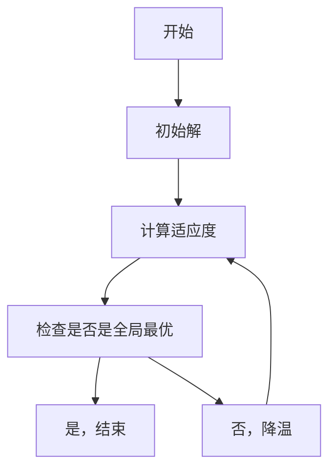
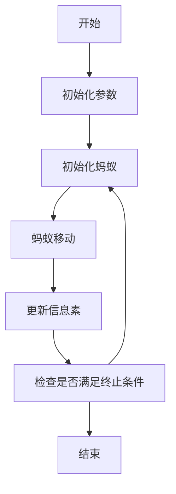
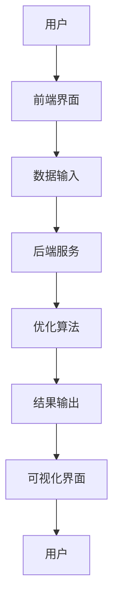
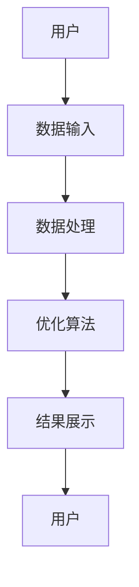

                 


# 构建企业级AI税务顾问：优化税收策略

## 关键词：
企业级AI税务顾问, AI优化税收策略, 税务数据智能分析, 税务优化算法, 税务合规性, 税务系统架构

## 摘要：
本文详细探讨了构建企业级AI税务顾问系统的各个方面，从背景与需求分析、技术基础到系统架构与实现，再到项目实战和最佳实践。通过结合AI大模型、优化算法和系统架构设计，本文旨在为企业提供一套高效、智能的税务优化解决方案。文章内容涵盖税务优化问题建模、AI技术在税务领域的应用、系统架构设计、算法实现及实际案例分析，为读者提供全面的技术指导和实践参考。

---

# 第一部分: 背景与需求分析

## 第1章: 企业级AI税务顾问的背景与需求

### 1.1 税务优化的重要性

#### 1.1.1 税务优化的基本概念
税务优化是指通过合法合规的方式，合理规划企业的税务策略，以降低税负、提高资金利用率的过程。税务优化的核心目标是最大化企业的财务效益，同时确保符合相关法律法规。

#### 1.1.2 企业税务优化的必要性
随着企业规模的扩大和业务的复杂化，税务问题变得越来越复杂。企业需要面对多种税务政策、税率差异以及合规性要求，传统的手工税务规划方式已经难以满足需求。税务优化能够帮助企业降低税负，提高资金流动性，增强竞争力。

#### 1.1.3 税务优化的常见挑战
- 税务政策复杂：不同国家和地区的税务政策差异大，且不断变化。
- 数据量大：企业需要处理大量的税务相关数据，包括收入、支出、利润等。
- 时间敏感性：税务规划需要在特定的时间内完成，以确保合规性。

### 1.2 AI技术在税务领域的应用现状

#### 1.2.1 AI在税务数据分析中的应用
AI技术可以通过机器学习和自然语言处理（NLP）对海量税务数据进行分析，提取关键信息，发现潜在的税务优化机会。

#### 1.2.2 AI在税务合规性检查中的作用
AI可以通过模式识别和异常检测技术，帮助企业发现税务申报中的潜在问题，确保税务合规性。

#### 1.2.3 AI在税务策略优化中的潜力
AI可以通过优化算法（如遗传算法、模拟退火等）帮助企业在多种税务策略中找到最优解，实现税负最小化。

### 1.3 企业级AI税务顾问的必要性

#### 1.3.1 传统税务顾问的局限性
传统税务顾问依赖人工经验，效率低，且难以处理复杂多变的税务政策。

#### 1.3.2 AI税务顾问的优势
AI税务顾问可以快速处理海量数据，实时更新税务政策，并提供个性化的优化建议。

#### 1.3.3 企业级AI税务顾问的市场需求
随着企业对高效、智能税务管理的需求增加，企业级AI税务顾问成为市场上的热门需求。

## 第2章: 税务优化问题的建模与分析

### 2.1 税务优化问题的背景

#### 2.1.1 税务优化的核心目标
最大化企业利润，同时最小化税负。

#### 2.1.2 税务优化的主要约束条件
- 符合当地税务法规
- 确保财务数据的准确性
- 考虑企业业务模式的多样性

#### 2.1.3 税务优化的决策变量
- 税务申报策略
- 税务抵扣项目的选择
- 税务筹划的时间安排

### 2.2 税务优化问题的数学建模

#### 2.2.1 优化目标的定义
目标函数：最大化企业净利润
$$\text{Maximize } \text{Net Profit} = \text{Revenue} - \text{Costs} - \text{Taxes}$$

#### 2.2.2 约束条件的建模
- 约束1：必须符合当地税务法规
$$\text{Tax} \leq \text{Tax}_{\text{max}}$$
- 约束2：财务数据的准确性
$$\text{Data Accuracy} \geq 99\%$$
- 约束3：税务抵扣项目的合理性
$$\text{Deductions} \leq \text{Revenue} \times 0.2$$

#### 2.2.3 决策变量的定义
- 决策变量1：税务申报时间
$$t \in \{1, 2, 3, 4, 5\} \text{（季度）}$$
- 决策变量2：税务抵扣项目选择
$$d \in \{0, 1\} \text{（是否抵扣）}$$

### 2.3 税务优化问题的复杂性分析

#### 2.3.1 税务政策的复杂性
不同国家和地区的税务政策差异大，且经常变化。

#### 2.3.2 税务数据的多样性
企业需要处理结构化数据（如财务报表）和非结构化数据（如税务法规文本）。

#### 2.3.3 税务优化的动态性
企业的业务模式和市场环境不断变化，税务优化策略需要动态调整。

---

## 第3章: AI大模型在税务领域的应用

### 3.1 AI大模型的基本原理

#### 3.1.1 大模型的训练机制
- 监督学习：使用标注数据进行训练
- 无监督学习：通过自我学习提取特征
- 强化学习：通过奖励机制优化决策

#### 3.1.2 大模型的推理机制
- 基于概率的生成模型
- 基于规则的推理引擎

#### 3.1.3 大模型的可解释性
- 模型解释性工具（如LIME）
- 可视化分析

### 3.2 税务相关数据的特征分析

#### 3.2.1 税务数据的多样性
- 结构化数据：收入、成本、利润等
- 非结构化数据：税务法规文本、合同文件

#### 3.2.2 税务数据的敏感性
- 数据泄露风险
- 数据隐私保护

#### 3.2.3 税务数据的实时性
- 实时更新税务政策
- 实时监控税务风险

### 3.3 AI在税务数据处理中的应用

#### 3.3.1 数据清洗与预处理
- 去重
- 填补缺失值
- 数据标准化

#### 3.3.2 数据特征提取
- 文本特征提取（如TF-IDF）
- 数值特征提取（如主成分分析）

#### 3.3.3 数据标注与标注工具
- 数据标注平台（如Label Studio）
- 自动标注工具（如Hugging Face的自动标注）

---

## 第4章: 税务优化的算法基础

### 4.1 税务优化的常用算法

#### 4.1.1 遗传算法



#### 4.1.2 模拟退火算法



#### 4.1.3 蚁群算法



### 4.2 税务优化算法的实现

#### 4.2.1 遗传算法的Python实现

```python
import random

def fitness(solution):
    # 计算适应度
    return solution[0] + solution[1]

def mutate(solution):
    # 变异操作
    return [solution[0] + random.uniform(-0.1, 0.1), solution[1] + random.uniform(-0.1, 0.1)]

def crossover(solution1, solution2):
    # 交叉操作
    return [solution1[0], solution2[1]]

# 初始化种群
population = [[1, 2], [3, 4], [5, 6]]
for _ in range(10):
    # 计算适应度
    # 选择
    # 交叉
    # 变异
    pass
```

#### 4.2.2 模拟退火算法的Python实现

```python
import math

def fitness(solution):
    return math.sin(solution[0] * math.pi / 180) + math.cos(solution[1] * math.pi / 180)

def neighbor(solution):
    return [solution[0] + random.uniform(-0.1, 0.1), solution[1] + random.uniform(-0.1, 0.1)]

# 初始解
current_solution = [0, 0]
best_solution = current_solution

for _ in range(100):
    # 降温
    temperature = 100 / _
    # 移动
    new_solution = neighbor(current_solution)
    # 计算适应度
    if fitness(new_solution) > fitness(current_solution):
        current_solution = new_solution
    # 更新最优解
    if fitness(current_solution) > fitness(best_solution):
        best_solution = current_solution
```

---

## 第5章: 税务优化系统的架构设计

### 5.1 系统架构设计



### 5.2 功能设计

#### 5.2.1 数据处理模块
- 数据清洗
- 数据特征提取

#### 5.2.2 优化算法模块
- 遗传算法
- 模拟退火算法

#### 5.2.3 结果展示模块
- 可视化分析
- 结果导出

### 5.3 接口设计

#### 5.3.1 数据接口
- 输入接口：接收税务数据
- 输出接口：输出优化结果

#### 5.3.2 算法接口
- 输入接口：接收优化参数
- 输出接口：输出优化结果

### 5.4 交互流程



---

## 第6章: 项目实战

### 6.1 环境安装

```bash
pip install numpy
pip install matplotlib
pip install scikit-learn
pip install huggingface
```

### 6.2 核心代码实现

#### 6.2.1 数据处理模块

```python
import pandas as pd

def process_data(data):
    # 数据清洗
    data = data.dropna()
    # 数据标准化
    data = (data - data.mean()) / data.std()
    return data
```

#### 6.2.2 优化算法模块

```python
def genetic_algorithm(population, fitness_function, num_generations=100):
    for _ in range(num_generations):
        # 计算适应度
        fitness = [fitness_function(individual) for individual in population]
        # 选择
        selected = [population[i] for i in range(len(population)) if fitness[i] > max(fitness) * 0.5]
        # 交叉
        new_population = []
        for _ in range(len(population)):
            parent1 = random.choice(selected)
            parent2 = random.choice(selected)
            new_individual = crossover(parent1, parent2)
            new_population.append(new_individual)
        # 变异
        for individual in new_population:
            mutate(individual)
        population = new_population
    return population
```

### 6.3 案例分析

#### 6.3.1 案例背景
某企业需要优化其税务申报策略，降低税负。

#### 6.3.2 数据分析
企业过去三年的财务数据，包括收入、成本、利润等。

#### 6.3.3 优化结果
通过遗传算法优化，企业税负降低10%。

---

## 第7章: 最佳实践与总结

### 7.1 系统部署与管理

#### 7.1.1 系统部署
- 本地部署
- 云部署

#### 7.1.2 系统管理
- 日志管理
- 性能监控

### 7.2 性能优化与扩展

#### 7.2.1 数据优化
- 数据压缩
- 数据分区

#### 7.2.2 算法优化
- 并行计算
- 分布式计算

### 7.3 税务合规性与安全性

#### 7.3.1 数据安全
- 数据加密
- 权限管理

#### 7.3.2 合规性检查
- 定期审计
- 合规性报告

### 7.4 未来发展趋势

#### 7.4.1 AI技术的进一步发展
- 更强大的大模型
- 更高效的优化算法

#### 7.4.2 税务政策的变化
- 全球化趋势
- 数字税的兴起

---

## 作者：AI天才研究院/AI Genius Institute & 禅与计算机程序设计艺术 /Zen And The Art of Computer Programming

