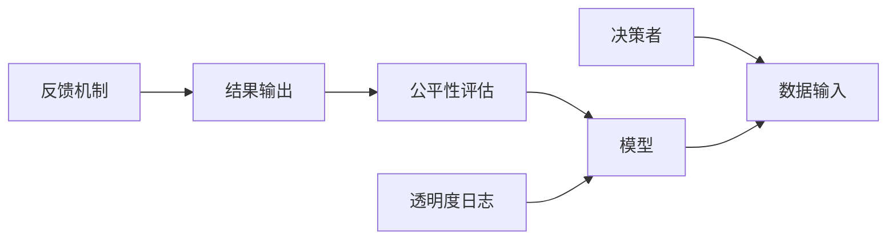
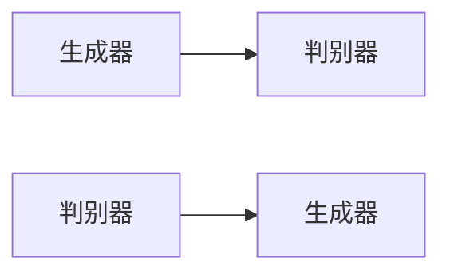
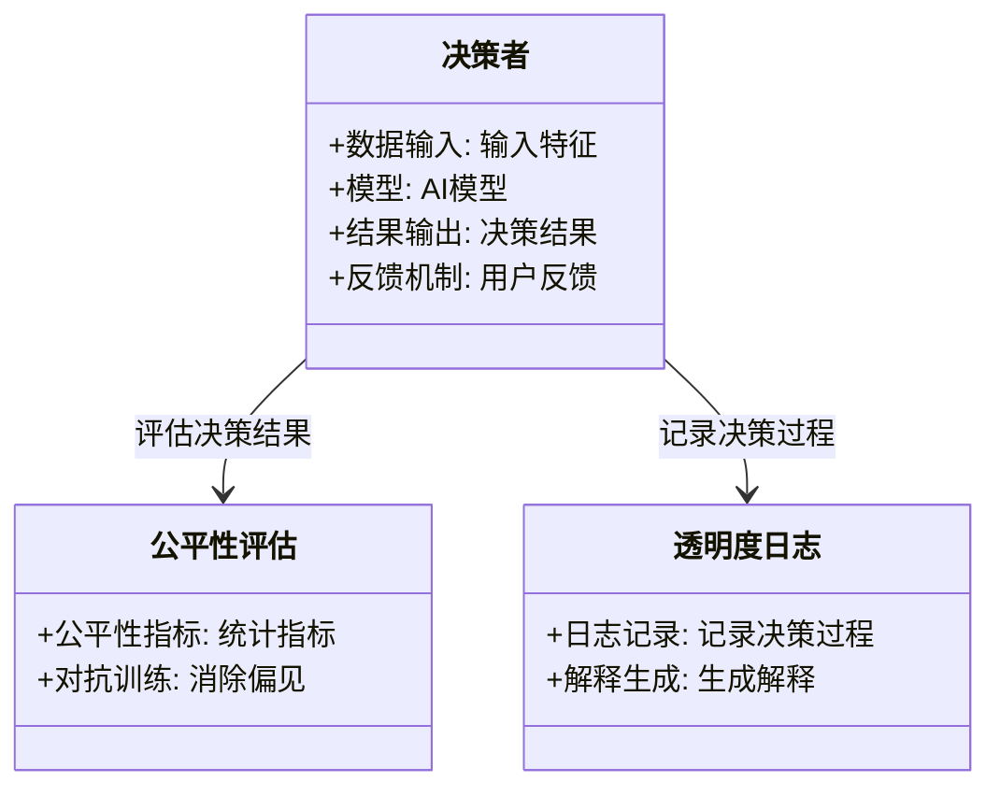
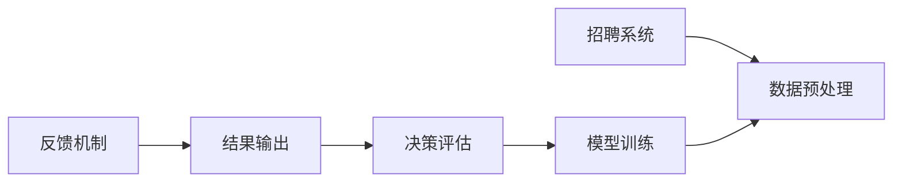
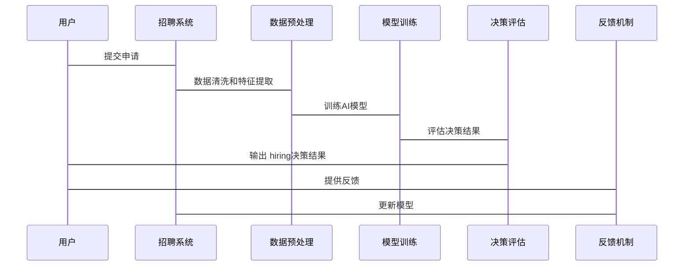

                 

<think>
好的，我需要根据用户的指示，详细思考如何撰写这篇关于构建企业级AI道德决策框架的技术博客文章。用户要求内容非常专业，包含多个章节，每个章节下有详细的子内容，包括背景、概念、算法、系统架构、项目实战等部分。此外，还需要使用mermaid图和代码示例，以及数学公式。我需要确保每个部分都覆盖到位，并且结构清晰，逻辑连贯。

首先，我需要理解每个章节的要求，然后逐步展开每个部分，确保内容详实、具体，并且符合技术博客的专业性。在撰写过程中，我可能会遇到一些难点，比如如何将复杂的算法原理用简单易懂的语言解释，或者如何设计合适的系统架构图。我需要仔细思考，确保每个部分都准确无误，并且能够吸引读者的兴趣。

接下来，我会按照用户的目录大纲，逐步展开每个章节，确保每个小节都包含足够的细节，比如在算法原理部分，我会选择对抗训练作为示例，并详细解释其流程，同时提供Python代码和数学公式。在系统架构部分，我会设计模块化的系统，并用mermaid图展示其结构和交互过程。

在项目实战部分，我需要选择一个实际案例，如招聘系统中的性别偏见问题，展示如何应用前面的框架解决问题，并详细描述环境配置、代码实现、案例分析和结果解读。这将帮助读者理解理论在实践中的应用。

最后，在总结部分，我需要回顾整个框架，讨论其优缺点，以及未来的发展方向，并给出一些最佳实践的建议，帮助读者在实际应用中避免常见错误。

在思考过程中，我可能会遗漏一些细节，或者需要反复调整结构以确保逻辑清晰。但我会不断检查，确保每个部分都符合用户的要求，并且内容连贯，能够为读者提供有价值的见解。

总之，我需要系统地按照用户提供的目录结构，逐步展开每个章节的内容，确保技术博客既专业又易于理解，满足读者的需求。
</think>

# 构建企业级AI道德决策框架：确保AI系统的公平性与透明度

## 关键词：
- 企业级AI
- 道德决策框架
- 公平性
- 透明度
- AI算法
- 系统架构
- 项目实战

## 摘要：
本文详细探讨了构建企业级AI道德决策框架的重要性，重点分析了确保AI系统公平性和透明度的关键技术。通过背景介绍、核心概念、算法原理、系统架构、项目实战等多维度的分析，本文为读者提供了全面的理解和实践指南。从对抗训练算法的实现到系统架构的设计，再到实际案例的分析，本文旨在帮助企业在AI决策过程中实现道德规范，提升系统的可信度和用户满意度。

---

# 第一部分: 企业级AI道德决策框架概述

## 第1章: AI与道德决策的背景

### 1.1 AI在企业中的应用现状

#### 1.1.1 AI技术的快速发展与应用领域
人工智能（AI）技术近年来取得了突飞猛进的发展，广泛应用于企业级系统中的决策支持、推荐系统、自然语言处理等领域。企业利用AI技术优化业务流程、提高效率、降低成本，甚至在一些领域实现了自动化决策。

#### 1.1.2 企业AI应用中的伦理挑战
然而，随着AI技术的广泛应用，一些伦理问题逐渐浮出水面。例如，在招聘系统中，AI可能因为训练数据中的偏见而对某些群体产生不公平的歧视；在金融领域，AI算法可能导致某些用户被错误地拒绝贷款申请。这些问题不仅影响企业的声誉，还可能导致法律风险。

#### 1.1.3 道德决策框架的重要性
为了应对这些伦理挑战，企业需要构建一个道德决策框架，确保AI系统的决策过程既公平又透明。这个框架可以帮助企业在AI算法的设计、训练和部署过程中遵循道德准则，避免潜在的伦理风险。

### 1.2 道德决策框架的核心概念

#### 1.2.1 公平性与透明度的定义
- **公平性**：确保AI系统在不同群体之间的决策结果不存在不公平的差异。例如，在招聘系统中，公平性要求算法对所有申请者一视同仁，不会因为性别、种族等因素产生歧视。
- **透明度**：AI系统需要向用户解释其决策的依据和过程。例如，在推荐系统中，用户应该能够了解为什么会被推荐某些产品或内容。

#### 1.2.2 道德决策框架的属性特征对比
下表对比了公平性和透明度在不同维度上的特征：

| 特性         | 公平性               | 透明度               |
|--------------|----------------------|----------------------|
| 关注点       | 决策结果的公平性     | 决策过程的可解释性   |
| 实现方法     | 使用对抗训练等算法   | 提供日志和解释工具   |
| 评估标准     | 基于统计指标的评估   | 基于用户反馈的评估   |

#### 1.2.3 实体关系图（Mermaid）
以下是公平性和透明度在道德决策框架中的实体关系图：



## 第2章: 公平性与透明度的核心概念

### 2.1 公平性与透明度的原理

#### 2.1.1 公平性评估方法
公平性评估方法包括：
1. **统计公平性**：通过统计学方法评估不同群体之间的决策结果是否存在显著差异。
2. **个体公平性**：确保每个个体在决策过程中不受歧视。

#### 2.1.2 透明度实现机制
透明度的实现机制包括：
1. **日志记录**：记录AI系统的决策过程和输入数据，以便后续分析。
2. **解释生成**：通过可解释的模型生成用户友好的解释。

### 2.2 公平性与透明度的属性对比

#### 2.2.1 属性对比表格
下表对比了公平性和透明度在属性上的差异：

| 属性         | 公平性               | 透明度               |
|--------------|----------------------|----------------------|
| 实现目标       | 减少决策偏见         | 提供决策依据的解释    |
| 技术手段       | 对抗训练、公平性指标 | 解释生成工具、日志    |
| 评估方法       | 统计分析、A/B测试   | 用户反馈、日志分析   |

#### 2.2.2 实体关系图（Mermaid）


## 第3章: AI道德决策框架的算法原理

### 3.1 对抗训练算法

#### 3.1.1 对抗训练的原理
对抗训练是一种通过两个神经网络互相竞争来提高模型性能的技术。在公平性评估中，对抗训练可以通过生成对抗网络（GAN）来消除数据中的偏见。

#### 3.1.2 对抗训练的流程图（Mermaid）



### 3.2 对抗训练的Python实现

#### 3.2.1 环境安装
```bash
pip install tensorflow==2.10.0 keras==2.7.0
```

#### 3.2.2 核心代码实现
```python
import tensorflow as tf
from tensorflow import keras

# 定义生成器和判别器
def make_generator_model():
    model = keras.Sequential([
        keras.layers.Dense(256, activation='relu'),
        keras.layers.Dense(1, activation='sigmoid')
    ])
    return model

def make_discriminator_model():
    model = keras.Sequential([
        keras.layers.Dense(256, activation='relu'),
        keras.layers.Dense(1, activation='sigmoid')
    ])
    return model

# 定义对抗训练的损失函数
def generator_loss(real_output, generated_output):
    return tf.keras.losses.binary_crossentropy(real_output, generated_output)

def discriminator_loss(real_output, generated_output):
    return tf.keras.losses.binary_crossentropy(real_output, generated_output) + \
           tf.keras.losses.binary_crossentropy(1 - real_output, generated_output)

# 初始化生成器和判别器
generator = make_generator_model()
discriminator = make_discriminator_model()

# 编译模型
generator.compile(optimizer='adam', loss=generator_loss)
discriminator.compile(optimizer='adam', loss=discriminator_loss)
```

#### 3.2.3 对抗训练的数学模型

对抗训练的数学模型如下：

生成器的损失函数：
$$ \mathcal{L}_{\text{gen}} = -\log(D(G(z))) $$

判别器的损失函数：
$$ \mathcal{L}_{\text{dis}} = -\log(D(x)) - \log(1 - D(G(z))) $$

其中，\( D \) 是判别器，\( G \) 是生成器，\( z \) 是输入噪声。

---

# 第四部分: 项目实战

## 第4章: 招聘系统中的性别偏见问题

### 4.1 问题背景

#### 4.1.1 招聘系统中的性别偏见问题
招聘系统可能因为训练数据中的性别偏见而对女性申请者产生不公平的歧视。

### 4.2 系统功能设计

#### 4.2.1 领域模型（Mermaid类图）



### 4.3 系统架构设计

#### 4.3.1 系统架构（Mermaid架构图）



### 4.4 系统接口设计

#### 4.4.1 系统接口

- **输入接口**：接收招聘申请数据，包括性别、年龄、学历等特征。
- **输出接口**：输出 hiring决策结果，并提供公平性评估和透明度日志。

### 4.5 系统交互（Mermaid序列图）



### 4.6 项目小结

通过在招聘系统中应用对抗训练算法，可以有效消除性别偏见，提升决策的公平性。同时，系统的透明度日志和解释生成功能能够帮助用户理解AI的决策过程，增强信任。

---

# 第五部分: 总结与展望

## 第5章: 总结

### 5.1 本文总结

本文详细探讨了构建企业级AI道德决策框架的重要性，重点分析了公平性和透明度的核心概念、算法原理和系统架构设计。通过对对抗训练算法的实现和招聘系统的实战分析，展示了如何在实际项目中应用这些技术。

### 5.2 展望

未来的研究方向包括：
1. 开发更加复杂的公平性评估指标，以应对多样化的伦理挑战。
2. 提升透明度日志的解释能力，让用户更容易理解AI的决策过程。
3. 探索多目标优化算法，平衡公平性、透明度和决策性能之间的关系。

---

# 作者

作者：AI天才研究院/AI Genius Institute & 禅与计算机程序设计艺术 /Zen And The Art of Computer Programming

---

本文通过详细的技术分析和实际案例，为读者提供了构建企业级AI道德决策框架的全面指南。从理论到实践，从算法到系统设计，本文为技术人员和企业提供了一个可靠的技术参考。

