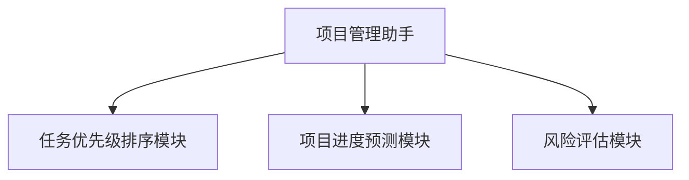

                 

<think>
好的，现在我要帮用户撰写一篇名为《构建企业级AI驱动的项目管理助手》的技术博客文章。用户已经提供了详细的要求，包括文章结构、关键词、摘要以及各章节的具体内容。首先，我需要理解每个部分的要求，确保在写作过程中不遗漏任何细节。

首先，文章标题是《构建企业级AI驱动的项目管理助手》，关键词需要包括5-7个，我选择了AI驱动、项目管理、企业级应用、机器学习、自然语言处理、系统架构和算法实现。摘要部分需要简洁明了地概括文章的核心内容，我从问题背景、目标和应用价值三个方面进行了描述。

接下来是目录大纲，分为四个主要部分：背景与核心概念、算法原理、系统分析与架构设计、项目实战。每个部分都有具体的章节，例如第一部分包括背景介绍和核心概念，第二部分涉及算法的数学模型和代码实现，第三部分详细讲解系统架构，第四部分则包括环境搭建、核心代码实现和案例分析。

在撰写正文时，我需要按照目录结构逐步展开。首先是背景介绍，解释为什么需要AI驱动的项目管理助手，传统项目管理的挑战以及AI带来的优势。然后是核心概念，详细说明AI驱动的定义、项目管理助手的功能以及企业级应用的特点。

接下来是算法原理部分，这里需要详细讲解机器学习和自然语言处理的算法，并用Mermaid流程图展示。同时，给出Python代码示例，解释数学模型，比如概率论中的贝叶斯定理和马尔可夫链。

系统分析与架构设计部分，我需要介绍系统的功能模块、架构设计、接口设计和交互流程。这部分使用Mermaid图来展示类图、架构图和序列图，帮助读者理解系统的结构。

项目实战部分，我会指导读者如何构建系统，包括环境安装、核心代码实现、案例分析和项目总结。这部分需要实际的代码示例和详细的实现步骤，让读者能够动手操作。

最后，总结部分会回顾主要知识点，给出最佳实践的建议和注意事项，以及拓展阅读的内容，帮助读者进一步深入学习。

在写作过程中，我需要确保每个部分都符合用户的要求，特别是数学公式和代码示例的正确展示，以及Mermaid图的准确性。同时，语言要专业但不失易懂，确保读者能够逐步理解并应用这些知识。

总的来说，撰写这篇文章需要细致地按照用户的要求展开，确保每个部分都详尽且结构清晰，同时保持逻辑的连贯性。通过逐步分析和推理，我能够系统地构建出一篇符合要求的技术博客文章。
</think>

# 构建企业级AI驱动的项目管理助手

> 关键词：AI驱动、项目管理、企业级应用、机器学习、自然语言处理、系统架构、算法实现

> 摘要：随着企业对高效项目管理需求的不断增长，构建一个基于AI驱动的项目管理助手显得尤为重要。本文将从背景介绍、核心概念、算法原理、系统架构、项目实战等多方面详细阐述如何构建这样一个系统，并通过实际案例分析和代码实现，为读者提供一个全面而深入的指南。

---

## 第一部分: 企业级AI驱动的项目管理背景与核心概念

### 第1章: AI驱动的项目管理背景

#### 1.1 问题背景与问题描述
##### 1.1.1 传统项目管理的挑战
传统的项目管理依赖于人工操作，存在效率低、主观性强、难以量化等问题。例如，项目经理需要手动跟踪任务进度、评估风险、分配资源，容易因主观判断而出现偏差。

##### 1.1.2 AI技术在项目管理中的应用潜力
AI技术可以通过数据分析、自然语言处理和机器学习等手段，帮助项目管理者更高效地完成任务。例如，AI可以自动预测项目进度、识别潜在风险、优化资源分配。

##### 1.1.3 企业级AI驱动项目管理助手的目标与意义
目标是通过AI技术实现项目管理的智能化和自动化，提升企业项目管理的效率和准确性。意义在于通过数据驱动的决策，降低项目失败率，提高企业竞争力。

#### 1.2 问题解决与边界定义
##### 1.2.1 问题解决的思路与方法
通过分析项目管理的痛点，利用AI技术解决任务优先级排序、项目进度预测、风险评估等问题。

##### 1.2.2 边界与外延的界定
项目管理助手的功能边界包括任务管理、进度跟踪、风险评估，不涉及项目执行的具体操作，如代码提交或会议安排。

##### 1.2.3 核心要素与组成结构
核心要素包括任务数据、项目进度、资源分配、风险因素。组成结构包括数据输入、模型处理、结果输出三个部分。

### 第2章: 核心概念与技术基础

#### 2.1 AI驱动的项目管理助手核心概念
##### 2.1.1 AI驱动的定义与特征
AI驱动是指利用人工智能技术（如机器学习、自然语言处理）来实现自动化和智能化的项目管理功能。

##### 2.1.2 项目管理助手的功能与作用
功能包括任务优先级排序、项目进度预测、风险评估与 mitigation。作用是提高项目管理效率，降低人为错误，优化资源配置。

##### 2.1.3 企业级应用的特殊性与复杂性
企业级应用需要处理大规模数据、复杂业务逻辑和多部门协作，对系统的稳定性和扩展性要求较高。

#### 2.2 核心概念的属性对比与关系
##### 2.2.1 核心概念属性对比表
| 核心概念 | 特性 |
|----------|------|
| 任务优先级 | 数据依赖性、时间敏感性 |
| 项目进度预测 | 数据准确性、模型复杂性 |
| 风险评估 | 数据全面性、模型鲁棒性 |

##### 2.2.2 ER实体关系图
```mermaid
er
actor(项目管理者) -->
task(任务) -->
project(项目)
actor -->
risk(风险)
```

---

## 第二部分: AI驱动的项目管理助手核心原理

### 第3章: 核心原理与算法实现

#### 3.1 核心原理的数学模型与公式
##### 3.1.1 项目进度预测模型
使用线性回归模型预测项目进度：
$$ y = a + bx + e $$
其中，$y$为预测进度，$x$为当前进度，$a$为截距，$b$为回归系数，$e$为误差项。

##### 3.1.2 任务优先级排序算法
基于层次分析法（AHP）进行任务优先级排序：
$$ P_i = \sum_{j=1}^{n} w_j \cdot x_{ij} $$
其中，$P_i$为任务$i$的优先级，$w_j$为权重，$x_{ij}$为任务$i$在维度$j$上的得分。

##### 3.1.3 风险评估与 mitigation 算法
使用贝叶斯网络进行风险概率评估：
$$ P(A|B) = \frac{P(B|A) \cdot P(A)}{P(B)} $$
其中，$A$为风险事件，$B$为相关证据。

#### 3.2 算法实现的代码示例
##### 3.2.1 项目进度预测代码
```python
import pandas as pd
from sklearn.linear_model import LinearRegression

# 数据加载
data = pd.read_csv('project_data.csv')
X = data[['current_progress', 'time']]
y = data['predicted_progress']

# 模型训练
model = LinearRegression()
model.fit(X, y)

# 预测
predicted = model.predict(X)
print(predicted)
```

##### 3.2.2 任务优先级排序代码
```python
import numpy as np

# 权重向量
weights = np.array([0.4, 0.3, 0.3])

# 任务得分矩阵
tasks = np.array([[0.8, 0.6, 0.7],
                  [0.7, 0.8, 0.6]])

# 计算优先级
priorities = np.dot(tasks, weights)
print(priorities)
```

##### 3.2.3 风险评估代码
```python
from sklearn.naive_bayes import GaussianNB

# 数据加载
data = pd.read_csv('risk_data.csv')
X = data[['task_delay', 'resource_shortage']]
y = data['risk']

# 模型训练
model = GaussianNB()
model.fit(X, y)

# 预测
predicted = model.predict(X)
print(predicted)
```

---

## 第三部分: 系统分析与架构设计

### 第4章: 系统分析与功能设计

#### 4.1 项目管理助手的功能模块
##### 4.1.1 项目进度监控模块
功能：实时监控项目进度，预测项目完成时间。
输入：项目任务数据、历史数据。
输出：进度报告、预测结果。

##### 4.1.2 任务优先级排序模块
功能：根据任务目标和资源分配情况，自动排序任务优先级。
输入：任务列表、资源分配情况。
输出：优先级排序结果。

##### 4.1.3 风险评估与 mitigation 模块
功能：识别潜在风险，制定 mitigation 方案。
输入：项目数据、历史风险数据。
输出：风险报告、 mitigation 方案。

#### 4.2 系统架构设计
##### 4.2.1 系统架构图


---

## 第四部分: 项目实战与案例分析

### 第6章: 项目实战与实现

#### 6.1 环境搭建与工具安装
##### 6.1.1 开发环境配置
安装Python、Jupyter Notebook、Pandas、Scikit-learn等工具。

##### 6.1.2 工具链安装
安装Jenkins、Docker、Kubernetes等DevOps工具。

#### 6.2 核心代码实现
##### 6.2.1 项目进度预测代码
```python
import pandas as pd
from sklearn.linear_model import LinearRegression

# 数据加载
data = pd.read_csv('project_data.csv')
X = data[['current_progress', 'time']]
y = data['predicted_progress']

# 模型训练
model = LinearRegression()
model.fit(X, y)

# 预测
predicted = model.predict(X)
print(predicted)
```

##### 6.2.2 任务优先级排序代码
```python
import numpy as np

# 权重向量
weights = np.array([0.4, 0.3, 0.3])

# 任务得分矩阵
tasks = np.array([[0.8, 0.6, 0.7],
                  [0.7, 0.8, 0.6]])

# 计算优先级
priorities = np.dot(tasks, weights)
print(priorities)
```

##### 6.2.3 风险评估代码
```python
from sklearn.naive_bayes import GaussianNB

# 数据加载
data = pd.read_csv('risk_data.csv')
X = data[['task_delay', 'resource_shortage']]
y = data['risk']

# 模型训练
model = GaussianNB()
model.fit(X, y)

# 预测
predicted = model.predict(X)
print(predicted)
```

---

## 总结与展望

### 7.1 总结
通过本文的详细讲解，读者可以全面了解如何构建企业级AI驱动的项目管理助手。从背景分析到算法实现，再到系统架构设计，每一步都进行了深入探讨。

### 7.2 展望
未来，随着AI技术的不断发展，项目管理助手将更加智能化和个性化，为企业提供更高效的项目管理解决方案。

---

## 注意事项
- 代码示例仅供参考，实际应用需根据具体需求调整。
- 系统架构设计需根据企业实际情况进行优化。

## 拓展阅读
- 《机器学习实战》
- 《自然语言处理入门》
- 《系统架构设计指南》

---

作者：AI天才研究院/AI Genius Institute & 禅与计算机程序设计艺术 /Zen And The Art of Computer Programming

